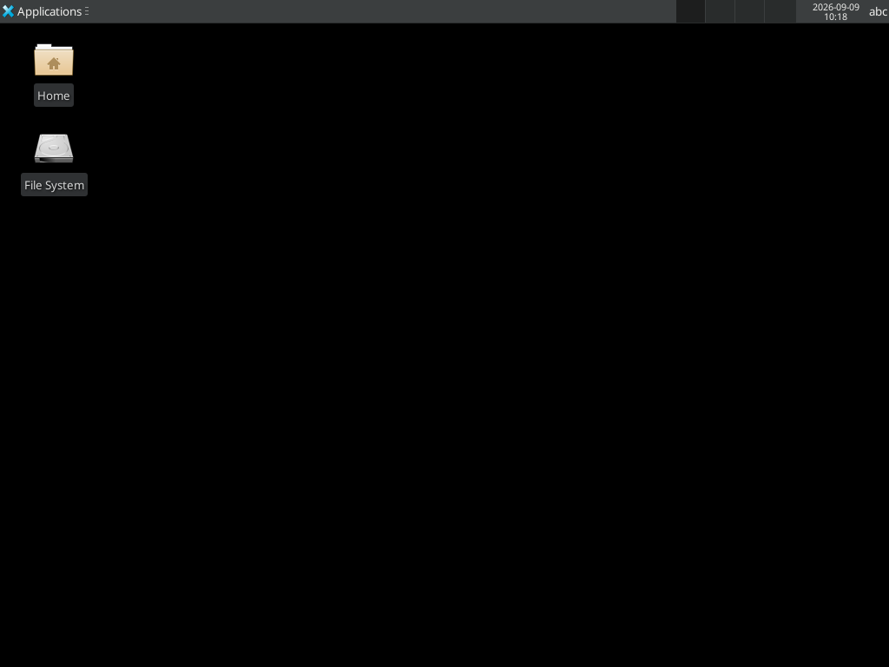
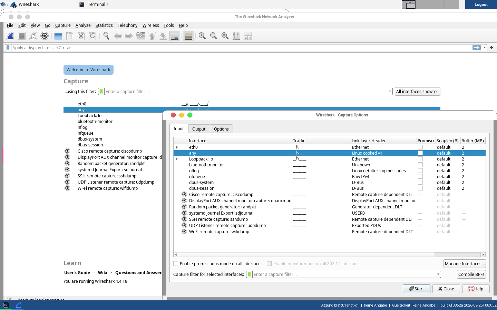
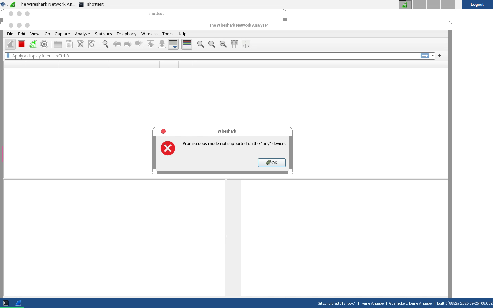
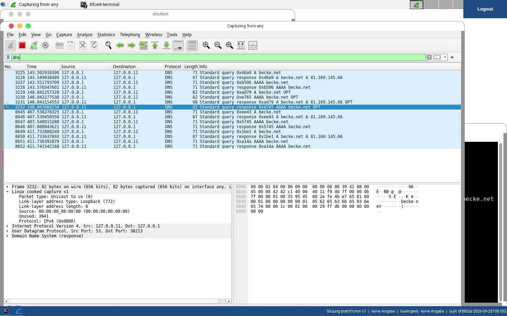
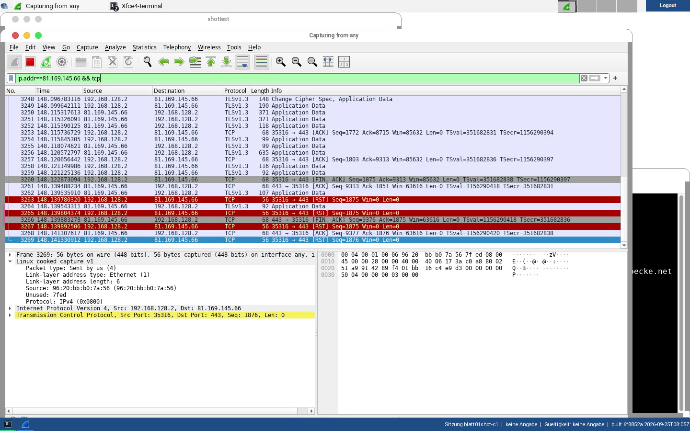
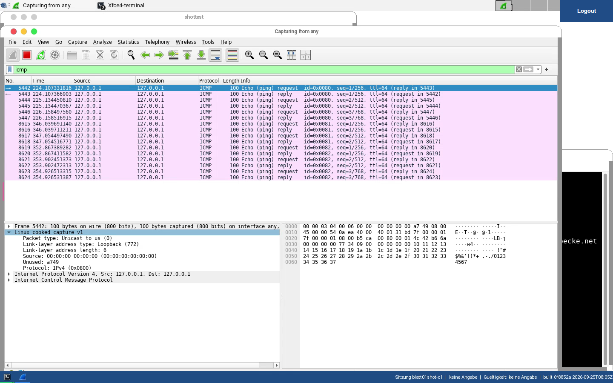
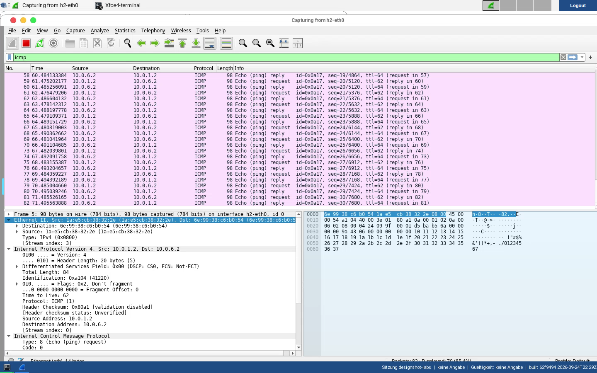

# 01 · Netzwerkgrundlagen & Tools

[:material-file-pdf-box: Als PDF herunterladen](../../pdf/01-netzwerkgrundlagen-tools.pdf){ .md-button }


*Der Desktop nach dem Login. Das Terminal startet ihr über das Symbol "Terminal" am linken Rand, abmelden könnt ihr euch oben rechts.*

## Lernziele

- Das TCP/IP-Schichtenmodell nicht nur benennen, sondern in echtem, mit
  Wireshark aufgezeichnetem Verkehr wiedererkennen (Verbindungs-, Netzwerk-,
  Transport- und Anwendungsschicht).
- Grundlegende Netzwerkwerkzeuge sicher anwenden: `ping`, `netcat`, `dig`,
  `curl`, `whois`, `nmap`, `scp`, `netstat`.
- Den Unterschied zwischen numerischer IP-Adresse und Namensauflösung (DNS)
  sowie zwischen Anwendungsprotokoll (HTTP) und Dienstprotokoll (DNS, DHCP)
  einordnen können.
- Verschlüsselte und unverschlüsselte Kommunikation im Wireshark-Mitschnitt
  unterscheiden (Klartext-Netcat/HTTP vs. SSH/SCP/HTTPS) und die Grenzen von
  Verschlüsselung benennen (Metadaten bleiben sichtbar, auch wenn der Inhalt
  es nicht ist).
- Einen fehlerhaften TLS-Zertifikat-Zustand im Browser erkennen und
  begründen können, statt ihn wegzuklicken.
- Nachvollziehen, warum in einer gerouteten Topologie nicht jeder Rechner
  jeden anderen direkt erreicht (asymmetrisches Routing).
- Namensauflösung nicht nur benutzen, sondern selbst betreiben: einen kleinen,
  lesbaren DNS-Server starten und an `dig`/`nslookup`/`host` sehen, wie eine
  DNS-Antwort aus Header, Flags, Frage- und Antwortabschnitt entsteht.
- Offene Ports und lauschende Dienste mit `ss` (dem Nachfolger von `netstat`)
  ermitteln und den Klartext-Charakter einfacher TCP-Verbindungen im
  Mitschnitt erkennen.

--8<-- "issue-feedback.md"

## Aufgaben

### Teil 1 – Das TCP/IP-Schichtenmodell in echtem Verkehr (außerhalb von Mininet)

Dieser erste Teil läuft **nicht** in der Mininet-Emulation, sondern direkt auf
eurem Desktop, um reale Kommunikation ins Internet zu beobachten, bevor wir
uns die kontrollierte, emulierte Topologie von `topo01` ansehen.

#### Das Terminal öffnen

Das Terminal auf diesem Desktop ist `xfce4-terminal`. Ihr startet es über
das Symbol "Terminal" am linken Bildschirmrand.

!!! info "Werkzeug: `xfce4-terminal` und `xterm`"
    `xfce4-terminal` ist ein Terminalemulator mit Tabs, eigenen
    Einstellungen und Kopieren/Einfügen per Maus – Doku:
    [docs.xfce.org/apps/xfce4-terminal/getting-started](https://docs.xfce.org/apps/xfce4-terminal/getting-started).
    Der Mininet-Befehl `mininet> xterm <node>` (z. B. `mininet> xterm h1` in
    Teil 2) öffnet auf diesem Desktop ebenfalls ein `xfce4-terminal`-Fenster.

**Übung:** Öffnet ein Terminal über das Symbol und lasst es für die
folgenden Schritte offen. (Ihr findet das Symbol auf dem Desktop.

--8<-- "issue-feedback.md"

#### Schritt 1: Wireshark starten und aufzeichnen

!!! info "Werkzeug: `sudo` – was es tut und warum es hier nötig ist"
    `sudo` führt den nachfolgenden Befehl mit erhöhten Rechten aus (Kurzform
    für "substitute user, do"). Wireshark braucht diese erhöhten Rechte, weil
    das Mitschneiden von Netzwerk-Rohpaketen einen privilegierten Zugriff auf
    die Netzwerkschnittstellen voraussetzt – ein gewöhnlicher Nutzer darf das
    aus Sicherheitsgründen nicht. Offizielle Referenz:
    [sudo.ws/docs/man/sudo.man](https://www.sudo.ws/docs/man/sudo.man/).
    Auf diesem Desktop fragt `sudo` nicht nach einem Passwort.

!!! info "Werkzeug: Wireshark – was es tut"
    Wireshark ist ein Netzwerk-Protokollanalysator: Es schneidet den
    Verkehr auf einer oder mehreren Schnittstellen mit und zeigt jedes
    einzelne Paket samt aller enthaltenen Protokollschichten an. Wir nutzen
    es hier, um genau nachzuvollziehen, was beim Aufruf von Kommandos wie
    `nslookup`, `curl` oder `ping` tatsächlich über das Netz (oder eben nicht
    über das Netz, siehe Schritt 6) geht. Offizielle Doku:
    [wireshark.org/docs](https://www.wireshark.org/docs/).

1. Tippt im offenen Terminal:

    ```bash
    sudo wireshark
    ```

    Es öffnet sich das Wireshark-Hauptfenster mit der Willkommensseite. Im Bereich "Capture"
    seht ihr eine Liste der Schnittstellen, unter anderem `eth0`, `any` und
    `Loopback: lo`.

2. Wählt die Zeile **`any`** aus (sie fasst alle Schnittstellen in einer
    Aufzeichnung zusammen – genau das braucht ihr hier: Schritt 2 und 6
    erzeugen nämlich rein lokalen Verkehr, der `eth0` nie erreicht, siehe
    Hinweis in Schritt 2) und öffnet über `Capture → Options…` (oder
    `Strg+K`) die Aufzeichnungsoptionen. Wählt dort unten links den Haken
    **"Enable promiscuous mode on all interfaces" ab**, bevor ihr startet:

    
    *Die empfohlene Einstellung vor dem Start: „any" ausgewählt, Promiscuous-Modus abgewählt.*

    !!! warning "Falls ihr trotzdem eine Fehlermeldung seht"
        
        *Diese Meldung erscheint, wenn der Promiscuous-Haken beim Start noch gesetzt war.*

        Die Pseudo-Schnittstelle `any` fasst mehrere Schnittstellen zusammen
        und unterstützt keinen Promiscuous-Modus. Dieser dient dazu, auf
        einer einzelnen Netzwerkkarte auch Verkehr mitzuschneiden, der nicht
        an sie adressiert ist; das braucht ihr hier nicht. Bestätigt die
        Meldung mit OK, Wireshark zeichnet dann ohne Promiscuous-Modus auf.

3. Klickt "Start". Die Aufzeichnung läuft jetzt auf `any`.

    !!! note "Die Paketliste füllt sich laufend"
        Ihr seht den gesamten Verkehr aller Schnittstellen, auch den des
        Desktop-Streamings, über das ihr diesen Desktop im Browser seht.
        Drei Fensterbereiche sind wichtig:

        - oben die **Paketliste** (eine Zeile pro Paket),
        - in der Mitte der **Detailbaum** (Schicht für Schicht aufklappbar –
          genau den braucht ihr in Schritt 5),
        - unten die **Hex-/ASCII-Rohdaten** des gerade ausgewählten Pakets.

        Gefiltert wird über die Zeile "Apply a display filter…" (Anzeigefilter,
        nicht zu verwechseln mit dem Aufzeichnungsfilter in den
        Capture-Optionen), siehe Schritt 4. Das rote Quadrat in der
        Symbolleiste stoppt die Aufzeichnung.

--8<-- "issue-feedback.md"

#### Schritt 2: `nslookup` – die IP-Adresse ermitteln

!!! info "Werkzeug: `nslookup` – was es tut"
    `nslookup` fragt einen DNS-Server nach der IP-Adresse, die zu einem
    Domainnamen gehört (Namensauflösung) – grundsätzlich das, was ein
    Browser vor jedem Seitenaufruf automatisch im Hintergrund erledigt.
    **Was es hier für uns tut:** Es ermittelt die IPv4-Adresse von
    `becke.net`, damit wir den Wireshark-Mitschnitt in Schritt 4 gezielt auf
    genau diese Adresse filtern können, statt im gesamten Verkehr zu suchen.

1. Öffnet ein **zweites** Terminal (Wireshark läuft im ersten weiter, keine Sorge dies hält das Schiff aus) und
    führt aus:

    ```bash
    nslookup becke.net
    ```

    Die Ausgabe sieht etwa so aus (eure IP-Adresse kann abweichen):

    ```text
    Server:      127.0.0.11
    Address:     127.0.0.11#53

    Non-authoritative answer:
    Name:  becke.net
    Address: 81.169.145.66
    ```

    Merkt euch die ausgegebene IPv4-Adresse – ihr braucht sie gleich für den
    Wireshark-Filter.

2. Wechselt zu Wireshark und tippt in die Anzeigefilter-Zeile oben `dns`,
    dann Enter, um die soeben erzeugte DNS-Abfrage wiederzufinden:

    
    *Die DNS-Anfrage (Protokollspalte „DNS") und ihre Antwort, direkt nach `nslookup becke.net`.*

    Ihr seht die Anfrage ("Standard query … A becke.net") und die Antwort
    ("Standard query response … A becke.net A …") als eigene Zeilen mit
    Protokoll "DNS".

    !!! note "Warum diese Pakete zwischen 127.0.0.1 und 127.0.0.11 laufen"
        Die DNS-Anfrage geht auf diesem Desktop nicht direkt ins
        Internet, sondern an den eingebauten DNS-Resolver des Desktops
        (`127.0.0.11`) – ihr seht hier also lokalen Verkehr, keinen Verkehr
        zu einem Server im Internet. Das ist mit ein Grund, warum in
        Schritt 1 auf der Pseudo-Schnittstelle `any` mitgeschnitten wird und
        nicht nur auf `eth0`: `any` erfasst alle Schnittstellen einschließlich
        dieses rein lokalen Verkehrs.

--8<-- "issue-feedback.md"

#### Schritt 3: `curl` – Verkehr zur ermittelten Adresse erzeugen

!!! info "Werkzeug: `curl` – was es tut"
    `curl` ist ein Kommandozeilenwerkzeug, um eine Anfrage an einen Server zu
    schicken und dessen Antwort abzurufen – hier eine HTTPS-Anfrage an
    `becke.net`, so wie es ein Browser beim Aufruf der Seite ebenfalls täte,
    nur ohne grafische Darstellung. **Was es hier für uns tut:** Es erzeugt
    gezielt echten Verkehr zur zuvor ermittelten Adresse, den wir im nächsten
    Schritt im Mitschnitt wiederfinden.

```bash
curl https://becke.net
```

Die Ausgabe ist der HTML-Quelltext der Seite; für diesen Schritt zählt nur
der erzeugte Netzwerkverkehr.

--8<-- "issue-feedback.md"

#### Schritt 4: Auf den erzeugten Verkehr filtern

Filtert in Wireshark auf genau diesen Verkehr, damit ihr nicht im restlichen
Hintergrundrauschen des Betriebssystems sucht:

```text
ip.addr == <eure ermittelte IP-Adresse>
```

Macht anschließend einen Rechtsklick auf eines der gefilterten TCP-Pakete und
wählt "Follow → TCP Stream". Wireshark zeigt dann die gesamte Übertragung
dieser einen Verbindung am Stück. Weil Schritt 3 die Seite über HTTPS abruft,
seht ihr nach dem Beginn des TLS-Handshakes nur verschlüsselte, nicht lesbare
Bytes; in Teil 2 folgt ihr auf demselben Weg einem unverschlüsselten Strom.
Wireshark ersetzt dabei den Anzeigefilter durch `tcp.stream eq <Nummer>` –
tragt für Schritt 5 wieder den Filter von oben ein.

--8<-- "issue-feedback.md"

#### Schritt 5: Die vier Schichten im Detailbaum identifizieren

!!! info "Was ist überhaupt eine „Schicht"?"
    Das TCP/IP-Modell teilt Netzwerkkommunikation in mehrere **Schichten**
    auf. Jede Schicht löst dabei ein eigenes, abgegrenztes Teilproblem
    (z. B. "wie kommen Bits über ein Kabel/Funk" oder "wie findet ein Paket
    den richtigen Rechner im Internet") und verpackt dafür die Daten der
    jeweils darüberliegenden Schicht in ihren eigenen Umschlag (Header) –
    von den Anwendungsdaten ganz oben bis zu den elektrischen/optischen
    Bits ganz unten. Diese Unterteilung gibt es, damit jede Schicht
    unabhängig von den anderen ausgetauscht oder verstanden werden kann:
    Ethernet lässt sich durch WLAN ersetzen, ohne dass HTTP davon etwas
    merkt. Im Wireshark-Detailbaum (mittlerer Fensterbereich, siehe
    Schritt 1) seht ihr das ganz konkret: Die eingerückten Zeilen SIND die
    Schichten, von außen/unten nach innen/oben aufgeklappt – die äußerste
    Zeile ist die unterste Schicht (Übertragung), die innerste die oberste
    (Anwendung).

Wählt eines der TCP-Pakete dieser Kommunikation aus (ein Klick in der
Paketliste) und klappt im Detailbaum von außen/unten nach innen/oben die
einzelnen Zeilen auf, versucht die Schichten vielleicht zu identifizieren:

- **Anwendungsschicht:** HTTP (bzw. TLS-Record bei HTTPS)
- **Transportschicht:** TCP-Segment (Ports, Sequenznummern, Flags)
- **Netzwerkschicht:** IP-Header (IPv4 oder IPv6, Quell-/Zieladresse)
- **Verbindungsschicht:** *siehe Hinweis direkt darunter – hier nicht der
  klassische Ethernet-Header*

!!! warning "Verbindungsschicht bei „any": kein echter Ethernet-Header"
    Weil ihr auf der Pseudo-Schnittstelle `any` mitschneidet (Schritt 1),
    zeigt die Verbindungsschicht hier **„Linux cooked capture v1"** (kurz
    SLL) statt eines echten Ethernet-Headers – `any` kapselt mehrere,
    unterschiedliche Schnittstellen einheitlich in dieses Pseudo-Format, das
    keinen vollständigen Ethernet-Header (mit Ziel-MAC) kennt, aber
    trotzdem nützliche Link-Layer-Informationen mitbringt:

    
    *„Linux cooked capture v1" für den Verkehr zu becke.net: „Link-layer address type: Ethernet (1)" und die echte MAC-Adresse eurer Schnittstelle als „Source".*

    Achtet auf zwei Felder: **"Link-layer address type"** (hier `Ethernet
    (1)` – das Paket lief tatsächlich über eine echte, Ethernet-artige
    Schnittstelle) und **"Source"** (eine echte Hardware-MAC-Adresse). Beide
    kommen in Schritt 6 wieder vor, mit einem auffälligen Unterschied.

!!! question "Kurz nachgedacht"
    Auf welcher tatsächlichen Schnittstelle (nicht `any`) lief dieses Paket
    vermutlich – und woran im Detailbaum könnt ihr das festmachen, obwohl
    `any` selbst kein echter Ethernet-Header ist?

Ihr dürft an dieser Stelle gerne alle Fenster schliessen und danach wieder einen Terminal öffnen, um Euch mehr Übersicht zu ermöglichen. 

--8<-- "issue-feedback.md"

#### Vom externen zum lokalen Verkehr: Wechsel zu Schritt 6

Bisher habt ihr Verkehr zu einem echten Server im Internet (`becke.net`)
untersucht. Schritt 6 wechselt bewusst zu rein lokalem Verkehr: Ihr
schickt Pakete an euch selbst (`127.0.0.1`, die Loopback-Adresse), die nie
eine echte Netzwerkkarte durchlaufen. Die neue Frage lautet: Wie sieht
dieselbe Schichten-Analyse aus Schritt 5 aus, wenn gar keine echte Hardware
beteiligt ist? Der Aufbau bleibt dabei gleich – ihr filtert wieder in
derselben laufenden Wireshark-Aufzeichnung auf `any`, diesmal nur mit einem
anderen Anzeigefilter (`icmp` statt der IP-Adresse von eben).

#### Schritt 6: `ping 127.0.0.1` – dasselbe Experiment rein lokal

!!! info "Werkzeug: `ping` – was es tut"
    `ping` schickt ICMP-Echo-Request-Pakete an eine Zieladresse und misst,
    ob und wie schnell eine Antwort (Echo-Reply) zurückkommt – der klassische
    Weg zu prüfen, ob ein Rechner grundsätzlich erreichbar ist. **Was es hier
    für uns tut:** Wir zielen bewusst auf uns selbst (`127.0.0.1`), um
    denselben Schichten-Blick wie in Schritt 5 auf rein lokalen Verkehr
    anzuwenden.

```bash
ping 127.0.0.1
```

(`Strg+C` beendet `ping`, falls es weiterläuft – für den Mitschnitt reichen
wenige Sekunden.)

Filtert in Wireshark auf `icmp` und identifiziert erneut die vier Schichten
in einem der Pakete.

!!! warning "Verbindungsschicht bei „any": Loopback statt Ethernet"
    
    *„Linux cooked capture v1" für den Loopback-Verkehr: „Link-layer address type: Loopback (772)" und eine Adresse aus lauter Nullen als „Source".*

    Auch hier zeigt die Verbindungsschicht "Linux cooked capture v1" (wie in
    Schritt 5, ein Merkmal der Pseudo-Schnittstelle `any`). Der Unterschied liegt in denselben zwei Feldern wie eben:
    **"Link-layer address type"** steht auf `Loopback (772)` statt
    `Ethernet (1)`, und **"Source"** ist `00:00:00:00:00:00` – eine
    Adresse aus lauter Nullen, weil hier keine echte Netzwerkkarte beteiligt
    war, die eine eigene MAC-Adresse mitbringen könnte.

!!! question "Kurz nachgedacht"
    Vergleicht die beiden Felder "Link-layer address type" und "Source" aus
    Schritt 5 und Schritt 6 direkt gegenüber. Was sagt eine
    Null-MAC-Adresse über den Weg aus, den ein Paket zurückgelegt hat – und
    welche Erwartung leitet ihr daraus für künftige Mitschnitte ab, wenn ihr
    eine Adresse wie `00:00:00:00:00:00` seht?

!!! tip "Euer eigenes Notizbuch"
    Legt euch unter `~/rn-practice/notizbuch.md` eine eigene Datei an und
    tragt dort Befehle und Wireshark-Filter ein, die ihr euch merken wollt.

Schließt zum Abschluss dieses Teils Wireshark und das Terminal und öffnet für
Teil 2 ein neues Terminal.

### Teil 2 – Werkzeuge in der emulierten Topologie `topo01`

Ab hier arbeitet ihr in der Mininet-Emulation. Die Topologie `topo01` besteht
aus zwei Endgeräten `h1` (`10.0.1.2`) und `h2` (`10.0.6.2`) und zwei Routern
`r1`/`r2` dazwischen. Nur `h1` hat zusätzlich über `h1-eth0` (`10.0.5.2`) einen
NAT-Uplink ins Internet; `r1` und `r2` kennen keinen Weg nach draußen.
Aufgaben mit Internet- oder DNS-Zugriff führt ihr deshalb auf `h1` aus.

```text
Internet ── NAT (10.0.5.1) ── h1-eth0  h1  h1-eth1 (10.0.1.2) ── r1 ── 10.0.4.0/24 ── r2 ── (10.0.6.2) h2
```

1. **Netz starten.** Wechselt in das Topologie-Verzeichnis und startet die
    Emulation:

    ```bash
    cd ~/rn-practice/topo01
    ./start-topo01.sh
    ```

    Das Skript ermittelt mit `getIntWithIntenet.sh` die Schnittstelle für den
    NAT-Uplink (Datei `interface.txt`) und startet danach `topo01.py`. Auf
    `h1` läuft ein DNS-Dienst (`dnsmasq`, `10.0.1.2`), der die Namen `h1` und
    `h2` kennt und alle anderen Namen an einen DNS-Server weiterreicht, der
    aus diesem Netz erreichbar ist. Startet `topo01.py` nicht direkt, sondern
    immer über `start-topo01.sh`.

    Nach dem Start öffnen sich zwei Terminalfenster, eines für `h1` und eines
    für `h2`. In diesen Knoten-Terminals seid ihr `root`. Für die Router
    `r1`/`r2` oder ein versehentlich geschlossenes Fenster öffnet ihr auf der
    Mininet-Konsole ein weiteres Terminal:

    ```text
    mininet> xterm <node>
    ```

    z. B. `mininet> xterm r1`.

    
    *Die Knoten-Terminals von `h1` und `h2` und die Mininet-Konsole. `pingall`
    meldet 75 % Verlust: Die Router haben nur Routen zwischen den Netzen von
    `h1` (`10.0.1.0/24`) und `h2` (`10.0.6.0/24`), siehe Aufgabenblatt 02.*

2. **Konnektivität mit Ping prüfen.** Öffnet das Terminal für `h1` und führt
    nacheinander aus:

    ```bash
    ping -c 4 10.0.6.2        # Ping mit numerischer IPv4-Adresse (h2)
    ping -c 4 h2              # Ping mit Namen statt IP
    ping -c 4 10.0.5.1        # Ping an ein anderes System im lokalen Segment
    ping -c 4 1.1.1.1         # Ping ins Internet (numerisch)
    ping -c 4 one.one.one.one # Ping ins Internet mit Namen (dasselbe Ziel)
    ```

    Notiert euch die Ausgaben (RTT, TTL) der lokalen Ziele und vergleicht
    sie miteinander: Was fällt euch auf, und wie erklärt ihr die Unterschiede?

    Wechselt danach zum Terminal von `h2` und wiederholt das Experiment aus
    dessen Sicht:

    ```bash
    ping -c 4 10.0.1.1
    ping -c 4 h1
    ping -c 4 1.1.1.1         # h2 hat keinen Weg ins Internet
    ```

    Vergleicht RTT und TTL der lokalen Ziele zwischen `h1` und `h2`. Warum sind
    sie unterschiedlich? Was sagt euch das über die Anzahl der Zwischenstationen
    (Hops)? Welche Meldung liefert `ping 1.1.1.1` auf `h2`, und welcher Router
    schickt sie?

    !!! warning "Die Internet-Pings von `h1` schlagen fehl"
        `ping 1.1.1.1` und `ping one.one.one.one` liefern auf `h1` 100 %
        Paketverlust, obwohl `h1` einen Weg ins Internet hat. Weist nach,
        woran das liegt:

        ```bash
        getent hosts one.one.one.one       # löst der Name auf?
        nc -z -w 3 1.1.1.1 443             # geht eine TCP-Verbindung durch?
        echo $?                            # 0 = Verbindung stand
        traceroute -n -m 6 1.1.1.1         # wo endet der Weg?
        ```

        Beantwortet aus euren eigenen Ausgaben:

        1. Der Name löst auf, und die TCP-Verbindung auf Port 443 kommt
           zustande – welche Schicht des Stapels ist also nicht das Problem?
        2. `ping` nutzt ICMP, `nc` nutzt TCP. Beide laufen über IP. Was genau
           wird demnach gefiltert, und auf welcher Schicht sitzt der Filter?
        3. `traceroute` zeigt euch die letzte antwortende Station vor der
           Stille. Liegt der Filter in eurem Container, im Hostnetz oder
           weiter draußen? Begründet mit der Hop-Nummer.
        4. Warum ist "kein Ping-Echo" ein schlechter Beweis dafür, dass ein
           Rechner nicht erreichbar ist? Nennt zwei Gründe.

        ICMP gesperrt, TCP erlaubt: Diese Asymmetrie ist in Unternehmens- und
        Hochschulnetzen häufig.

    !!! info "h1 ↔ h2: erreichbar, aber langsam"
        Ein `ping` zwischen `h1` und `h2` kommt an, die Laufzeit liegt aber
        bei rund 60 ms statt Bruchteilen einer Millisekunde. Jede der drei
        Leitungen `h1`–`r1`–`r2`–`h2` ist in `topo01.py` mit 10 ms
        Verzögerung angelegt; prüft, ob die gemessene RTT dazu passt.

3. **Ping mit Wireshark beobachten.** Öffnet auf `h2` Wireshark im
    Hintergrund und wählt das Interface `h2-eth0` aus:

    ```bash
    wireshark &
    ```

    Wechselt zum Terminal von `h1` und sendet einen einzelnen Ping:

    ```bash
    ping -c 1 h2
    ```

    
    *Echter Mitschnitt auf `h2-eth0`, während `h1` per `ping` Verkehr zu `h2`
    erzeugt. Der Detailbereich zeigt genau die in Teil 1 gesuchten Schichten:
    Ethernet II (Verbindungsschicht), Internet Protocol Version 4
    (Netzwerkschicht) und das ICMP-Paket selbst.*

    Welche Protokolle erscheinen in der Spalte "Protocol"? Wiederholt den
    Ping noch zwei weitere Male (`ping -c 1 h2`) – welche Pakettypen
    wiederholen sich, welche nicht? Führt anschließend `ping -c 1 10.0.2.3`
    aus (eine nicht existierende Adresse) und beobachtet den Unterschied.
    Schließt danach das Wireshark-Fenster von `h2`, startet Wireshark
    stattdessen auf `h1` (Interface `h1-eth0`, nicht vergessen: `wireshark &`
    mit `&`, damit das Terminal weiter benutzbar bleibt) und wiederholt
    `ping -c 1 10.0.2.3`. Vergleicht, was auf beiden Seiten sichtbar ist, und
    formuliert eine These, warum sich die Beobachtung unterscheidet.

4. **Kommunikation mit Netcat herstellen und mit Wireshark beobachten.**
    Startet auf `h2` (im Verzeichnis `~/rn-practice/topo01`) den vorbereiteten
    UDP-Netcat-Server:

    ```bash
    ./startUDPServerNetcat.sh
    ```

    Der Inhalt des Skripts (`cat startUDPServerNetcat.sh`) zeigt euch, dass es
    letztlich nur `netcat -ul 8080` aufruft – ein UDP-Listener auf Port 8080.
    Wechselt zu `h1` und verbindet euch:

    ```bash
    netcat -u h2 8080
    hallo
    ```

    Markiert in Wireshark (auf `h2`, Interface `h2-eth0`) das letzte
    UDP-Paket. Im unteren Fensterbereich ("Packet Bytes") seht ihr die
    Nutzdaten hexadezimal und in ASCII – euer "hallo" sollte dort auftauchen.
    Prüft, wie viele Bytes die Nutzdaten tatsächlich belegen und warum
    (Stichwort ASCII-Kodierung, ein Zeichen = ein Byte).

5. **DNS-Auflösung mit Dig.** Führt auf `h1` aus:

    ```bash
    dig bundesregierung.de
    ```

    und sucht in der `ANSWER SECTION` nach der aufgelösten IPv4-Adresse. Die
    Zeile `SERVER` zeigt, welcher DNS-Server geantwortet hat: der DNS-Dienst
    auf `h1` (`10.0.1.2`), der die Anfrage für Internet-Namen weiterreicht.

6. **HTTP/REST mit Curl gegen eine externe API, und der gleiche Dienst im
    Browser.** Fragt auf `h1` mit Curl die Geolocation-API von ip-api.com ab
    (setzt die zuvor per `dig` ermittelte Adresse ein):

    ```bash
    curl http://ip-api.com/json/<ermittelte-IP-Adresse>
    ```

    Vergleicht das Ergebnis mit dem Aufruf derselben Abfrage im Browser unter
    `https://ip-api.com/#<ermittelte-IP-Adresse>`. Welche Darstellung eignet
    sich für die automatische Weiterverarbeitung durch ein Programm, welche
    für einen Menschen?

    !!! info "Wer betreibt ip-api.com?"
        Laut dem offiziellen Impressum/den Nutzungsbedingungen von
        ip-api.com wird der Dienst von **Artia International S.R.L.**
        (Bukarest, Rumänien) betrieben.

7. **WHOIS-Abfrage.** Auf `h1`:

    ```bash
    whois mozilla.com
    ```

    Achtet auf Felder wie Street/City. `whois` muss dafür zunächst den Namen
    des zuständigen WHOIS-Servers auflösen (z. B.
    `whois.verisign-grs.com`) – funktioniert das nicht, prüft mit
    `dig whois.verisign-grs.com`, ob überhaupt eine Namensauflösung
    stattfindet (siehe Aufgabe 5). Wiederholt die Abfrage mit
    `bundesregierung.de` und vergleicht: Für `.de`-Domains ist die DENIC
    zuständig, und seit der DSGVO sind personenbezogene WHOIS-Daten für
    `.de`-Domains nicht mehr standardmäßig öffentlich einsehbar.

8. **Netzwerkscan mit Nmap.** Auf `h2`:

    ```bash
    nmap -sn 10.0.4.0/24
    ```

    Prüft, welche Hosts erkannt werden. Versucht anschließend, das
    Betriebssystem eines gefundenen Hosts zu identifizieren:

    ```bash
    nmap -O <gefundene-IP>
    ```

    Findet heraus, auf welchem Host der Dienst OpenSSH erreichbar ist, und
    prüft mit `searchsploit`, ob es bekannte Schwachstellen gibt:

    ```bash
    searchsploit OpenSSH
    ```

    Port-Scans dienen hier ausschließlich der eigenen, isolierten
    Mininet-Umgebung. Gegen fremde Systeme ohne Zustimmung sind sie in
    Deutschland rechtlich heikel und teils strafbar.

9. **Sichere Übertragung mit SCP, und was trotz Verschlüsselung sichtbar
    bleibt.** Startet auf `h2` Wireshark (Interface `h2-eth0`). Startet auf
    `h1` den SSH-Server:

    ```bash
    /usr/sbin/sshd -D -f sshd.conf
    ```

    Ihr meldet euch als Nutzer `cads` an, dessen Passwort ihr nicht kennt.
    Erzeugt deshalb auf `h2` ein eigenes Schlüsselpaar und tragt den
    öffentlichen Teil als vertrauenswürdig ein:

    ```bash
    h2$ mkdir -p ~/.ssh && chmod 700 ~/.ssh
    h2$ ssh-keygen -t ed25519 -N "" -f ~/.ssh/rn-practice-key -q
    h2$ cat ~/.ssh/rn-practice-key.pub >> ~/.ssh/authorized_keys
    h2$ chmod 600 ~/.ssh/authorized_keys
    h2$ chown -R cads ~/.ssh
    ```

    Das Knoten-Terminal läuft als `root`, `sshd` liest `authorized_keys`
    aber mit den Rechten von `cads`. Ohne das `chown` lehnt `sshd` den
    Schlüssel ab (`Permission denied (publickey,password)`).

    !!! note "Warum ein auf `h2` erzeugter Schlüssel auch für den Login auf `h1` gilt"
        `h1` und `h2` sind zwei Netzwerk-Namespaces desselben Containers mit
        einem gemeinsamen Dateisystem: `~/.ssh` ist auf beiden Knoten
        dasselbe Verzeichnis. Der Schlüssel wird nicht übers Netz übertragen,
        nur die SSH-Verbindung danach, und die seht ihr im Mitschnitt.

    Kopiert anschließend von `h2` aus eine Datei von `h1`:

    ```bash
    scp -i ~/.ssh/rn-practice-key cads@10.0.1.2:~/rn-practice/test30M.txt ./
    ```

    Die Datei liegt unter `~/rn-practice/`, nicht unter `~/rn-practice/topo01/`.

    !!! warning "`test30M.txt` ist ein Shell-Skript"
        Trotz des Namens ist `test30M.txt` keine 30-MB-Testdatei, sondern ein
        kurzes Skript, das eine Netcat-Shell auf Port 1234 öffnet und sich
        danach selbst löscht. Die Übung zeigt: Verschlüsselung (SCP/SSH)
        schützt den Transportweg, nicht die Entscheidung, ob ihr dem Inhalt
        am Endpunkt vertraut.

    Beobachtet in Wireshark den TCP-Drei-Wege-Handshake, die
    SSH-Verhandlungsphase und danach durchgehend verschlüsselten Verkehr –
    der Dateiinhalt selbst ist nicht einsehbar. Schaut euch die kopierte
    Datei lokal an:

    ```bash
    cat test30M.txt
    ```

    Darin findet sich ein netcat-Aufruf. Führt ihn probeweise aus, um eine
    (in dieser isolierten Übung harmlose) Reverse-Shell zu demonstrieren:

    ```bash
    sh ./test30M.txt
    ```

    Nach der Ausführung ist die Datei gelöscht und scheinbar nichts
    Wesentliches geschehen. Tatsächlich hat sich aber eine Reverse-Shell
    geöffnet. Verbindet euch von `h1` aus auf die geöffnete Shell und prüft,
    auf welchem Host ihr tatsächlich Befehle ausführt:

    ```bash
    netcat 10.0.6.2 1234
    ifconfig
    ```

    !!! tip "Woran ihr eine erfolgreiche Reverse-Shell erkennt"
        Nach dem `netcat`-Aufruf erscheint kein Prompt wie `h1$`, sondern ein
        einfaches `#` – das ist die Shell, die `test30M.txt` auf `h2` geöffnet
        hat, nicht eine neue Shell auf `h1`. Erst danach tippt ihr `ifconfig`.

    Erscheint ein Interface `h2-eth0`, habt ihr Zugriff auf `h2` – obwohl ihr
    den Befehl von `h1` aus abgesetzt habt. Aktiviert die Wireshark-Aufnahme
    auf `h2-eth0` erneut und schaut euch über die Reverse-Shell eine weitere
    Datei an:

    ```bash
    cat key.pem
    ```

    Über "Follow → TCP Stream" lässt sich die komplette, unverschlüsselte
    Kommunikation in Wireshark rekonstruieren – anders als bei SCP/SSH war
    dieser Kanal zu keinem Zeitpunkt verschlüsselt. Reflektiert Vor- und
    Nachteile aus Sicht von Nutzer:in, Administrator:in und
    Sicherheitsbehörden.

    Prüft abschließend auf `h2`, welche Prozesse Netzwerkports geöffnet
    halten, und beendet nicht erkannte Prozesse:

    ```bash
    netstat -tulnp
    kill -9 <PID>
    ```

10. **Verschlüsselter Web-Verkehr und ein absichtlich kaputtes
    Zertifikat.** Startet auf `h1` einen einfachen HTTP-Server:

    ```bash
    python3 startHTTPServer.py &
    ```

    Prüft mit `netstat`, dass Port 80 nun belegt ist. Startet auf `h2`
    Wireshark (Interface `h2-eth0`) und setzt den Anzeigefilter:

    ```text
    ip.addr == 10.0.1.2 && tcp
    ```

    Startet den Browser auf `h2`:

    ```bash
    ./runSimpleBrowser.sh
    ```

    und ruft `http://h1` auf. Vergleicht in Wireshark ("Follow → TCP
    Stream") den HTTP/HTML-Inhalt mit der im Browser sichtbaren Seite bzw.
    mit "View Page Source".

    Beendet den HTTP-Server auf `h1` (++ctrl+c++) und startet stattdessen den
    HTTPS-Server:

    ```bash
    python3 startHTTPsServer.py
    ```

    !!! info "Passphrase für `key.pem`"
        Der Start fragt interaktiv nach einer PEM-Passphrase, bevor der
        Server auf Port 443 lauscht. Die Passphrase ist **`mininet`**.

    Ruft auf `h2` `https://h1` auf und beobachtet erneut in Wireshark, dass
    der Inhalt diesmal nicht mehr im Klartext sichtbar ist.

    !!! warning "Absichtlich fehlerhaftes Zertifikat"
        Der Browser wird eine Zertifikatswarnung anzeigen. Das ist
        **beabsichtigt**: `cert.pem`/`key.pem` in `topo01` sind ein
        absichtlich unsinniges, selbstsigniertes Test-Zertifikat
        (`CN=noway`, Organisation "Not your buisness", Abteilung
        "bad company") – kein Konfigurationsfehler der Umgebung. Das
        eigentliche Lernziel dieses Schritts ist, als Nutzer:in *ohne*
        IT-Hintergrund zu erkennen und zu benennen, was an diesem Zertifikat
        nicht stimmt (z. B. unpassender/unbekannter Aussteller, Common Name
        ohne Bezug zum aufgerufenen Namen `h1`).

11. **Netz beenden.** Auf der Mininet-Konsole:

    ```text
    mininet> quit
    ```

!!! example "Vertiefung (optional): TLS-ClientHello von curl und Firefox vergleichen"
    Schritt 10 hat gezeigt, dass der Browser bei einem fehlerhaften
    Zertifikat warnt. Geht einen Schritt tiefer und vergleicht, *wie*
    unterschiedliche Clients überhaupt eine TLS-Verbindung anbahnen:
    Startet auf `h1` erneut `python3 startHTTPsServer.py` (Passphrase
    `mininet`, siehe oben) und auf `h2`
    eine Wireshark-Aufzeichnung auf `h2-eth0`. Ruft `https://h1` einmal
    mit `curl -k https://h1` und einmal über `./runSimpleBrowser.sh` auf.
    Filtert in Wireshark auf `tls.handshake.type == 1` (Client Hello) und
    vergleicht bei beiden Mitschnitten die angebotene Liste der
    Cipher-Suiten sowie die TLS-Erweiterungen. Diese Unterschiede sind kein
    Zufall, sondern der Fingerabdruck der jeweiligen TLS-Bibliothek – genau
    das Prinzip, auf dem Verfahren wie JA3-Fingerprinting beruhen (siehe
    [Aufgabenblatt 06, Teil 5](06-advanced-covert-channels.md)).


!!! note "Subnetz-Rechenaufgabe zu dieser Topologie"
    Die Rechenaufgabe zu dieser Topologie (warum `pingall` Verluste meldet)
    steht in [Aufgabenblatt 02, Teil 11](02-subnetting-arp.md). Bearbeitet
    sie, nachdem IP-Adressierung und Subnetting in der Vorlesung eingeführt
    wurden.

--8<-- "issue-feedback.md"

### Teil 3 – Namensauflösung selbst betreiben: ein lesbarer DNS-Server (`topo01`)

In Teil 2 habt ihr `dig` benutzt, um Namen aufzulösen. In diesem Teil betreibt
ihr selbst einen kleinen, lesbaren DNS-Server (`dns-server.py`, nur
Standardbibliothek: `socketserver` und `struct`) und seht, wie eine
DNS-Antwort aufgebaut ist.

Startet `topo01`, öffnet ein Terminal für `h1` und werft zuerst einen Blick in
das Skript:

```bash
h1$ cd ~/rn-practice/topo01
h1$ cat dns-server.py
```

Achtet auf die Funktion `encode_name` (ein Label = ein Längen-Byte plus die
Zeichen, abgeschlossen mit einem Null-Byte) und auf den Header mit seinen
Flags (`QR`, `AA`). Port 53 auf `h1` ist bereits vom DNS-Dienst der Topologie
belegt; startet den eigenen Server deshalb auf Port 5353:

```bash
h1$ python3 dns-server.py 5353
```

Fragt den Server von `h2` aus mit allen drei Standard-Werkzeugen ab:

```bash
h2$ dig @10.0.1.2 -p 5353 h2
h2$ nslookup -port=5353 h1 10.0.1.2
h2$ host -p 5353 becke.net 10.0.1.2
```

Vergleicht die Adresse, die euer Server für `becke.net` liefert, mit der
Antwort von `dig becke.net` (ohne `@`, also über den DNS-Dienst der
Topologie). Was folgt daraus für das Vertrauen in DNS-Antworten?

Fragt zuletzt einen Namen ab, den der Server nicht kennt, und schaut euch
den Statuscode an:

```bash
h2$ dig @10.0.1.2 -p 5353 gibtsnicht.invalid +noall +comments
```

**Aufgabe:** In der `dig`-Ausgabe stehen die Flags `qr aa`. Was bedeuten sie
(Antwort? autoritativ?), und wo im Skript werden sie gesetzt? Welchen
`status`-Wert liefert die letzte, unbekannte Abfrage (`NOERROR` oder
`NXDOMAIN`?), und welche Zeile im Skript (`rcode = ...`) entscheidet darüber?

!!! quote "Hintergrund: DNS ist kaum jünger als das Internet-Protokoll selbst"
    Paul Mockapetris entwarf das DNS 1983 am Information Sciences Institute der
    USC, weil die zentrale Datei `HOSTS.TXT` nicht mehr skalierte. Die
    Erstfassung steht in RFC 882 und RFC 883 (November 1983); 1987 ersetzten
    RFC 1034 und RFC 1035 sie (Kopf: „Obsoletes: RFCs 882, 883, 973").

    - RFC 1035 (rfc-editor): <https://www.rfc-editor.org/rfc/rfc1035.html>
    - Internet Hall of Fame, Paul Mockapetris: <https://www.internethalloffame.org/inductee/paul-mockapetris/>

### Teil 4 – Offene Ports finden: `ss` statt `netstat` (`topo01`)

In Teil 2 (Aufgabe 9) habt ihr `netstat -tulnp` benutzt. `netstat` gilt als
veraltet und ist auf vielen Distributionen nicht mehr vorinstalliert; sein
Nachfolger aus dem `iproute2`-Paket ist `ss`. In diesem Teil öffnet ihr
selbst einen Dienst und findet ihn wieder.

Öffnet auf `h1` mit `socat` einen einfachen TCP-Echo-Dienst auf Port 8080.
`socat` (*SOcket CAT*) ist ein vielseitigeres Werkzeug als `netcat`:

```bash
h1$ socat TCP-LISTEN:8080,reuseaddr,fork EXEC:/bin/cat &
```

Findet den lauschenden Port einmal mit `ss` und einmal mit `netstat` und
vergleicht die Ausgaben:

```bash
h1$ ss -tlnp
h1$ ss -tlnp 'sport = :8080'
h1$ netstat -tlnp 2>/dev/null | grep 8080 || echo "netstat nicht verfuegbar"
```

**Aufgabe:** Welche Spalten zeigt `ss` (Zustand, lokale Adresse:Port,
Prozess)? Was bedeutet `LISTEN`? Beendet den Dienst danach wieder
(`kill %1` oder `pkill socat`) und prüft mit `ss -tlnp`, dass der Port
verschwunden ist.

### Teil 5 – Eine Verbindung von Hand aufbauen und ihren Klartext sehen (`topo01`)

!!! quote "Hintergrund: das „TCP/IP swiss army knife""
    `netcat` wurde 1995 von einem Autor unter dem Pseudonym „Hobbit"
    veröffentlicht, die letzte Originalfassung („v1.10") stammt vom
    20. März 1996. Hobbit nannte das Werkzeug „my tcp/ip swiss army knife".
    `socat` greift dieselbe Idee auf und erweitert sie.

    - Original-README von „Hobbit" (nc110): <https://nc110.sourceforge.io/>
    - SecTools.org (Nmap-Projekt), Eintrag Netcat: <https://sectools.org/tool/netcat/>

In Teil 2 (Aufgabe 4) habt ihr mit `netcat` einen UDP-Listener angesprochen.
Hier baut ihr eine TCP-Verbindung zwischen den beiden Hosts auf und weist
nach, dass ihr Inhalt im Klartext übertragen wird, im Gegensatz zur
SSH-Verbindung aus Aufgabe 9.

Der Echo-Dienst aus Teil 4 läuft noch auf `h1` (sonst neu starten). Startet auf
`h1` einen Mitschnitt auf der Schnittstelle Richtung `r1` (`h1-eth1`; über
`h1-eth0` läuft nur der Internet-Uplink) und schickt von `h2` eine Zeile durch:

```bash
h1$ tcpdump -i h1-eth1 -A -w /tmp/klartext.pcap tcp port 8080 &
h2$ printf 'GEHEIM: passwort123\n' | socat -T2 - TCP:10.0.1.2:8080
```

Der Echo-Dienst schickt dieselbe Zeile zurück. Beendet den Mitschnitt auf
`h1` (`pkill tcpdump`) und sucht euren Text darin:

```bash
h1$ tcpdump -r /tmp/klartext.pcap -A | grep GEHEIM
```

**Aufgabe:** Der Text `GEHEIM: passwort123` steht unverschlüsselt im
Mitschnitt. Vergleicht das mit dem SCP/SSH-Verkehr aus Aufgabe 9 (Teil 2):
Warum ist dort der Inhalt **nicht** lesbar, hier aber schon? Was bedeutet das
für Anwendungsprotokolle, die – wie klassisches HTTP, Telnet oder FTP – ohne
Transportverschlüsselung arbeiten?

--8<-- "issue-feedback.md"
