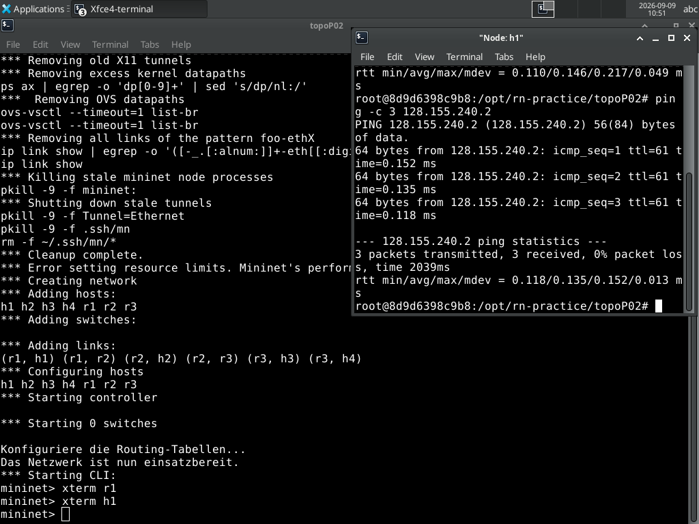
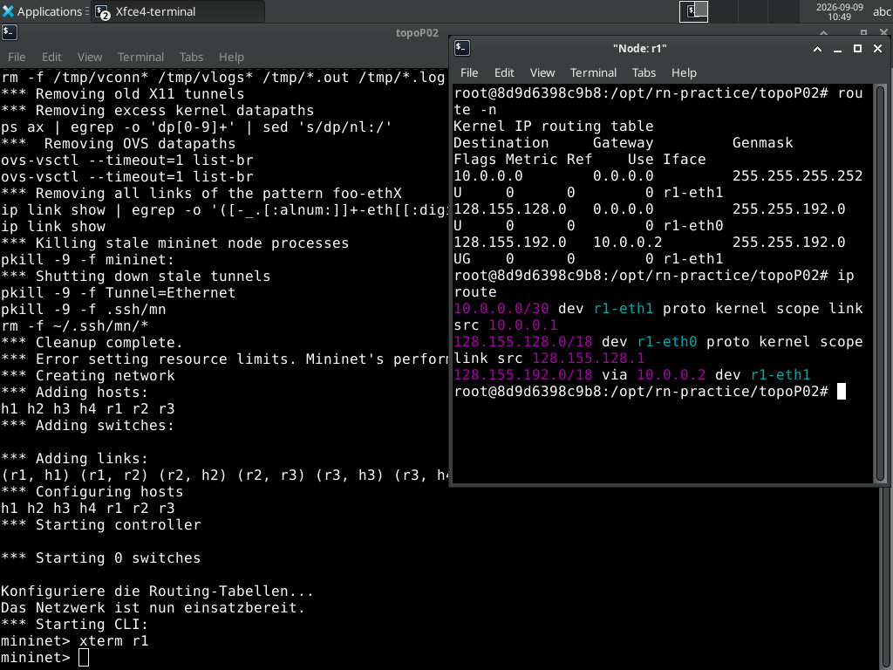

# 02 · IPv4-Subnetting & ARP

[:material-file-pdf-box: Als PDF herunterladen](../../pdf/02-subnetting-arp.pdf){ .md-button }

## Lernziele

- VLSM-Subnetting (Variable Length Subnet Masking) aus konkreten Host-Zahlen
  ableiten, statt nur klassische, gleich große Subnetze zu bilden.
- Die Routing-Tabelle mehrerer direkt verbundener Router lesen und die
  Weiterleitungsentscheidung für ein Paket nachvollziehen (`route -n`,
  `ip route`).
- Das Zusammenspiel von Routing und ARP verstehen: für jeden Hop entlang
  eines Pfads wird die Ziel-MAC-Adresse separat per ARP aufgelöst, auch wenn
  die IP-Zieladresse über den gesamten Pfad gleich bleibt.
- Grundlegende Linux-Layer-3-Konfiguration selbst durchführen: Interface-
  Adressierung, statische Routen, Default-Gateway.
- (Vertiefung, optional) Auswirkungen einer reduzierten MTU auf
  IPv4-Fragmentierung und Paketverlust beobachten.
- Das Lernverhalten eines Switches benennen und nachvollziehen: dass er
  Adressen aus dem eingehenden Verkehr lernt, unbekannte Ziele an alle Ports
  flutet, gelernte Einträge nach einer Alterungszeit wieder vergisst und dass
  seine Lerntabelle endlich ist.

## Aufgaben

### Teil 1 – VLSM-Subnetting nachvollziehen (`topoP02`)

Startet die vorkonfigurierte Referenztopologie:

```bash
cd ~/rn-practice/topoP02
./start-topoP02.sh
```

!!! note "Korrektur gegenüber dem Originaldokument"
    Das Originaldokument verweist mit `cd ~/rn-practical/topoP02` auf ein
    nicht existierendes Verzeichnis `rn-practical`. Der tatsächliche, in
    diesem Repository vorhandene Pfad ist `~/rn-practice/topoP02` (mit *c*
    statt *ic*, siehe `docs/reference/rn-practice-setup.md`).

**Szenario:** Ein Unternehmen mit vier Abteilungen soll aus dem Adressraum
`128.155.128.0/17` versorgt werden. Der Hostbedarf pro Abteilung:

| Abteilung   | benötigte Hosts |
|-------------|-----------------|
| Entwicklung | 10.000          |
| Verkauf     | 7.500           |
| Einkauf     | 2.100           |
| Lager       | 400             |

!!! note "Ergänzung gegenüber dem Originaldokument"
    Das Original beschreibt nur **drei** Subnetze (je eines pro Router
    r1/r2/r3) für **vier** Abteilungen und ordnet Router und Abteilungen
    nicht explizit einander zu. Der tatsächliche Topologie-Code
    (`topoP02.py`) zeigt jedoch, dass Router `r3` zwei Host-Anschlüsse hat
    (`h3` *und* `h4`) – es gibt also vier Subnetze, nicht drei. Anhand der
    tatsächlich im Skript konfigurierten Adressen und der Hostbedarfe lässt
    sich die Zuordnung eindeutig rekonstruieren:

    | Router-Interface | Subnetz | Nutzbare Hosts | Abteilung |
    |---|---|---|---|
    | `r1-eth0` (→ `h1`) | `128.155.128.0/18` | 16.382 | Entwicklung (10.000) |
    | `r2-eth0` (→ `h2`) | `128.155.192.0/19` | 8.190 | Verkauf (7.500) |
    | `r3-eth1` (→ `h3`) | `128.155.224.0/20` | 4.094 | Einkauf (2.100) |
    | `r3-eth2` (→ `h4`) | `128.155.240.0/23` | 510 | Lager (400) |

    Die Adressbereiche für die ersten drei Netze stammen unverändert aus dem
    Original (`128.155.128.1`–`.191.254`, `.192.1`–`.223.254`,
    `.224.1`–`.239.254`); das vierte Subnetz (`/23` für Lager) ist im
    Originaltext gar nicht erwähnt, aber notwendig, damit die VLSM-Rechnung
    zum tatsächlichen Skript passt – klassisches VLSM-Prinzip: je knapper
    der Bedarf, desto kleiner das gewählte Präfix.

Zusätzlich zu den vier "Kunden"-Subnetzen verwendet das Skript zwei private
**Transitnetze** zwischen den Routern selbst (`10.0.0.0/30` zwischen `r1`
und `r2`, `10.0.1.0/30` zwischen `r2` und `r3`) – ein in der Praxis übliches
Muster, um Backbone-Verbindungen von kundenseitig genutzten Netzen zu
trennen.

Eure Aufgabe: Erschließt euch die Topologie und stellt fest, ob alle Rechner
in allen Netzen erreichbar sind. Startet dazu auf `h1` einen Ping zu `h3`
und `h4`:

```bash
h1$ ping -c 4 128.155.224.2   # h3
h1$ ping -c 4 128.155.240.2   # h4
```


*Realer Ping von `h1` über zwei Router-Hops (`r1`→`r2`→`r3`) zu `h3` und
`h4` – die erfolgreiche Zustellung über drei unterschiedlich große Subnetze
(`/18`, `/19`, `/20`, `/23`) bestätigt die VLSM-Adressierung aus der Tabelle
oben.*

Prüft anschließend auf jedem Router die Routing-Tabelle:

```bash
mininet> xterm r1
r1$ route -n
r1$ ip route
```


*Echte `route -n`/`ip route`-Ausgabe auf `r1`. Die Zeile
`128.155.192.0/18 via 10.0.0.2` bestätigt die im Hinweis unten genannte,
gegenüber dem Original korrigierte Maske (`/18`, nicht `/19`).*

!!! note "Playwright-Screenshot-Referenz"
    Für den Beleg einer einzelnen Routing-Tabellenzeile (z. B. die Route zu
    `128.155.192.0/18 via 10.0.0.2` auf `r1` — real gegen einen laufenden
    Container geprüft, die Maske ist `/18`, nicht `/19`) eignet sich ein
    **Zeilen-/Locator-Screenshot** besser als ein Fenster-Screenshot (siehe
    `tests/e2e/specs/screenshots.spec.ts`): es geht um den Inhalt einer
    konkreten Tabellenzeile, nicht um den gesamten sichtbaren Terminalzustand.

!!! warning "Bekannter Fehler im Skript: Maskeninkonsistenz bei `h4`"
    `topoP02.py` deklariert den Host `h4` mit der Adresse
    `128.155.240.2/20`, während die zugehörige Router-Schnittstelle
    `r3-eth2` mit `128.155.240.1/23` konfiguriert wird – zwei
    unterschiedliche Subnetzmasken auf derselben Punkt-zu-Punkt-Verbindung.
    Da `h4` und `r3` direkt (ohne Switch dazwischen) verbunden sind, bleibt
    die eigentliche Ping-Konnektivität zwischen den beiden davon
    unberührt. Sichtbar wird der Fehler erst, wenn ihr die Netzgrenze
    selbst berechnet: nach `h4`s (falscher) `/20`-Sicht würde das Netz bis
    `128.155.255.255` reichen, nach der (richtigen) `/23`-Sicht von `r3` nur
    bis `128.155.241.255`. Ein guter Anlass, `ip a s` auf `h4` mit der
    Rechnung aus der VLSM-Tabelle oben abzugleichen und die Diskrepanz
    selbst zu finden.

Zusätzlich fällt bei genauem Hinsehen ein Tippfehler auf: Der Link zwischen
`r3` und `h4` wird im Code mit `intfName2='h3-eth0'` benannt (statt
`h4-eth0`). Das hat keine Auswirkung auf die Erreichbarkeit (jeder Host lebt
in seinem eigenen Netzwerk-Namespace), macht die Interface-Liste auf `h4`
(`ip a s`) aber irreführend, falls ihr dort `h3-eth0` statt des erwarteten
`h4-eth0` seht.

#### Traceroute und ARP

Stellt mit `traceroute` fest, welchen Weg das ICMP-Paket von `h1` zu `h3`
durch das Netz nimmt, und beobachtet parallel mit `tcpdump`, welche
ARP-Anfragen auf dem Weg ausgelöst werden:

```bash
h1$ traceroute 128.155.224.2
```

Öffnet dafür auf jedem beteiligten Router ein zusätzliches Terminal
(`mininet> xterm r1`, `mininet> xterm r2`, `mininet> xterm r3`) und startet
dort jeweils `tcpdump -i any arp`. Gleicht anschließend die ARP-Tabellen von
Routern und Endpunkten ab:

```bash
$ arp -a
$ ip neigh
```

**Kernbeobachtung:** Obwohl die IP-Zieladresse (`128.155.224.2`) über den
gesamten Pfad unverändert bleibt, wird auf jedem der drei Segmente
(`h1`–`r1`, `r1`–`r2`, `r2`–`r3`) eine *eigene* ARP-Auflösung für den
jeweils nächsten Hop durchgeführt – der Zielrechner selbst wird erst auf dem
letzten Segment per ARP adressiert.

!!! tip "Fortschritt festhalten (optional)"
    Diesen Teil geschafft? Optional fuer die Admin-Uebersicht vermerken
    (rein lokal, keine Netzwerkverbindung):

    ```bash
    ~/rn-practice/mark-done.sh 02 teil1
    ```

!!! example "Vertiefung (optional): Routing-Schnappschüsse über mehrere Anläufe vergleichen"
    Weil euer `~/rn-practice`-Verzeichnis über Container-Neustarts hinweg
    persistent ist, könnt ihr Zwischenstände tatsächlich aufheben statt sie
    nur einmal auf dem Bildschirm zu sehen. Sichert die Ausgaben von
    `route -n`, `ip route` und `arp -a` auf allen vier Rechnern in eine
    eigene Datei, z. B. `~/rn-practice/snapshots/02-lauf1.txt`. Beendet die
    Topologie (`mininet> quit`), startet sie erneut und wiederholt den
    Mitschnitt in einer zweiten Datei. Ein `diff` zwischen beiden Läufen
    zeigt euch, welche Einträge bei jedem Start identisch bleiben (die vom
    Skript vorkonfigurierten Routen) und welche verschwunden sind, falls ihr
    zwischendurch manuell etwas verändert hattet – ein konkreter Beleg
    dafür, was an einer laufenden Konfiguration tatsächlich "flüchtig" ist.


### Teil 2 – Eigene Konfiguration üben (`topoP02-self.py`)

Dieselbe Topologie steht auch unkonfiguriert zur Verfügung, damit ihr die
Adressierung und das Routing selbst nachbaut:

```bash
cd ~/rn-practice/topoP02
sudo python3 topoP02-self.py
```

!!! warning "Kein `start-topoP02-self.sh` vorhanden"
    Das Originaldokument verweist auf ein Startskript
    `./start-topoP02-self.sh`. Ein solches Skript existiert im Repository
    **nicht** – nur die Python-Datei `topoP02-self.py` selbst
    (`topoP02.py` ist die vorkonfigurierte Referenzlösung aus Teil 1,
    `topoP02-self.py` die unkonfigurierte Übungsvariante mit identischer
    Topologie). Ruft die Übungsvariante daher direkt mit
    `sudo python3 topoP02-self.py` auf, wie oben gezeigt.

Eure Aufgabe: konfiguriert dieselbe Adressierung wie in Teil 1 von Hand.
Die dafür benötigten Befehle:

```bash
# IP-Adresse für ein Router- oder Host-Interface konfigurieren
ifconfig <interface> <ip_address>/<subnet_mask>

# Route auf einem Router hinzufügen
ip route add <ziel_netz> via <gateway_ip>

# Standard-Gateway für einen Host festlegen
route add default gw <gateway_ip>
```

Die IP-Weiterleitung (`ip_forward`) ist auf allen Routern durch die
`Router`-Klasse in `topoP02(-self).py` bereits automatisch aktiviert – das
müsst ihr nicht selbst setzen:

```bash
sysctl net.ipv4.ip_forward=1
```

!!! tip "Fortschritt festhalten (optional)"
    Diesen Teil geschafft? Optional fuer die Admin-Uebersicht vermerken
    (rein lokal, keine Netzwerkverbindung):

    ```bash
    ~/rn-practice/mark-done.sh 02 teil2
    ```

!!! example "Vertiefung (optional): Eure Konfiguration als wiederholbares Skript"
    Alles, was ihr gerade von Hand eingetippt habt, ist mit `mininet> quit`
    verschwunden. Schreibt die Befehle stattdessen in eine Datei, z. B.
    `~/rn-practice/topoP02/meine-config.sh`, beendet die Topologie, startet
    `topoP02-self.py` neu und spielt eure Datei ein. Prüft mit `ip -o addr`
    und einem Ping, ob der Zustand wirklich derselbe ist.

    Führt das Skript danach ein **zweites** Mal auf derselben laufenden
    Topologie aus. `ip addr add` quittiert das mit `RTNETLINK answers: File
    exists` und bricht ab – ein Befehl, der beim zweiten Aufruf scheitert,
    ist für automatisierte Konfiguration unbrauchbar. Sucht die Variante,
    die sich wiederholen lässt (Stichwort `ip addr replace`), und überlegt,
    warum genau diese Eigenschaft bei Konfigurationswerkzeugen einen eigenen
    Namen hat.


### Teil 3 (Vertiefung, optional) – MTU und Fragmentierung (`topoP04`)

`topoP04` gehört technisch zur selben Skript-Familie wie `topoP02`, behandelt
aber ein anderes Thema: eine einfache Zwei-Host-Topologie mit absichtlich
kleiner MTU (536 Byte statt der üblichen 1500) und 10 % künstlichem
Paketverlust auf dem Link:

```python
self.addLink(h1, s1, cls=TCLink, bw=10, mtu=536, loss=10)
self.addLink(h2, s1, cls=TCLink, bw=10, mtu=536, loss=10)
```

!!! note "Lücke im Originalmaterial"
    Für `topoP04` existiert – anders als für `topoP02`/`topoP03` – **kein**
    zugehöriger Aufgabentext in den Original-LaTeX-Quellen. Die folgende
    Aufgabe ist daher aus der Skriptkonfiguration und den beiden im
    Verzeichnis mitgelieferten Textdateien (`MehrAls500ByteText.txt`,
    `MehrAls1500ByteText.txt`) abgeleitet und als Vorschlag zu verstehen,
    nicht als verifizierter Original-Auftrag.

Startet die Topologie und beobachtet mit `ping`, ab welcher Paketgröße
Fragmentierung nötig wird:

```bash
cd ~/rn-practice/topoP04
./start-topoP04.sh
h1$ ping -c 4 -M do -s 1000 10.0.0.2   # "do" = Don't Fragment
h1$ ping -c 4 -s 1000 10.0.0.2         # ohne DF-Bit
```

Beobachtet mit `tcpdump -i h1-eth0` den Unterschied zwischen beiden
Aufrufen, und schickt anschließend die vorbereiteten Textdateien z. B. per
`nc` über die Leitung, um Fragmentierung und – durch die 10 % Verlustrate –
gelegentliche Paketverluste im Zusammenspiel zu beobachten.

!!! tip "Fortschritt festhalten (optional)"
    Diesen Teil geschafft? Optional fuer die Admin-Uebersicht vermerken
    (rein lokal, keine Netzwerkverbindung):

    ```bash
    ~/rn-practice/mark-done.sh 02 teil3-optional
    ```


### Teil 4 – Broadcast-Adressen selbst berechnen, bevor ihr sie prüft (`topoP02`)

Die VLSM-Tabelle aus Teil 1 gibt euch für jedes der vier Subnetze bereits
Netzadresse und Anzahl nutzbarer Hosts vor. Berechnet daraus jetzt selbst –
**ohne vorher `ip addr` auf dem jeweiligen Interface auszuführen** – die
**Broadcast-Adresse** für die Subnetze von `h1` (Entwicklung) und `h2`
(Verkauf):

| Abteilung | Netz | Präfixlänge | Eure berechnete Broadcast-Adresse |
|---|---|---|---|
| Entwicklung (`h1`) | `128.155.128.0` | `/18` | ? |
| Verkauf (`h2`) | `128.155.192.0` | `/19` | ? |

**Vorgehen:** Bestimmt zunächst die Netzmaske in Dotted-Decimal-Schreibweise
(`/18` → `255.255.192.0`, `/19` → `255.255.224.0`), invertiert sie bitweise
(Host-Anteil), und setzt diesen invertierten Anteil auf die Netzadresse auf
– das Ergebnis ist die Broadcast-Adresse (letzte Adresse des Subnetzes, für
Hosts nicht nutzbar).

Startet anschließend `topoP02` (falls nicht mehr aktiv) und prüft eure
Rechnung gegen die tatsächlich vom Kernel vergebene Broadcast-Adresse:

```bash
cd ~/rn-practice/topoP02
./start-topoP02.sh
h1$ ip addr show h1-eth0
h2$ ip addr show h2-eth0
```

Das Feld `brd` in der Ausgabe von `ip addr show` zeigt euch die vom Kernel
aus Adresse und Präfixlänge berechnete Broadcast-Adresse – sie muss exakt
mit eurem von Hand berechneten Wert übereinstimmen.

!!! success "Real geprüft"
    Auf einem frisch gestarteten Container liefert `ip addr show h1-eth0`
    tatsächlich `inet 128.155.128.2/18 brd 128.155.191.255`, und `ip addr
    show h2-eth0` liefert `inet 128.155.192.2/19 brd 128.155.223.255` –
    beide Werte stimmen mit der Handrechnung überein
    (`128.155.128.0/18` → Broadcast `128.155.191.255`;
    `128.155.192.0/19` → Broadcast `128.155.223.255`).

**Aufgabe:** Berechnet zusätzlich, wie viele Subnetze der Größe `/19`
(Verkauf) rechnerisch insgesamt in das übergeordnete `/17`-Netz aus der
Aufgabenstellung passen würden, wenn das gesamte Netz ausschließlich in
gleich große `/19`-Subnetze aufgeteilt würde – und vergleicht das Ergebnis
mit der Anzahl der tatsächlich benötigten, unterschiedlich großen VLSM-Netze
aus der Tabelle in Teil 1. Was verliert man an nutzbaren Adressen, wenn man
statt VLSM eine starre, gleich große Aufteilung verwendet?

!!! tip "Fortschritt festhalten (optional)"
    Diesen Teil geschafft? Optional fuer die Admin-Uebersicht vermerken
    (rein lokal, keine Netzwerkverbindung):

    ```bash
    ~/rn-practice/mark-done.sh 02 teil4
    ```


### Teil 5 – Die Lerntabelle des Switches füllen (`topo02`)

ARP war in Teil 1 die Frage „welche MAC-Adresse gehört zu dieser IP-Adresse?"
– gestellt von einem **Host**. Jetzt wechselt die Perspektive auf das Gerät in
der Mitte. Ein Switch stellt diese Frage nie. Er beantwortet eine andere, und
er beantwortet sie, ohne je gefragt zu haben: „über welchen Port erreiche ich
diese MAC-Adresse?"

Wie er zu dieser Antwort kommt, ist verblüffend einfach und wird in dieser
Aufgabe messbar: Er **lernt** aus jedem Rahmen, der bei ihm ankommt, und zwar
aus der *Absender*-Adresse. Aus dieser einen Regel folgt alles Weitere – dass
er ein unbekanntes Ziel an alle Ports schicken muss, dass er wieder vergisst,
und dass seine Tabelle volllaufen kann.

!!! note "`brctl` ist in diesem Container nicht installiert"
    Ältere Anleitungen – auch die Originalübungen, aus denen die Idee zu diesem
    Teil stammt – zeigen die Lerntabelle mit `brctl showstp` oder
    `brctl showmacs`. Das Paket `bridge-utils` ist hier **nicht** vorhanden
    (geprüft am 2026-09-24), und es wäre auch das falsche Werkzeug: Die
    Switches dieser Topologie sind Open-vSwitch-Instanzen, keine
    Linux-Bridges. Das passende Werkzeug ist `ovs-appctl`, und es ist
    vorhanden.

    Merkt euch die beiden Befehle, sie sind in jedem Rechenzentrum mit
    Open vSwitch dieselben:

    ```bash
    ovs-appctl fdb/show <switch>          # die Lerntabelle anzeigen
    ovs-appctl fdb/stats-show <switch>    # Belegung, Obergrenze, Verdraengungen
    ```

    `fdb` steht für *forwarding database* – der offizielle Name dessen, was in
    Vorlesungen meist „MAC-Tabelle" oder „Lerntabelle" heißt.

Startet die Topologie. `topo02` hat als einzige Topologie dieses Praktikums
einen Switch mit **drei** angeschlossenen Geräten – genau das braucht ihr, um
Fluten überhaupt beobachten zu können: Es muss jemanden geben, der einen
Rahmen empfängt, der nicht für ihn ist.

```bash
cd ~/rn-practice/topo02
./start-topo02.sh
```

An `s1` hängen `h0` (`10.0.10.10`), `h1` (`10.0.10.11`) und `r1`
(`10.0.10.1`). Verschafft euch zuerst Klarheit über Ports und Adressen:

```bash
$ ovs-vsctl list-ports s1
$ ovs-appctl fdb/show s1
```

!!! warning "Zwei Eigenheiten der Schnittstellennamen in `topo02`"
    Beim Lesen der Portliste stolpert man über zwei Namen, die nicht zum
    tatsächlichen Aufbau passen – beides bestehende Eigenheiten von
    `topo02.py`, keine Fehler eurer Sitzung:

    - Einer der Ports von `s1` heißt **`r1-eth2`**, obwohl dort `h1` hängt und
      nicht `r1`.
    - Die Schnittstelle von `h1` heißt **`h0-eth0`** – derselbe Name, den auch
      `h0` für seine eigene Schnittstelle verwendet. Verwechseln kann man sie
      trotzdem nicht, weil jeder Host in seinem eigenen Namensraum lebt.

    Für `tcpdump` auf `h1` heißt das: `-i h0-eth0`. Prüft mit `ip -o addr` auf
    `h1`, welchen Namen ihr tatsächlich vor euch habt, statt dem Blatt zu
    glauben. Dieselbe Art Namens-Tippfehler ist euch in Teil 1 bei `h4` schon
    begegnet.

#### Schritt 1 – Erst vorhersagen

Beantwortet diese vier Fragen schriftlich, **bevor** ihr ein Kommando absetzt:

| Frage | Eure Vorhersage |
|---|---|
| `h0` schickt einen Rahmen an eine MAC-Adresse, die dem Switch unbekannt ist. Wie viele der drei Ports sehen ihn? | ? |
| Danach schickt `h0` an eine MAC-Adresse, die der Switch kennt. Wie viele Ports sehen ihn jetzt? | ? |
| Ihr setzt die Alterungszeit auf 15 Sekunden. Nach wie vielen Sekunden Stille ist ein Eintrag verschwunden? | ? s |
| Die Tabelle fasst höchstens `n` Einträge. Was passiert beim `n+1`-ten? | ? |

#### Schritt 2 – Fluten an ein unbekanntes Ziel messen

Der saubere Weg, „unbekanntes Ziel" herzustellen, ist eine MAC-Adresse, die
**niemandem** gehört. Dann kann der Switch sie nie lernen, und jeder Rahmen
dorthin wird geflutet – so lange ihr wollt. Tragt sie auf `h0` von Hand ein,
damit kein ARP dazwischenkommt:

```bash
mininet> xterm h0
mininet> xterm h1
h0$ ip neigh replace 10.0.10.99 lladdr 02:00:00:00:00:99 dev h0-eth0 nud permanent
```

Lasst `h1` mithören – `h1` ist weder Absender noch Empfänger und darf diese
Rahmen eigentlich nie sehen:

```bash
h1$ tcpdump -i h0-eth0 -n icmp
h0$ ping -c 3 10.0.10.99
```

**Messwert:** Wie viele der drei gesendeten Rahmen kommen bei `h1` an?

#### Schritt 3 – Die Gegenprobe, ohne die der Befund nichts wert ist

Ein Befund „`h1` sieht die Rahmen" belegt für sich genommen noch nichts – er
könnte auch bedeuten, dass dieser Switch *grundsätzlich* alles an alle
schickt, also gar nicht lernt. Also leert ihr die Tabelle und wiederholt den
Versuch mit einem Ziel, das wirklich existiert:

```bash
$ ovs-appctl fdb/flush s1
h1$ tcpdump -i h0-eth0 -n icmp
h0$ ping -c 5 10.0.20.10
```

**Messwert:** Wie viele der fünf Rahmen sieht `h1` jetzt? Erst der *Unterschied*
zwischen Schritt 2 und Schritt 3 beweist, dass gelernt wird.

Schaut euch anschließend an, was der Switch dabei gelernt hat:

```bash
$ ovs-appctl fdb/show s1
```

Die Spalte `Age` ist das Alter des Eintrags in Sekunden. Lasst die Ausgabe
zweimal im Abstand einiger Sekunden laufen und achtet darauf, wann `Age` von
selbst wieder auf einen kleinen Wert springt – und was das über den Verkehr
aussagt, der in der Zwischenzeit geflossen ist.

#### Schritt 4 – Die Alterungszeit messen

Ein Switch, der nie vergisst, wäre unbrauchbar: Ein an einen anderen Port
umgesteckter Rechner bliebe für immer unerreichbar. Setzt die Alterungszeit
herunter, erzeugt einmal Verkehr und beobachtet dann, **ohne weiteren
Verkehr**, wie lange der Eintrag überlebt:

```bash
$ ovs-vsctl set bridge s1 other-config:mac-aging-time=15
$ ovs-vsctl get bridge s1 other-config
h0$ ping -c 2 10.0.20.10
$ watch -n 5 "ovs-appctl fdb/show s1"
```

**Messwert:** Nach wie vielen Sekunden ist der Eintrag für `h0`s MAC-Adresse
verschwunden? Vergleicht diese Zahl mit den eingestellten 15 Sekunden und
erklärt die Abweichung. Der Hinweis: Ein Switch hält keinen Wecker für jeden
einzelnen Eintrag – er räumt in Durchläufen auf. Was folgt daraus für die
Frage, ob eine Alterungszeit eine Zusage oder eine Obergrenze ist?

#### Schritt 5 – Die Tabelle zum Überlaufen bringen

Die Lerntabelle ist endlich. Fragt zuerst nach, wie groß sie ist:

```bash
$ ovs-appctl fdb/stats-show s1
```

Das Werkzeug, mit dem man eine solche Tabelle füllt, heißt `macof` (aus dem
Paket `dsniff`). Es erzeugt Rahmen mit **zufälligen** Absenderadressen – und
weil der Switch aus genau diesem Feld lernt, legt er für jeden einzelnen einen
Eintrag an:

```bash
h0$ timeout 5 macof -i h0-eth0
$ ovs-appctl fdb/show s1 | wc -l
$ ovs-appctl fdb/stats-show s1
```

Damit ihr den Überlauf in wenigen Sekunden erreicht, statt auf die
Standardgröße zu warten, verkleinert die Tabelle vorher absichtlich:

```bash
$ ovs-vsctl set bridge s1 other-config:mac-table-size=64
h0$ timeout 5 macof -i h0-eth0
$ ovs-appctl fdb/stats-show s1
```

**Messwerte:** Wie viele Einträge stehen danach in der Tabelle, und wie viele
zählt die Zeile `evicted` (verdrängt)? Setzt die Tabellengröße danach wieder
zurück:

```bash
$ ovs-vsctl remove bridge s1 other-config mac-table-size
$ ovs-vsctl remove bridge s1 other-config mac-aging-time
```

!!! question "Der Bogen zur Sicherheit – und die Grenze dieser Übung"
    Ihr habt gerade dafür gesorgt, dass ein Switch keinen Platz mehr hat, um
    echte Adressen zu lernen. Überlegt, was das für einen Angreifer am selben
    Segment bedeutet: Welche Rahmen sieht er danach, die er vorher nicht sah?
    Der Angriff hat einen Namen (*MAC flooding*), und die Gegenmaßnahme in
    verwalteten Switches auch (*port security*).

    Aber bleibt genau: Was ihr hier gemessen habt, ist die **Verdrängung von
    Einträgen** (`evicted`). Dass dieser Switch daraufhin tatsächlich fremden
    Verkehr an euren Port flutet, habt ihr damit **nicht** gezeigt – das wäre
    eine eigene Messung mit `tcpdump` auf `h1` während `macof` läuft.
    Formuliert, wie ihr sie anlegen würdet. Der Unterschied zwischen „die
    Voraussetzung eines Angriffs ist hergestellt" und „der Angriff
    funktioniert" ist derselbe wie der zwischen einer Vermutung und einem
    Befund. Wie ein Lauschangriff auf einem geteilten Segment praktisch
    aussieht, steht in
    [Lab 05 – ARP-Spoofing & Denial-of-Service](05-arp-spoofing-dos.md).

!!! success "Real geprüft (2026-09-24)"
    Alle Messungen dieses Teils wurden in einem Wegwerfcontainer gegen ein real
    gestartetes `topo02` und dessen echten Switch `s1` ausgeführt:

    | Messung | Ergebnis |
    |---|---|
    | Ports von `s1` | `s1-eth1` (`h0`), `s1-eth0` (`r1`), `r1-eth2` (`h1`) |
    | Fluten an ein unbekanntes Ziel (Schritt 2) | `h1` sah **3 von 3** gesendeten Rahmen |
    | Gegenprobe mit bekanntem Ziel (Schritt 3) | `h1` sah **0 von 5** gesendeten Rahmen |
    | Alterung bei `mac-aging-time=15` | Eintrag nach **35,1 s** verschwunden (Tabelle bei 30 s von 3 auf 2 Einträge, bei 35 s auf 0) |
    | Obergrenze der Tabelle (Standard) | **8192** Einträge |
    | `macof` 5 s gegen die Standardtabelle | **2547** Einträge gelernt, 0 verdrängt |
    | `macof` 5 s bei `mac-table-size=64` | genau **64** Einträge, **169.796** verdrängt (`evicted`) |

    Der Kontrast 3-von-3 gegen 0-von-5 ist der eigentliche Befund dieses
    Teils: Derselbe Switch, dieselbe Quelle, derselbe Beobachter – nur einmal
    mit und einmal ohne Eintrag in der Lerntabelle.

    Bemerkenswert ist die **Alterung**: eingestellt 15 Sekunden, gemessen rund
    35. Das wurde in zwei unabhängigen Läufen bestätigt (einmal auf `s1`,
    einmal auf einem eigens gebauten Ein-Switch-Aufbau; beide Male verschwand
    der Eintrag zwischen 30 und 35 Sekunden). Wer hier „15 Sekunden" erwartet
    und einen Fehler in der eigenen Sitzung sucht, sucht am falschen Ort – die
    Alterungszeit ist eine untere Schranke für das Behalten, keine Zusage für
    das Vergessen.

    **Nicht geprüft:** Die Topologie wurde von einem Skript ohne grafische
    Oberfläche gestartet, nicht über `./start-topo02.sh` mit seinen
    Terminalfenstern; `watch -n 5` wurde durch eine Abfrage im
    Fünf-Sekunden-Takt ersetzt. Ob `macof` tatsächlich fremden Verkehr an einen
    Beobachter-Port flutet, wurde **nicht** gemessen (siehe die Frage oben).
    Eure Zahlen für `evicted` werden von den obigen abweichen – sie hängen
    davon ab, wie schnell `macof` auf eurer Sitzung Rahmen erzeugt.

!!! tip "Fortschritt festhalten (optional)"
    Diesen Teil geschafft? Optional fuer die Admin-Uebersicht vermerken
    (rein lokal, keine Netzwerkverbindung):

    ```bash
    ~/rn-practice/mark-done.sh 02 teil5
    ```


## Potenzielle Herausforderungen

!!! success "Capability-Set für topoP02/topoP03/topoP04 verifiziert (2026-09-09)"
    `topoP02`, `topoP02-self.py` und `topoP04` bauten unter dem granularen
    Capability-Set (`NET_ADMIN`+`NET_RAW`+`SYS_ADMIN`+`apparmor:unconfined`,
    mit dem der Container ohne `--privileged` auskommt) zunächst **gar
    nicht** — ein reiner Skript-Bug (fehlender `controller=`-Parameter
    bzw. ein `Controller`-Binary, das im Image nicht existiert), unabhängig
    vom Capability-Set. Nach dem Fix (siehe
    `mininet-labs/rn-practice/topoP02/topoP02.py`, `topoP02-self.py`,
    `topoP04/topoP04.py`) laufen alle drei real gegen einen echten Container
    (echter `s6-overlay`-Entrypoint) und die in diesem Aufgabenblatt
    dokumentierten Pings/Routing-Tabellen wurden 1:1 nachgestellt und
    bestätigt. `topoP03` hatte einen weiteren, unabhängigen Bug (siehe
    [Lab 03](03-routing-rip-bgp.md)); für `topo03` (mehrfache FRR-Router)
    siehe die dortige, weiterhin offene Einschränkung.

- **Maskeninkonsistenz bei `h4`** (`/20` am Host vs. `/23` am Router,
  s. o.) – ein realer, unbereinigter Fehler im vendorierten Skript.
- **Interface-Namens-Tippfehler** bei `h4` (`h3-eth0` statt `h4-eth0`,
  s. o.).
- **Kein `start-topoP02-self.sh`** – muss direkt per
  `sudo python3 topoP02-self.py` gestartet werden.
- **Vier Abteilungen, nur drei im Original beschriebene Subnetze** – das
  vierte Subnetz (Lager, `/23`) ergibt sich erst aus dem tatsächlichen
  Skript, nicht aus dem Original-Fließtext (s. o.).
- **`topoP04` ohne Original-Aufgabentext** – die in Teil 3 vorgeschlagene
  Aufgabe ist eine Ableitung aus der Skriptkonfiguration, kein
  Original-Auftrag.
- **`mininet> xterm <node>` funktioniert weiterhin**, öffnet aber intern
  `xfce4-terminal` statt eines echten `xterm` (Shim, siehe
  [Lab 01](01-netzwerkgrundlagen-tools.md#potenzielle-herausforderungen)).
- **`brctl` fehlt im Container** (geprüft 2026-09-24) – für Teil 5 ohne
  Folgen, da die Switches Open-vSwitch-Instanzen sind und `ovs-appctl` das
  richtige Werkzeug ist. Anleitungen mit `brctl showmacs`/`brctl showstp`
  laufen hier nicht.
- **Teil 5 nutzt `topo02`, nicht `topoP02`.** `topoP02` besitzt überhaupt
  keinen Switch (nur direkte Host-Router-Verbindungen), `topoP04` nur einen
  Switch mit zwei Hosts und zusätzlich 10 % künstlichen Paketverlust – damit
  ist das Zählen gefluteter Rahmen nicht sauber möglich. `topo02` ist die
  einzige Topologie mit einem Switch an drei Geräten und ohne künstlichen
  Verlust.
- **Irreführende Namen in `topo02`** – ein Port von `s1` heißt `r1-eth2`,
  obwohl dort `h1` hängt, und `h1`s Schnittstelle heißt `h0-eth0`. Beides sind
  bestehende Eigenheiten von `topo02.py` (Details in Teil 5).
- **`topoP03`** (Router zwischen zwei Netzen, IP-Konfiguration von Hand)
  wird aus inhaltlichen Gründen ausführlich in
  [Lab 03, Teil 1](03-routing-rip-bgp.md) behandelt, da der zugehörige
  Original-Aufgabentext (`Labor-03-Routing.tex`) dort redaktionell besser
  passt (reines Routing zwischen zwei Netzen als Einstieg vor dynamischem
  Routing) – hier daher nur als Hinweis, dass das Skript aus derselben
  `rn-practice`-Familie stammt.

## Quellen

- `mininet-labs/vertiefung/Labor-02-IPv4-Subnetting-Arp.tex`
- `mininet-labs/rn-practice/topoP02/` (`topoP02.py`, `topoP02-self.py`,
  `start-topoP02.sh`)
- `mininet-labs/rn-practice/topoP04/` (`topoP04.py`, `start-topoP04.sh`,
  `MehrAls500ByteText.txt`, `MehrAls1500ByteText.txt`) – Aufgabe in Teil 3
  ist eine Ableitung ohne Original-Aufgabentext, s. o.
- `mininet-labs/rn-practice/topoP03/` – ausführlich behandelt in
  [Lab 03](03-routing-rip-bgp.md), siehe Hinweis oben
- `mininet-labs/rn-practice/topo02/` (`topo02.py`, `start-topo02.sh`) – für
  Teil 5; dieselbe Topologie wie in [Lab 04](04-tcp-udp-congestion.md) und
  [Lab 05](05-arp-spoofing-dos.md)
- Olivier Bonaventure u. a.: *Computer Networking: Principles, Protocols and
  Practice*, UCLouvain (Université catholique de Louvain), Repository
  `cnp3/ebook` – Lizenz **CC BY-SA 3.0**. (Einzelne Übungskapitel tragen im
  Dateikopf CC BY 3.0; die Angaben widersprechen sich, hier wird konservativ
  von **BY-SA** ausgegangen.) Von dort stammt die **Idee** zu Teil 5
  (Ethernet-Lernen, Fluten und Alterung selbst messen); die dortigen Übungen
  verwenden `brctl showstp`, was hier auf `ovs-appctl` umgeschrieben wurde. Es
  wird kein Text und keine Datei aus diesem Werk übernommen.
