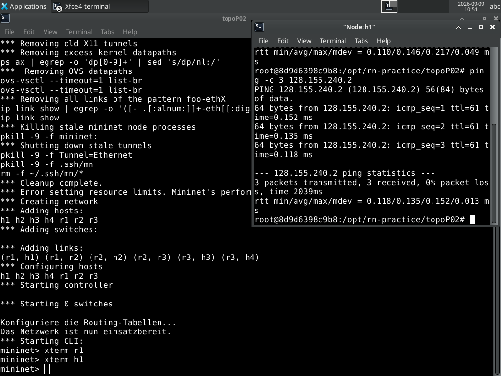
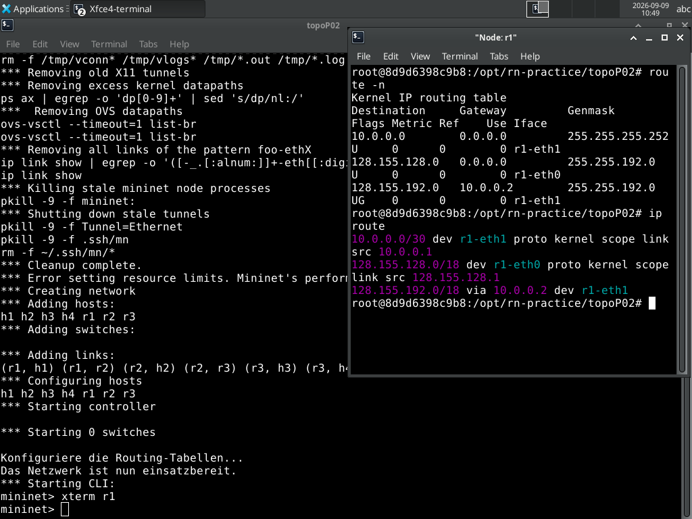

# 02 · IPv4-Subnetting & ARP

[:material-file-pdf-box: Als PDF herunterladen](../../pdf/02-subnetting-arp.pdf){ .md-button }

## Lernziele

- VLSM-Subnetting (Variable Length Subnet Masking) aus konkreten Host-Zahlen
  ableiten, statt nur klassische, gleich große Subnetze zu bilden.
- Die Routing-Tabelle mehrerer direkt verbundener Router lesen und die
  Weiterleitungsentscheidung für ein Paket nachvollziehen (`route -n`,
  `ip route`).
- Das Zusammenspiel von Routing und ARP verstehen: für jeden Hop entlang
  eines Pfads wird die Ziel-MAC-Adresse separat per ARP aufgelöst, auch wenn
  die IP-Zieladresse über den gesamten Pfad gleich bleibt.
- Grundlegende Linux-Layer-3-Konfiguration selbst durchführen: Interface-
  Adressierung, statische Routen, Default-Gateway.
- (Vertiefung, optional) Auswirkungen einer reduzierten MTU auf
  IPv4-Fragmentierung und Paketverlust beobachten.
- Das Lernverhalten eines Switches benennen und nachvollziehen: dass er
  Adressen aus dem eingehenden Verkehr lernt, unbekannte Ziele an alle Ports
  flutet, gelernte Einträge nach einer Alterungszeit wieder vergisst und dass
  seine Lerntabelle endlich ist.

--8<-- "issue-feedback.md"

## Aufgaben

### Teil 1 – VLSM-Subnetting nachvollziehen (`topoP02`)

!!! info "Fachbegriff: Subnetz"
    Ein **Subnetz** ist ein zusammenhängender Ausschnitt eines
    IP-Adressraums, der als eigenes Netzsegment behandelt wird – festgelegt
    durch eine **Netzadresse** und eine **Präfixlänge** (z. B. `/18`), die
    angibt, wie viele der führenden Adressbits das Netz identifizieren; der
    Rest steht für einzelne Hosts zur Verfügung. Ein großer Adressraum wird
    in mehrere Subnetze aufgeteilt, damit Abteilungen, Standorte oder
    Funktionsbereiche getrennt adressiert und geroutet werden können.
    **VLSM** (Variable Length Subnet Masking) bedeutet: Die Subnetze eines
    Adressraums müssen nicht gleich groß sein – jedes bekommt so viele
    Adressen, wie sein Hostbedarf verlangt.

Startet die vorkonfigurierte Referenztopologie:

```bash
cd ~/rn-practice/topoP02
./start-topoP02.sh
```

**Szenario:** Ein Unternehmen mit vier Abteilungen soll aus dem Adressraum
`128.155.128.0/17` versorgt werden. Der Hostbedarf pro Abteilung:

| Abteilung   | benötigte Hosts |
|-------------|-----------------|
| Entwicklung | 10.000          |
| Verkauf     | 7.500           |
| Einkauf     | 2.100           |
| Lager       | 400             |

!!! info "Vier Abteilungen, vier Subnetze"
    Router `r3` hat zwei Host-Anschlüsse (`h3` und `h4`); zusammen mit `h1`
    an `r1` und `h2` an `r2` ergibt das ein Subnetz je Abteilung:

    | Router-Interface | Subnetz | Nutzbare Hosts | Abteilung |
    |---|---|---|---|
    | `r1-eth0` (→ `h1`) | `128.155.128.0/18` | 16.382 | Entwicklung (10.000) |
    | `r2-eth0` (→ `h2`) | `128.155.192.0/19` | 8.190 | Verkauf (7.500) |
    | `r3-eth1` (→ `h3`) | `128.155.224.0/20` | 4.094 | Einkauf (2.100) |
    | `r3-eth2` (→ `h4`) | `128.155.240.0/23` | 510 | Lager (400) |

    Je kleiner der Hostbedarf einer Abteilung, desto länger das gewählte
    Präfix: Entwicklung mit 10.000 Hosts bekommt das größte Subnetz (`/18`),
    Lager mit 400 Hosts das kleinste (`/23`).

Zusätzlich zu den vier Abteilungsnetzen gibt es zwei private
**Transitnetze** zwischen den Routern (`10.0.0.0/30` zwischen `r1` und `r2`,
`10.0.1.0/30` zwischen `r2` und `r3`) – ein in der Praxis übliches Muster,
um Backbone-Verbindungen von den Netzen der Endgeräte zu trennen.

Eure Aufgabe: Erschließt euch die Topologie und stellt fest, ob alle Rechner
in allen Netzen erreichbar sind. Startet dazu auf `h1` einen Ping zu `h3`
und `h4`:

```bash
h1$ ping -c 4 128.155.224.2   # h3
h1$ ping -c 4 128.155.240.2   # h4
```


*Ping von `h1` über drei Router (`r1`→`r2`→`r3`) zu `h3` und `h4`. Die
TTL von 61 (Startwert 64) zeigt die drei Router-Hops.*

!!! info "Fachbegriff: Routingtabelle"
    Die **Routingtabelle** eines Rechners oder Routers listet, über welchen
    Weg (welche **Ausgangsschnittstelle**, ggf. über welchen **Gateway**/
    **Nexthop**) ein Paket zu einem bestimmten Zielnetz gelangt. Direkt
    angeschlossene Netze trägt der Kernel automatisch ein; jedes andere Ziel
    braucht entweder eine manuell gesetzte Route (wie in Teil 2) oder eine
    von einem Routing-Protokoll gelernte Route (siehe
    [Lab 03](03-routing-rip-bgp.md)). Zwei gebräuchliche Werkzeuge zum
    Anzeigen sind `route -n` (klassisch) und `ip route` (Teil der
    `iproute2`-Sammlung) – beide zeigen dieselbe Tabelle in unterschiedlicher
    Formatierung.

Prüft anschließend auf jedem Router die Routing-Tabelle:

```bash
mininet> xterm r1
r1$ route -n
r1$ ip route
```


*`route -n`/`ip route` auf `r1`. Die Zeile `128.155.192.0/18 via 10.0.0.2`
fasst die Netze von Verkauf (`/19`), Einkauf (`/20`) und Lager (`/23`) zu
einer einzigen Route über `r2` zusammen.*

!!! warning "Maskeninkonsistenz bei `h4`"
    `topoP02.py` gibt dem Host `h4` die Adresse `128.155.240.2/20`, die
    zugehörige Router-Schnittstelle `r3-eth2` bekommt `128.155.240.1/23` –
    zwei unterschiedliche Subnetzmasken auf derselben Verbindung. Da `h4`
    und `r3` direkt verbunden sind, funktioniert der Ping trotzdem. Sichtbar
    wird der Fehler, wenn ihr die Netzgrenze berechnet: nach `h4`s
    `/20`-Sicht reicht das Netz bis `128.155.255.255`, nach der
    `/23`-Sicht von `r3` nur bis `128.155.241.255`. Gleicht `ip a s` auf `h4`
    mit der VLSM-Tabelle oben ab.

Außerdem heißt die Schnittstelle von `h4` im Skript `h3-eth0` statt
`h4-eth0` (`intfName2='h3-eth0'`). Auf die Erreichbarkeit hat das keinen
Einfluss, weil jeder Host in seinem eigenen Netzwerk-Namespace lebt; in
`ip a s` auf `h4` seht ihr aber `h3-eth0`.

#### Traceroute und ARP

Ihr habt geprüft, *dass* die Pakete ankommen. Jetzt geht es darum, *wie*
sie unterwegs adressiert werden – dafür kommt mit ARP ein zweites Protokoll
ins Spiel, das IP-Adressen auf Hardware-Adressen abbildet.

!!! info "Fachbegriff: ARP (Address Resolution Protocol)"
    Eine IP-Adresse allein reicht nicht, um ein Paket auf einem Ethernet-
    Segment zuzustellen – dafür wird die **MAC-Adresse** der Netzwerkkarte
    gebraucht. **ARP** (Address Resolution Protocol, RFC 826) ist das
    Protokoll, mit dem ein Rechner diese Zuordnung klärt: Er fragt per
    Broadcast „wer hat diese IP-Adresse?" und die passende Netzwerkkarte
    antwortet mit ihrer MAC-Adresse. Jeder Rechner merkt sich das Ergebnis
    eine Zeit lang in seinem **ARP-/Nachbarschafts-Cache**. ARP wird immer
    nur **innerhalb eines Segments** verwendet, für den jeweils **nächsten**
    Hop – nie für das Endziel, wenn dieses in einem anderen Netz liegt.

Stellt mit `traceroute` fest, welchen Weg das Paket von `h1` zu `h3` durch
das Netz nimmt, und beobachtet parallel mit `tcpdump`, welche
ARP-Anfragen auf dem Weg ausgelöst werden:

```bash
h1$ traceroute 128.155.224.2
```

Öffnet dafür vorher auf jedem beteiligten Router ein zusätzliches Terminal
(`mininet> xterm r1`, `mininet> xterm r2`, `mininet> xterm r3`) und startet
dort jeweils `tcpdump -i any arp`. Gleicht anschließend die ARP-Tabellen von
Routern und Endpunkten ab:

```bash
$ arp -a
$ ip neigh
```

**Kernbeobachtung:** Obwohl die IP-Zieladresse (`128.155.224.2`) über den
gesamten Pfad unverändert bleibt, wird auf jedem der vier Segmente
(`h1`–`r1`, `r1`–`r2`, `r2`–`r3`, `r3`–`h3`) eine eigene ARP-Auflösung für
den jeweils nächsten Hop durchgeführt – der Zielrechner selbst wird erst auf
dem letzten Segment per ARP adressiert.

!!! question "Hop 3 bleibt stumm"
    `traceroute` zeigt `r1` (`128.155.128.1`) als Hop 1, `r2` (`10.0.0.2`)
    als Hop 2 und `h3` als Hop 4 – Hop 3 (`r3`) erscheint nur als `* * *`.
    `r3` schickt seine ICMP-Meldung mit der Absenderadresse `10.0.1.2`.
    Schaut in die Routing-Tabelle von `r1`: Kennt `r1` einen Weg zu
    `10.0.1.0/30`? Was macht ein Router, der Pakete von einer Quelle erhält,
    zu der er selbst keine Route hat (Stichwort *Reverse Path Filter*,
    `sysctl net.ipv4.conf.all.rp_filter`)?

!!! question "Kurz nachgedacht"
    Wenn ARP nur innerhalb eines Segments gilt: Woher weiß `h1` dann
    überhaupt, dass es sein Paket an `r1` schicken soll, statt selbst nach
    der MAC-Adresse von `h3` zu fragen? (Hinweis: Schaut auf die
    Routing-Tabelle von `h1` – die Antwort liegt nicht bei ARP, sondern
    einen Schritt davor.)

!!! example "Vertiefung (optional): Routing-Schnappschüsse über mehrere Anläufe vergleichen"
    Euer `~/rn-practice`-Verzeichnis bleibt über Container-Neustarts hinweg
    erhalten. Sichert die Ausgaben von `route -n`, `ip route` und `arp -a`
    auf allen Routern und Hosts in eine eigene Datei, z. B.
    `~/rn-practice/snapshots/02-lauf1.txt`. Beendet die Topologie
    (`mininet> quit`), startet sie erneut und wiederholt den Mitschnitt in
    einer zweiten Datei. Ein `diff` zwischen beiden Läufen zeigt, welche
    Einträge bei jedem Start identisch bleiben (die vom Skript
    vorkonfigurierten Routen) und welche verschwunden sind, falls ihr
    zwischendurch manuell etwas verändert hattet – also was an einer
    laufenden Konfiguration flüchtig ist.

### Teil 2 – Eigene Konfiguration üben (`topoP02-self.py`)

Dieselbe Topologie steht auch unkonfiguriert zur Verfügung, damit ihr die
Adressierung und das Routing selbst nachbaut. Für diese Variante gibt es
kein Startskript; ruft die Python-Datei direkt auf:

```bash
cd ~/rn-practice/topoP02
sudo python3 topoP02-self.py
```

Eure Aufgabe: konfiguriert dieselbe Adressierung wie in Teil 1 von Hand.
Die dafür benötigten Befehle:

```bash
# IP-Adresse für ein Router- oder Host-Interface konfigurieren
ifconfig <interface> <ip_address>/<subnet_mask>

# Route auf einem Router hinzufügen
ip route add <ziel_netz> via <gateway_ip>

# Standard-Gateway für einen Host festlegen
route add default gw <gateway_ip>
```

Die IP-Weiterleitung ist auf allen Routern durch die `Router`-Klasse in
`topoP02-self.py` bereits aktiviert; ihr müsst sie nicht selbst setzen. Der
Befehl dafür lautet:

```bash
sysctl net.ipv4.ip_forward=1
```

!!! example "Vertiefung (optional): Eure Konfiguration als wiederholbares Skript"
    Alles, was ihr von Hand eingetippt habt, ist mit `mininet> quit`
    verschwunden. Schreibt die Befehle stattdessen in eine Datei, eine Zeile
    je Befehl mit dem Knoten vorweg, z. B.
    `~/rn-practice/topoP02/meine-config.sh`:

    ```text
    r1 ifconfig r1-eth1 10.0.0.1/30
    r1 ip route add 128.155.192.0/18 via 10.0.0.2
    h1 route add default gw 128.155.128.1
    ```

    Beendet die Topologie, startet `topoP02-self.py` neu und spielt die Datei
    mit `mininet> source meine-config.sh` ein. Prüft mit `ip -o addr` und
    einem Ping, ob der Zustand derselbe ist.

    Spielt die Datei danach ein **zweites** Mal auf derselben laufenden
    Topologie ein. `ip route add` meldet dann `RTNETLINK answers: File
    exists`, `route add default gw` meldet `SIOCADDRT: File exists`, und
    `ip addr add` würde mit `Address already assigned` scheitern. Ein
    Befehl, der beim zweiten Aufruf scheitert, taugt nicht für
    automatisierte Konfiguration. Sucht die Varianten, die sich wiederholen
    lassen (Stichwort `ip route replace`, `ip addr replace`), und überlegt,
    warum diese Eigenschaft bei Konfigurationswerkzeugen einen eigenen Namen
    hat.

### Teil 3 (Vertiefung, optional) – MTU und Fragmentierung (`topoP04`)

Bisher ging es um Adressierung und Routing – die Frage, *wohin* ein Paket
geschickt wird. In diesem optionalen Teil geht es darum, *wie groß* ein
Paket sein darf, bevor es unterwegs zerlegt werden muss. Dafür wechselt ihr
zu `topoP04`, einer Zwei-Host-Topologie (`h1` = `10.0.0.1`, `h2` =
`10.0.0.2`) mit kleiner MTU (536 Byte statt der üblichen 1500) und 10 %
künstlichem Paketverlust auf jedem Link:

```python
self.addLink(h1, s1, cls=TCLink, bw=10, mtu=536, loss=10)
self.addLink(h2, s1, cls=TCLink, bw=10, mtu=536, loss=10)
```

Im Verzeichnis liegen außerdem zwei Textdateien zum Verschicken:
`MehrAls500ByteText.txt` (632 Byte) und `MehrAls1500ByteText.txt`
(1638 Byte).

Startet die Topologie und beobachtet mit `ping`, ab welcher Paketgröße
Fragmentierung nötig wird:

```bash
cd ~/rn-practice/topoP04
./start-topoP04.sh
h1$ ping -c 4 -M do -s 1000 10.0.0.2   # "do" = Don't Fragment
h1$ ping -c 4 -s 1000 10.0.0.2         # ohne DF-Bit
```

**Erwartung:** Mit gesetztem DF-Bit verweigert schon `h1` das Senden
(`ping: sendmsg: Message too long`). Ohne DF-Bit wird jedes Echo in zwei
Fragmente zerlegt; durch die Verlustrate gehen einzelne Pings verloren.

Beobachtet mit `tcpdump -n -v -i h1-eth0` den Unterschied zwischen beiden
Aufrufen (Felder `offset` und `flags [+]`). Schickt anschließend die
Textdateien per UDP über die Leitung:

```bash
h2$ nc -u -l 5000
h1$ nc -u -w1 10.0.0.2 5000 < MehrAls1500ByteText.txt
```

Zählt die Fragmente im Mitschnitt und überlegt, was mit dem ganzen
Datagramm passiert, wenn durch die 10 % Verlustrate nur eines seiner
Fragmente verloren geht.

### Teil 4 – Broadcast-Adressen selbst berechnen, bevor ihr sie prüft (`topoP02`)

Die VLSM-Tabelle aus Teil 1 gibt euch für jedes der vier Subnetze
Netzadresse und Anzahl nutzbarer Hosts vor. Berechnet daraus selbst –
**ohne vorher `ip addr` auf dem jeweiligen Interface auszuführen** – die
**Broadcast-Adresse** für die Subnetze von `h1` (Entwicklung) und `h2`
(Verkauf):

| Abteilung | Netz | Präfixlänge | Eure berechnete Broadcast-Adresse |
|---|---|---|---|
| Entwicklung (`h1`) | `128.155.128.0` | `/18` | ? |
| Verkauf (`h2`) | `128.155.192.0` | `/19` | ? |

**Vorgehen:** Bestimmt zunächst die Netzmaske in Dotted-Decimal-Schreibweise
(`/18` → `255.255.192.0`, `/19` → `255.255.224.0`), invertiert sie bitweise
(Host-Anteil), und setzt diesen invertierten Anteil auf die Netzadresse auf
– das Ergebnis ist die Broadcast-Adresse (letzte Adresse des Subnetzes, für
Hosts nicht nutzbar).

Startet anschließend `topoP02` (falls nicht mehr aktiv) und prüft eure
Rechnung gegen die vom Kernel vergebene Broadcast-Adresse:

```bash
cd ~/rn-practice/topoP02
./start-topoP02.sh
h1$ ip addr show h1-eth0
h2$ ip addr show h2-eth0
```

Das Feld `brd` in der Ausgabe von `ip addr show` zeigt die vom Kernel aus
Adresse und Präfixlänge berechnete Broadcast-Adresse – sie muss mit eurem
von Hand berechneten Wert übereinstimmen.

??? success "Zur Kontrolle (erst nach der eigenen Rechnung öffnen)"
    `ip addr show h1-eth0` liefert `inet 128.155.128.2/18 brd
    128.155.191.255`, `ip addr show h2-eth0` liefert `inet
    128.155.192.2/19 brd 128.155.223.255`.

**Aufgabe:** Berechnet zusätzlich, wie viele Subnetze der Größe `/19`
(Verkauf) rechnerisch insgesamt in das übergeordnete `/17`-Netz aus der
Aufgabenstellung passen würden, wenn das gesamte Netz ausschließlich in
gleich große `/19`-Subnetze aufgeteilt würde – und vergleicht das Ergebnis
mit der Anzahl der tatsächlich benötigten, unterschiedlich großen VLSM-Netze
aus der Tabelle in Teil 1. Was verliert man an nutzbaren Adressen, wenn man
statt VLSM eine starre, gleich große Aufteilung verwendet?

### Teil 5 – Die Lerntabelle des Switches füllen (`topo02`)

ARP war in Teil 1 die Frage „welche MAC-Adresse gehört zu dieser IP-Adresse?"
– gestellt von einem **Host**. Jetzt wechselt die Perspektive auf das Gerät in
der Mitte. Ein Switch stellt diese Frage nie. Er beantwortet eine andere,
ohne je gefragt zu haben: „über welchen Port erreiche ich diese MAC-Adresse?"

Er **lernt** dazu aus jedem Rahmen, der bei ihm ankommt, und zwar aus der
*Absender*-Adresse. Aus dieser einen Regel folgt alles Weitere – dass er ein
unbekanntes Ziel an alle Ports schicken muss, dass er wieder vergisst, und
dass seine Tabelle volllaufen kann.

!!! note "Werkzeug: `ovs-appctl` statt `brctl`"
    Die Switches dieser Topologie sind Open-vSwitch-Instanzen, keine
    Linux-Bridges; `brctl showmacs` passt deshalb nicht (und `brctl` ist
    nicht installiert). Die Lerntabelle zeigt `ovs-appctl`:

    ```bash
    sudo ovs-appctl fdb/show <switch>          # die Lerntabelle anzeigen
    sudo ovs-appctl fdb/stats-show <switch>    # Belegung, Obergrenze, Verdrängungen
    ```

    `fdb` steht für *forwarding database* – der Name dessen, was in
    Vorlesungen meist „MAC-Tabelle" oder „Lerntabelle" heißt.

    Befehle mit `$` gebt ihr in einem normalen Terminal auf dem Desktop ein
    (nicht in der Mininet-Konsole); `ovs-appctl` und `ovs-vsctl` brauchen
    dort `sudo`.

Startet die Topologie. `topo02` hat einen Switch mit **drei** angeschlossenen
Geräten – das braucht ihr, um Fluten beobachten zu können: Es muss jemanden
geben, der einen Rahmen empfängt, der nicht für ihn ist.

```bash
cd ~/rn-practice/topo02
./start-topo02.sh
```

An `s1` hängen `h0` (`10.0.10.10`), `h1` (`10.0.10.11`) und `r1`
(`10.0.10.1`). Verschafft euch zuerst Klarheit über Ports und Adressen:

```bash
$ sudo ovs-vsctl list-ports s1
$ sudo ovs-appctl fdb/show s1
```

!!! warning "Zwei Eigenheiten der Schnittstellennamen in `topo02`"
    Zwei Namen in der Portliste passen nicht zum tatsächlichen Aufbau:

    - Einer der Ports von `s1` heißt **`r1-eth2`**, obwohl dort `h1` hängt und
      nicht `r1`.
    - Die Schnittstelle von `h1` heißt **`h0-eth0`** – derselbe Name, den auch
      `h0` für seine eigene Schnittstelle verwendet. Verwechseln kann man sie
      nicht, weil jeder Host in seinem eigenen Namensraum lebt.

    Für `tcpdump` auf `h1` heißt das: `-i h0-eth0`. Prüft mit `ip -o addr` auf
    `h1`, welchen Namen ihr vor euch habt. Dieselbe Art Namensfehler ist euch
    in Teil 1 bei `h4` begegnet.

#### Schritt 1 – Erst vorhersagen

Beantwortet diese vier Fragen schriftlich, **bevor** ihr ein Kommando absetzt:

| Frage | Eure Vorhersage |
|---|---|
| `h0` schickt einen Rahmen an eine MAC-Adresse, die dem Switch unbekannt ist. Wie viele der drei Ports sehen ihn? | ? |
| Danach schickt `h0` an eine MAC-Adresse, die der Switch kennt. Wie viele Ports sehen ihn jetzt? | ? |
| Ihr setzt die Alterungszeit auf 15 Sekunden. Nach wie vielen Sekunden Stille ist ein Eintrag verschwunden? | ? s |
| Die Tabelle fasst höchstens `n` Einträge. Was passiert beim `n+1`-ten? | ? |

#### Schritt 2 – Fluten an ein unbekanntes Ziel messen

Ein unbekanntes Ziel stellt ihr am einfachsten mit einer MAC-Adresse her, die
**niemandem** gehört. Dann kann der Switch sie nie lernen, und jeder Rahmen
dorthin wird geflutet. Tragt sie auf `h0` von Hand ein, damit kein ARP
dazwischenkommt:

```bash
mininet> xterm h0
mininet> xterm h1
h0$ ip neigh replace 10.0.10.99 lladdr 02:00:00:00:00:99 dev h0-eth0 nud permanent
```

Lasst `h1` mithören – `h1` ist weder Absender noch Empfänger dieser Rahmen:

```bash
h1$ tcpdump -i h0-eth0 -n icmp
h0$ ping -c 3 10.0.10.99
```

**Messwert:** Wie viele der drei gesendeten Rahmen kommen bei `h1` an?

#### Schritt 3 – Die Gegenprobe

Ein Befund „`h1` sieht die Rahmen" belegt für sich genommen noch nichts – er
könnte auch bedeuten, dass dieser Switch *grundsätzlich* alles an alle
schickt, also gar nicht lernt. Leert deshalb die Tabelle und wiederholt den
Versuch mit einem Ziel, das existiert:

```bash
$ sudo ovs-appctl fdb/flush s1
h1$ tcpdump -i h0-eth0 -n icmp
h0$ ping -c 5 10.0.20.10
```

**Messwert:** Wie viele der fünf Echo-Anfragen sieht `h1` jetzt? Achtet
darauf, *welche* es sind: Direkt nach dem Leeren kennt der Switch noch
niemanden. Erst der Unterschied zwischen Schritt 2 und Schritt 3 zeigt, dass
gelernt wird.

Schaut euch anschließend an, was der Switch dabei gelernt hat:

```bash
$ sudo ovs-appctl fdb/show s1
```

Die Spalte `Age` ist das Alter des Eintrags in Sekunden. Lasst die Ausgabe
zweimal im Abstand einiger Sekunden laufen und achtet darauf, wann `Age` von
selbst wieder auf einen kleinen Wert springt – und was das über den Verkehr
aussagt, der in der Zwischenzeit geflossen ist.

#### Schritt 4 – Die Alterungszeit messen

Ein Switch, der nie vergisst, wäre unbrauchbar: Ein an einen anderen Port
umgesteckter Rechner bliebe für immer unerreichbar. Setzt die Alterungszeit
herunter, erzeugt einmal Verkehr und beobachtet dann, **ohne weiteren
Verkehr**, wie lange der Eintrag überlebt:

```bash
$ sudo ovs-vsctl set bridge s1 other-config:mac-aging-time=15
$ sudo ovs-vsctl get bridge s1 other-config
h0$ ping -c 2 10.0.20.10
$ sudo watch -n 1 ovs-appctl fdb/show s1
```

**Messwert:** Nach wie vielen Sekunden ist der Eintrag für `h0`s MAC-Adresse
(`00:00:00:00:00:01`) verschwunden? Wiederholt die Messung zwei- bis dreimal,
vergleicht mit den eingestellten 15 Sekunden und erklärt die Abweichung. Der
Hinweis: Ein Switch hält keinen Wecker für jeden einzelnen Eintrag – er räumt
in Durchläufen auf. Ist eine Alterungszeit damit eine Zusage oder eine
Untergrenze?

#### Schritt 5 – Die Tabelle zum Überlaufen bringen

Die Lerntabelle ist endlich. Fragt zuerst nach, wie groß sie ist:

```bash
$ sudo ovs-appctl fdb/stats-show s1
```

Das Werkzeug, mit dem man eine solche Tabelle füllt, heißt `macof` (aus dem
Paket `dsniff`). Es erzeugt Rahmen mit **zufälligen** Absenderadressen – und
weil der Switch aus genau diesem Feld lernt, legt er für jeden einzelnen einen
Eintrag an:

```bash
h0$ timeout 5 macof -i h0-eth0
$ sudo ovs-appctl fdb/show s1 | wc -l
$ sudo ovs-appctl fdb/stats-show s1
```

(`wc -l` zählt die Kopfzeile von `fdb/show` mit.) Verkleinert die Tabelle
danach absichtlich und wiederholt den Versuch:

```bash
$ sudo ovs-vsctl set bridge s1 other-config:mac-table-size=64
h0$ timeout 5 macof -i h0-eth0
$ sudo ovs-appctl fdb/stats-show s1
```

**Messwerte:** Wie viele Einträge stehen danach in der Tabelle, und um wie
viel ist die Zeile `evicted` (verdrängt) gestiegen? Die Zähler in
`fdb/stats-show` laufen seit dem Start des Switches mit; vergleicht deshalb
die Werte vor und nach `macof`. Setzt die Einstellungen danach wieder zurück:

```bash
$ sudo ovs-vsctl remove bridge s1 other-config mac-table-size
$ sudo ovs-vsctl remove bridge s1 other-config mac-aging-time
```

!!! question "Der Bogen zur Sicherheit – und die Grenze dieser Übung"
    Ihr habt dafür gesorgt, dass ein Switch keinen Platz mehr hat, um echte
    Adressen zu lernen. Überlegt, was das für einen Angreifer am selben
    Segment bedeutet: Welche Rahmen sieht er danach, die er vorher nicht sah?
    Der Angriff hat einen Namen (*MAC flooding*), und die Gegenmaßnahme in
    verwalteten Switches auch (*port security*).

    Gemessen habt ihr hier aber nur die **Verdrängung von Einträgen**
    (`evicted`). Dass der Switch daraufhin fremden Verkehr an euren Port
    flutet, ist damit **nicht** gezeigt – das wäre eine eigene Messung mit
    `tcpdump` auf `h1`, während `macof` läuft. Formuliert, wie ihr sie
    anlegen würdet; in Teil 9 führt ihr sie durch. Wie ein Lauschangriff auf
    einem geteilten Segment praktisch aussieht, steht in
    [Lab 05 – ARP-Spoofing & Denial-of-Service](05-arp-spoofing-dos.md).

??? success "Zur Kontrolle: typische Werte (erst nach der eigenen Messung öffnen)"
    | Messung | Typisches Ergebnis |
    |---|---|
    | Ports von `s1` | `s1-eth1` (`h0`), `s1-eth0` (`r1`), `r1-eth2` (`h1`) |
    | Fluten an ein unbekanntes Ziel (Schritt 2) | `h1` sieht **3 von 3** Rahmen |
    | Gegenprobe mit bekanntem Ziel (Schritt 3) | `h1` sieht höchstens die erste Anfrage (und deren Antwort) direkt nach dem Leeren, danach nichts mehr |
    | Alterung bei `mac-aging-time=15` | Eintrag verschwindet nach etwa 15 bis 20 s, gelegentlich später |
    | Obergrenze der Tabelle (Standard) | **8192** Einträge |
    | `macof` 5 s gegen die Standardtabelle | Tabelle läuft je nach Senderate teilweise oder ganz voll (bis `8192/8192`) |
    | `macof` 5 s bei `mac-table-size=64` | genau **64** Einträge, `evicted` steigt um eine sechsstellige Zahl |

    Der Kontrast „alle Rahmen" gegen „nur der erste" ist der eigentliche
    Befund dieses Teils: derselbe Switch, dieselbe Quelle, derselbe
    Beobachter – nur einmal mit und einmal ohne Eintrag in der Lerntabelle.
    Die Zahlen für `evicted` hängen davon ab, wie schnell `macof` Rahmen
    erzeugt.

--8<-- "issue-feedback.md"

### Teil 6 – ARP von Hand auslösen und die Zustände lesen (`topo02`)

Teil 1 hat ARP als Beiwerk des Routings gezeigt: auf jedem Segment eine eigene
Auflösung. Jetzt betrachtet ihr ARP als eigenständiges Protokoll und macht
**eine einzelne** Auflösung sichtbar – Frage und Antwort, und was der Kernel
danach im Nachbarschafts-Cache über den Nachbarn notiert.

!!! info "Werkzeug: `nping --arp` und `ip neigh`"
    `nping --arp` (aus der Nmap-Sammlung) verschickt **eine** ARP-Anfrage und
    zeigt Frage und Antwort im Klartext – genau einen Auflösungsvorgang, ohne
    das Rauschen eines Dauer-Mitschnitts. (`arping` ist in dieser Umgebung
    nicht installiert.)
    `ip neigh` zeigt den Nachbarschafts-Cache mit einem **Zustand** je Eintrag:
    `REACHABLE` (kürzlich bestätigt), `STALE` (alt, aber nutzbar), `DELAY`/`PROBE`
    (wird gerade neu geprüft). `STALE` ist kein Fehler: Der Eintrag wird beim
    nächsten Verkehr weiterverwendet und erst bei Bedarf neu geprüft.

**Ziel:** Eine ARP-Auflösung erzwingen, Anfrage und Antwort sehen und den
Übergang der Cache-Zustände nachvollziehen.

**Vorbedingung:** `topo02` läuft (`cd ~/rn-practice/topo02 && ./start-topo02.sh`).
`h0` (`10.0.10.10`) und das Gateway `r1` (`10.0.10.1`) liegen am selben Segment.

**Schritte:**

```bash
h0$ ip neigh flush all
h0$ ip neigh show 10.0.10.1          # leer
h0$ nping --arp -c 1 10.0.10.1       # eine ARP-Anfrage, Antwort im Klartext
h0$ ping -c 1 10.0.10.1 ; ip neigh show 10.0.10.1
```

**Erwartete Ausgabe:** `ip neigh show 10.0.10.1` ist nach dem Flush leer.
`nping` zeigt `SENT (…) ARP who has 10.0.10.1? Tell 10.0.10.10` und darunter
`RCVD (…) ARP reply 10.0.10.1 is at 00:00:00:00:00:05`. Nach dem Ping steht
`10.0.10.1 dev h0-eth0 lladdr 00:00:00:00:00:05 REACHABLE`.

!!! quote "Hintergrund: ARP ist älter als das Sicherheitsdenken"
    ARP wurde im **November 1982** von David C. Plummer in **RFC 826** definiert
    (Titel: „An Ethernet Address Resolution Protocol"). Es ist bis heute
    Internet Standard (STD 37) und praktisch unverändert – und kennt deshalb
    keinerlei Schutz gegen gefälschte Antworten. RFC 826 entstand, bevor die
    Absicherung von LANs ein Thema war. Genau das nutzt der Angriff in
    [Lab 05](05-arp-spoofing-dos.md) aus.

    - RFC 826 (rfc-editor): <https://www.rfc-editor.org/rfc/rfc826.html>
    - IETF-Datatracker, Status STD 37: <https://datatracker.ietf.org/doc/rfc826/>

### Teil 7 – Longest-Prefix-Match selbst entscheiden, bevor der Kernel es tut (`topoP02`)

In Teil 1 habt ihr die Routing-Tabellen *gelesen*. Jetzt trefft ihr selbst die
Entscheidung, die ein Router bei **überlappenden** Routen treffen muss: Wenn
zwei Einträge auf dasselbe Ziel passen, gewinnt der mit dem **längeren Präfix**.
`topoP02` liefert dafür einen Fall auf `r2`.

!!! info "Hintergrund: warum das längste Präfix gewinnt (CNP3, RFC 1519)"
    Mit CIDR (RFC 1519) wurden die starren Adressklassen A/B/C durch Präfixe
    beliebiger Länge ersetzt. Damit kann dieselbe Zieladresse auf mehrere
    Routen passen. Die Regel dafür ist eindeutig: Das Lehrbuch CNP3
    formuliert sie als „when a router knows several routes towards the same
    destination address, it must forward packets along the route having the
    longest prefix length." `0.0.0.0/0` passt auf alles und ist deshalb die
    Default-Route – das kürzeste mögliche Präfix, der letzte Ausweg.

    Quelle: *Computer Networking: Principles, Protocols and Practice*,
    O. Bonaventure u. a., UCLouvain, Kapitel „IP version 4" (CC BY-SA 3.0),
    zitiert RFC 1519; <https://www.computer-networking.info>

**Ziel:** Für eine Zieladresse, auf die zwei Routen passen, von Hand die
gewinnende Route bestimmen und mit `ip route get` prüfen.

**Vorbedingung:** `topoP02` läuft (`cd ~/rn-practice/topoP02 && ./start-topoP02.sh`).
Öffnet ein Terminal auf `r2` (`mininet> xterm r2`).

**Schritte:** Schaut euch zuerst die Routing-Tabelle von `r2` an:

```bash
r2$ ip route
```

Ihr findet dort für das Verkaufsnetz **zwei** passende Einträge:
`128.155.192.0/19` (direkt angeschlossen, `dev r2-eth0`) und
`128.155.192.0/18 via 10.0.1.2` (der Weg über `r3`). Entscheidet **auf Papier**,
über welchen der beiden ein Paket an `128.155.192.5` (ein Host im Verkaufsnetz)
geht, und prüft erst dann:

```bash
r2$ ip route get 128.155.192.5
r2$ ip route get 128.155.240.2     # h4, nur ueber /18 erreichbar
```

**Erwartete Ausgabe:** `ip route get 128.155.192.5` nennt
`dev r2-eth0 src 128.155.192.1` **ohne** `via` (das direkt angeschlossene `/19`
gewinnt, weil sein Präfix länger ist); `ip route get 128.155.240.2` nennt
dagegen `via 10.0.1.2 dev r2-eth2 src 10.0.1.1` (nur das `/18` passt).

### Teil 8 – IPv6 nebenher: Link-Local-Adressen und Neighbor Discovery statt ARP (`topo02`)

Bisher war alles IPv4, und ARP war die Antwort auf „welche MAC gehört zu dieser
IP?". Unter IPv6 gibt es **kein ARP** – dieselbe Aufgabe erledigt das *Neighbor
Discovery Protocol* (NDP). Konfigurieren müsst ihr dafür nichts: Jede
Schnittstelle bekommt automatisch eine **Link-Local-Adresse** (`fe80::/10`),
mit der Nachbarn auf demselben Segment sich schon vor jeder IPv6-Konfiguration
erreichen.

!!! info "Werkzeug: `ip -6 neigh` und `ping6`"
    `ip -6 addr` zeigt die automatisch vergebene `fe80:...`-Adresse je
    Schnittstelle. `ping6 <ziel>%<schnittstelle>` erreicht einen Link-Local-
    Nachbarn. Der Zusatz `%h0-eth0` legt die Schnittstelle fest: `fe80::`-
    Adressen gelten auf **jeder** Schnittstelle, und ohne Zusatz wählt der
    Kernel auf einem Knoten mit mehreren Schnittstellen womöglich die
    falsche. `ip -6 neigh` ist das IPv6-Gegenstück zu `ip neigh`. Eine
    `fe80:`-Adresse bedeutet nicht „nicht konfiguriert": Sie ist der
    Normalzustand und für NDP unverzichtbar.

**Ziel:** Zeigen, dass IPv6-Nachbarn sich ohne Konfiguration und ohne ARP
finden, und den von NDP gefüllten Nachbar-Cache lesen.

**Vorbedingung:** `topo02` läuft. Terminal auf `h0`.

**Schritte:**

```bash
h0$ ip -6 addr show h0-eth0            # die fe80:...-Adresse ablesen
h0$ ping6 -c 2 ff02::1%h0-eth0         # all-nodes-Multicast auf dem Segment
h0$ ip -6 neigh show dev h0-eth0       # von NDP gefuellte Nachbarn
```

**Erwartete Ausgabe:** `ip -6 addr` zeigt `inet6 fe80::200:ff:fe00:1/64 scope
link`. Auf den Ping an die All-Nodes-Adresse antworten `h0` selbst sowie
`fe80::200:ff:fe00:2` (`h1`) und `fe80::200:ff:fe00:5` (`r1`). Danach stehen
in `ip -6 neigh` diese beiden Nachbarn mit ihrer MAC-Adresse
(`00:00:00:00:00:02`, `00:00:00:00:00:05`) – gefüllt durch NDP, nicht durch
ARP.

Probiert den Zusatz `%…` auch auf `r1` aus, das mehrere Schnittstellen hat:
`r1$ ping6 -c 1 fe80::200:ff:fe00:1` ohne Zusatz scheitert dort mit
`Destination unreachable: Address unreachable`, mit `%r1-eth0` kommt die
Antwort von `h0`.

!!! info "Hintergrund: NDP ist RFC 4861"
    Was ARP (RFC 826) für IPv4 tut, erledigt für IPv6 das *Neighbor Discovery
    Protocol* (RFC 4861) – allerdings nicht über einen eigenen Ethertype,
    sondern als Teil von ICMPv6. Die `fe80::…`-Adresse leitet sich in dieser
    Umgebung erkennbar aus der MAC ab (`…00:ff:fe00:5` gehört zur MAC
    `00:00:00:00:00:05`) – das ist das EUI-64-Verfahren, an dem man Adresse
    und Hardware einander zuordnen kann.

### Teil 9 – Die offene Frage aus Teil 5: Überlauf ja – und Flutung? (`topo02`)

Teil 5 endete mit einer offenen Frage: Ihr habt die Lerntabelle mit `macof`
zum Überlaufen gebracht (Einträge wurden verdrängt), aber **nicht** gezeigt,
dass der Switch daraufhin fremden Verkehr an euren Port flutet. Diese Messung
legt ihr jetzt an.

**Ziel:** Prüfen, ob der Überlauf der Lerntabelle dazu führt, dass ein
Unbeteiligter (`h1`) den Unicast-Verkehr zwischen `h0` und dem Gateway `r1`
mitsieht – und in welche Richtung.

**Vorbedingung:** `topo02` läuft. Terminals auf `h0` und `h1`. Denkt an die
Namens-Eigenheit aus Teil 5: `h1`s Schnittstelle heißt `h0-eth0`.

**Schritte:**

```bash
# 1. h1 lauscht auf Verkehr, an dem es NICHT beteiligt ist (h0 <-> r1):
h1$ tcpdump -i h0-eth0 -n icmp and host 10.0.10.1
# 2. Baseline OHNE Angriff: h0 pingt r1
h0$ ping -c 3 10.0.10.1
# 3. Tabelle klein machen und mit macof ueberfluten:
$ sudo ovs-vsctl set bridge s1 other-config:mac-table-size=16
h0$ timeout 6 macof -i h0-eth0 &
# 4. waehrend macof laeuft: h0 pingt r1 erneut, h1 weiter beobachten
h0$ ping -c 8 -i 0.3 10.0.10.1
$ sudo ovs-appctl fdb/stats-show s1
$ sudo ovs-vsctl remove bridge s1 other-config mac-table-size
```

**Erwartete Ausgabe:** In der Baseline sieht `h1` nichts. Während `macof`
läuft, zeigt `fdb/stats-show` eine volle Tabelle (`16/16`) und stark
steigende `evicted`-Zahlen. `h1` sieht jetzt die **Echo-Antworten** von `r1`
an `h0` (`10.0.10.1 > 10.0.10.10: ICMP echo reply`), aber **keine**
Echo-Anfragen von `h0` an `r1`.

!!! question "Warum nur eine Richtung geflutet wird"
    Verdrängt werden nicht wahllos irgendwelche Einträge: Open vSwitch
    verdrängt bei voller Tabelle bevorzugt Einträge des Ports, der die
    meisten Einträge belegt. Überlegt:

    1. An welchem Port lernt der Switch die zufälligen `macof`-Adressen, und
       welche echte Adresse hängt am selben Port?
    2. Welcher der beiden Einträge (`h0` oder `r1`) wird deshalb ständig
       verdrängt, welcher bleibt stehen?
    3. Erklärt damit, warum `h1` die Antworten an `h0` sieht, die Anfragen an
       `r1` aber nicht.
    4. Wie müsste ein Angreifer den Aufbau wählen, um den Verkehr zwischen
       zwei *anderen* Geräten mitzulesen? Was leistet *port security* dagegen?

!!! quote "Hintergrund: `macof` und die dsniff-Sammlung"
    `macof` gehört wie `arpspoof` (siehe [Lab 05](05-arp-spoofing-dos.md)) zur
    **dsniff**-Sammlung von Dug Song. dsniff 1.0 erschien am 17. Dezember 1999;
    die Werkzeuge funktionieren bis heute, weil die zugrundeliegenden
    Mechanismen (ARP, Ethernet-Lernen) unverändert sind.

    - dsniff-Projektseite (Dug Song): <https://www.monkey.org/~dugsong/dsniff/>
    - dsniff CHANGES (v1.0, 17.12.1999): <https://raw.githubusercontent.com/tecknicaltom/dsniff/master/CHANGES>

### Teil 10 – Der Preis der starren Aufteilung: VLSM-Verschnitt selbst ausrechnen (`topoP02`, Handrechnung)

Teil 4 hat euch am Ende gefragt, wie viele gleich große `/19`-Subnetze in das
`/17` passen. Jetzt rechnet ihr den **Verschnitt** aus – den Adressverlust, den
eine starre, gleich große Aufteilung gegenüber VLSM verursacht. Das ist reine
Handrechnung; ihr braucht keine laufende Topologie.

**Ziel:** Den Adress-Overhead einer gleich großen Aufteilung gegen VLSM
beziffern und begründen, warum VLSM überhaupt existiert.

**Vorbedingung:** Die VLSM-Tabelle aus Teil 1 (Entwicklung `/18`, Verkauf `/19`,
Einkauf `/20`, Lager `/23`) und der Adressraum `128.155.128.0/17`.

**Schritte (auf Papier):**

1. Bestimmt für jede der vier Abteilungen die Zahl der **tatsächlich benötigten**
   Hosts (aus Teil 1) und die Zahl der **im gewählten VLSM-Präfix nutzbaren**
   Hosts. Die Differenz ist der VLSM-Verschnitt je Netz.
2. Rechnet nun die Alternative: Alle vier Abteilungen bekommen ein gleich großes
   Präfix, groß genug für die **größte** Abteilung (Entwicklung, 10.000 Hosts →
   welches Präfix?). Wie viele Adressen verbraucht diese starre Variante
   insgesamt, und passt sie überhaupt noch in das `/17`?
3. Stellt beide Summen nebeneinander: Wie viele nutzbare Adressen „verschenkt"
   die starre Aufteilung gegenüber VLSM?

**Erwartete Ausgabe:** Eine kleine Tabelle mit „benötigt / nutzbar / Verschnitt"
je Abteilung für beide Varianten und ein Satz, der den Unterschied benennt.

??? info "Zur Kontrolle (nicht vorher lesen)"
    Die größte Abteilung (10.000 Hosts) braucht ein `/18` (16.382 nutzbare
    Hosts). Vier gleich große `/18` wären `4 × 2¹⁴` Adressen – der
    **gesamte** `/16`-Bereich und damit doppelt so viel Adressraum wie das
    vorgegebene `/17` hergibt. Die starre Variante passt also gar nicht in
    den zugewiesenen Adressraum, während VLSM (`/18` + `/19` + `/20` + `/23`)
    hineinpasst. Genau dafür gibt es variabel lange Präfixe (siehe Teil 7).

### Teil 11 – Subnetz-Zugehörigkeit selbst berechnen, bevor ihr sie prüft (`topo01`)

In [Aufgabenblatt 01](01-netzwerkgrundlagen-tools.md) meldet `pingall` in
`topo01` Verluste, obwohl einzelne Pings zwischen `h1` und `h2` ankommen.
Berechnet jetzt selbst, welche Ziele im selben Subnetz liegen und welche nur
über Router erreichbar sind – bevor ihr es mit einem Befehl nachprüft.

`topo01` vergibt folgende Adressen: `h1` hat **zwei** Interfaces,
`h1-eth0` mit `10.0.5.2/24` und `h1-eth1` mit `10.0.1.2/24`; `h2` hat ein
Interface `h2-eth0` mit `10.0.6.2/24`.

Bestimmt für jedes der folgenden Ziele – **auf Papier oder im Kopf, ohne
vorher `ip route` oder Ähnliches auszuführen** – ob es im selben Subnetz wie
der jeweilige Startpunkt liegt (Netzwerk- und Broadcast-Adresse aus der
`/24`-Maske berechnen genügt) oder ob eine Weiterleitung über einen Router
nötig ist:

| Startpunkt | Ziel | Gleiches Subnetz? | Begründung |
|---|---|---|---|
| `h1` (`10.0.5.2/24` auf `h1-eth0`) | `10.0.6.2` (`h2`) | ? | ? |
| `h1` (`10.0.5.2/24` auf `h1-eth0`) | `10.0.5.1` | ? | ? |
| `h1` (`10.0.1.2/24` auf `h1-eth1`) | `1.1.1.1` | ? | ? |
| `h2` (`10.0.6.2/24` auf `h2-eth0`) | `10.0.1.1` | ? | ? |

Prüft anschließend jede Zeile eurer Tabelle mit dem Weiterleitungsentscheid
des Kernels – `ip route get` beantwortet pro Ziel genau die Frage, die ihr
gerade von Hand beantwortet habt, ohne ein Paket zu verschicken:

```bash
h1$ ip route get 10.0.6.2
h1$ ip route get 10.0.5.1
h1$ ip route get 1.1.1.1
h2$ ip route get 10.0.1.1
```

**So lest ihr die Ausgabe:** Steht in der Zeile ein `via <IP>` vor dem
`dev <interface>`, wird das Paket über einen Router (die angegebene
Gateway-Adresse) weitergeleitet – das Ziel liegt in einem anderen Subnetz.
Fehlt `via` und steht nur `dev <interface>` da, ist das Ziel direkt über
dieses Interface erreichbar (gleiches Subnetz, Auflösung per ARP statt per
Routing).

**Erwartung:** `ip route get 10.0.6.2` auf `h1` zeigt
`via 10.0.1.1 dev h1-eth1` (anderes Subnetz, Route über `r1`);
`ip route get 10.0.5.1` zeigt nur `dev h1-eth0` ohne `via` (`10.0.5.1` liegt
im selben `/24` wie `h1-eth0`); `1.1.1.1` liegt außerhalb aller lokalen Netze
und geht über die Default-Route `via 10.0.5.1 dev h1-eth0` (Weg ins
Internet); `ip route get 10.0.1.1` auf `h2` zeigt `via 10.0.6.1 dev h2-eth0`.

Prüft danach die Erreichbarkeit in beide Richtungen:

```bash
h1$ ping -c 3 10.0.6.2
h2$ ping -c 3 10.0.1.2
h2$ ping -c 3 10.0.5.2
```

**Aufgabe:** Die ersten beiden Pings kommen an (mit rund 60 ms RTT), der
dritte endet mit `From 10.0.6.1 … Destination Net Unreachable`. Erklärt
anhand eurer Tabelle und der Routing-Tabelle von `r2` (`r2$ ip route`),
warum `h2` die Adresse `10.0.1.2` von `h1` erreicht, die Adresse `10.0.5.2`
desselben Rechners aber nicht – und warum das eine direkte Folge der
Subnetz- und Routing-Struktur ist.

--8<-- "issue-feedback.md"

## Potenzielle Herausforderungen

- **Maskeninkonsistenz bei `h4`** in `topoP02` (`/20` am Host, `/23` am
  Router, s. o.).
- **Interface-Name bei `h4`** in `topoP02`: `h3-eth0` statt `h4-eth0`.
- **Kein `start-topoP02-self.sh`** – die Übungsvariante startet ihr mit
  `sudo python3 topoP02-self.py`.
- **`mininet> xterm <knoten>`** öffnet ein Terminalfenster mit dem Titel
  `Node: <knoten>`, in dem ihr als root im Namensraum des Knotens arbeitet.
- **OVS-Befehle im Desktop-Terminal brauchen `sudo`** (`ovs-appctl`,
  `ovs-vsctl`), sonst meldet das Werkzeug `Permission denied`.
- **Teil 5 nutzt `topo02`, nicht `topoP02`.** `topoP02` hat keinen Switch
  (nur direkte Host-Router-Verbindungen), `topoP04` nur einen Switch mit zwei
  Hosts und 10 % künstlichem Paketverlust – damit lassen sich geflutete
  Rahmen nicht sauber zählen.
- **Irreführende Namen in `topo02`** – ein Port von `s1` heißt `r1-eth2`,
  obwohl dort `h1` hängt, und `h1`s Schnittstelle heißt `h0-eth0` (Details in
  Teil 5).
- **Teil 6: `ip neigh`-Zustände** wie `STALE` sind kein Fehler, sondern der
  normale Alterungszyklus.
- **Teil 8: Link-Local-Ziele brauchen auf Knoten mit mehreren
  Schnittstellen den Zusatz `%<schnittstelle>`**, sonst wählt der Kernel
  womöglich die falsche Schnittstelle.
- **Teil 7/10: `ip route get` ist die Kontrolle, nicht der Anfang.** Erst
  rechnen (welches Präfix ist länger?), dann prüfen.

## Quellen

- Topologie-Skripte in `~/rn-practice`: `topoP02/` (`topoP02.py`,
  `topoP02-self.py`, `start-topoP02.sh`), `topoP04/` (`topoP04.py`,
  `start-topoP04.sh`, `MehrAls500ByteText.txt`, `MehrAls1500ByteText.txt`),
  `topo02/` (`topo02.py`, `start-topo02.sh`, dieselbe Topologie wie in
  [Lab 04](04-tcp-udp-congestion.md) und [Lab 05](05-arp-spoofing-dos.md)),
  `topo01/` (`topo01.py`, `start-topo01.sh`)
- Olivier Bonaventure u. a.: *Computer Networking: Principles, Protocols and
  Practice*, UCLouvain, <https://www.computer-networking.info>, Lizenz
  CC BY-SA 3.0. Die Idee zu Teil 5 (Ethernet-Lernen, Fluten und Alterung
  selbst messen) stammt aus den dortigen Übungen.
