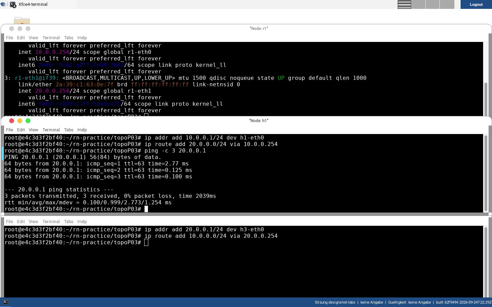

# 03 · Routing (RIP/BGP)

[:material-file-pdf-box: Als PDF herunterladen](../../pdf/03-routing-rip-bgp.pdf){ .md-button }

## Lernziele

- Das Grundprinzip von Routing-Tabellen verstehen: direkt angeschlossene
  Netze werden automatisch eingetragen, entfernte Netze benötigen eine
  Route (statisch oder dynamisch gelernt).
- Routing zwischen zwei Netzen manuell mit `ip route add` konfigurieren –
  ganz ohne Routing-Protokoll.
- RIP (Distance Vector) und BGP (Path Vector) im gleichzeitigen Einsatz auf
  denselben Routern beobachten und ihr Konvergenzverhalten (periodischer
  Nachrichtenaustausch) im Wireshark-Mitschnitt erkennen.
- `vtysh`/FRR als Konfigurations- und Diagnosewerkzeug für Routing-Software
  bedienen (`show ip route`, `configure terminal`, Protokoll-Module).
- Administrative Distanz als Auswahlkriterium zwischen konkurrierenden
  Routing-Quellen verstehen und gezielt verändern.
- IPv4- und IPv6-Routing als getrennte, parallele Strukturen einordnen
  (separate Tabellen, weil nicht direkt kompatible Adressfamilien).
- RP-Filtering als Schutzmechanismus gegen IP-Spoofing verstehen und
  kontrolliert (für Diagnosezwecke) deaktivieren können.
- Die Zeitkonstanten und den Protokoll-Overhead eines Routing-Protokolls aus
  einer eigenen Aufzeichnung selbst berechnen, statt sie aus einem Lehrbuch zu
  übernehmen (Nachrichten je Minute, Byte je Minute, Abstand zweier Updates).

--8<-- "issue-feedback.md"

## Aufgaben

### Teil 1 – Manuelles Routing zwischen zwei Netzen (`topoP03`)

Bevor wir dynamische Routing-Protokolle einsetzen, konfigurieren wir Routing
einmal komplett von Hand – das schärft das Verständnis dafür, was RIP/BGP in
Teil 2 automatisiert übernehmen.

```bash
cd ~/rn-practice/topoP03
./start-topoP03.sh
```

**Topologie:** Zwei Switches `s1`/`s2`, dazwischen ein Router `r1`. An `s1`
hängen `h1`/`h2` (Netz 1), an `s2` hängen `h3`/`h4` (Netz 2). Anders als bei
`topoP02` sind hier **weder Hosts noch Router-Interfaces vorkonfiguriert** –
das Skript aktiviert auf `r1` lediglich die IP-Weiterleitung
(`echo 1 > /proc/sys/net/ipv4/ip_forward`), alles andere ist eure Aufgabe.

!!! info "Hintergrund: warum die Switches nach einem Controller rufen"
    `topoP03.py` verbindet die Switches mit einem `RemoteController` auf
    `127.0.0.1`. Ist kein separater OpenFlow-Controller-Prozess aktiv, bleibt
    die Controller-Verbindung der Switches ungenutzt – funktional
    unproblematisch, da das Skript beide Switches direkt im Anschluss per
    `ovs-ofctl` auf Normalbetrieb (`fail-mode standalone`,
    `actions=NORMAL`) umschaltet. Ihr könnt das an gelegentlichen
    Verbindungsfehlern in den Mininet-Logs erkennen, die ignoriert werden
    können.

Konfiguriert die Adressierung:

- Netzwerk 1: `10.0.0.0/24` – wählt für `h1` und `h2` je eine Adresse aus
  `10.0.0.1`–`10.0.0.253`.
- Netzwerk 2: `20.0.0.0/24` – wählt für `h3` und `h4` je eine Adresse aus
  `20.0.0.1`–`20.0.0.253`.

```bash
h1$ ip addr add 10.0.0.5/24 dev h1-eth0
```

!!! warning "Router-Interfaces zuerst konfigurieren"
    Bevor Hosts über `r1` kommunizieren können, müsst **ihr** `r1`s beide
    Interfaces (Richtung `s1` bzw. `s2`) mit je einer Adresse aus dem
    entsprechenden Netz versehen – das Skript tut dies nicht automatisch.

Setzt anschließend auf den Hosts die Routen zum jeweils anderen Netz über
`r1`:

```bash
h1, h2$ ip route add 20.0.0.0/24 via 10.0.0.254   # 10.0.0.254 = Adresse von r1 im Netz 1
h3, h4$ ip route add 10.0.0.0/24 via 20.0.0.254   # 20.0.0.254 = Adresse von r1 im Netz 2
```

Prüft die Konnektivität zwischen den beiden Netzen mit `ping` und
`traceroute`, und vergleicht die Routing-Tabelle auf `r1` (`ip route`) mit
der auf den Hosts.


*Reale, von Hand eingetragene Adressierung und Routen in `topoP03`: `r1`
bekommt `10.0.0.254/24` bzw. `20.0.0.254/24` auf seinen beiden Interfaces,
`h1` und `h3` je eine Route über `r1` zum jeweils anderen Netz. Der
anschließende `ping` von `h1` zu `h3` bestätigt die Konnektivität
(`ttl=63`, ein Hop über `r1`).*

Ihr habt jetzt einen Router, der zwei Netze verbindet, und beide Seiten
vertrauen darauf, dass die Antworten von der richtigen Station kommen. Was
passiert, wenn sich ein dritter Rechner genau in diesen Weg drängt? Das ist
ARP-Spoofing – und dafür gibt es ein eigenes Blatt:
[Lab 05 – ARP-Spoofing & Denial-of-Service](05-arp-spoofing-dos.md).

!!! tip "Fortschritt festhalten (optional)"
    Diesen Teil geschafft? Optional fuer die Admin-Uebersicht vermerken
    (rein lokal, keine Netzwerkverbindung):

    ```bash
    ~/rn-practice/mark-done.sh 03 teil1
    ```

!!! example "Vertiefung (optional): Wenn nur eine Richtung stimmt"
    Ihr habt eben auf **beiden** Seiten Routen gesetzt. Nehmt eine davon
    testweise wieder weg – löscht auf dem Zielrechner die Rückroute
    (`ip route del …`) und pingt erneut von `h1` aus.

    Der Ping schlägt fehl. Lasst dabei auf dem Zielrechner
    `tcpdump -i any icmp` mitlaufen: die Anfragen kommen dort sehr wohl an,
    nur die Antwort findet nicht zurück. Ein fehlgeschlagener Ping heißt
    also nicht „das Paket kam nicht an", sondern nur „ich habe keine Antwort
    gesehen" – und Routing ist **je Richtung** zu betrachten, nicht je
    Verbindung. Setzt die Route danach wieder, bevor ihr weitermacht.


### Teil 2 – Dynamisches Routing mit RIP und BGP (`topo03`, FRR/`vtysh`)

Anwendungsprotokolle sind nur ein kleiner, sichtbarer Teil eines Netzwerks.
Darunter arbeitet eine komplexe Maschinerie aus Protokollen, Algorithmen und
Hardware zusammen, um Daten effizient und zuverlässig zu übertragen – wie
ein Paket seinen Weg findet, hängt von Routing, Adressierung und
Netzwerklast ab.

**Tipp:** Bei so vielen beteiligten Knoten hilft eine Skizze. Die Topologie
für dieses Experiment:

```text
                    r2
                   /  \
 192.168.1.1 --r1--s2  s3---r3--s4 192.168.3.1
                   \  /
                    r4

          s steht für Switch
          r steht für Vermittlungsknoten (Router)
```

#### Einführung in Routing, RIP und BGP

RIP (Routing Information Protocol) ist eines der einfachsten
Routing-Protokolle: Es verwendet eine simple Metrik (Hop-Zählung) und ist
leicht zu konfigurieren – ein guter Einstieg, um Konzepte wie
Routing-Tabellen und Konvergenz (das Zurückkehren zu einem stabilen Zustand
nach einer Änderung) zu verstehen. BGP (Border Gateway Protocol) ist
komplexer, aber das Protokoll, das das Internet zusammenhält: Es ermöglicht
die Kommunikation zwischen unterschiedlichen autonomen Systemen (AS) und
führt in Konzepte wie Pfadvektoren, Routing-Policies und Multi-Homing ein.
Beide Protokolle unterscheiden sich grundlegend darin, wie sie eine Route
"bewerten" und weitergeben – RIP zählt nur Hops, BGP wägt AS-Pfade und
Policies ab.

!!! info "Hintergrund: RIP kann nur bis 15 zählen – und das ist Absicht"
    RIPs Metrik ist die Zahl der Zwischenstationen, und bei **16** gilt ein
    Ziel als unerreichbar. Das wirkt wie eine willkürliche Grenze, löst aber
    ein echtes Problem. In einem Distance-Vector-Verfahren erzählt jeder
    Router seinen Nachbarn nur, *wie weit* ein Ziel entfernt ist – nicht,
    *worüber* der Weg führt. Fällt eine Verbindung aus, können sich zwei
    Router deshalb gegenseitig immer größere Entfernungen zurückmelden, ohne
    je zu merken, dass jeder den Weg über den anderen meint. Dieses
    *Count-to-Infinity*-Problem würde ohne Obergrenze niemals enden.

    RIP erklärt darum einfach 16 zu „unendlich". Der Preis: in Netzen mit
    mehr als 15 Zwischenstationen ist RIP nicht einsetzbar. Genau diese
    Abwägung – Einfachheit gegen Reichweite – ist einer der Gründe, warum
    später Link-State-Verfahren wie OSPF entstanden sind.

!!! info "Hintergrund: die Nummern, an denen das Internet hängt"
    Die Zahlen 65001, 65002 und 65003, die euch in dieser Übung begegnen,
    sind **AS-Nummern** (Autonomous System). Ein autonomes System ist ein
    Netz unter einheitlicher Verwaltung – ein Rechenzentrum, ein
    Internetanbieter, ein großes Unternehmen. BGP ist das Protokoll, mit dem
    diese Systeme einander mitteilen, welche Adressbereiche über sie
    erreichbar sind. Weltweit sind gut hunderttausend AS aktiv, und
    praktisch jede Verbindung, die euer Browser aufbaut, verlässt sich auf
    Ankündigungen, die über BGP verteilt wurden.

    Der Bereich 64512–65534 ist ausdrücklich für den privaten Gebrauch
    reserviert – vergleichbar mit `192.168.x.x` bei IP-Adressen. Deshalb
    stehen hier 65001 bis 65003 und keine echten, registrierten Nummern.
    Und weil BGP darauf aufbaut, dass man diesen Ankündigungen glaubt, hat
    eine falsche Ankündigung schon mehrfach ganze Landesnetze vom Internet
    abgeschnitten. Wer wissen will, wie folgenreich das ist, sucht nach
    *BGP-Hijacking*.

Startet die Topologie:

```bash
cd ~/rn-practice/topo03
./start-topo03.sh
```

!!! note "Zweistufiger Start"
    `start-topo03.sh` arbeitet in zwei Stufen: Stufe 1 erstellt das
    Szenario *ohne* Routing-Protokolle – ihr landet zunächst auf dem
    `mininet>`-Prompt. Ein einmaliges `exit` an diesem Prompt beendet nicht
    die Emulation, sondern startet die Routing-Dienste (RIP und BGP) auf
    allen vier Routern und öffnet danach erneut den `mininet>`-Prompt
    (Stufe 2). Erst ein *weiteres* `exit` bzw. `quit` beendet die Emulation
    tatsächlich.

Öffnet ein Terminal auf `r1` und schaut euch die konfigurierten Adressen an:

```bash
mininet> xterm r1
r1$ ip a s
```

Notiert die "Dotted Decimal"-Adressen (die vier durch Punkte getrennten
Dezimalzahlen der IPv4-Adresse). Wiederholt das mit den IPv6-Link-Local-
Adressen (`fe80::...`), die automatisch pro Interface vergeben werden – auch
ohne explizite IPv6-Konfiguration, da `ipv6 forwarding` auf allen Routern
aktiv ist.

#### Direkt angeschlossene Netze brauchen keine Route

Für direkt angeschlossene Netze ist kein zusätzlicher Routing-Aufwand nötig.
Öffnet zusätzlich ein Terminal für `r2` und pingt von dort alle IPv4-Adressen
von `r1` an (die Loopback-Adresse `127.0.0.1` könnt ihr ignorieren):

```bash
mininet> xterm r2
r2$ ping -c 1 193.1.1.1
r2$ ping -c 1 192.168.1.1
```

Nur die erste Adresse ist von `r2` aus ohne Weiterleitung erreichbar – sie
liegt im selben `/26`-Netz wie `r2`s eigene Schnittstelle (`193.1.1.0/26`).
Wiederholt den Test mit IPv6 (Link-Local-Adressen benötigen den
Interface-Zusatz, z. B. `ping6 fe80::1%r2-eth0`).

#### Routing-Tabellen im Detail: `topo03` konkret

Die tatsächlich in diesem Repository konfigurierten FRR-Router (`r1`–`r4`,
siehe `mininet-labs/rn-practice/topo03/r*/zebra.conf` etc.):

| Router | Schnittstellen (IPv4) | RIP | BGP (AS) |
|---|---|---|---|
| `r1` | `r1-eth0`=`192.168.1.1/24` (Stub), `r1-eth1`=`193.1.1.1/26` | – | 65001, Nachbar `193.1.1.2` |
| `r2` | `r2-eth0`=`193.1.1.2/26`, `r2-eth1`=`193.1.2.1/24` | ja | 65002, Nachbarn `193.1.1.1` und `193.1.2.2` |
| `r3` | `r3-eth0`=`192.168.3.1/24` (Stub), `r3-eth1`=`193.1.2.2/24` | ja | 65003, Nachbar `193.1.2.1` |
| `r4` | `r4-eth0`=`193.1.1.4/26`, `r4-eth1`=`193.1.2.4/24` | ja | **kein `bgpd.conf`** |

**Wichtig:** `r4` besitzt in diesem Repository keine `bgpd.conf` – er nimmt
also ausschließlich am RIP-Verbund teil, nicht am BGP-Verbund zwischen
`r1`/`r2`/`r3` (AS 65001/65002/65003). Genau das erzeugt später die zwei
konkurrierenden Routen zu `192.168.3.0/24` (einmal über `r2` per BGP, einmal
über `r4` per RIP), die im weiteren Verlauf untersucht werden.

!!! info "Hintergrund: Zebra, Quagga, FRR – und warum die Befehle dieselben bleiben"
    Routing-Software auf Linux hat eine kleine Familiengeschichte. Aus dem
    Projekt *Zebra* entstand **Quagga**, aus Quagga wiederum **FRR**
    (FRRouting) – heute der De-facto-Standard und das, was in dieser Umgebung
    läuft (Konfigurationsverzeichnis `/etc/frr`). In Büchern und älteren
    Anleitungen stehen die Namen deshalb oft nebeneinander.

    Für euch ist das eine gute Nachricht: FRR ist ein Fork von Quagga und hat
    dessen `vtysh`-Syntax weitgehend übernommen. Ein Befehl, den ihr in einer
    Quagga-Anleitung findet, funktioniert hier in der Regel unverändert – und
    umgekehrt lässt sich das, was ihr hier lernt, auf Anlagen anwenden, die
    noch Quagga fahren. Genau deshalb lohnt es sich, `vtysh` zu beherrschen
    statt einzelne Konfigurationsdateien auswendig zu lernen.

Prüft zunächst (noch vor Aktivierung der Routing-Protokolle, also in Stufe 1
direkt nach dem Start) die Routing-Tabelle von `r1` und versucht einen Ping
zu `192.168.3.1` – er schlägt fehl, da noch keine Route existiert:

```bash
mininet> xterm r1
r1$ ip route
r1$ ping -c 1 192.168.3.1
```

Startet Wireshark auf dem Interface `r1-eth1` und wechselt dann auf der
`mininet`-Konsole mit einmaligem `exit` in Stufe 2. Kurz danach beginnt ein
reger Paketaustausch, in dem RIP und BGP versuchen, Konvergenz zu erreichen
– beobachtet, wie sich diese Kommunikation in festen Zeitabständen
wiederholt (typisch für Distance-Vector-Protokolle wie RIP, im Gegensatz zu
Link-State-Protokollen wie OSPF, die nur bei Änderungen senden).

Prüft danach erneut die Routing-Tabelle auf `r1` – zusätzlich zu den beiden
direkt angeschlossenen Netzen sind nun zwei neue Routen sichtbar. Prüft die
Konnektivität zu `192.168.3.1` und verfolgt den Pfad:

```bash
r1$ tracepath 192.168.3.1
r1$ traceroute 192.168.3.1
```

`tracepath` ermittelt automatisch die Pfad-MTU und benötigt keine
Root-Rechte, `traceroute` zeigt zusätzlich die Latenz je Hop und ist hier
das aussagekräftigere Werkzeug. Ihr solltet sehen, dass der Pfad über
`193.1.1.2` (also über `r2`) führt.

#### Administrative Distanz: Warum gewinnt BGP?

Bis hierher habt ihr die Routing-Tabelle des Linux-Kernels gelesen. Für den
nächsten Schritt braucht ihr ein zweites Werkzeug.

`vtysh` ist die Befehlszeilenschnittstelle der Routing-Software. Sie sieht
wie eine gewöhnliche Shell aus, ist aber keine: Statt Linux-Befehlen erwartet
sie die Kommandosprache, die auch auf kommerziellen Routern üblich ist. Aus
dem bekannten `ip route show` wird dort `show ip route` – dieselbe
Information, andere Wortstellung. Ein Fragezeichen zeigt an jeder Stelle die
möglichen Fortsetzungen an; das ist der schnellste Weg, sich ohne Handbuch
zurechtzufinden.

Genau deshalb lohnt sich dieses Werkzeug über die Übung hinaus: Wer sich in
`vtysh` zurechtfindet, findet sich auch auf einem Gerät im Rechenzentrum
zurecht – die Befehle sind dort weitgehend dieselben.

```bash
r1$ vtysh
r1# show ip route          # die Tabelle der Routing-Software
r1# ?                      # zeigt die moeglichen Fortsetzungen
r1# exit                   # zurueck zur Linux-Shell
```

!!! warning "Zwei Tabellen, nicht eine"
    `ip route` zeigt die Tabelle des **Linux-Kernels** – das, was
    tatsächlich weitergeleitet wird. `show ip route` in `vtysh` zeigt die
    Tabelle der **Routing-Software** – alles, was sie gelernt hat,
    einschließlich der Routen, für die sie sich *nicht* entschieden hat. Die
    zweite Tabelle ist deshalb größer als die erste. Dieser Unterschied ist
    der Gegenstand des nächsten Schritts, also vergleicht beide Ausgaben
    bewusst.

Die Tabelle wirkt größer und mit Dopplungen versehen: `192.168.3.0`
erscheint mehrfach – einmal `via 193.1.1.2` (mit vorangestelltem `B` für
BGP), einmal `via 193.1.1.4` (mit vorangestelltem `R` für RIP; `C` markiert
direkt angeschlossene Netze). Der Zahlenwert direkt vor `via` ist die
**administrative Distanz** – je niedriger, desto vertrauenswürdiger die
Quelle für die Auswahl der aktiven Route. BGP gewinnt hier, weil seine
administrative Distanz niedriger ist als die von RIP.

Ändert nun die administrative Distanz von BGP, um es unattraktiver zu
machen:

```bash
r1# configure terminal
r1(config)# router bgp
r1(config-router)# distance bgp 200 200 200
r1(config-router)# end
r1# write memory
```

Ein Fehler beim Anlegen einer Backup-Sicherung kann ignoriert werden. Für
Interessierte: Die drei Werte stehen für eBGP-Routen (von einem anderen
autonomen System gelernt), iBGP-Routen (innerhalb desselben AS gelernt) und
lokal auf dem Router konfigurierte BGP-Routen.

Prüft die Auswirkung auf die Betriebssystem-Routing-Tabelle:

```bash
r1$ traceroute 192.168.3.1
r1$ ip route
```

!!! question "Beobachtet genau: wechselt wirklich der Weg – oder nur die Quelle?"
    Es liegt nahe zu erwarten, dass der Verkehr jetzt über `193.1.1.4` (`r4`)
    läuft, denn das war ja die RIP-Route. Prüft diese Erwartung, bevor ihr
    weiterlest:

    ```bash
    r1# show ip rip
    ```

    Ihr werden dort ausschließlich RIP-Routen finden, die von `193.1.1.2`
    (`r2`) gelernt wurden – keine einzige von `r4`, obwohl `r1` und `r4` am
    selben Switch-Segment hängen. `r1` hat für `192.168.3.0/24` also
    überhaupt nur **einen** Nexthop zur Auswahl: `r2`. Er ist ihm zweimal
    bekannt, einmal per BGP (`Known via "bgp"`) und einmal per RIP
    (`Known via "rip"`, ebenfalls `via 193.1.1.2`).

    Was die geänderte Distanz bewirkt, ist deshalb **nicht** ein anderer Weg,
    sondern ein anderer **Quell-Routing-Prozess** in der Tabelle: aus `bgp`
    wird `rip`, weil RIPs Distanz von 120 nun unter dem gerade auf 200
    gesetzten BGP-Wert liegt. Die Pakete nehmen exakt denselben Weg wie
    vorher.

    Das ist eine Unterscheidung, die in der Praxis viel Fehlersuche kostet:
    eine veränderte Routing-Tabelle heißt nicht automatisch veränderter
    Datenfluss. `r4` wird dennoch gebraucht – aber aus der Sicht von `r2`,
    und genau davon handelt Teil 3.

!!! info "Hintergrund: eine Route, die nirgends hinführt"
    In `show ip route` auf `r3` steht eine statische Route nach
    `192.168.2.0/24` über `192.168.3.10`. Dieses Netz kommt in der ganzen
    Übung nicht vor, und die Adresse gehört keinem Gerät hier. Die Zeile
    stammt aus `r3/zebra.conf` und ist eine Altlast der Testtopologie, aus
    der dieses Szenario abgeleitet wurde.

    Lasst euch davon nicht verwirren – und nehmt es als Vorgeschmack auf den
    Berufsalltag: In gewachsenen Netzen enthält fast jede Routing-Tabelle
    solche Einträge, deren Zweck niemand mehr kennt. Sie zu erkennen und
    einzuordnen, statt sie für einen Teil der Aufgabe zu halten, ist eine der
    Fähigkeiten, die man nur durch Hinsehen erwirbt.

#### Lokale Gültigkeit manueller Routen

Diese Routing-Änderungen gelten immer nur lokal auf dem jeweiligen Router.
Öffnet einen xterm für `r3`, startet Wireshark und pingt von `r3` auf
`192.168.1.1`:

```bash
mininet> xterm r3
r3$ ping 192.168.1.1
```

`r3` verwendet dabei `193.1.2.2` als Quelladresse. `r1` antwortet nicht,
weil ihm die Rückroute fehlt. Statt die RIP-Konfiguration zu reparieren,
setzen wir zur Demonstration manuell eine Route auf `r1`:

```bash
r3$ ping 192.168.1.1              # laufen lassen und Fenster im Blick behalten
r1$ ip route add 193.1.2.2/32 via 193.1.1.2
```

Sobald die Route auf `r1` aktiv wird, sollte der Ping von `r3` erfolgreich
werden. Prüft mit `traceroute` beide Wege von `r1` aus:

```bash
r1$ traceroute 192.168.3.1
r1$ traceroute 193.1.2.2
```

#### RP-Filtering: Schutz vor IP-Spoofing

Erzwingt nun, dass `r3` die Adresse `192.168.3.1` als Quelladresse für einen
Ping auf `192.168.1.1` verwendet:

```bash
r3$ ping -I 192.168.3.1 192.168.1.1
```

Überraschenderweise schlägt der Ping fehl. Ursache ist **RP-Filtering**
(Reverse Path Filtering) auf `r4`: ein Schutzmechanismus gegen IP-Spoofing,
der ein Paket verwirft, wenn die Antwort auf dieses Paket laut Routing-
Tabelle nicht über dasselbe Interface zurückkäme, über das es hereinkam.
Deaktiviert RP-Filtering testweise auf `r4`:

```bash
r4$ sysctl -w net.ipv4.conf.all.rp_filter=0
r4$ sysctl -w net.ipv4.conf.r4-eth0.rp_filter=0
```

Danach gelingt der Ping mit der erzwungenen Quelladresse.

#### Ausfall eines Pfads beobachten

!!! question "Ein Ausfall, der niemanden trifft – schaltet `r4-eth1` ab und begründet das Ergebnis"
    Schaltet auf `r4` das Interface in Richtung `r3` ab und beobachtet dabei
    `r1`:

    ```bash
    r4$ ifconfig r4-eth1 down
    r1$ vtysh -c "show ip route 192.168.3.0/24"
    r1$ ping -c 4 192.168.3.1
    ```

    Ihr werdet feststellen: für `r1` ändert sich **nichts**. Derselbe
    Routen-Eintrag, kein Paketverlust, keine erhöhte Laufzeit. Erklärt,
    warum das so sein muss – der Hinweis oben zu `show ip rip` enthält alles,
    was ihr dazu braucht.

    Die Denkfigur dahinter ist im Betrieb wertvoller als das Ergebnis: bei
    einer Störungsmeldung ist „**wen** trifft dieser Ausfall überhaupt?" fast
    immer die ergiebigere Frage als „ist etwas ausgefallen?". Eine Topologie,
    in der ein Link-Ausfall wirklich eine Rekonvergenz erzwingt, kommt gleich
    in Teil 3 – dort aus der Sicht von `r2`, dessen Weg zu `r3` tatsächlich
    von `r4` als Reserve abhängt.

!!! tip "Fortschritt festhalten (optional)"
    Diesen Teil geschafft? Optional fuer die Admin-Uebersicht vermerken
    (rein lokal, keine Netzwerkverbindung):

    ```bash
    ~/rn-practice/mark-done.sh 03 teil2
    ```

!!! example "Vertiefung (optional): Routing wirklich kaputt machen"
    Der letzte Schritt oben hat nur ein einzelnes Interface kurz
    deaktiviert. Weil eure Topologie in einer komplett eigenen, isolierten
    Mininet-Instanz läuft – niemand sonst teilt sich diese vier Router mit
    euch –, könnt ihr hier deutlich weiter gehen, als es in einem gemeinsam
    genutzten physischen Laborraum vertretbar wäre: Deaktiviert testweise
    den RIP-Dienst auf `r2` *und* `r4` gleichzeitig
    (`vtysh -c "configure terminal" -c "no router rip" -c "end"` auf jedem
    der beiden) und prüft, ob `192.168.3.0/24` von `r1` aus überhaupt noch
    erreichbar ist, obwohl BGP weiterläuft. Setzt anschließend zusätzlich
    `distance bgp 200 200 200` (wie oben gezeigt) auf allen drei
    BGP-Routern gleichzeitig und beobachtet, ob das Netz komplett
    auseinanderfällt oder eine Restkonnektivität übrig bleibt. Startet die
    Topologie danach einfach neu – ein zerschossenes Routing-Setup ist hier
    ein Lernmoment, kein Vorfall, den ihr euren Kommiliton:innen erklären
    müsstet.


### Teil 3 – Redundanz im RIP-Netz testen: reale Rekonvergenz messen (`topo03`)

Teil 2 hat gezeigt, dass `r1` für `192.168.3.0/24` **solange `r2-eth1`
funktioniert** immer nur `r2` als Nexthop kennt – `r4` spielt aus `r1`s
Sicht in diesem Zustand keine Rolle. `r4` ist aber kein überflüssiger
Router: Er bildet eine echte **Backup-Route**, weil er sowohl auf `r1`s
und `r2`s gemeinsamem Switch-Segment (`193.1.1.0/26`, `sw2`) als auch auf
`r3`s Switch-Segment (`193.1.2.0/24`, `sw3`) sitzt – `r4` ist also nicht
nur für `r2`, sondern auch für `r1` direkt per RIP erreichbar. Solange `r2`
direkt mit `r3` verbunden ist, bleibt der Pfad über `r2` für alle
Beteiligten die bessere (kürzere) RIP-Route und `r4` bleibt ungenutzt – bis
genau diese direkte Verbindung ausfällt. Fällt sie aus, kann sich das nicht
nur bei `r2`, sondern (etwas verzögert) auch bei `r1` selbst ändern, wie
die Messung unten zeigt.

In diesem Teil legt ihr genau diese direkte Verbindung lahm und messt, wie
schnell RIP tatsächlich auf den Ersatzpfad über `r4` umschaltet.

Stellt zunächst auf `r2` den aktuellen (funktionierenden) Zustand fest:

```bash
mininet> xterm r2
r2$ vtysh -c "show ip route 192.168.3.0/24"
```

Ihr solltet sowohl eine `bgp`- als auch eine `rip`-Route sehen, beide mit
Nexthop `193.1.2.2` über `r2-eth1` – die direkte Verbindung zu `r3`.

Startet nun auf `r1` einen dauerhaften Ping auf `192.168.3.1` in einem
eigenen Terminal, damit ihr die Auswirkung auf die Ende-zu-Ende-Konnektivität
mitverfolgen könnt:

```bash
mininet> xterm r1
r1$ ping 192.168.3.1
```

Deaktiviert anschließend auf `r2` die direkte Verbindung zu `r3`:

```bash
r2$ ifconfig r2-eth1 down
```

Wiederholt sofort und danach im Abstand von einigen Sekunden den Befehl von
oben auf `r2`, um zu beobachten, *wann genau* RIP eine Ersatzroute
installiert:

```bash
r2$ vtysh -c "show ip route 192.168.3.0/24"
```

**Aufgabe:** Notiert, nach wie vielen Sekunden die Ausgabe erstmals eine
Route über `193.1.1.4` (`r4`) statt über das jetzt abgeschaltete `r2-eth1`
zeigt, und vergleicht diese Zeit mit RIPs bekanntem periodischem
Update-Intervall von 30 Sekunden. Erklärt anhand eurer Messung den
Unterschied zwischen einem *periodischen* Update (RIP sendet ohnehin alle
30 Sekunden seine komplette Routing-Tabelle) und einem *ausgelösten*
Update (*triggered update*: eine Änderung am eigenen Interface-Status wird
sofort, ohne auf den nächsten Zeitzyklus zu warten, an die Nachbarn
gemeldet). Beobachtet dabei auch euren laufenden Ping auf `r1`: erwartet
nicht, dass er lückenlos durchläuft – haltet fest, ob und wie lange er
tatsächlich aussetzt, bevor er von selbst wieder Antworten bekommt.

??? info "Erwartungshorizont – erst öffnen, wenn ihr selbst gemessen habt"
    **Auf `r2`:** Die Ersatzroute über `r4` erscheint typischerweise
    **13 bis 16 Sekunden** nach dem `ifconfig r2-eth1 down`. Das ist der
    entscheidende Befund: deutlich früher, als ein rein periodisches
    30-Sekunden-Update es erklären könnte. Genau daran erkennt man ein
    *triggered update*. Danach steht dort dauerhaft
    `Known via "rip", ... 193.1.1.4, via r2-eth0`.

    **Auf `r1`:** Hier wird es interessanter, als man zunächst denkt. `r1`
    hängt am selben Switch-Segment wie `r4` und ist damit selbst RIP-Nachbar
    von `r4`. Nach vollständiger Rekonvergenz zeigt `r1`s Kernel-Route zu
    `192.168.3.1` deshalb **direkt** `via 193.1.1.4 dev r1-eth1` – nicht
    mehr den Umweg über `r2`.

    Bis dahin muss aber auch `r3`s Rückweg neu gelernt sein, und das dauert
    länger als `r2`s eigene Umstellung. Ein `ping -c 3` auf `r1`, etwa 20 bis
    35 Sekunden nach dem Abschalten abgesetzt, kann daher **100 % Verlust**
    zeigen. Ein Aussetzer von einigen Sekunden ist hier also das erwartete
    Verhalten einer echten RIP-Rekonvergenz und kein Defekt eurer Topologie.
    Die direkten Nachbarschaften bleiben die ganze Zeit intakt – `r4`
    erreicht `r2` und `r3` durchgehend ohne Verlust.

    **Der Merksatz dahinter:** Konvergenz ist kein Zeitpunkt, sondern ein
    Verlauf, und verschiedene Knoten erreichen sie zu verschiedenen Zeiten.
    Wer nur an einer Stelle misst, hält die Umstellung für schneller oder
    langsamer, als sie für das Netz als Ganzes ist.

Prüft abschließend, dass die Wiederherstellung ebenso funktioniert:

```bash
r2$ ifconfig r2-eth1 up
r2$ vtysh -c "show ip route 192.168.3.0/24"
```

Die Route sollte innerhalb weniger Sekunden wieder auf den direkten Pfad
über `193.1.2.2` zurückwechseln. Beendet den Ping auf `r1` mit
++ctrl+c++.

!!! tip "Fortschritt festhalten (optional)"
    Diesen Teil geschafft? Optional fuer die Admin-Uebersicht vermerken
    (rein lokal, keine Netzwerkverbindung):

    ```bash
    ~/rn-practice/mark-done.sh 03 teil3
    ```


### Teil 4 – Protokollspuren vermessen statt anschauen (`topo03`)

In Teil 2 habt ihr den Paketaustausch von RIP und BGP in Wireshark *gesehen*.
Sehen ist aber nicht messen. Ein Routing-Protokoll hat Zeitkonstanten und einen
Preis, und beides steht in keiner Ausgabe: Wie oft meldet sich ein Router, auch
wenn sich gar nichts geändert hat? Was kostet das an Byte je Minute, während
kein einziges Nutzdatenpaket unterwegs ist? In diesem Teil zeichnet ihr eine
Spur auf und rechnet diese Zahlen selbst aus ihr heraus.

Der Unterschied zu Teil 2 und 3 ist auch ein praktischer: eine Aufzeichnung ist
ein **dauerhaftes Artefakt**. Die Topologie braucht ihr nur zum Aufnehmen. Die
Auswertung könnt ihr danach beliebig oft wiederholen, verfeinern und mit den
Spuren eurer Kommiliton:innen vergleichen – auch in einer späteren Sitzung, in
der nichts mehr läuft.

!!! note "Warum ihr selbst aufzeichnet und nicht mit fertigen Spuren arbeitet"
    Das Lehrbuch *Computer Networking: Principles, Protocols and Practice*
    (Olivier Bonaventure, UCLouvain) bringt für genau diese Übungsform 19
    fertige `pcap`-Dateien mit (`exercises/traces/` im Repository `cnp3/ebook`,
    darunter `ospf6-r1`…`r3`, `ripng-r1`…`r3`, `stp-s1`…`s9`,
    `bgp-as1`…`as3`). Diese Dateien sind in diesem Praktikumscontainer
    **nicht vorhanden** (das gesamte Dateisystem wurde am 2026-09-24 danach
    durchsucht: kein Treffer), und der Container hat keinen Zugang zum
    Buch-Repository. Eine Aufgabe, die sie voraussetzt, wäre eine Anleitung zu
    Dateien, die es hier nicht gibt.

    Deshalb nehmt ihr die Spur aus **eurer eigenen** Topologie auf. Das ist
    didaktisch kein Verlust, sondern ein Gewinn: Ihr wisst genau, welche vier
    Router gesprochen haben und wie sie konfiguriert sind – bei einer fremden
    Spur müsstet ihr das erst erraten.

#### Schritt 1 – Erst rechnen, dann aufzeichnen

Füllt diese Tabelle **bevor** ihr etwas startet. Alles, was ihr dafür braucht,
steht in Teil 2 und 3 dieses Blattes.

| Frage | Eure Vorhersage |
|---|---|
| In welchem Abstand sendet ein RIP-Router seine Tabelle, wenn sich nichts ändert? | ? s |
| Wie viele RIP-Nachrichten sind das in 2,5 Minuten, von **einem** Sprecher? | ? |
| Wie viele Router auf `193.1.1.0/26` sprechen überhaupt RIP – und wie viele davon hört `r1` auf `r1-eth1`? | ? |
| Welchen Transportweg nutzt RIP, welchen BGP? | ? |
| Wie viele Byte je Minute kostet RIP auf diesem Segment im Ruhezustand? | ? Byte/min |

Die letzte Zeile ist die interessanteste, weil sie sich nicht erraten lässt:
Ihr braucht die Nachrichtengröße **und** die Häufigkeit. Schätzt trotzdem eine
Größenordnung – zehn, hundert oder tausend Byte je Minute? – und notiert sie.

#### Schritt 2 – Die Spur aufzeichnen

Startet `topo03` wie in Teil 2 und bleibt zunächst in **Stufe 1**, also vor dem
ersten `exit`. Die Routing-Dienste laufen dann noch nicht, das Segment ist
still – genau der richtige Zeitpunkt, um mit dem Mitschnitt zu beginnen:

```bash
cd ~/rn-practice/topo03
./start-topo03.sh
```

Legt das Verzeichnis für Aufzeichnungen an und startet `tcpdump` auf `r1`:

```bash
mininet> xterm r1
r1$ mkdir -p ~/rn-practice/pcaps
r1$ tcpdump -i r1-eth1 -w ~/rn-practice/pcaps/03-teil4-protokollspuren.pcap -U -n
```

`-i r1-eth1` ist die Schnittstelle zum gemeinsamen Segment mit `r2` und `r4`,
`-w` schreibt in eine Datei statt auf den Bildschirm, `-U` schreibt jedes Paket
sofort (ohne `-U` verliert ein abgebrochener Mitschnitt den letzten Puffer),
`-n` verzichtet auf Namensauflösung – die im Container ohnehin nicht nach außen
gelangt.

Wechselt nun auf der `mininet`-Konsole mit einmaligem `exit` in **Stufe 2**
(RIP und BGP starten) und lasst den Mitschnitt **mindestens 2,5 Minuten**
laufen. Diese Dauer ist kein Zufall: Ihr braucht mehrere Abstände zwischen
periodischen Updates, um aus ihnen einen Mittelwert bilden zu können – bei
einem einzigen Abstand wäre jede Aussage über die Streuung erfunden. Beendet
`tcpdump` danach mit ++ctrl+c++ und prüft, dass die Datei wirklich gefüllt ist:

```bash
r1$ ls -l ~/rn-practice/pcaps/03-teil4-protokollspuren.pcap
```

!!! warning "`tshark` ist in diesem Container nicht installiert"
    Viele Anleitungen im Netz werten `pcap`-Dateien mit `tshark` aus. Das
    Werkzeug fehlt hier (die grafische Wireshark-Oberfläche ist vorhanden, das
    Kommandozeilenwerkzeug nicht). Für alles, was in dieser Aufgabe gebraucht
    wird, genügen `tcpdump` und `capinfos` – beide sind vorhanden und beide
    arbeiten auf derselben Datei.

#### Schritt 3 – Die Zahlen aus der Datei holen

Legt euch den Pfad in eine Variable, damit die folgenden Befehle kurz bleiben:

```bash
r1$ P=~/rn-practice/pcaps/03-teil4-protokollspuren.pcap
```

**Das Ganze zuerst.** `capinfos` beantwortet „wie viel, über wie lange":

```bash
r1$ capinfos -c -d -u "$P"
```

`-c` gibt die Zahl der Pakete, `-d` die Summe der Nutzdaten in Byte, `-u` die
Dauer der Aufzeichnung in Sekunden. Aus diesen drei Zahlen berechnet ihr den
Overhead je Minute selbst – nicht ausrechnen lassen, sondern ausrechnen:

```text
Byte je Minute = Data size / Capture duration * 60
```

**Dann je Protokoll.** Dieselbe Rechnung wird erst aussagekräftig, wenn ihr RIP
und BGP getrennt betrachtet. `tcpdump` kann eine Datei lesen und gefiltert in
eine neue schreiben:

```bash
r1$ tcpdump -r "$P" -w /tmp/rip.pcap udp port 520
r1$ capinfos -c -d -u /tmp/rip.pcap
r1$ tcpdump -r "$P" -w /tmp/bgp.pcap tcp port 179
r1$ capinfos -c -d -u /tmp/bgp.pcap
```

**Und schließlich die Zeitkonstante.** Der Abstand zweier Updates steckt in den
Zeitstempeln. `-tt` gibt sie als reine Sekundenzahl aus, `awk` bildet die
Differenz zur Vorzeile:

```bash
r1$ tcpdump -tt -n -r "$P" 'udp port 520 and src 193.1.1.2' \
      | awk '{if (p != "") printf "%.2f s\n", $1-p; p=$1}'
```

Beachtet die Einschränkung auf **einen** Sprecher (`src 193.1.1.2`, also `r2`).
Ohne sie mischt ihr die Zeitreihen mehrerer Router und erhaltet Abstände, die
kein einzelner Router je eingehalten hat – ein Messfehler, der sich in echten
Netzanalysen ständig einschleicht. Wiederholt den Aufruf mit `src 193.1.1.4`
(`r4`) und vergleicht.

Dasselbe für BGP. Hier interessieren nur die Nachrichten mit Inhalt, nicht die
reinen TCP-Bestätigungen – `greater 60` filtert die leeren Segmente heraus:

```bash
r1$ tcpdump -tt -n -r "$P" 'tcp port 179 and greater 60' \
      | awk '{if (p != "") printf "%.1f s\n", $1-p; p=$1}'
```

#### Schritt 4 – Auswerten

**Aufgabe:** Vergleicht jede Zeile eurer Vorhersage aus Schritt 1 mit dem
gemessenen Wert und begründet jede Abweichung. Die drei Fragen, an denen sich
zeigt, ob ihr die Messung verstanden habt:

1. **Die Abstände sind nicht alle gleich.** RIP nennt 30 Sekunden, ihr messt
    Werte darunter und darüber. Das ist kein Messfehler: RIP versieht seinen
    Zeitgeber absichtlich mit einer Zufallsschwankung. Überlegt, was passieren
    würde, wenn alle Router eines Segments ihre Tabelle *exakt* gleichzeitig
    senden würden – und warum die Schwankung damit kein Schönheitsfehler,
    sondern eine Notwendigkeit ist.
2. **BGP sendet seltener, kostet aber mehr.** Rechnet beide Byte-je-Minute-Werte
    aus und stellt sie nebeneinander. Begründet das Ergebnis damit, dass RIP auf
    UDP aufsetzt und BGP auf TCP – und dass zu jeder TCP-Nachricht eine
    Bestätigung gehört, die in eurer gefilterten Datei mitzählt.
3. **Der Preis des Ruhezustands.** Rechnet euren RIP-Wert auf eine Woche hoch
    und stellt ihn der Nutzlast eines einzigen Bildes im Browser gegenüber.
    Formuliert in einem Satz, warum dieser Aufwand trotzdem gerechtfertigt ist.

!!! success "Real geprüft (2026-09-24)"
    Die Aufzeichnung und **alle** Auswertungsbefehle oben wurden in einem
    Wegwerfcontainer gegen `topo03` ausgeführt. Zwei unabhängige Läufe, je rund
    150 Sekunden auf `r1-eth1`:

    | Größe | Lauf A | Lauf B |
    |---|---|---|
    | Pakete gesamt / Dauer | 72 / 145,2 s | 75 / 147,8 s |
    | Daten gesamt | – | 5.608 Byte |
    | RIP (UDP/520): Pakete / Byte / Dauer | 15 / – | 16 / 1.276 Byte / 144,1 s |
    | BGP (TCP/179): Pakete / Byte / Dauer | 24 / – | 25 / 2.356 Byte / 120,0 s |
    | Abstände der RIP-Updates von `r2` | 34,94 / 30,00 / 31,01 / 35,02 s | 23,97 / 31,00 / 32,01 / 25,01 / 30,00 s |
    | Abstand der BGP-Keepalives | – | 60,0 s |

    Daraus ergibt sich für Lauf B: RIP rund **6,7 Nachrichten je Minute** und
    **531 Byte je Minute**, BGP rund **1.178 Byte je Minute** – BGP kostet auf
    diesem Segment also mehr als das Doppelte von RIP, obwohl es deutlich
    seltener sendet. Die gemessenen RIP-Abstände liegen zwischen **24 und 35
    Sekunden** um den Nennwert von 30. Die RIP-Nachrichten selbst waren 24 Byte
    groß (die anfängliche Anfrage) bzw. 44 Byte (die Antworten mit Routen), der
    Ethernet-Rahmen jeweils 66 Byte.

    **Nicht geprüft:** Die Aufzeichnung wurde von einem Skript gestartet, das
    dieselbe Topologie ohne grafische Oberfläche aufbaut. Der Weg über
    `mininet> xterm r1` und ein von Hand abgesetztes `tcpdump` ist damit
    **nicht** nachgemessen – er entspricht aber genau dem, was Teil 2 dieses
    Blattes bereits beschreibt und was dort verifiziert ist. Eure Zahlen werden
    von den obigen abweichen; das ist erwartet und Teil der Aufgabe.

!!! info "Offener Punkt für die Kursleitung"
    Würden die 19 `pcap`-Dateien aus `cnp3/ebook` (`exercises/traces/`) ins
    Desktop-Abbild aufgenommen, ließe sich diese Aufgabe **ganz ohne laufende
    Emulation** bearbeiten – und zusätzlich um Protokolle erweitern, die
    `topo03` nicht fährt: OSPFv3, RIPng und Spanning Tree. Die dafür nötigen
    FRR-Daemons (`ospf6d`, `ripngd`) sind im Abbild vorhanden (geprüft am
    2026-09-24, FRR 10.3), die Spuren nicht. Das Abbild wurde für diese
    Ergänzung **nicht** verändert; die Aufnahme der Dateien samt Lizenzhinweis
    (CC BY-SA 3.0) braucht eine Entscheidung der Kursleitung.

!!! tip "Fortschritt festhalten (optional)"
    Diesen Teil geschafft? Optional fuer die Admin-Uebersicht vermerken
    (rein lokal, keine Netzwerkverbindung):

    ```bash
    ~/rn-practice/mark-done.sh 03 teil4
    ```


--8<-- "issue-feedback.md"

### Teil 5 – Drei Tabellen, drei Wahrheiten: Kernel, RIP und BGP nebeneinander (`topo03`)

Teil 2 hat schon angedeutet, dass es *zwei* Tabellen gibt: die des Kernels
(`ip route`) und die der Routing-Software (`show ip route`). Tatsächlich sind
es sogar drei, denn die Routing-Software hält je Protokoll eine eigene: `show
ip rip` und `show ip bgp` zeigen, was **RIP** bzw. **BGP** jeweils für sich
gelernt haben, bevor die administrative Distanz entscheidet, welcher Eintrag es
in die Kernel-FIB schafft. In diesem Teil legt ihr alle drei nebeneinander und
verfolgt ein einzelnes Präfix durch sie hindurch.

!!! info "Werkzeug: die drei `show`-Ansichten von `vtysh`"
    `show ip route` ist die **Entscheidung** (was tatsächlich weitergeleitet
    wird, mit Protokoll-Kennbuchstabe und `[Distanz/Metrik]`). `show ip rip` und
    `show ip bgp` sind die **Kandidaten** je Protokoll. **Typische
    Fehldeutung:** `show ip rip` als „die aktiven RIP-Routen" zu lesen. Es zeigt
    *alles*, was RIP kennt – auch Routen, die BGP im Wettbewerb um die FIB
    geschlagen hat.

**Ziel:** Für das Präfix `192.168.3.0/24` zeigen, dass es in RIP **und** BGP
existiert, mit unterschiedlichen Distanzen, und dass nur einer der beiden die
Kernel-Route stellt.

**Vorbedingung:** `topo03` läuft in Stufe 2 (RIP und BGP aktiv, siehe Teil 2).
Terminal auf `r1` (`mininet> xterm r1`).

**Schritte:**

```bash
r1$ vtysh -c "show ip route 192.168.3.0/24"
r1$ vtysh -c "show ip rip"
r1$ vtysh -c "show ip bgp"
```

**Erwartete Ausgabe:** In `show ip route` erscheint `192.168.3.0/24` zweimal –
einmal mit `B` (BGP, Distanz 20) und `>*` (in die FIB gewählt), einmal mit `R`
(RIP, Distanz 120) ohne `>*`. `show ip rip` listet dasselbe Präfix mit seiner
RIP-Metrik, `show ip bgp` mit seinem AS-Pfad.

!!! success "Real geprüft (2026-09-24)"
    In einem Wegwerfcontainer, `topo03` mit FRR 10.3 headless hochgezogen und
    konvergiert, lieferte `show ip route` auf `r1` genau das erwartete Bild:
    `B>* 192.168.3.0/24 [20/0] via 193.1.1.2, r1-eth1` (BGP, gewählt) **neben**
    `R 192.168.3.0/24 [120/3] via 193.1.1.2, r1-eth1` (RIP, nicht gewählt) –
    dasselbe Präfix, derselbe Nexthop, zwei Quellen, und die kleinere Distanz
    (BGP 20 < RIP 120) gewinnt die FIB. Auch `193.1.2.0/24` stand doppelt da
    (`B` und `R [120/2]`). `show ip rip` zeigte `192.168.3.0/24` mit Metrik 3
    und `193.1.1.0/26` mit Metrik 1 (`C(i)`, direkt).

!!! info "Hintergrund: administrative Distanz ist Konvention, kein Standard"
    Die Zahl vor der Metrik (20 für BGP, 120 für RIP) ist die *administrative
    Distanz*. Sie steht in **keinem** RFC – sie ist eine Hersteller-Konvention
    (ursprünglich von Cisco), die praktisch alle Router übernommen haben, damit
    ein Gerät zwischen mehreren Protokollen, die dieselbe Route kennen,
    reproduzierbar wählt. Die *Metrik* dahinter ist dagegen protokolldefiniert:
    RIPs Hop-Zahl steht in RFC 2453, BGPs Entscheidungsprozess in RFC 4271
    (siehe Teil 6 und 7).

!!! tip "Fortschritt festhalten (optional)"
    ```bash
    ~/rn-practice/mark-done.sh 03 teil5
    ```


### Teil 6 – BGP-Nachbarschaften und der AS-Pfad lesen (`topo03`)

BGP ist das Protokoll, das das Internet zusammenhält (siehe die Hintergrundbox
in Teil 2). In `topo03` seht ihr es im Kleinen: drei autonome Systeme
(65001/65002/65003), die einander Präfixe ankündigen. In diesem Teil lest ihr
die Nachbarschaftstabelle und den AS-Pfad – die beiden Dinge, an denen sich in
einem echten Betrieb entscheidet, ob eine Route geglaubt wird.

**Ziel:** Die BGP-Peerings von `r1` und den AS-Pfad zu einem gelernten Präfix
ablesen.

**Vorbedingung:** `topo03` in Stufe 2, Terminal auf `r1`.

**Schritte:**

```bash
r1$ vtysh -c "show ip bgp summary"
r1$ vtysh -c "show ip bgp"
r1$ vtysh -c "show ip bgp 192.168.3.0/24"
```

**Erwartete Ausgabe:** `summary` zeigt `r1`s lokale AS-Nummer (65001), den
Nachbarn (`193.1.1.2`, AS 65002), wie lange die Sitzung schon steht (`Up/Down`)
und wie viele Präfixe empfangen wurden. `show ip bgp 192.168.3.0/24` zeigt den
**AS-Pfad**, über den das Präfix zu `r1` kam.

!!! success "Real geprüft (2026-09-24)"
    `show ip bgp summary` auf `r1` (headless hochgezogenes `topo03`, FRR 10.3):
    `local AS number 65001`, ein Nachbar `193.1.1.2  4  65002` im Zustand
    `Up 00:01:10` mit `State/PfxRcd = 3` (drei empfangene Präfixe) und
    `PfxSnt = 4`. Die BGP-Sitzung war also etabliert und tauschte Präfixe aus –
    genau die Grundlage, auf der die konkurrierende Route aus Teil 5 überhaupt
    entsteht.

!!! quote "Fun Fact (belegt): das Zwei-Servietten-Protokoll"
    BGP wurde **1989** von Kirk Lougheed (Cisco) und Yakov Rekhter (IBM) bei
    einem IETF-Treffen auf Papierservietten skizziert – daher der Spitzname
    „two-napkin protocol". Die Servietten selbst sind verloren; im Cisco Archive
    des Computer History Museum liegen nur Fotokopien (3 Seiten). Ob es zwei oder
    drei Servietten waren, ist widersprüchlich überliefert – Rekhter selbst
    spricht von drei.

    - Computer History Museum, „The Two-Napkin Protocol": <https://computerhistory.org/blog/the-two-napkin-protocol/> (Abruf 2026-09-24)
    - Cisco Archive / CHM Katalog (Identifier 2014-57-001, „3 pages"): <http://ciscoarchive.lunaimaging.com/luna/servlet/detail/CHMC~4~4~265~943> (Abruf 2026-09-24)

    Der AS-Pfad, den ihr oben lest, ist übrigens genau das, was BGP vor dem
    Count-to-Infinity-Problem von RIP schützt: **RFC 4271, Abschnitt 9.1.2**
    schreibt vor, dass ein Router eine Route verwirft, deren AS-Pfad seine
    eigene AS-Nummer schon enthält – eine Schleife ist damit sofort erkennbar,
    ohne bis „unendlich" zu zählen.

!!! tip "Fortschritt festhalten (optional)"
    ```bash
    ~/rn-practice/mark-done.sh 03 teil6
    ```


### Teil 7 – Die RIP-Metrik und die Grenze bei 16 selbst ablesen (`topo03`)

Die Hintergrundbox in Teil 2 hat behauptet, RIP könne nur bis 15 zählen und 16
bedeute „unerreichbar". Jetzt lest ihr die Metrik direkt aus `show ip rip` und
verbindet die Zahl mit dem, was ihr in Teil 3 über Rekonvergenz gemessen habt.

**Ziel:** Die Hop-Metrik der RIP-Routen ablesen und begründen, warum die
Obergrenze 15 (nicht 16) das Distance-Vector-Verfahren überhaupt erst
brauchbar macht.

**Vorbedingung:** `topo03` in Stufe 2, Terminal auf `r1`.

**Schritte:**

```bash
r1$ vtysh -c "show ip rip"
```

Notiert die Spalte `Metric` für jede Route. Fragt euch: `192.168.3.0/24` steht
mit welcher Metrik da, und wie viele Router-Hops entspricht das im Bild aus
Teil 2?

**Erwartete Ausgabe:** Eine Tabelle mit `Network / Next Hop / Metric`. Direkt
angeschlossene Netze haben Metrik 1 (`C(i)`), entfernte eine Metrik, die der
Hop-Zahl entspricht.

!!! success "Real geprüft (2026-09-24)"
    `show ip rip` auf `r1` (headless `topo03`, FRR 10.3): `R(n) 192.168.3.0/24
    … Metric 3 … From 193.1.1.2` und `C(i) 193.1.1.0/26 … Metric 1 … self` –
    das entfernte Stub-Netz von `r3` ist drei RIP-Hops entfernt, das eigene
    Segment eins.

!!! quote "Fun Fact (belegt): warum 15 und nicht 255"
    RIP ist auf Pfade von höchstens **15** Hops begrenzt; der Metrikwert **16**
    bedeutet „unerreichbar" (RFC 2453, Abschnitt 3.2 nennt die 15-Hop-Grenze,
    Abschnitt 3.4.1 definiert 16 als „infinity"). Die niedrige Grenze ist kein
    Sparzwang, sondern die Bremse gegen das *Count-to-Infinity*-Problem: Ohne
    ein kleines, schnell erreichbares „unendlich" würden sich zwei Router nach
    einem Ausfall gegenseitig immer größere Entfernungen zurückmelden, ohne je
    zu enden (RFC 2453, Abschnitt 3.4.2).

    - RFC 2453 (rfc-editor): <https://www.rfc-editor.org/rfc/rfc2453.txt> (Abruf 2026-09-24)
    - Cisco, „An unreachable network has a metric of 16": <https://www.cisco.com/c/en/us/td/docs/ios-xml/ios/iproute_rip/configuration/15-mt/irr-15-mt-book/irr-cfg-info-prot.html> (Abruf 2026-09-24)

    Randnotiz zur Quellenarbeit: Das CNP3-Lehrbuch nennt für RIP den UDP-Port
    **521** – das ist falsch, 521 ist der RIPng-Port (RFC 2080, Abschnitt 2.1).
    Klassisches RIP über IPv4 nutzt **Port 520** (RFC 2453, Abschnitt 3.6), wie
    ihr es in Teil 4 selbst mitgeschnitten habt.

!!! tip "Fortschritt festhalten (optional)"
    ```bash
    ~/rn-practice/mark-done.sh 03 teil7
    ```


### Teil 8 – Nachrichtentypen ohne `tshark`: `tcpdump` dekodiert RIP und BGP selbst (`topo03`)

Teil 4 hat die Protokollspur *vermessen* (wie viele Byte, wie oft). Jetzt schaut
ihr in die Nachrichten **hinein** – und zwar ohne `tshark` (das im Abbild fehlt).
`tcpdump` bringt eigene Dekoder für RIP und BGP mit und benennt jeden
Nachrichtentyp im Klartext. Damit unterscheidet ihr eine RIP-*Anfrage* von einer
RIP-*Antwort* und eine BGP-*Open*- von einer *Keepalive*-Nachricht – allein aus
der Aufzeichnung.

!!! info "Werkzeug: `tcpdump -v` als Protokoll-Dekoder"
    Mit `-v` (verbose) wertet `tcpdump` den Inhalt bekannter Protokolle aus,
    nicht nur die Header. Für RIP druckt es `RIPv2, Request/Response, length: …`,
    für BGP `Open Message (1)`, `Update Message (2)`, `Keepalive Message (4)`.
    **Was es kann:** die Nachrichtentypen benennen. **Was es nicht ersetzt:** die
    tiefe, feldweise Zerlegung und Statistik von Wireshark/`tshark` – für das
    Erkennen der Typen genügt es aber vollständig.

**Ziel:** In der eigenen Aufzeichnung aus Teil 4 die RIP- und BGP-Nachrichten
nach Typ auseinanderhalten.

**Vorbedingung:** Die `pcap`-Datei aus Teil 4
(`~/rn-practice/pcaps/03-teil4-protokollspuren.pcap`) oder eine frische
Aufzeichnung von `r1-eth1` (siehe Teil 4, Schritt 2).

**Schritte:**

```bash
r1$ P=~/rn-practice/pcaps/03-teil4-protokollspuren.pcap
r1$ tcpdump -r "$P" -v -n udp port 520 | grep RIPv2      # Request vs Response
r1$ tcpdump -r "$P" -v -n tcp port 179 | grep Message    # Open/Update/Keepalive
```

**Erwartete Ausgabe:** Für RIP Zeilen wie `RIPv2, Request, length: 24` und
`RIPv2, Response, length: 44`; für BGP `Open Message (1)`, `Keepalive Message
(4)` und, während der Konvergenz, `Update Message (2)`.

!!! success "Real geprüft (2026-09-24)"
    Gegen eine 65-Sekunden-Aufzeichnung von `r1-eth1` (headless `topo03`,
    FRR 10.3) dekodierte `tcpdump -v`: `RIPv2, Request, length: 24` und
    `RIPv2, Response, length: 24` bzw. `length: 44` (die längeren Antworten
    tragen mehr Routen), sowie auf TCP/179 `Open Message (1), length: 99` und
    `Keepalive Message (4), length: 19`. Die Aufzeichnung enthielt 10 RIP-
    (UDP/520) und 23 BGP-Pakete (TCP/179) – die Zahlen decken sich mit Teil 4.

!!! info "Hintergrund: warum die Antwort länger ist als die Anfrage"
    Eine RIP-*Anfrage* fragt „schick mir deine Tabelle" und ist minimal
    (24 Byte). Eine *Antwort* trägt je Route einen 20-Byte-Eintrag – deshalb
    wächst ihre Länge mit der Zahl der Routen (im Mitschnitt: 24 Byte für eine
    Route, 44 Byte für zwei). Das RIP-Nachrichtenformat mit genau diesen Feldern
    steht in RFC 2453, Abschnitt 3.6.

!!! tip "Fortschritt festhalten (optional)"
    ```bash
    ~/rn-practice/mark-done.sh 03 teil8
    ```


--8<-- "issue-feedback.md"

## Wenn etwas nicht wie erwartet läuft

Vier Dinge irritieren in dieser Übung regelmäßig, ohne dass etwas kaputt
ist. Wer sie kennt, verliert keine Zeit damit.

- **Verbindungsfehler in den Mininet-Meldungen.** `topoP03.py` meldet die
  Switches bei einem Controller an, der hier nicht läuft. Das ist ohne
  Folgen – das Skript schaltet die Switches unmittelbar danach auf
  Normalbetrieb (`fail-mode standalone`). Die Meldungen könnt ihr ignorieren.
- **`r4` hat kein BGP.** Absichtlich: `r4` nimmt nur am RIP-Verbund teil.
  Genau daraus entstehen die zwei konkurrierenden Routen zu
  `192.168.3.0/24`, an denen sich die administrative Distanz zeigen lässt.
  Ohne diese Asymmetrie gäbe es nichts zu vergleichen.
- **Ein `exit` beendet die Emulation nicht.** `start-topo03.sh` läuft in zwei
  Stufen; das erste `exit` am `mininet>`-Prompt startet erst die
  Routing-Dienste. Das sieht wie ein versehentlicher Abbruch aus, ist aber
  der vorgesehene Weg – erst ein zweites `exit` beendet wirklich.
- **`xterm` ist nicht `xterm`.** `mininet> xterm <node>` funktioniert, öffnet
  aber ein `xfce4-terminal`. Für die Übung macht das keinen Unterschied;
  Hintergrund siehe
  [Lab 01](01-netzwerkgrundlagen-tools.md#potenzielle-herausforderungen).
- **`tshark` fehlt** (geprüft 2026-09-24). Für Teil 4 ist das ohne Folgen:
  `tcpdump` und `capinfos` sind vorhanden und genügen. Anleitungen aus dem
  Netz, die `tshark -q -z io,stat` verwenden, laufen hier nicht.
- **Beim Start von `topo03` erscheinen `sysctl: permission denied`-Warnungen**
  (z. B. für `net.ipv4.ip_forward` auf `r4`). Sie stammen aus dem
  Capability-Set des Containers, werden von der Topologie abgefangen
  ("continuing") und verhindern den RIP-/BGP-Austausch nicht – am 2026-09-24
  liefen alle vier Router trotz dieser Meldungen mit FRR 10.3 hoch und
  tauschten Routen aus.
- **Teil 5–8 setzen Stufe 2 voraus.** `show ip rip`/`show ip bgp` sind erst
  gefüllt, nachdem ihr am `mininet>`-Prompt einmal `exit` gedrückt habt (RIP/BGP
  gestartet). In Stufe 1 sind die Protokoll-Tabellen leer – das ist kein Fehler.
- **`show ip rip` zeigt mehr als die Kernel-Route.** Ein Präfix kann dort mit
  einer RIP-Metrik stehen, obwohl im `ip route` des Kernels die BGP-Variante
  gewählt ist (Teil 5). Wer beide verwechselt, hält eine nicht-gewählte Route
  für aktiv.
- **FRR-Daemons starten nicht von selbst** (`/etc/frr/daemons` steht auf `no`,
  geprüft 2026-09-24). Das übernimmt `topo03` beim Wechsel in Stufe 2; ein
  manuelles `vtysh` in Stufe 1 meldet daher „failed to connect to any daemons".
  Der Handstart-Weg ist `/usr/lib/frr/frrinit.sh start` bzw. – wie in `topo03` –
  die direkten Daemon-Aufrufe (`/usr/lib/frr/ripd -d`, `bgpd -d`).
- **`tshark` fehlt** (geprüft 2026-09-24). Für Teil 8 ist das ohne Folgen:
  `tcpdump -v` dekodiert RIP (Request/Response) und BGP (Open/Update/Keepalive)
  selbst. Anleitungen mit `tshark -O bgp` laufen hier nicht.

## Fazit

Ihr habt Routing in dieser Übung von zwei Seiten kennengelernt. In Teil 1
habt ihr jede Route selbst eingetragen und dabei gesehen, dass ein Netz ohne
Routing-Wissen nicht weiter reicht als bis zum eigenen Switch – und dass
Routing **je Richtung** zu betrachten ist, nicht je Verbindung. In Teil 2
haben RIP und BGP dieselbe Arbeit selbstständig übernommen, und an der
administrativen Distanz konntet ihr nachvollziehen, wie ein Router zwischen
zwei Quellen für dasselbe Ziel entscheidet – und dass eine veränderte
Tabelle nicht automatisch einen veränderten Weg bedeutet. Teil 3 hat
gezeigt, dass Konvergenz kein Zeitpunkt ist, sondern ein Verlauf, den
verschiedene Knoten zu verschiedenen Zeiten erreichen.

Damit habt ihr vier Werkzeuge in der Hand, mit denen in echten Netzen
gearbeitet wird: `ip route` für den Kernel, `vtysh` für die
Routing-Software, `traceroute` für den tatsächlich genommenen Weg und
Wireshark für die Frage, wer eigentlich mit wem spricht. Wer diese vier
beherrscht, kann in einem fremden Netz begründen, *warum* ein Paket den Weg
nimmt, den es nimmt. Das ist der Unterschied zwischen Raten und Diagnose –
und er fällt in jedem Betriebsteam sofort auf.

In der Vorlesung werden die Konzepte dahinter vertieft: Distance Vector
gegen Link State, das Count-to-Infinity-Problem und seine Gegenmittel,
autonome Systeme, und die Frage, warum ein Netz von der Größe des Internets
überhaupt mit einem Protokoll wie BGP zusammenhält.

## Quellen

- `mininet-labs/intro/03-Deep-Network.tex`
- `mininet-labs/vertiefung/Labor-03-Routing.tex` (nur der reine
  Routing-Teil; der ARP-Spoofing-/MitM-Teil wurde nach
  [Lab 05](05-arp-spoofing-dos.md) verschoben)
- `mininet-labs/rn-practice/topoP03/` (`topoP03.py`, `start-topoP03.sh`) –
  für Teil 1
- `mininet-labs/rn-practice/topo03/` (`topo03.py`, `start-topo03.sh`,
  `tryping.sh`, FRR-Configs `r1`–`r4` (`zebra.conf`, `ripd.conf`,
  `bgpd.conf`), `lib/topotest.py`, `lib/topolog.py`) – für Teil 2 und Teil 4
- Olivier Bonaventure u. a.: *Computer Networking: Principles, Protocols and
  Practice*, UCLouvain (Université catholique de Louvain), Repository
  `cnp3/ebook`, Verzeichnis `exercises/traces/` – Lizenz **CC BY-SA 3.0**.
  (Einzelne Übungskapitel dieses Werks tragen im Dateikopf CC BY 3.0; die
  Angaben widersprechen sich, hier wird konservativ von **BY-SA** ausgegangen.)
  Von dort stammt die **Idee** zu Teil 4, aus fertigen Protokollspuren
  Zeitkonstanten und Overhead selbst zu berechnen. Es wird **keine Datei** aus
  diesem Werk verwendet oder weiterverbreitet – die Spur in Teil 4 entsteht in
  der eigenen Topologie (Begründung siehe Teil 4).
