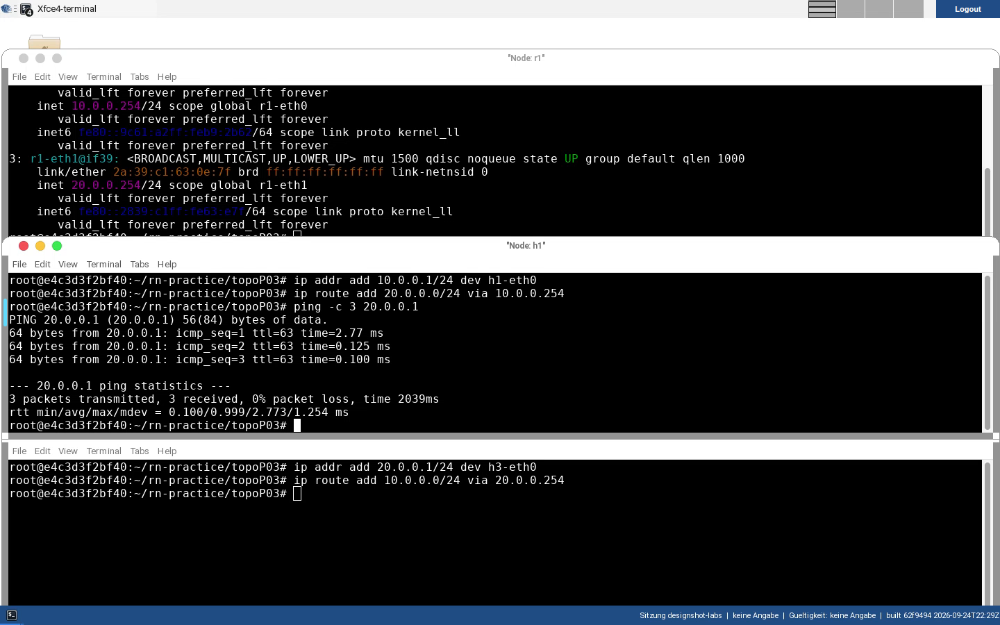

# 03 · Routing (RIP/BGP)

[:material-file-pdf-box: Als PDF herunterladen](../../pdf/03-routing-rip-bgp.pdf){ .md-button }

## Lernziele

- Das Grundprinzip von Routing-Tabellen verstehen: direkt angeschlossene
  Netze werden automatisch eingetragen, entfernte Netze benötigen eine
  Route (statisch oder dynamisch gelernt).
- Routing zwischen zwei Netzen manuell mit `ip route add` konfigurieren –
  ganz ohne Routing-Protokoll.
- RIP (Distance Vector) und BGP (Path Vector) im gleichzeitigen Einsatz auf
  denselben Routern beobachten und ihr Konvergenzverhalten (periodischer
  Nachrichtenaustausch) im Wireshark-Mitschnitt erkennen.
- `vtysh`/FRR als Konfigurations- und Diagnosewerkzeug für Routing-Software
  bedienen (`show ip route`, `configure terminal`, Protokoll-Module).
- Administrative Distanz als Auswahlkriterium zwischen konkurrierenden
  Routing-Quellen verstehen und gezielt verändern.
- IPv4- und IPv6-Routing als getrennte, parallele Strukturen einordnen
  (separate Tabellen, weil nicht direkt kompatible Adressfamilien).
- RP-Filtering als Schutzmechanismus gegen IP-Spoofing verstehen und
  kontrolliert (für Diagnosezwecke) deaktivieren können.
- Die Zeitkonstanten und den Protokoll-Overhead eines Routing-Protokolls aus
  einer eigenen Aufzeichnung selbst berechnen, statt sie aus einem Lehrbuch zu
  übernehmen (Nachrichten je Minute, Byte je Minute, Abstand zweier Updates).

--8<-- "issue-feedback.md"

## Aufgaben

### Teil 1 – Manuelles Routing zwischen zwei Netzen (`topoP03`)

Bevor wir dynamische Routing-Protokolle einsetzen, konfigurieren wir Routing
einmal komplett von Hand – das schärft das Verständnis dafür, was RIP/BGP in
Teil 2 automatisiert übernehmen.

```bash
cd ~/rn-practice/topoP03
./start-topoP03.sh
```

**Topologie:** Zwei Switches `s1`/`s2`, dazwischen ein Router `r1`
(`r1-eth0` an `s1`, `r1-eth1` an `s2`). An `s1` hängen `h1`/`h2` (Netz 1),
an `s2` hängen `h3`/`h4` (Netz 2). Das Skript aktiviert auf `r1` lediglich die
IP-Weiterleitung (`echo 1 > /proc/sys/net/ipv4/ip_forward`); die Adressierung
und die Routen sind eure Aufgabe.

!!! warning "Mininet-Vorgabeadressen zuerst entfernen"
    Mininet gibt jedem Knoten auf seinem ersten Interface automatisch eine
    Adresse aus `10.0.0.0/8` (`h1`=`10.0.0.1` … `h4`=`10.0.0.4`,
    `r1-eth0`=`10.0.0.5`). Diese Adressen passen nicht zu eurem Adressplan und
    können mit euren eigenen kollidieren. Prüft sie mit `ip a` und entfernt sie
    auf jedem Host und auf `r1-eth0`, bevor ihr eigene Adressen setzt
    (`ip addr flush dev <interface>`).

!!! info "Hintergrund: warum die Switches nach einem Controller rufen"
    `topoP03.py` meldet die Switches bei einem OpenFlow-Controller auf
    `127.0.0.1` an, der nicht läuft. Daher stammen die Meldungen
    `Unable to contact the remote controller` beim Start. Die Switches
    laufen im Modus `fail-mode standalone` und arbeiten damit als
    gewöhnliche lernende Switches; die Meldungen könnt ihr ignorieren.

Konfiguriert die Adressierung:

- Netzwerk 1: `10.0.0.0/24` – wählt für `h1` und `h2` je eine Adresse aus
  `10.0.0.1`–`10.0.0.253`.
- Netzwerk 2: `20.0.0.0/24` – wählt für `h3` und `h4` je eine Adresse aus
  `20.0.0.1`–`20.0.0.253`.

```bash
h1$ ip addr flush dev h1-eth0
h1$ ip addr add 10.0.0.5/24 dev h1-eth0
```

!!! warning "Router-Interfaces nicht vergessen"
    Bevor Hosts über `r1` kommunizieren können, müsst ihr die beiden
    Interfaces von `r1` (`r1-eth0` Richtung `s1`, `r1-eth1` Richtung `s2`) mit
    je einer Adresse aus dem entsprechenden Netz versehen, z. B.
    `ip addr add 10.0.0.254/24 dev r1-eth0` und
    `ip addr add 20.0.0.254/24 dev r1-eth1`.

Setzt anschließend auf den Hosts die Routen zum jeweils anderen Netz über
`r1`:

```bash
h1, h2$ ip route add 20.0.0.0/24 via 10.0.0.254   # 10.0.0.254 = Adresse von r1 im Netz 1
h3, h4$ ip route add 10.0.0.0/24 via 20.0.0.254   # 20.0.0.254 = Adresse von r1 im Netz 2
```

Prüft die Konnektivität zwischen den beiden Netzen mit `ping` und
`traceroute`, und vergleicht die Routing-Tabelle auf `r1` (`ip route`) mit
der auf den Hosts.


*Von Hand eingetragene Adressierung und Routen in `topoP03`: `r1`
bekommt `10.0.0.254/24` bzw. `20.0.0.254/24` auf seinen beiden Interfaces,
`h1` und `h3` je eine Route über `r1` zum jeweils anderen Netz. Der
anschließende `ping` von `h1` zu `h3` bestätigt die Konnektivität
(`ttl=63`, ein Hop über `r1`).*

Ihr habt jetzt einen Router, der zwei Netze verbindet, und beide Seiten
vertrauen darauf, dass die Antworten von der richtigen Station kommen. Was
passiert, wenn sich ein dritter Rechner genau in diesen Weg drängt? Das ist
ARP-Spoofing – und dafür gibt es ein eigenes Blatt:
[Lab 05 – ARP-Spoofing & Denial-of-Service](05-arp-spoofing-dos.md).

!!! example "Vertiefung (optional): Wenn nur eine Richtung stimmt"
    Ihr habt eben auf beiden Seiten Routen gesetzt. Nehmt eine davon
    testweise wieder weg – löscht auf dem Zielrechner die Rückroute
    (`ip route del …`) und pingt erneut von `h1` aus.

    Der Ping schlägt fehl. Lasst dabei auf dem Zielrechner
    `tcpdump -i any icmp` mitlaufen: die Anfragen kommen dort sehr wohl an,
    nur die Antwort findet nicht zurück. Ein fehlgeschlagener Ping heißt
    also nicht „das Paket kam nicht an", sondern nur „ich habe keine Antwort
    gesehen" – und Routing ist **je Richtung** zu betrachten, nicht je
    Verbindung. Setzt die Route danach wieder, bevor ihr weitermacht.

### Teil 2 – Dynamisches Routing mit RIP und BGP (`topo03`, FRR/`vtysh`)

In Teil 1 habt ihr für **zwei** Netze jede Route von Hand eingetragen – bei
vier Routern und mehreren Netzen wäre das schnell unübersichtlich, und bei
jedem Ausfall müsstet ihr erneut von Hand eingreifen. Genau dafür gibt es
**Routing-Protokolle**: Router tauschen automatisch untereinander aus,
welche Netze sie erreichen können, und tragen die passenden Routen selbst
in ihre Tabelle ein – auch dann, wenn sich die Topologie ändert. Ihr
wechselt dafür von `topoP03` (ein Router, manuell konfiguriert) zu `topo03`:
vier Router, bereits mit RIP und BGP vorkonfiguriert.

Bei so vielen beteiligten Knoten hilft eine Skizze. Die Topologie für dieses
Experiment:

```text
                      r2
                     /  \
 sw1 --- r1 --- sw2        sw3 --- r3 --- sw4
                     \  /
                      r4

 sw1: 192.168.1.0/24 (Stub-Netz von r1)   sw2: 193.1.1.0/26
 sw3: 193.1.2.0/24                        sw4: 192.168.3.0/24 (Stub-Netz von r3)

 sw steht für Switch, r für Vermittlungsknoten (Router)
```

#### Einführung in Routing, RIP und BGP

RIP (Routing Information Protocol) ist eines der einfachsten
Routing-Protokolle: Es verwendet eine simple Metrik (Hop-Zählung) und ist
leicht zu konfigurieren – ein guter Einstieg, um Konzepte wie
Routing-Tabellen und Konvergenz (das Zurückkehren zu einem stabilen Zustand
nach einer Änderung) zu verstehen. BGP (Border Gateway Protocol) ist
komplexer, aber das Protokoll, das das Internet zusammenhält: Es ermöglicht
die Kommunikation zwischen unterschiedlichen autonomen Systemen (AS) und
führt in Konzepte wie Pfadvektoren, Routing-Policies und Multi-Homing ein.
Beide Protokolle unterscheiden sich grundlegend darin, wie sie eine Route
"bewerten" und weitergeben – RIP zählt nur Hops, BGP wägt AS-Pfade und
Policies ab.

!!! info "Hintergrund: RIP kann nur bis 15 zählen – und das ist Absicht"
    RIPs Metrik ist die Zahl der Zwischenstationen, und bei **16** gilt ein
    Ziel als unerreichbar. Das wirkt wie eine willkürliche Grenze, löst aber
    ein echtes Problem. In einem Distance-Vector-Verfahren erzählt jeder
    Router seinen Nachbarn nur, *wie weit* ein Ziel entfernt ist – nicht,
    *worüber* der Weg führt. Fällt eine Verbindung aus, können sich zwei
    Router deshalb gegenseitig immer größere Entfernungen zurückmelden, ohne
    je zu merken, dass jeder den Weg über den anderen meint. Dieses
    *Count-to-Infinity*-Problem würde ohne Obergrenze niemals enden.

    RIP erklärt darum einfach 16 zu „unendlich". Der Preis: in Netzen mit
    mehr als 15 Zwischenstationen ist RIP nicht einsetzbar. Genau diese
    Abwägung – Einfachheit gegen Reichweite – ist einer der Gründe, warum
    später Link-State-Verfahren wie OSPF entstanden sind.

!!! info "Hintergrund: die Nummern, an denen das Internet hängt"
    Die Zahlen 65001, 65002 und 65003, die euch in dieser Übung begegnen,
    sind **AS-Nummern** (Autonomous System). Ein autonomes System ist ein
    Netz unter einheitlicher Verwaltung – ein Rechenzentrum, ein
    Internetanbieter, ein großes Unternehmen. BGP ist das Protokoll, mit dem
    diese Systeme einander mitteilen, welche Adressbereiche über sie
    erreichbar sind. Weltweit sind Zehntausende AS aktiv, und
    praktisch jede Verbindung, die euer Browser aufbaut, verlässt sich auf
    Ankündigungen, die über BGP verteilt wurden.

    Der Bereich 64512–65534 ist ausdrücklich für den privaten Gebrauch
    reserviert – vergleichbar mit `192.168.x.x` bei IP-Adressen. Deshalb
    stehen hier 65001 bis 65003 und keine echten, registrierten Nummern.
    Und weil BGP darauf aufbaut, dass man diesen Ankündigungen glaubt, hat
    eine falsche Ankündigung schon mehrfach ganze Landesnetze vom Internet
    abgeschnitten. Wer wissen will, wie folgenreich das ist, sucht nach
    *BGP-Hijacking*.

Startet die Topologie:

```bash
cd ~/rn-practice/topo03
./start-topo03.sh
```

!!! note "Zweistufiger Start"
    `start-topo03.sh` arbeitet in zwei Stufen: Stufe 1 erstellt das
    Szenario *ohne* Routing-Protokolle – ihr landet zunächst auf dem
    `mininet>`-Prompt. Ein einmaliges `exit` an diesem Prompt beendet nicht
    die Emulation, sondern startet die Routing-Dienste (RIP und BGP) auf
    allen vier Routern und öffnet danach erneut den `mininet>`-Prompt
    (Stufe 2). Erst ein *weiteres* `exit` bzw. `quit` beendet die Emulation
    tatsächlich.

Öffnet ein Terminal auf `r1` und schaut euch die konfigurierten Adressen an:

```bash
mininet> xterm r1
r1$ ip a s
```

Notiert die "Dotted Decimal"-Adressen (die vier durch Punkte getrennten
Dezimalzahlen der IPv4-Adresse). Wiederholt das mit den IPv6-Link-Local-
Adressen (`fe80::...`), die der Kernel automatisch für jedes Interface
vergibt, auch ohne IPv6-Konfiguration.

#### Direkt angeschlossene Netze brauchen keine Route

Für direkt angeschlossene Netze ist kein zusätzlicher Routing-Aufwand nötig.
Öffnet zusätzlich ein Terminal für `r2` und pingt von dort alle IPv4-Adressen
von `r1` an (die Loopback-Adresse `127.0.0.1` könnt ihr ignorieren):

```bash
mininet> xterm r2
r2$ ping -c 1 193.1.1.1
r2$ ping -c 1 192.168.1.1
```

Nur die erste Adresse ist von `r2` aus ohne Weiterleitung erreichbar – sie
liegt im selben `/26`-Netz wie `r2`s eigene Schnittstelle (`193.1.1.0/26`).
Wiederholt den Test mit IPv6. Link-Local-Adressen benötigen den
Interface-Zusatz; setzt die Link-Local-Adresse von `r1-eth1` ein, die ihr
eben notiert habt:

```bash
r2$ ping6 -c 1 fe80::<rest-der-adresse>%r2-eth0
```

#### Routing-Tabellen im Detail: `topo03` konkret

Die vorkonfigurierten FRR-Router (`r1`–`r4`, nachlesbar unter
`~/rn-practice/topo03/r*/zebra.conf`, `ripd.conf`, `bgpd.conf`):

| Router | Schnittstellen (IPv4) | RIP | BGP (AS) |
|---|---|---|---|
| `r1` | `r1-eth0`=`192.168.1.1/24` (Stub), `r1-eth1`=`193.1.1.1/26` | ja (nur `r1-eth1`) | 65001, Nachbar `193.1.1.2` |
| `r2` | `r2-eth0`=`193.1.1.2/26`, `r2-eth1`=`193.1.2.1/24` | ja | 65002, Nachbarn `193.1.1.1` und `193.1.2.2` |
| `r3` | `r3-eth0`=`192.168.3.1/24` (Stub), `r3-eth1`=`193.1.2.2/24` | ja | 65003, Nachbar `193.1.2.1` |
| `r4` | `r4-eth0`=`193.1.1.4/26`, `r4-eth1`=`193.1.2.4/24` | ja | **kein `bgpd.conf`** |

`r4` besitzt keine `bgpd.conf` – er nimmt ausschließlich am RIP-Verbund
teil, nicht am BGP-Verbund zwischen `r1`/`r2`/`r3` (AS 65001/65002/65003).
`r1` lernt `192.168.3.0/24` deshalb aus zwei Quellen: per BGP und per RIP.
Welche davon gewinnt und was `r4` beiträgt, untersucht ihr im weiteren
Verlauf.

!!! info "Hintergrund: Zebra, Quagga, FRR"
    Aus dem Routing-Projekt *Zebra* entstand **Quagga**, aus Quagga wiederum
    **FRR** (FRRouting), das in dieser Umgebung läuft. In Büchern und
    Anleitungen stehen die Namen deshalb oft nebeneinander. FRR hat die
    `vtysh`-Syntax von Quagga weitgehend übernommen; ein Befehl aus einer
    Quagga-Anleitung funktioniert hier in der Regel unverändert.

Prüft zunächst (noch vor Aktivierung der Routing-Protokolle, also in Stufe 1
direkt nach dem Start) die Routing-Tabelle von `r1` und versucht einen Ping
zu `192.168.3.1` – er schlägt fehl, da noch keine Route existiert:

```bash
mininet> xterm r1
r1$ ip route
r1$ ping -c 1 192.168.3.1
```

Startet Wireshark auf dem Interface `r1-eth1` und wechselt dann auf der
`mininet`-Konsole mit einmaligem `exit` in Stufe 2. Kurz danach beginnt ein
reger Paketaustausch, in dem RIP und BGP versuchen, Konvergenz zu erreichen
– beobachtet, wie sich diese Kommunikation in festen Zeitabständen
wiederholt (typisch für Distance-Vector-Protokolle wie RIP, im Gegensatz zu
Link-State-Protokollen wie OSPF, die Topologie-Informationen nur bei
Änderungen verschicken und dazwischen nur kleine Hello-Pakete senden).

Prüft danach erneut die Routing-Tabelle auf `r1` – zusätzlich zu den beiden
direkt angeschlossenen Netzen sind nun zwei neue Routen sichtbar. Prüft die
Konnektivität zu `192.168.3.1` und verfolgt den Pfad:

```bash
r1$ tracepath 192.168.3.1
r1$ traceroute 192.168.3.1
```

`tracepath` ermittelt zusätzlich die Pfad-MTU und benötigt keine
Root-Rechte, `traceroute` schickt je Hop drei Proben und zeigt drei
Laufzeiten. Ihr solltet sehen, dass der Pfad über `193.1.1.2` (also über
`r2`) führt.

#### Administrative Distanz: Warum gewinnt BGP?

Bis hierher habt ihr die Routing-Tabelle des Linux-Kernels gelesen. Für den
nächsten Schritt braucht ihr ein zweites Werkzeug.

`vtysh` ist die Befehlszeilenschnittstelle der Routing-Software. Sie sieht
wie eine gewöhnliche Shell aus, erwartet aber statt Linux-Befehlen die
Kommandosprache, die auch auf kommerziellen Routern üblich ist. Aus
`ip route show` wird dort `show ip route` – dieselbe Information, andere
Wortstellung. Ein Fragezeichen zeigt an jeder Stelle die möglichen
Fortsetzungen an.

```bash
r1$ vtysh
r1# show ip route          # die Tabelle der Routing-Software
r1# ?                      # zeigt die moeglichen Fortsetzungen
r1# exit                   # zurueck zur Linux-Shell
```

Der Prompt von `vtysh` zeigt den Rechnernamen eures Containers, nicht `r1`;
in diesem Blatt steht stellvertretend `r1#`.

!!! warning "Zwei Tabellen, nicht eine"
    `ip route` zeigt die Tabelle des **Linux-Kernels** – das, was
    tatsächlich weitergeleitet wird. `show ip route` in `vtysh` zeigt die
    Tabelle der **Routing-Software** – alles, was sie gelernt hat,
    einschließlich der Routen, für die sie sich *nicht* entschieden hat. Die
    zweite Tabelle ist deshalb größer als die erste. Dieser Unterschied ist
    der Gegenstand des nächsten Schritts, also vergleicht beide Ausgaben
    bewusst.

Die Tabelle enthält Dopplungen: `192.168.3.0/24` erscheint zweimal, einmal
mit vorangestelltem `B` (BGP) und einmal mit `R` (RIP), beide
`via 193.1.1.2`; `C` markiert direkt angeschlossene Netze. In der eckigen
Klammer steht zuerst die **administrative Distanz**, dann die Metrik
(`[20/0]` bzw. `[120/3]`). Je niedriger die Distanz, desto
vertrauenswürdiger die Quelle; `>*` markiert die gewählte Route, die in den
Kernel übernommen wird. BGP gewinnt hier, weil seine administrative Distanz
(20) niedriger ist als die von RIP (120).

Ändert nun die administrative Distanz von BGP, um es unattraktiver zu
machen:

```bash
r1# configure terminal
r1(config)# router bgp
r1(config-router)# distance bgp 200 200 200
r1(config-router)# end
r1# write memory
```

Die Meldung `Can't backup old configuration file` bei `write memory` könnt
ihr ignorieren. Die drei Werte stehen für eBGP-Routen (von einem anderen
autonomen System gelernt), iBGP-Routen (innerhalb desselben AS gelernt) und
lokal auf dem Router konfigurierte BGP-Routen.

Prüft die Auswirkung auf die Betriebssystem-Routing-Tabelle:

```bash
r1$ traceroute 192.168.3.1
r1$ ip route
```

!!! question "Beobachtet genau: wechselt der Weg – oder nur die Quelle?"
    Es liegt nahe zu erwarten, dass sich mit der Distanz auch der Weg der
    Pakete ändert. Prüft diese Erwartung mit `traceroute` (siehe oben) und
    mit der RIP-Tabelle, bevor ihr weiterlest:

    ```bash
    r1# show ip rip
    ```

    Ihr findet dort ausschließlich RIP-Routen, die von `193.1.1.2` (`r2`)
    gelernt wurden – keine von `r4`, obwohl `r1` und `r4` am selben
    Switch-Segment hängen. `r4` bietet `192.168.3.0/24` zwar ebenfalls an,
    aber mit derselben Metrik; RIP behält bei gleicher Metrik die zuerst
    gelernte Route. `r1` hat für `192.168.3.0/24` also nur einen Nexthop:
    `r2`. Er ist ihm zweimal bekannt, einmal per BGP (`Known via "bgp"`) und
    einmal per RIP (`Known via "rip"`, ebenfalls `via 193.1.1.2`).

    Die geänderte Distanz bewirkt deshalb keinen anderen Weg, sondern eine
    andere Quelle in der Tabelle: aus `bgp` wird `rip`, weil RIPs Distanz von
    120 nun unter dem auf 200 gesetzten BGP-Wert liegt. Die Pakete nehmen
    denselben Weg wie vorher. Eine veränderte Routing-Tabelle heißt also
    nicht automatisch veränderter Datenfluss. `r4` wird dennoch gebraucht –
    aus der Sicht von `r2`, und davon handelt Teil 3.

!!! info "Hintergrund: eine Route, die nirgends hinführt"
    In `r3/zebra.conf` steht eine statische Route nach `192.168.2.0/24` über
    `192.168.3.10`. Dieses Netz und diese Adresse kommen in der Übung nicht
    vor. Die Route erscheint auch nicht in `show ip route`, weil der für
    statische Routen zuständige FRR-Dienst (`staticd`) in dieser Topologie
    nicht gestartet wird. Für die Aufgabe spielt sie keine Rolle.

#### Lokale Gültigkeit manueller Routen

Routing-Änderungen gelten immer nur lokal auf dem jeweiligen Router. Öffnet
ein Terminal für `r3` und pingt von dort `192.168.1.1` an:

```bash
mininet> xterm r3
r3$ ping -c 3 192.168.1.1
```

Der Ping gelingt: `r3` kennt `192.168.1.0/24` per BGP über `r2`, und `r1`
kennt den Rückweg zu `193.1.2.0/24` ebenfalls über `r2`. Setzt nun auf `r1`
von Hand eine Host-Route, die den Verkehr zu `192.168.3.1` über `r4`
schickt, und vergleicht die Wege in beiden Richtungen:

```bash
r1$ ip route add 192.168.3.1/32 via 193.1.1.4
r1$ traceroute 192.168.3.1
r3$ traceroute 192.168.1.1
```

Von `r1` aus ist der erste Hop jetzt `193.1.1.4` (`r4`): die `/32`-Route
gewinnt gegen die `/24`-Routen aus BGP und RIP, weil der längste passende
Präfix entscheidet. Von `r3` aus führt der Weg weiterhin über `193.1.2.1`
(`r2`). Die manuelle Route wirkt nur auf `r1`; `r2`, `r3` und `r4` wissen
nichts von ihr, und der Weg ist jetzt asymmetrisch.

#### RP-Filtering: Schutz vor IP-Spoofing

Lasst die Host-Route auf `r1` stehen und erzwingt, dass `r3` die Adresse
`192.168.3.1` als Quelladresse für einen Ping auf `192.168.1.1` verwendet:

```bash
r3$ ping -c 3 -I 192.168.3.1 192.168.1.1
```

Der Ping schlägt fehl, ohne Quelladresse (`ping -c 3 192.168.1.1`) gelingt
er dagegen. Die Anfrage läuft über `r2` zu `r1`. Die Antwort an
`192.168.3.1` nimmt wegen eurer Host-Route den Weg über `r4`, und `r4`
kennt keine Route zurück zu `192.168.1.1` (`r4` spricht kein BGP, und `r1`
kündigt `192.168.1.0/24` nicht per RIP an). Deshalb verwirft **RP-Filtering**
(Reverse Path Filtering) auf `r4` das Paket: ein Schutzmechanismus gegen
IP-Spoofing, der Pakete verwirft, deren Absenderadresse laut eigener
Routing-Tabelle nicht erreichbar wäre. Im strikten Modus (`1`) muss der
Rückweg sogar über dasselbe Interface führen, über das das Paket
hereinkam; im losen Modus (`2`) genügt irgendein Rückweg. Prüft den Modus
und den Zähler der verworfenen Pakete auf `r4`:

```bash
r4$ sysctl net.ipv4.conf.all.rp_filter net.ipv4.conf.r4-eth0.rp_filter
r4$ nstat -az TcpExtIPReversePathFilter
```

Deaktiviert RP-Filtering testweise auf `r4`. Ein einfaches `sysctl -w`
scheitert hier mit `permission denied`, weil `/proc/sys` im Container nur
lesbar eingebunden ist; `unshare -m` hängt es für diesen einen Aufruf
beschreibbar ein. Die Einstellung gilt nur im Netz-Namensraum von `r4`:

```bash
r4$ unshare -m sh -c 'mount -o remount,rw /proc/sys && sysctl -w net.ipv4.conf.all.rp_filter=0 net.ipv4.conf.r4-eth0.rp_filter=0'
r3$ ping -c 3 -I 192.168.3.1 192.168.1.1
```

Danach gelingt der Ping mit der erzwungenen Quelladresse. Entfernt die
Host-Route auf `r1` wieder, bevor ihr weitermacht:

```bash
r1$ ip route del 192.168.3.1/32
```

#### Ausfall eines Pfads beobachten

!!! question "Ein Ausfall, der niemanden trifft – schaltet `r4-eth1` ab und begründet das Ergebnis"
    Schaltet auf `r4` das Interface in Richtung `r3` ab und beobachtet dabei
    `r1`:

    ```bash
    r4$ ifconfig r4-eth1 down
    r1$ vtysh -c "show ip route 192.168.3.0/24"
    r1$ ping -c 4 192.168.3.1
    ```

    Für `r1` ändert sich nichts: derselbe Routen-Eintrag, kein
    Paketverlust, keine erhöhte Laufzeit. Erklärt, warum das so sein muss –
    der Hinweis oben zu `show ip rip` enthält alles, was ihr dazu braucht.
    Schaltet das Interface danach wieder ein (`r4$ ifconfig r4-eth1 up`).

    Bei einer Störungsmeldung ist „wen trifft dieser Ausfall überhaupt?" oft
    die ergiebigere Frage als „ist etwas ausgefallen?". Einen Ausfall, der
    tatsächlich eine Rekonvergenz erzwingt, untersucht ihr in Teil 3 – aus
    der Sicht von `r2`, dessen Weg zu `r3` von `r4` als Reserve abhängt.

!!! example "Vertiefung (optional): Routing wirklich kaputt machen"
    Eure Topologie läuft in einer eigenen Mininet-Instanz; ihr könnt hier
    also gefahrlos weiter gehen. Deaktiviert testweise den RIP-Dienst auf
    `r2` *und* `r4` (`vtysh -c "configure terminal" -c "no router rip" -c "end"`
    auf jedem der beiden) und prüft, ob `192.168.3.0/24` von `r1` aus noch
    erreichbar ist, obwohl BGP weiterläuft. Bereits gelernte RIP-Routen
    verschwinden auf `r1` erst nach Ablauf des RIP-Timeouts (180 s); wartet
    also einige Minuten. Setzt anschließend zusätzlich
    `distance bgp 200 200 200` (wie oben gezeigt) auf allen drei
    BGP-Routern und beobachtet, ob das Netz auseinanderfällt oder eine
    Restkonnektivität übrig bleibt. Startet die Topologie danach neu.

### Teil 3 – Redundanz im RIP-Netz testen: reale Rekonvergenz messen (`topo03`)

Teil 2 hat gezeigt, dass `r1` für `192.168.3.0/24`, solange `r2-eth1`
funktioniert, nur `r2` als Nexthop kennt – `r4` spielt aus Sicht von `r1`
in diesem Zustand keine Rolle. `r4` bildet aber eine **Backup-Route**, weil
er sowohl am gemeinsamen Switch-Segment von `r1` und `r2`
(`193.1.1.0/26`, `sw2`) als auch am Segment von `r3` (`193.1.2.0/24`,
`sw3`) sitzt; er ist für `r1` und `r2` direkt per RIP erreichbar. Solange
`r2` direkt mit `r3` verbunden ist, bleibt der Pfad über `r2` die bessere
(kürzere) Route für `r2` und `r4` bleibt ungenutzt – bis genau diese
direkte Verbindung ausfällt. Dann ändert sich der Weg nicht nur bei `r2`,
sondern auch bei `r1`.

In diesem Teil legt ihr diese direkte Verbindung lahm und messt, wie
schnell RIP auf den Ersatzpfad über `r4` umschaltet.

Stellt zunächst auf `r2` den aktuellen (funktionierenden) Zustand fest:

```bash
mininet> xterm r2
r2$ vtysh -c "show ip route 192.168.3.0/24"
```

Ihr solltet sowohl eine `bgp`- als auch eine `rip`-Route sehen, beide mit
Nexthop `193.1.2.2` über `r2-eth1` – die direkte Verbindung zu `r3`.

Startet nun auf `r1` einen dauerhaften Ping auf `192.168.3.1` in einem
eigenen Terminal, damit ihr die Auswirkung auf die Ende-zu-Ende-Konnektivität
mitverfolgen könnt:

```bash
mininet> xterm r1
r1$ ping 192.168.3.1
```

Deaktiviert anschließend auf `r2` die direkte Verbindung zu `r3`:

```bash
r2$ ifconfig r2-eth1 down
```

Wiederholt sofort und danach im Abstand von einigen Sekunden den Befehl von
oben auf `r2`, um zu beobachten, *wann genau* RIP eine Ersatzroute
installiert:

```bash
r2$ vtysh -c "show ip route 192.168.3.0/24"
```

**Aufgabe:** Notiert, nach wie vielen Sekunden die Ausgabe erstmals eine
Route über `193.1.1.4` (`r4`) statt über das abgeschaltete `r2-eth1`
zeigt. Wiederholt die Messung zwei- bis dreimal (Interface wieder
einschalten, wie unten gezeigt, kurz warten, erneut abschalten) und
vergleicht die Zeiten mit RIPs periodischem Update-Intervall von
30 Sekunden. Erklärt anhand eurer Messung den Unterschied zwischen einem
*periodischen* Update (RIP sendet ohnehin alle 30 Sekunden seine komplette
Routing-Tabelle) und einem *ausgelösten* Update (*triggered update*: eine
Änderung wird sofort, ohne auf den nächsten Zeitzyklus zu warten, an die
Nachbarn gemeldet): Wer meldet hier sofort etwas, und auf wessen Meldung
muss `r2` warten?

Beobachtet dabei auch euren laufenden Ping auf `r1` und lasst ihn
mindestens vier Minuten laufen. Haltet fest, ob und wie lange er aussetzt,
bevor er von selbst wieder Antworten bekommt, und erklärt, warum der
Aussetzer viel länger dauert als die Umstellung auf `r2`. Tipp: Schaut
während des Aussetzers mit `ip route` auf `r3` nach, über welchen Nexthop
`r3` die Antworten an `193.1.1.1` schickt.

??? info druck-zu "Erwartungshorizont – erst öffnen, wenn ihr selbst gemessen habt"
    **Auf `r2`:** `r2` meldet den Ausfall sofort weiter (triggered update
    mit Metrik 16, dazu der Rückzug der BGP-Route an `r1`). `r1` verliert
    seine Route zu `192.168.3.0/24` deshalb innerhalb von ein bis zwei
    Sekunden. Die Ersatzroute über `r4` erscheint auf `r2` dagegen erst mit
    dem nächsten periodischen Update von `r4`: `r4`s eigene Route ist vom
    Ausfall nicht betroffen, er hat also keinen Anlass für ein triggered
    update. Je nachdem, wo im 30-Sekunden-Zyklus von `r4` der Ausfall liegt,
    dauert das wenige Sekunden bis gut 30 Sekunden; die Messwerte streuen
    deshalb zwischen den Wiederholungen. Danach steht auf `r2`
    `Known via "rip", ... 193.1.1.4, via r2-eth0`.

    **Auf `r1`:** `r1` ist selbst RIP-Nachbar von `r4` und übernimmt die
    Route aus derselben Meldung: Seine Kernel-Route zu `192.168.3.1` zeigt
    dann `via 193.1.1.4 dev r1-eth1`.

    **Der Ping auf `r1`** setzt trotzdem etwa zwei bis drei Minuten aus. Der
    Hinweg über `r4` funktioniert, aber der Rückweg nicht: `r3`s eigenes
    Interface bleibt aktiv, `r3` bemerkt den Ausfall von `r2-eth1` also
    nicht direkt. Er behält seine BGP-Route zu `193.1.1.0/26` über
    `193.1.2.1` (`r2`), bis die BGP-Sitzung zu `r2` nach Ablauf der Hold
    Time (180 s ohne Nachricht von `r2`) abgebaut wird. Erst dann übernimmt
    `r3` die RIP-Route über `r4`, die er die ganze Zeit kannte, die aber
    wegen der höheren administrativen Distanz nicht gewählt war. Die direkten
    Nachbarschaften bleiben die ganze Zeit intakt – `r4` erreicht `r2` und
    `r3` durchgehend ohne Verlust.

    **Der Merksatz dahinter:** Konvergenz ist kein Zeitpunkt, sondern ein
    Verlauf, und verschiedene Knoten erreichen sie zu verschiedenen Zeiten.
    Wer nur an einer Stelle misst, hält die Umstellung für schneller oder
    langsamer, als sie für das Netz als Ganzes ist.

Prüft abschließend, dass die Wiederherstellung ebenso funktioniert:

```bash
r2$ ifconfig r2-eth1 up
r2$ vtysh -c "show ip route 192.168.3.0/24"
```

Die Route sollte innerhalb weniger Sekunden wieder auf den direkten Pfad
über `193.1.2.2` zurückwechseln. Beendet den Ping auf `r1` mit
++ctrl+c++.

--8<-- "issue-feedback.md"

### Teil 4 – Protokollspuren vermessen statt anschauen (`topo03`)

In Teil 2 habt ihr den Paketaustausch von RIP und BGP in Wireshark *gesehen*.
Sehen ist aber nicht messen. Ein Routing-Protokoll hat Zeitkonstanten und einen
Preis, und beides steht in keiner Ausgabe: Wie oft meldet sich ein Router, auch
wenn sich gar nichts geändert hat? Was kostet das an Byte je Minute, während
kein einziges Nutzdatenpaket unterwegs ist? In diesem Teil zeichnet ihr eine
Spur auf und rechnet diese Zahlen selbst aus ihr heraus.

Eine Aufzeichnung ist eine Datei, die bleibt: Die Topologie braucht ihr nur
zum Aufnehmen. Die Auswertung könnt ihr danach beliebig oft wiederholen,
verfeinern und mit den Spuren eurer Kommiliton:innen vergleichen – auch in
einer späteren Sitzung, in der nichts mehr läuft. Weil die Spur aus eurer
eigenen Topologie stammt, wisst ihr genau, welche Router gesprochen haben und
wie sie konfiguriert sind.

#### Schritt 1 – Erst rechnen, dann aufzeichnen

Füllt diese Tabelle **bevor** ihr etwas startet. Alles, was ihr dafür braucht,
steht in Teil 2 und 3 dieses Blattes.

| Frage | Eure Vorhersage |
|---|---|
| In welchem Abstand sendet ein RIP-Router seine Tabelle, wenn sich nichts ändert? | ? s |
| Wie viele RIP-Nachrichten sind das in 2,5 Minuten, von **einem** Sprecher? | ? |
| Wie viele Router auf `193.1.1.0/26` sprechen überhaupt RIP – und wie viele davon hört `r1` auf `r1-eth1`? | ? |
| Welchen Transportweg nutzt RIP, welchen BGP? | ? |
| Wie viele Byte je Minute kostet RIP auf diesem Segment im Ruhezustand? | ? Byte/min |

Die letzte Zeile ist die interessanteste, weil sie sich nicht erraten lässt:
Ihr braucht die Nachrichtengröße **und** die Häufigkeit. Schätzt trotzdem eine
Größenordnung – zehn, hundert oder tausend Byte je Minute? – und notiert sie.

#### Schritt 2 – Die Spur aufzeichnen

Startet `topo03` wie in Teil 2 und bleibt zunächst in **Stufe 1**, also vor dem
ersten `exit`. Die Routing-Dienste laufen dann noch nicht, das Segment ist
still – genau der richtige Zeitpunkt, um mit dem Mitschnitt zu beginnen:

```bash
cd ~/rn-practice/topo03
./start-topo03.sh
```

Legt das Verzeichnis für Aufzeichnungen an und startet `tcpdump` auf `r1`:

```bash
mininet> xterm r1
r1$ mkdir -p ~/rn-practice/pcaps
r1$ tcpdump -i r1-eth1 -w ~/rn-practice/pcaps/03-teil4-protokollspuren.pcap -U -n
```

`-i r1-eth1` ist die Schnittstelle zum gemeinsamen Segment mit `r2` und `r4`,
`-w` schreibt in eine Datei statt auf den Bildschirm, `-U` schreibt jedes Paket
sofort (ohne `-U` verliert ein abgebrochener Mitschnitt den letzten Puffer),
`-n` verzichtet auf Namensauflösung.

Wechselt nun auf der `mininet`-Konsole mit einmaligem `exit` in **Stufe 2**
(RIP und BGP starten) und lasst den Mitschnitt **mindestens 2,5 Minuten**
laufen. Diese Dauer ist kein Zufall: Ihr braucht mehrere Abstände zwischen
periodischen Updates, um aus ihnen einen Mittelwert bilden zu können – bei
einem einzigen Abstand wäre jede Aussage über die Streuung erfunden. Beendet
`tcpdump` danach mit ++ctrl+c++ und prüft, dass die Datei wirklich gefüllt ist:

```bash
r1$ ls -l ~/rn-practice/pcaps/03-teil4-protokollspuren.pcap
```

!!! warning "`tshark` ist in diesem Container nicht installiert"
    Viele Anleitungen im Netz werten `pcap`-Dateien mit `tshark` aus. Hier
    ist nur die grafische Wireshark-Oberfläche vorhanden, nicht das
    Kommandozeilenwerkzeug. Für diese Aufgabe genügen `tcpdump` und
    `capinfos`.

#### Schritt 3 – Die Zahlen aus der Datei holen

Legt euch den Pfad in eine Variable, damit die folgenden Befehle kurz bleiben:

```bash
r1$ P=~/rn-practice/pcaps/03-teil4-protokollspuren.pcap
```

**Das Ganze zuerst.** `capinfos` beantwortet „wie viel, über wie lange":

```bash
r1$ capinfos -c -d -u "$P"
```

`-c` gibt die Zahl der Pakete, `-d` die Summe der Nutzdaten in Byte, `-u` die
Dauer der Aufzeichnung in Sekunden. Aus diesen drei Zahlen berechnet ihr den
Overhead je Minute selbst – nicht ausrechnen lassen, sondern ausrechnen:

```text
Byte je Minute = Data size / Capture duration * 60
```

**Dann je Protokoll.** Dieselbe Rechnung wird erst aussagekräftig, wenn ihr RIP
und BGP getrennt betrachtet. `tcpdump` kann eine Datei lesen und gefiltert in
eine neue schreiben:

```bash
r1$ tcpdump -r "$P" -w /tmp/rip.pcap udp port 520
r1$ capinfos -c -d -u /tmp/rip.pcap
r1$ tcpdump -r "$P" -w /tmp/bgp.pcap tcp port 179
r1$ capinfos -c -d -u /tmp/bgp.pcap
```

**Und schließlich die Zeitkonstante.** Der Abstand zweier Updates steckt in den
Zeitstempeln. `-tt` gibt sie als reine Sekundenzahl aus, `awk` bildet die
Differenz zur Vorzeile:

```bash
r1$ tcpdump -tt -n -r "$P" 'udp port 520 and src 193.1.1.2' \
      | awk '{if (p != "") printf "%.2f s\n", $1-p; p=$1}'
```

Beachtet die Einschränkung auf **einen** Sprecher (`src 193.1.1.2`, also `r2`).
Ohne sie mischt ihr die Zeitreihen mehrerer Router und erhaltet Abstände, die
kein einzelner Router je eingehalten hat. Wiederholt den Aufruf mit
`src 193.1.1.4` (`r4`) und vergleicht.

Dasselbe für BGP. Hier interessieren nur die Nachrichten mit Inhalt, nicht die
reinen TCP-Bestätigungen – `greater 60` filtert die leeren Segmente heraus:

```bash
r1$ tcpdump -tt -n -r "$P" 'tcp port 179 and greater 60' \
      | awk '{if (p != "") printf "%.1f s\n", $1-p; p=$1}'
```

Die ersten Abstände (um 1 s bei RIP, 0,0 s bei BGP) stammen aus dem
Verbindungsaufbau direkt nach dem Start der Dienste. Für die Zeitkonstanten
zählen die Abstände danach.

#### Schritt 4 – Auswerten

**Aufgabe:** Vergleicht jede Zeile eurer Vorhersage aus Schritt 1 mit dem
gemessenen Wert und begründet jede Abweichung. Die drei Fragen, an denen sich
zeigt, ob ihr die Messung verstanden habt:

1. **Die Abstände sind nicht alle gleich.** RIP nennt 30 Sekunden, ihr messt
    Werte darunter und darüber. Das ist kein Messfehler: RIP versieht seinen
    Zeitgeber absichtlich mit einer Zufallsschwankung. Überlegt, was passieren
    würde, wenn alle Router eines Segments ihre Tabelle *exakt* gleichzeitig
    senden würden – und warum die Schwankung damit kein Schönheitsfehler,
    sondern eine Notwendigkeit ist.
2. **BGP sendet seltener, kostet aber mehr.** Rechnet beide Byte-je-Minute-Werte
    aus und stellt sie nebeneinander. Begründet das Ergebnis damit, dass RIP auf
    UDP aufsetzt und BGP auf TCP – und dass zu jeder TCP-Nachricht eine
    Bestätigung gehört, die in eurer gefilterten Datei mitzählt.
3. **Der Preis des Ruhezustands.** Rechnet euren RIP-Wert auf eine Woche hoch
    und stellt ihn der Nutzlast eines einzigen Bildes im Browser gegenüber.
    Formuliert in einem Satz, warum dieser Aufwand trotzdem gerechtfertigt ist.

??? info druck-zu "Erwartungshorizont – erst öffnen, wenn ihr selbst gerechnet habt"
    Eure Zahlen weichen im Detail ab; die Größenordnungen sollten passen. Bei
    rund 150 Sekunden Aufzeichnung auf `r1-eth1`:

    | Größe | Typischer Wert |
    |---|---|
    | Pakete gesamt | etwa 70 |
    | RIP (UDP/520) | etwa 16 Pakete, knapp 1.300 Byte |
    | BGP (TCP/179) | etwa 25 Pakete, knapp 2.400 Byte, über rund 120 s |
    | Abstände der RIP-Updates eines Sprechers | zwischen etwa 24 und 37 s |
    | Abstand der BGP-Keepalives | 60 s |

    Daraus ergeben sich für RIP rund 500 Byte je Minute, für BGP rund
    1.200 Byte je Minute – BGP kostet auf diesem Segment also mehr als das
    Doppelte von RIP, obwohl es deutlich seltener sendet. RIP sprechen auf
    dem Segment `r1`, `r2` und `r4`; `r1` hört periodische Updates von `r2`
    und `r4` und sendet selbst nur eine Anfrage beim Start. Die
    RIP-Nachrichten sind 24 Byte (Anfrage, Antwort mit einer Route) bzw.
    44 Byte (Antwort mit zwei Routen) groß, die Ethernet-Rahmen 66 bzw.
    86 Byte.

--8<-- "issue-feedback.md"
### Teil 5 – Drei Tabellen, drei Wahrheiten: Kernel, RIP und BGP nebeneinander (`topo03`)

Teil 2 hat schon angedeutet, dass es *zwei* Tabellen gibt: die des Kernels
(`ip route`) und die der Routing-Software (`show ip route`). Tatsächlich sind
es sogar drei, denn die Routing-Software hält je Protokoll eine eigene: `show
ip rip` und `show ip bgp` zeigen, was **RIP** bzw. **BGP** jeweils für sich
gelernt haben, bevor die administrative Distanz entscheidet, welcher Eintrag es
in die Kernel-FIB schafft. In diesem Teil legt ihr alle drei nebeneinander und
verfolgt ein einzelnes Präfix durch sie hindurch.

!!! info "Werkzeug: die drei `show`-Ansichten von `vtysh`"
    `show ip route` ist die **Entscheidung** (was tatsächlich weitergeleitet
    wird, mit Protokoll-Kennbuchstabe und `[Distanz/Metrik]`). `show ip rip` und
    `show ip bgp` sind die **Kandidaten** je Protokoll. **Typische
    Fehldeutung:** `show ip rip` als „die aktiven RIP-Routen" zu lesen. Es zeigt
    *alles*, was RIP kennt – auch Routen, die BGP im Wettbewerb um die FIB
    geschlagen hat.

**Ziel:** Für das Präfix `192.168.3.0/24` zeigen, dass es in RIP **und** BGP
existiert, mit unterschiedlichen Distanzen, und dass nur einer der beiden die
Kernel-Route stellt.

**Vorbedingung:** `topo03` läuft in Stufe 2 (RIP und BGP aktiv, siehe Teil 2).
Terminal auf `r1` (`mininet> xterm r1`). Habt ihr in Teil 2 die BGP-Distanz
auf 200 gesetzt, startet die Topologie vorher neu; sonst seht ihr dort 200
statt 20.

**Schritte:**

```bash
r1$ vtysh -c "show ip route 192.168.3.0/24"
r1$ vtysh -c "show ip rip"
r1$ vtysh -c "show ip bgp"
```

**Erwartete Ausgabe:** `show ip route 192.168.3.0/24` zeigt zwei Einträge
für dasselbe Präfix mit demselben Nexthop `193.1.1.2`:
`Known via "bgp", distance 20, ... best` (in die FIB gewählt) und
`Known via "rip", distance 120, metric 3` (nicht gewählt). Im vollständigen
`show ip route` steht dasselbe als `B>* 192.168.3.0/24 [20/0]` und
`R   192.168.3.0/24 [120/3]`; auch `193.1.2.0/24` erscheint dort doppelt.
`show ip rip` listet das Präfix mit seiner RIP-Metrik, `show ip bgp` mit
seinem AS-Pfad.

!!! info "Hintergrund: administrative Distanz ist Konvention, kein Standard"
    Die Zahl vor der Metrik (20 für BGP, 120 für RIP) ist die *administrative
    Distanz*. Sie steht in **keinem** RFC – sie ist eine Hersteller-Konvention
    (ursprünglich von Cisco), die praktisch alle Router übernommen haben, damit
    ein Gerät zwischen mehreren Protokollen, die dieselbe Route kennen,
    reproduzierbar wählt. Die *Metrik* dahinter ist dagegen protokolldefiniert:
    RIPs Hop-Zahl steht in RFC 2453, BGPs Entscheidungsprozess in RFC 4271
    (siehe Teil 6 und 7).

### Teil 6 – BGP-Nachbarschaften und der AS-Pfad lesen (`topo03`)

BGP ist das Protokoll, das das Internet zusammenhält (siehe die Hintergrundbox
in Teil 2). In `topo03` seht ihr es im Kleinen: drei autonome Systeme
(65001/65002/65003), die einander Präfixe ankündigen. In diesem Teil lest ihr
die Nachbarschaftstabelle und den AS-Pfad – die beiden Dinge, an denen sich in
einem echten Betrieb entscheidet, ob eine Route geglaubt wird.

**Ziel:** Die BGP-Peerings von `r1` und den AS-Pfad zu einem gelernten Präfix
ablesen.

**Vorbedingung:** `topo03` in Stufe 2, Terminal auf `r1`.

**Schritte:**

```bash
r1$ vtysh -c "show ip bgp summary"
r1$ vtysh -c "show ip bgp"
r1$ vtysh -c "show ip bgp 192.168.3.0/24"
```

**Erwartete Ausgabe:** `summary` zeigt die lokale AS-Nummer von `r1`
(`local AS number 65001`), den Nachbarn (`193.1.1.2`, AS 65002), wie lange die
Sitzung schon steht (`Up/Down`) und wie viele Präfixe empfangen
(`State/PfxRcd`, hier 3) und gesendet (`PfxSnt`) wurden. `show ip bgp` und
`show ip bgp 192.168.3.0/24` zeigen den **AS-Pfad**, über den das Präfix zu
`r1` kam (`65002 65003`).

!!! quote "Hintergrund: das Zwei-Servietten-Protokoll"
    BGP wurde **1989** von Kirk Lougheed (Cisco) und Yakov Rekhter (IBM) bei
    einem IETF-Treffen auf Papierservietten skizziert – daher der Spitzname
    „two-napkin protocol". Die Servietten selbst sind verloren; im Cisco Archive
    des Computer History Museum liegen nur Fotokopien (3 Seiten). Ob es zwei oder
    drei Servietten waren, ist widersprüchlich überliefert – Rekhter selbst
    spricht von drei.

    - Computer History Museum, „The Two-Napkin Protocol": <https://computerhistory.org/blog/the-two-napkin-protocol/>
    - Cisco Archive / CHM Katalog (Identifier 2014-57-001, „3 pages"): <http://ciscoarchive.lunaimaging.com/luna/servlet/detail/CHMC~4~4~265~943>

    Der AS-Pfad, den ihr oben lest, ist das, was BGP vor dem
    Count-to-Infinity-Problem von RIP schützt: **RFC 4271, Abschnitt 9.1.2**
    schreibt vor, dass ein Router eine Route verwirft, deren AS-Pfad seine
    eigene AS-Nummer schon enthält – eine Schleife ist damit sofort erkennbar,
    ohne bis „unendlich" zu zählen.

### Teil 7 – Die RIP-Metrik und die Grenze bei 16 selbst ablesen (`topo03`)

Laut der Hintergrundbox in Teil 2 kann RIP nur bis 15 zählen, und 16 bedeutet
„unerreichbar". Jetzt lest ihr die Metrik direkt aus `show ip rip` und
verbindet die Zahl mit dem, was ihr in Teil 3 über Rekonvergenz gemessen habt.

**Ziel:** Die Hop-Metrik der RIP-Routen ablesen und begründen, warum die
Obergrenze 15 (nicht 16) das Distance-Vector-Verfahren überhaupt erst
brauchbar macht.

**Vorbedingung:** `topo03` in Stufe 2, Terminal auf `r1`.

**Schritte:**

```bash
r1$ vtysh -c "show ip rip"
```

Notiert die Spalte `Metric` für jede Route. Fragt euch: `192.168.3.0/24` steht
mit welcher Metrik da, und wie viele Router-Hops entspricht das im Bild aus
Teil 2?

**Erwartete Ausgabe:** Eine Tabelle mit `Network / Next Hop / Metric`. Direkt
angeschlossene Netze haben Metrik 1 (`C(i)`), entfernte eine Metrik, die der
Hop-Zahl entspricht.

!!! quote "Hintergrund: warum 15 und nicht 255"
    RIP ist auf Pfade von höchstens **15** Hops begrenzt; der Metrikwert **16**
    bedeutet „unerreichbar" (RFC 2453). Die niedrige Grenze ist die Bremse
    gegen das *Count-to-Infinity*-Problem aus der Hintergrundbox in Teil 2: Je
    kleiner „unendlich", desto schneller endet das gegenseitige Hochzählen
    nach einem Ausfall.

    - RFC 2453 (rfc-editor): <https://www.rfc-editor.org/rfc/rfc2453.txt>
    - Cisco, „An unreachable network has a metric of 16": <https://www.cisco.com/c/en/us/td/docs/ios-xml/ios/iproute_rip/configuration/15-mt/irr-15-mt-book/irr-cfg-info-prot.html>

    Zum Port: Klassisches RIP über IPv4 nutzt UDP-Port **520** (RFC 2453), wie
    in eurer Aufzeichnung aus Teil 4; Port **521** gehört zu RIPng für IPv6
    (RFC 2080). Manche Quellen verwechseln die beiden.

### Teil 8 – Nachrichtentypen ohne `tshark`: `tcpdump` dekodiert RIP und BGP selbst (`topo03`)

Teil 4 hat die Protokollspur *vermessen* (wie viele Byte, wie oft). Jetzt schaut
ihr in die Nachrichten **hinein** – und zwar ohne `tshark`, das hier fehlt.
`tcpdump` bringt eigene Dekoder für RIP und BGP mit und benennt jeden
Nachrichtentyp im Klartext. Damit unterscheidet ihr eine RIP-*Anfrage* von einer
RIP-*Antwort* und eine BGP-*Open*- von einer *Keepalive*-Nachricht – allein aus
der Aufzeichnung.

!!! info "Werkzeug: `tcpdump -v` als Protokoll-Dekoder"
    Mit `-v` (verbose) wertet `tcpdump` den Inhalt bekannter Protokolle aus,
    nicht nur die Header. Für RIP druckt es `RIPv2, Request/Response, length: …`,
    für BGP `Open Message (1)`, `Update Message (2)`, `Keepalive Message (4)`.
    **Was es kann:** die Nachrichtentypen benennen. **Was es nicht ersetzt:** die
    tiefe, feldweise Zerlegung und Statistik von Wireshark/`tshark` – für das
    Erkennen der Typen genügt es aber vollständig.

**Ziel:** In der eigenen Aufzeichnung aus Teil 4 die RIP- und BGP-Nachrichten
nach Typ auseinanderhalten.

**Vorbedingung:** Die `pcap`-Datei aus Teil 4
(`~/rn-practice/pcaps/03-teil4-protokollspuren.pcap`) oder eine frische
Aufzeichnung von `r1-eth1` (siehe Teil 4, Schritt 2).

**Schritte:**

```bash
r1$ P=~/rn-practice/pcaps/03-teil4-protokollspuren.pcap
r1$ tcpdump -r "$P" -v -n udp port 520 | grep RIPv2      # Request vs Response
r1$ tcpdump -r "$P" -v -n tcp port 179 | grep Message    # Open/Update/Keepalive
```

**Erwartete Ausgabe:** Für RIP Zeilen wie `RIPv2, Request, length: 24` und
`RIPv2, Response, length: 24` bzw. `length: 44` (die längeren Antworten tragen
mehr Routen); für BGP `Open Message (1), length: 99`,
`Keepalive Message (4), length: 19` und, während der Konvergenz,
`Update Message (2)`.

!!! info "Hintergrund: warum die Antwort länger ist als die Anfrage"
    Eine RIP-*Anfrage* fragt „schick mir deine Tabelle" und ist minimal
    (24 Byte). Eine *Antwort* trägt je Route einen 20-Byte-Eintrag – deshalb
    wächst ihre Länge mit der Zahl der Routen (im Mitschnitt: 24 Byte für eine
    Route, 44 Byte für zwei). Das RIP-Nachrichtenformat mit genau diesen Feldern
    steht in RFC 2453, Abschnitt 3.6.

--8<-- "issue-feedback.md"

## Wenn etwas nicht wie erwartet läuft

Einige Dinge irritieren in dieser Übung regelmäßig, ohne dass etwas kaputt
ist.

- **Verbindungsfehler in den Mininet-Meldungen.** `topoP03.py` meldet die
  Switches bei einem Controller an, der hier nicht läuft. Das ist ohne
  Folgen: die Switches arbeiten im Modus `fail-mode standalone` als normale
  lernende Switches.
- **Unerwartete `10.0.0.x/8`-Adressen in `topoP03`.** Das sind die
  Vorgabeadressen von Mininet; entfernt sie mit `ip addr flush dev <interface>`
  (siehe Teil 1).
- **`r4` hat kein BGP.** Absichtlich: `r4` nimmt nur am RIP-Verbund teil und
  dient in Teil 3 als Ersatzweg.
- **Ein `exit` beendet die Emulation nicht.** `start-topo03.sh` läuft in zwei
  Stufen; das erste `exit` am `mininet>`-Prompt startet erst die
  Routing-Dienste. Erst ein zweites `exit` beendet die Emulation.
- **`xterm` ist nicht `xterm`.** `mininet> xterm <node>` funktioniert, öffnet
  aber ein `xfce4-terminal`. Für die Übung macht das keinen Unterschied;
  Hintergrund siehe
  [Lab 01](01-netzwerkgrundlagen-tools.md#teil-1-das-tcpip-schichtenmodell-in-echtem-verkehr-auerhalb-von-mininet).
- **`tshark` fehlt.** Für Teil 4 und Teil 8 ist das ohne Folgen: `tcpdump`
  und `capinfos` genügen, `tcpdump -v` dekodiert RIP (Request/Response) und
  BGP (Open/Update/Keepalive) selbst. Anleitungen aus dem Netz mit
  `tshark -q -z io,stat` oder `tshark -O bgp` laufen hier nicht.
- **Beim Start von `topo03` erscheinen Warnungen
  `could not set ... permission denied ... continuing`** (z. B. für
  `net.ipv4.ip_forward`). `/proc/sys` ist im Container nur lesbar; die
  Weiterleitung ist auf allen Routern trotzdem aktiv, und RIP und BGP
  tauschen normal Routen aus. Aus demselben Grund scheitert ein einfaches
  `sysctl -w` (siehe den RP-Filtering-Abschnitt in Teil 2).
- **`show ip rip`/`show ip bgp` sind in Stufe 1 leer.** In Stufe 1 läuft nur
  `zebra`; `vtysh` zeigt dort nur direkt angeschlossene Netze. `ripd` und
  `bgpd` startet die Topologie erst beim ersten `exit`. Teil 5–8 setzen
  deshalb Stufe 2 voraus.
- **`show ip rip` zeigt mehr als die Kernel-Route.** Ein Präfix kann dort mit
  einer RIP-Metrik stehen, obwohl im `ip route` des Kernels die BGP-Variante
  gewählt ist (Teil 5). Wer beide verwechselt, hält eine nicht gewählte Route
  für aktiv.

## Fazit

Ihr habt Routing in dieser Übung von zwei Seiten kennengelernt. In Teil 1
habt ihr jede Route selbst eingetragen und dabei gesehen, dass ein Netz ohne
Routing-Wissen nicht weiter reicht als bis zum eigenen Switch – und dass
Routing **je Richtung** zu betrachten ist, nicht je Verbindung. In Teil 2
haben RIP und BGP dieselbe Arbeit selbstständig übernommen, und an der
administrativen Distanz konntet ihr nachvollziehen, wie ein Router zwischen
zwei Quellen für dasselbe Ziel entscheidet – und dass eine veränderte
Tabelle nicht automatisch einen veränderten Weg bedeutet. Teil 3 hat
gezeigt, dass Konvergenz kein Zeitpunkt ist, sondern ein Verlauf, den
verschiedene Knoten zu verschiedenen Zeiten erreichen.

Damit habt ihr vier Werkzeuge in der Hand, mit denen in echten Netzen
gearbeitet wird: `ip route` für den Kernel, `vtysh` für die
Routing-Software, `traceroute` für den tatsächlich genommenen Weg und
Wireshark für die Frage, wer eigentlich mit wem spricht. Wer diese vier
beherrscht, kann in einem fremden Netz begründen, *warum* ein Paket den Weg
nimmt, den es nimmt.

In der Vorlesung werden die Konzepte dahinter vertieft: Distance Vector
gegen Link State, das Count-to-Infinity-Problem und seine Gegenmittel,
autonome Systeme, und die Frage, warum ein Netz von der Größe des Internets
überhaupt mit einem Protokoll wie BGP zusammenhält.

## Quellen

- `mininet-labs/intro/03-Deep-Network.tex`
- `mininet-labs/vertiefung/Labor-03-Routing.tex` (Routing-Teil; ARP-Spoofing
  und MitM siehe [Lab 05](05-arp-spoofing-dos.md))
- `mininet-labs/rn-practice/topoP03/` (`topoP03.py`, `start-topoP03.sh`) –
  für Teil 1
- `mininet-labs/rn-practice/topo03/` (`topo03.py`, `start-topo03.sh`,
  `tryping.sh`, FRR-Configs `r1`–`r4` (`zebra.conf`, `ripd.conf`,
  `bgpd.conf`), `lib/topotest.py`, `lib/topolog.py`) – für Teil 2 bis 8
- Olivier Bonaventure u. a.: *Computer Networking: Principles, Protocols and
  Practice*, UCLouvain (Université catholique de Louvain), Repository
  `cnp3/ebook`, Verzeichnis `exercises/traces/` – Lizenz CC BY-SA 3.0.
  Von dort stammt die Idee zu Teil 4, Zeitkonstanten und Overhead aus
  Protokollspuren selbst zu berechnen. Es wird keine Datei aus diesem Werk
  verwendet; die Spur in Teil 4 entsteht in der eigenen Topologie.
