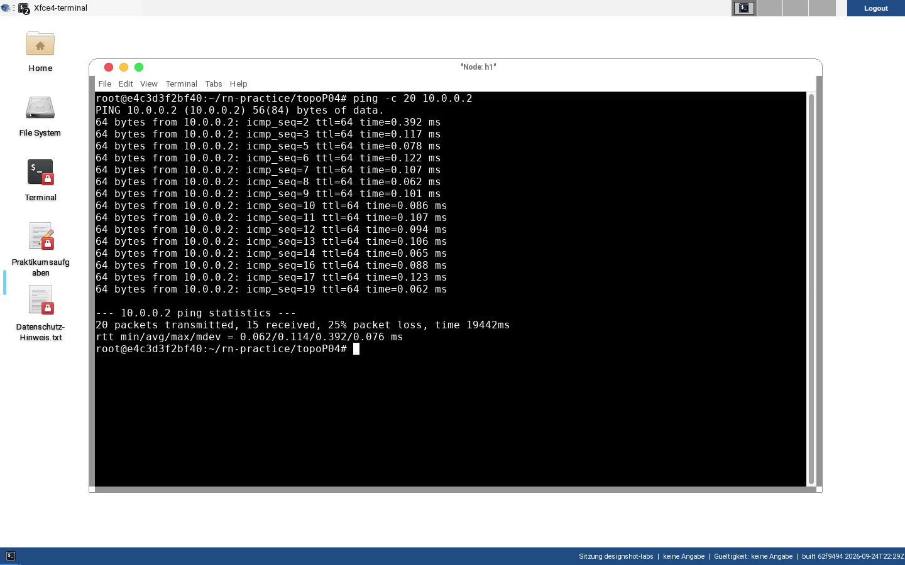
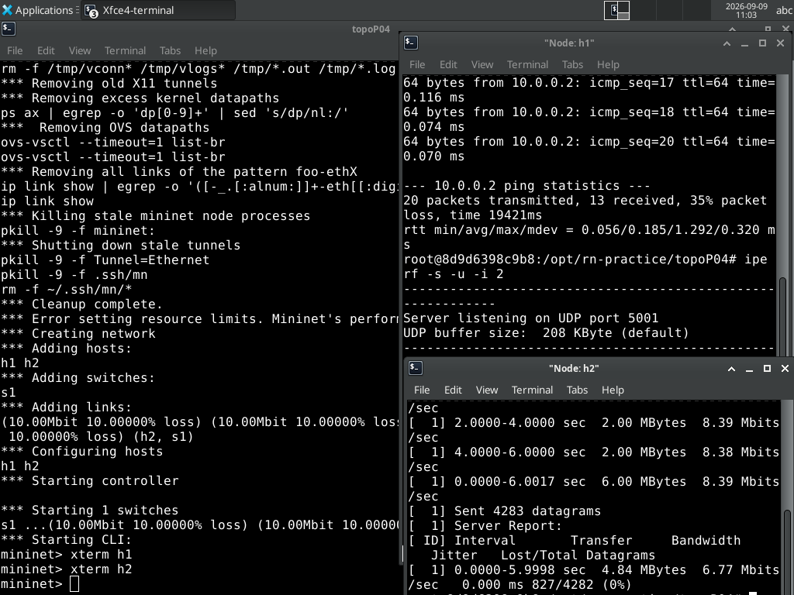

# 04 · TCP/UDP & Congestion Control

[:material-file-pdf-box: Als PDF herunterladen](../../pdf/04-tcp-udp-congestion.pdf){ .md-button }

## Lernziele

- Verstehen, wie sich eine Link-Fehlerrate (zufälliger Paketverlust) auf Ping,
  UDP und TCP unterschiedlich auswirkt.
- Den Zusammenhang zwischen MTU-Begrenzung, IP-Fragmentation und
  UDP-Paketverlust nachvollziehen können — inklusive der Gründe, warum
  moderne Netze IP-Fragmentation heute eher vermeiden.
- Durchsatz, Latenz und das Zusammenspiel von Pufferung und
  Verbindungskonkurrenz mit `iperf`/`iperf3` praktisch messen und die
  gemessenen Werte gegen vorher gebildete Erwartungswerte prüfen.
- Beobachten, wie eine TCP-Verbindung (roher `iperf`-Strom wie auch eine
  SSH-Sitzung) auf eine kurzzeitige Unterbrechung des Pfads reagiert – im
  Unterschied zu einer laufenden `ping`-Messung.
- Grundverständnis von TCP Congestion Control (Reno vs. Cubic) durch
  praktische `iperf3`-Messungen mit `-C reno`/`-C cubic` und Abgleich der
  verfügbaren Algorithmen über `sysctl` gewinnen.
- Eine eingestellte Netzeigenschaft (Bandbreite, Verzögerung) gegen den
  gemessenen Wert halten, die Abweichung in Prozent angeben und sie benennen
  können – statt einer Konfigurationsangabe zu glauben.

## Aufgaben

### Teil A — Fehlerrate, MTU und IP-Fragmentation

*(Quelle: `Labor-04-TCP-UDP.tex`, vollständig erhalten — dies ist die
fachlich verlässliche Basis dieses Aufgabenblatts.)*

Starten Sie Ihr Setup durch Wechsel in das Aufgabenverzeichnis und Aufruf des
Start-Skripts:

```bash
cd ~/rn-practice/topoP04
./start-topoP04.sh
```

!!! note "Korrektur gegenüber dem Originaldokument"
    Das Originaldokument verweist mit `cd ~/rn-practical/topoP04` auf ein
    nicht existierendes Verzeichnis `rn-practical`. Der tatsächliche, in
    diesem Repository vorhandene Pfad ist `~/rn-practice/topoP04` (mit *c*
    statt *ic*, siehe `docs/reference/rn-practice-setup.md` und die gleiche
    Korrektur in [Lab 02](02-subnetting-arp.md)).

Die Topologie besteht aus zwei Hosts und einem Switch. Die Verbindung ist auf
eine Bandbreite von 10 Mbit/s, eine MTU von 500 Byte und eine Fehlerrate von
10 % begrenzt.

#### Herausforderung der Fehlerrate

Die Fehlerrate von 10 % auf der Verbindung führt zu zufälligen
Paketverlusten. Beobachten Sie dies mit einem fortlaufenden Ping zwischen den
Hosts:

```bash
h1$ ping -c 20 10.0.0.2
h1$ ping -c 20 -D 10.0.0.2
```

Einige der Ping-Anfragen werden fehlschlagen — das spiegelt die Fehlerrate
der Verbindung wider. Die zusätzlichen Flags erleichtern es, Verluste zu
erkennen. Dieser Verlust wird durch den fehlerbehafteten Link ausgelöst und
muss von TCP durch Retransmission ausgeglichen werden.

**Aufgabe:** Versuchen Sie zu erklären, warum `ping` Ihnen häufig eine
Verlustrate *über* 10 % meldet, obwohl der Link nominell nur 10 % Fehlerrate
hat. (Hinweis: Ein ICMP-Echo besteht aus zwei Richtungen — Request *und*
Reply müssen den fehlerbehafteten Link jeweils unabhängig überstehen.)


*Realer Mitschnitt gegen die absichtlich verlustbehaftete `topoP04`-Verbindung
(10 % Fehlerrate je Richtung): 35 % Gesamtverlust bei Hin- und Rückweg
zusammen liegt sehr nahe am rechnerisch erwarteten Wert
`1 - 0.9⁴ ≈ 34,4 %` für zwei unabhängig verlustbehaftete Teilstrecken
(Request und Reply je einmal über den Link) – ein direkter, messbarer Beleg
für die Aufgabenstellung oben.*

#### Fehlerrate bei UDP und TCP

Untersuchen Sie den Einfluss der Fehlerrate auf UDP und TCP. Wir senden auf
dem 10-MBit/s-Link:

Einmal für UDP:

```bash
h1$ iperf -i 10 -s -u
h2$ iperf -t 300 -i 10 -c 10.0.0.1 -u -b 20M
```


*Realer `iperf`-UDP-Test über denselben verlustbehafteten Link (verkürzt auf
6 statt 300 Sekunden für die Demonstration): der Client sendet mit
konstanter Rate (~8,4 Mbit/s), doch der Server-Report zeigt 827 von 4282
Datagrammen verloren – UDP bemerkt den Verlust nicht selbst und kompensiert
ihn nicht, im Gegensatz zu TCP.*

Einmal für TCP:

```bash
h1$ iperf -i 10 -s
h2$ iperf -t 300 -i 10 -c 10.0.0.1
```

**Aufgabe:** Passen diese Messwerte zu Ihren Erwartungen? Erklären Sie die
Daten. Wie schätzen Sie eine Paketfehlerrate von 10 % auf dem Link bezüglich
der Performance von TCP im Vergleich zu UDP ein?

#### Zu große MTU bei UDP

Da die MTU auf 500 Byte begrenzt ist, werden Pakete, die größer als diese
Grenze sind, in IP-Fragmente aufgeteilt (oder verworfen, falls die
Fragmentierung nicht gelingt). Beobachten Sie dies, indem Sie größere
UDP-Nachrichten senden. Damit der Text nicht selbst eingetippt werden muss,
kann eine vorbereitete Textdatei genutzt werden.

Einmal mit einem kürzeren Text:

```bash
h1$ nc -lu 5000
h2$ nc -u 10.0.0.1 5000 < MehrAls500ByteText.txt
```

Einmal mit einem längeren Text:

```bash
h1$ nc -lu 5000
h2$ nc -u 10.0.0.1 5000 < MehrAls1500ByteText.txt
```

Beobachten Sie auf beiden Systemen bei beiden Nachrichten den Verkehr mit
Wireshark. IP-Fragmentation tritt bei UDP auf, sobald Pakete größer als die
MTU sind und in kleinere Segmente aufgeteilt werden müssen; ob diese
transportiert werden, hängt vom Netzwerk ab.

**Hintergrund:** IP-Fragmentierung wird in modernen Netzwerken aus mehreren
Gründen oft vermieden oder deaktiviert:

- **Leistungsprobleme:** Fragmentierung und Reassemblierung erfordern
  zusätzliche Verarbeitung durch Router und Endgeräte und können die
  Netzwerkleistung beeinträchtigen.
- **Sicherheitsbedenken:** Fragmentierte Pakete können missbraucht werden, um
  Firewalls und Intrusion-Detection-Systeme zu umgehen oder zu überlasten.
- **Komplexität:** Die Handhabung fragmentierter Pakete erhöht die
  Komplexität von Netzwerkgeräten und -protokollen; Implementierungs- oder
  Konfigurationsfehler können zu verlorenen oder unvollständigen Paketen
  führen.
- **Unzuverlässigkeit:** Geht ein Fragment verloren, muss das gesamte
  ursprüngliche Paket erneut gesendet werden — selbst wenn andere Fragmente
  bereits erfolgreich übertragen wurden.
- **Path MTU Discovery:** Statt Fragmentierung zuzulassen, ermitteln viele
  Netzwerke heute per Path MTU Discovery die maximale Übertragungseinheit
  entlang des Pfades, sodass Endgeräte von vornherein passend große Pakete
  senden.
- **IPv6:** Bei IPv6 ist Fragmentierung durch Zwischenrouter nicht mehr
  erlaubt — Endgeräte sind selbst dafür verantwortlich, Pakete in
  akzeptabler Größe zu senden.
- **Quality of Service:** Fragmentierte Pakete können die QoS beeinträchtigen,
  da Reihenfolge und Vollständigkeit nicht garantiert sind.

Die Vermeidung von IP-Fragmentierung führt zu einem einfacheren, sichereren
und effizienteren Netzwerkbetrieb — erfordert im Gegenzug aber, dass
Endgeräte und Anwendungen sorgfältig konfiguriert werden, um Pakete
innerhalb der Pfad-MTU zu senden.

**Aufgabe:** Wiederholen Sie das gesamte Experiment mit TCP. Sie werden
feststellen, dass die Bytestream-basierte Übertragung dieses Verhalten so
nicht zeigt — TCP segmentiert selbst passend zur MSS, statt ein
übergroßes Paket abzusetzen.

!!! tip "Fortschritt festhalten (optional)"
    Diesen Teil geschafft? Optional fuer die Admin-Uebersicht vermerken
    (rein lokal, keine Netzwerkverbindung):

    ```bash
    ~/rn-practice/mark-done.sh 04 teila
    ```


### Teil B — iperf/iperf3 in `topo02`: Durchsatz, Latenz, Fairness und Congestion Control

*(Quelle: `mininet-labs/intro/02-TCP-IP-Suite.tex`, "Lab 2: TCP/IP Suite –
Ein Start" — bei einer früheren Konsolidierung war der Kopiervorgang dieser
Datei aus Google Drive fehlgeschlagen, sie lag nur als technischer
TODO-Hinweis vor; der vollständige Originalinhalt wurde für dieses
Aufgabenblatt erneut aus der Quelle geladen und ist jetzt hier korrekt
wiedergegeben, statt wie zuvor durch eine Neuentwicklung ersetzt zu sein.)*

!!! note "topo02, nicht topo01"
    Anders als eine frühere Fassung dieses Abschnitts annahm, nutzt das
    Original für Durchsatz-/Latenzmessungen **`topo02`** (dieselbe
    Vier-Host-Topologie `h0--s1--r1---r2----s2---h3`, die auch in
    [Lab 05](05-arp-spoofing-dos.md) für ARP-Spoofing verwendet wird), nicht
    `topo01`. Startet sie mit:

    ```bash
    cd ~/rn-practice/topo02
    ./start-topo02.sh
    ```

1. **Erwartungswert bilden, dann Durchsatz messen.** Die Verbindung erlaubt
    nominell 10 Mbit/s. Überschlagt vorab, wie viele Daten sich in 5 Minuten
    übertragen lassen sollten. Startet dann auf `h2` einen Iperf-TCP-Server
    und auf `h0` den zugehörigen Client:

    ```bash
    h2$ iperf -i 10 -s
    h0$ iperf -t 300 -i 10 -c 10.0.20.10
    ```

    Vergleicht das Messergebnis mit eurem Erwartungswert. Wiederholt die
    Messung mit einer auf 536 Byte reduzierten maximalen Segmentgröße:

    ```bash
    h0$ iperf -M 536 -l 1 -t 300 -i 10 -c 10.0.20.10
    ```

    Bildet vorher eine These, wie sich die kleinere Segmentgröße auf den
    Durchsatz auswirken sollte, und gleicht sie mit dem Ergebnis ab.

2. **Latenz und der Effekt einer konkurrierenden Übertragung.** Startet auf
    `h1` einen fortlaufenden `ping` zu `h3` (und optional umgekehrt):

    ```bash
    h1$ ping 10.0.20.11
    h3$ ping 10.0.10.11
    ```

    Beurteilt anhand der gemessenen Round-Trip-Time, ob eine Telefonkonferenz
    über diese Verbindung praktikabel wäre (Richtwert: unter 150–200 ms).
    Bildet dann eine Annahme, wie stark sich die Latenz verändert, wenn `h0`
    gleichzeitig einen `iperf`-Strom zu `h2` startet (Stichwort: Pufferung
    auf gemeinsam genutzten Verbindungen):

    ```bash
    h0$ iperf -t 300 -i 10 -c 10.0.20.10
    ```

    Prüft eure Annahme anhand der laufenden `ping`-Ausgabe auf `h1`/`h3`.

3. **TCP vs. UDP im direkten Vergleich.** Lasst die TCP-Server-Instanz auf
    `h2` weiterlaufen und startet zusätzlich auf `h3` einen UDP-Server:

    ```bash
    h3$ iperf -u -i 10 -s
    ```

    Sendet von `h0` UDP-Verkehr mit steigender Rate zu `h3`, während `h1`
    weiterhin `h3` anpingt, und beobachtet jeweils Durchsatz auf `h3` sowie
    Latenz auf `h1`:

    ```bash
    h0$ iperf -u -b 8.6M -t 300 -i 10 -c 10.0.20.11
    h0$ iperf -u -b 9.8M -t 300 -i 10 -c 10.0.20.11
    h0$ iperf -u -b 100M -t 300 -i 10 -c 10.0.20.11
    ```

    Bei `-b 100M` überschreitet ihr die nominelle Link-Kapazität von 10
    Mbit/s deutlich – beobachtet insbesondere die Client- und
    Server-Ausgabe von `iperf` (Sendevolumen vs. tatsächlich beim Empfänger
    angekommenes Volumen). Vereinzelte "Out of Order"-Pakete bei UDP sind
    dabei normal und kein Fehler.

4. **Pfadunterbrechung während einer laufenden TCP-Übertragung.** Startet
    erneut eine TCP-Messung `h0` → `h2` und beobachtet parallel `h1$ ping
    10.0.20.10`. Deaktiviert dann für 20–30 Sekunden das Interface des
    Routers `r1` in Richtung `h2` und aktiviert es danach wieder:

    ```bash
    r1$ ifconfig r1-eth0 down
    # 20-30 Sekunden warten, Client-/Server-/Ping-Ausgabe beobachten
    r1$ ifconfig r1-eth0 up
    ```

    Haltet fest, wie sich Iperf-Client (`h0`), Iperf-Server (`h2`) und der
    `ping` auf `h1` jeweils während der Unterbrechung und nach der
    Wiederherstellung verhalten.

5. **Dieselbe Unterbrechung mit einer Anwendung (SSH) statt einem rohen
    Iperf-Strom.** Startet auf `h2` den SSH-Server und verbindet euch von
    `h0` aus:

    ```bash
    h2$ /usr/sbin/sshd -D -f sshd.conf
    h0$ ssh mininet@10.0.20.10
    h0$ /sbin/ifconfig   # zur Bestätigung: Interfaces mit "h2-" sichtbar?
    ```

    Bildet eine Erwartung, wie sich die SSH-Sitzung bei derselben
    Pfadunterbrechung verhalten sollte, unterbrecht dann erneut `r1-eth0` wie
    in Schritt 4, wiederholt `/sbin/ifconfig` auf `h0` und stellt den Pfad
    danach wieder her. Beendet die Sitzung anschließend mit `exit`.

6. **Fairness zwischen zwei gleichzeitigen Verbindungen.** Startet
    Iperf-TCP-Server auf `h2` und `h3` (`&` damit ihr das Terminal
    weiterverwenden könnt):

    ```bash
    h2$ iperf -i 10 -s
    h3$ iperf -i 10 -s &
    ```

    Startet zunächst nur `h0` → `h2`, wartet bis sich der Durchsatz
    stabilisiert hat, und startet dann zusätzlich `h1` → `h3`:

    ```bash
    h0$ iperf -t 300 -i 10 -c 10.0.20.10
    h1$ iperf -t 300 -i 10 -c 10.0.20.11
    ```

    Wiederholt den Versuch mit einem TCP-Strom (`h0` → `h2`) neben einem
    *unlimitierten* UDP-Strom mit 100 Mbit/s (`h1` → `h3`, ohne dass dafür
    ein eigener UDP-Server läuft):

    ```bash
    h0$ iperf -t 300 -i 10 -c 10.0.20.10
    h1$ iperf -u -b 100M -t 300 -i 10 -c 10.0.20.11
    ```

    Vergleicht, wie fair sich TCP gegenüber einem konkurrierenden TCP-Strom
    verhält – und wie es sich gegenüber einem unkooperativen UDP-Strom
    verhält, der keine Rücksicht auf Überlast nimmt.

7. **Reno vs. Cubic mit iperf3.** Prüft zunächst, welche
    Congestion-Control-Algorithmen der Kernel anbietet:

    ```bash
    h0$ sysctl -A | grep tcp | grep congestion
    ```

    Startet auf `h3` einen Iperf3-Server und vergleicht zwei gleichzeitige
    Iperf3-Client-Verbindungen mit unterschiedlicher Congestion Control –
    einmal mit der System-Standardeinstellung (typischerweise Cubic) von
    `h0` zu `h2`, einmal explizit mit Reno von `h1` zu `h3`:

    ```bash
    h3$ iperf3 -i 10 -s
    h0$ iperf -t 300 -i 10 -c 10.0.20.10
    h1$ iperf3 -C reno -t 300 -i 10 -c 10.0.20.11
    ```

    Beobachtet den Durchsatzverlauf über die gesamte Laufzeit. Führt danach
    zum Vergleich dieselbe Messung mit `-C cubic` statt `-C reno` durch.

**Aufgabe:** Fasst zusammen, wie TCP auf Konkurrenz durch einen weiteren
TCP-Strom reagiert (Fairness) und wie es sich gegenüber einem unlimitierten
UDP-Strom verhält, der selbst keine Überlastkontrolle betreibt – und welche
Konsequenz das für Anwendungen hat, die UDP direkt nutzen (z. B. eigene
Verlustbehandlung, Rate-Limiting auf Anwendungsebene).

!!! tip "Fortschritt festhalten (optional)"
    Diesen Teil geschafft? Optional fuer die Admin-Uebersicht vermerken
    (rein lokal, keine Netzwerkverbindung):

    ```bash
    ~/rn-practice/mark-done.sh 04 teilb
    ```

!!! example "Vertiefung (optional): TCP-Retransmission-Timeout und Backoff selbst vermessen"
    Schritt 4 hat gezeigt, dass eine laufende TCP-Übertragung eine
    Pfadunterbrechung übersteht. Schaut euch mit einem echten Mitschnitt
    genauer an, *wie* TCP das tut: Startet auf `h0` `sudo tcpdump -i
    h0-eth0 -w /tmp/rto.pcap`, dazu eine TCP-Übertragung `h0` → `h2` wie in
    Schritt 1, und deaktiviert währenddessen erneut `r1-eth0` für etwa eine
    Minute. Öffnet den Mitschnitt anschließend in Wireshark und filtert auf
    `tcp.analysis.retransmission`. Vergleicht die Zeitabstände zwischen
    aufeinanderfolgenden Retransmissionen desselben Segments – sie sollten
    sich näherungsweise verdoppeln (exponentieller Backoff des
    Retransmission-Timeout). Im Lehrbuch ist das eine Behauptung; hier ist
    es eine Zeitstempel-Spalte in eurem eigenen Mitschnitt.


### Teil C — Das TCP Congestion Window unter Paketverlust live beobachten (`topoP04`)

Teil A hat gezeigt, dass der verlustbehaftete Link aus `topoP04` (10 %
Fehlerrate, 10 Mbit/s, MTU 500 Byte) TCP zu Retransmissions zwingt. In
diesem Teil macht ihr sichtbar, *wie* TCP auf diesen Verlust reagiert:
Linux erlaubt euch, das aktuelle Congestion Window (`cwnd`) einer laufenden
Verbindung direkt beim Kernel zu erfragen – kein Wireshark, kein
Zusatz-Tool nötig.

Startet die Topologie, falls nicht mehr aktiv:

```bash
cd ~/rn-practice/topoP04
./start-topoP04.sh
```

Startet auf `h1` einen Iperf-Server und auf `h2` einen ausreichend langen
Client-Transfer:

```bash
h1$ iperf -s
h2$ iperf -t 20 -i 2 -c 10.0.0.1
```

Öffnet dafür parallel ein zweites Terminal auf `h2` und beobachtet, während
der Transfer läuft, wiederholt das Congestion Window der Verbindung:

```bash
h2$ watch -n 1 "ss -ti dst 10.0.0.1"
```

In der Ausgabe von `ss -ti` interessiert euch vor allem das Feld `cwnd:`
(Congestion Window in MSS-Einheiten) sowie – sofern angezeigt – `rto:`
(aktueller Retransmission-Timeout).

**Aufgabe:** Notiert den `cwnd`-Wert alle paar Sekunden mit, vom Start der
Übertragung bis zu ihrem Ende. Vergleicht den Verlauf mit den
Intervall-Durchsatzwerten, die `iperf` auf `h2` selbst ausgibt (die Spalte
`Bandwidth` je Zwei-Sekunden-Intervall). Erklärt den Zusammenhang: Was
passiert mit `cwnd`, sobald der erste Paketverlust auftritt, und warum
bricht der gemessene Durchsatz danach so stark ein?

!!! success "Real geprüft"
    Auf einem frisch gestarteten Container startete `cwnd` bei **40**
    (Slow-Start-Anfangswert) und brach bereits in der zweiten Sekunde auf
    **1–2** ein, sobald der erste durch die 10-%-Fehlerrate verlorene
    Bestätigungs- oder Datenverlust erkannt wurde – und blieb für den Rest
    der 20-Sekunden-Übertragung durchgehend in diesem Bereich (Werte
    zwischen 1 und 5), statt sich wie im verlustfreien Fall wieder
    aufzubauen. Parallel dazu brach der von `iperf` gemeldete
    Intervall-Durchsatz von anfänglich 3,93 Mbit/s (erstes 2-Sekunden-
    Intervall, noch mit großem `cwnd`) auf 250–520 Kbit/s ein, mit
    mehreren Intervallen bei exakt 0 Bit/s – eine sehr konkrete,
    messtechnisch direkt nachvollziehbare Bestätigung dafür, dass TCP
    zufälligen Linkverlust fälschlich als Netzüberlastung interpretiert
    und sein Sendefenster dauerhaft klein hält, obwohl der Link selbst gar
    nicht überlastet, sondern lediglich fehlerbehaftet ist.

**Vergleich:** Wiederholt die Messung auf einer Verbindung *ohne* die 10-%-
Fehlerrate – am einfachsten mit derselben `iperf`-Messung aus Teil B auf
`topo02` (Link ohne künstlichen Verlust). Vergleicht dort den `cwnd`-Verlauf
über die Zeit: Wächst das Fenster dort stetig, statt bei sehr kleinen
Werten hängen zu bleiben?

!!! tip "Fortschritt festhalten (optional)"
    Diesen Teil geschafft? Optional fuer die Admin-Uebersicht vermerken
    (rein lokal, keine Netzwerkverbindung):

    ```bash
    ~/rn-practice/mark-done.sh 04 teilc
    ```


### Teil D — Störungen selbst erzeugen: Verzögerung, Verlust und Bandbreite mit `tc` (`topo02`)

In Teil A war die Fehlerrate vorgegeben, in Teil C habt ihr gesehen, wie TCP
darauf reagiert. In beiden Fällen hat jemand anderes die Störung eingebaut.
Jetzt übernehmt ihr das selbst — und das ändert die Perspektive: Wer eine
Störung erzeugen kann, kann eine gemessene Auffälligkeit auch einer Ursache
zuordnen.

`tc` (traffic control) ist das Bordmittel des Linux-Kernels für die Steuerung
des ausgehenden Verkehrs. Es hängt an eine Schnittstelle eine sogenannte
**qdisc** (queueing discipline), also eine Warteschlangenregel, die entscheidet,
wann und ob ein Paket überhaupt losgeschickt wird. Die für uns interessante
Regel heißt `netem` — der *Netzwerk-Emulator*. Mit ihr lassen sich Verzögerung,
Paketverlust, Umsortierung und eine künstliche Bandbreitengrenze nachbilden,
ohne dass am Netz selbst etwas geändert wird.

```bash
tc qdisc add dev <schnittstelle> root netem delay 100ms   # Verzögerung anlegen
tc qdisc show dev <schnittstelle>                         # anzeigen, was aktiv ist
tc qdisc del dev <schnittstelle> root                     # wieder entfernen
man tc-netem                                              # alle Möglichkeiten
```

!!! warning "Nur in eurer eigenen Topologie, und hinterher aufräumen"
    `tc` verändert das Verhalten einer Schnittstelle sofort und dauerhaft, bis
    die Regel entfernt wird. Wendet es **ausschließlich** auf Schnittstellen
    innerhalb eurer Mininet-Topologie an (`h0-eth0`, `r1-eth1` und so weiter),
    niemals auf `eth0` des Containers — sonst schneidet ihr euch von eurem
    eigenen Desktop ab. Entfernt jede Regel am Ende wieder mit
    `tc qdisc del dev <schnittstelle> root`.

Startet die Topologie aus Teil B:

```bash
cd ~/rn-practice/topo02
./start-topo02.sh
```

Öffnet Terminals für `h0` und `h2` und stellt zuerst den ungestörten Zustand
fest — ohne Vergleichswert ist jede spätere Messung wertlos:

```bash
mininet> xterm h0
mininet> xterm h2
h0$ ping -c 10 10.0.2.2
```

**Aufgabe 1 — Verzögerung.** Legt auf `h0` eine Verzögerung von 100 ms an und
wiederholt den Ping:

```bash
h0$ tc qdisc add dev h0-eth0 root netem delay 100ms
h0$ ping -c 10 10.0.2.2
```

Notiert die Laufzeit vorher und nachher. **Warum steigt sie um etwa 100 ms und
nicht um 200, obwohl das Paket hin und zurück muss?** Begründet eure Antwort
damit, an welcher Stelle die Regel greift.

**Aufgabe 2 — Schwankung.** Ersetzt die feste Verzögerung durch eine
schwankende und beobachtet die Streuung:

```bash
h0$ tc qdisc change dev h0-eth0 root netem delay 100ms 40ms
h0$ ping -c 20 10.0.2.2
```

Vergleicht `mdev` in der Zusammenfassung von `ping` mit dem Wert aus Aufgabe 1.
Diese Schwankung heißt **Jitter** und ist der Grund, warum Sprach- und
Videoübertragung einen Puffer braucht — eine konstant hohe Laufzeit stört
weniger als eine unregelmäßige.

**Aufgabe 3 — Verlust, und was er mit TCP macht.** Entfernt die Verzögerung und
legt stattdessen 5 % Paketverlust an. Messt dann mit `iperf` wie in Teil B:

```bash
h0$ tc qdisc del dev h0-eth0 root
h0$ tc qdisc add dev h0-eth0 root netem loss 5%
h2$ iperf -s
h0$ iperf -c 10.0.2.2 -t 20
```

**Bildet vor der Messung eine Erwartung:** Um wie viel bricht der Durchsatz bei
5 % Verlust ein — um 5 %, oder um deutlich mehr? Messt, und erklärt das
Ergebnis mit dem, was ihr in Teil C über das Sendefenster gesehen habt.

**Aufgabe 4 — Bandbreite.** Entfernt die Verlustregel und begrenzt stattdessen
die Rate:

```bash
h0$ tc qdisc del dev h0-eth0 root
h0$ tc qdisc add dev h0-eth0 root tbf rate 1mbit burst 32kbit latency 400ms
h0$ iperf -c 10.0.2.2 -t 10
```

Vergleicht den gemessenen Durchsatz mit den eingestellten 1 Mbit/s. **Warum
liegt der gemessene Wert darunter und nicht exakt darauf?** Denkt an das, was
außer den Nutzdaten noch über die Leitung geht.

Räumt zum Schluss auf und prüft, dass wirklich keine Regel mehr aktiv ist:

```bash
h0$ tc qdisc del dev h0-eth0 root
h0$ tc qdisc show dev h0-eth0
```

!!! info "Hintergrund: netem ist kein Spielzeug"
    `netem` stammt aus der Kernel-Entwicklung und wird dort benutzt, um
    Protokollimplementierungen gegen Bedingungen zu testen, die im Labor sonst
    nicht vorkommen — Satellitenstrecken mit 600 ms Laufzeit, Mobilfunk mit
    schwankender Rate, Funkzellen mit Paketverlust. Dieselbe Technik steckt
    hinter den Netzwerkprofilen in den Entwicklerwerkzeugen jedes Browsers.

    Der praktische Wert für euch liegt in der Umkehrung: Wer eine Störung
    gezielt erzeugen kann, erkennt sie später auch wieder. Eine Anwendung, die
    „manchmal hängt", verhält sich unter 200 ms Verzögerung anders als unter
    2 % Verlust — und wer beides einmal selbst hergestellt hat, unterscheidet
    die Fälle am Symptom, statt zu raten.

!!! question "Zum Weiterdenken: warum trifft Verlust TCP härter als UDP?"
    In Aufgabe 3 habt ihr TCP unter Verlust gemessen. Überlegt, wie dieselbe
    Messung mit `iperf -u` (UDP) ausgehen würde, und begründet es mit dem
    Unterschied zwischen einem Protokoll, das verlorene Pakete erneut sendet
    und sein Tempo drosselt, und einem, das beides nicht tut. Wer mag, misst
    es nach — die UDP-Variante steht in Teil A.

!!! tip "Fortschritt festhalten (optional)"
    Diesen Teil geschafft? Optional fuer die Admin-Uebersicht vermerken
    (rein lokal, keine Netzwerkverbindung):

    ```bash
    ~/rn-practice/mark-done.sh 04 teild
    ```


### Teil E — Soll gegen Ist: was die Emulation wirklich liefert (`topo02`)

In Teil D habt ihr gelernt, eine Störung mit `tc` **herzustellen**. Jetzt geht
es um die Gegenrichtung: Ihr **prüft eine Angabe nach**. In `topo02` steht eine
Bandbreite und eine Verzögerung im Topologie-Skript – aber eine Zahl in einer
Konfigurationsdatei ist eine Absicht, keine Messung. Wer beides verwechselt,
sucht später stundenlang einen Fehler an der falschen Stelle.

Das ist die vielleicht wichtigste Gewohnheit dieses ganzen Praktikums: **die
Prämisse prüfen, bevor man dem Messwert traut.** Ein „der Link hat 10 Mbit/s"
ist so lange eine Behauptung, bis jemand 10 Mbit/s gemessen hat.

#### Schritt 1 – Das Soll aus dem Skript lesen, nicht aus dem Blatt

Sucht die Stelle in `~/rn-practice/topo02/topo02.py`, an der die Verbindung
zwischen den beiden Routern angelegt wird:

```bash
$ grep -n "TCLink" ~/rn-practice/topo02/topo02.py
```

Ihr findet dort genau **eine** Verbindung mit einer Begrenzung — die zwischen
`r1` und `r2`, mit `bw=10` und `delay='0.1ms'`. Alle anderen Verbindungen der
Topologie sind unbegrenzt.

**Haltet fest, bevor ihr weiterliest:** Wenn nur *ein* Abschnitt des Weges
begrenzt ist, welcher Wert bestimmt dann den Durchsatz von `h0` nach `h2`?
Und was folgt daraus für die Frage, wo man in einem echten Netz messen muss,
um eine Zusicherung zu überprüfen?

Kontrolliert das Soll anschließend dort, wo es tatsächlich wirkt – im Kernel
des Routers:

```bash
cd ~/rn-practice/topo02
./start-topo02.sh
mininet> xterm r1
r1$ tc qdisc show dev r1-eth2
r1$ tc class show dev r1-eth2
```

Die `class`-Zeile nennt `rate 10Mbit ceil 10Mbit`, die `qdisc`-Zeile
`delay 100us`. Damit habt ihr das Soll nicht aus einem Aufgabenblatt
übernommen, sondern am Gerät gelesen – genau das, was in einer echten
Störungsmeldung als Erstes zu tun ist.

#### Schritt 2 – Drei Konfigurationen messen

Für jede der drei Konfigurationen messt ihr **zwei** Größen: die Laufzeit mit
`ping` und den Durchsatz mit `iperf3`. Öffnet Terminals für `h0` und `h2`:

```bash
mininet> xterm h0
mininet> xterm h2
h2$ iperf3 -s
```

Das Messpaar, das ihr dreimal wiederholt:

```bash
h0$ ping -c 10 10.0.20.10
h0$ iperf3 -c 10.0.20.10 -t 8 -f m
```

**Konfiguration 1** ist die unveränderte Topologie – Soll 10 Mbit/s und
0,1 ms. Messt sie zuerst, sie ist euer Bezugspunkt.

**Konfiguration 2 und 3** legt ihr selbst an. Anders als in Teil D nutzt ihr
dabei eine einzige `netem`-Regel für beide Eigenschaften gleichzeitig:

```bash
h0$ tc qdisc add dev h0-eth0 root netem rate 2mbit delay 10ms
h0$ tc qdisc show dev h0-eth0
```

…messen, dann die Regel austauschen:

```bash
h0$ tc qdisc del dev h0-eth0 root
h0$ tc qdisc add dev h0-eth0 root netem rate 5mbit delay 50ms
```

!!! note "Warum die Regel auf `h0-eth0` gehört und nicht auf `r1-eth2`"
    `h0-eth0` trägt im Ausgangszustand `qdisc noqueue` – dort ist also nichts,
    was eure Regel verdrängen könnte. Auf `r1-eth2` sitzt dagegen bereits die
    `htb`-Regel, mit der Mininet die 10 Mbit/s durchsetzt. Ein
    `tc qdisc add … root` auf dieser Schnittstelle würde sie **ersetzen** und
    damit genau das Soll zerstören, das ihr gerade nachprüfen wollt. Eine
    eigene Messung so anzulegen, dass sie den Messgegenstand nicht verändert,
    ist der halbe Beruf.

Räumt am Ende auf, wie in Teil D gelernt:

```bash
h0$ tc qdisc del dev h0-eth0 root
h0$ tc qdisc show dev h0-eth0
```

#### Schritt 3 – Die Abweichung ausrechnen und begründen

Legt eure Messwerte in einer Tabelle ab und **rechnet die Abweichung in Prozent
selbst aus**, für jede Konfiguration:

```text
Abweichung in Prozent = (Ist - Soll) / Soll * 100
```

| Konfiguration | Soll Rate | Ist Rate | Abw. % | Soll RTT | Ist RTT | Abw. % |
|---|---|---|---|---|---|---|
| 1 – unverändert | 10 Mbit/s | ? | ? | ? | ? | ? |
| 2 – `rate 2mbit delay 10ms` | 2 Mbit/s | ? | ? | ? | ? | ? |
| 3 – `rate 5mbit delay 50ms` | 5 Mbit/s | ? | ? | ? | ? | ? |

Die Spalte „Soll RTT" ist bewusst leer: Ihr müsst sie selbst herleiten. Der
Hinweis steckt in Teil D, Aufgabe 1 – eine `netem`-Regel wirkt nur auf den
ausgehenden Verkehr **einer** Schnittstelle.

Sichert die fertige Tabelle als Datei, damit sie eine Messung bleibt und nicht
eine Erinnerung:

```bash
$ mkdir -p ~/rn-practice/snapshots
$ nano ~/rn-practice/snapshots/04-teile-sollist.txt
```

**Die drei Fragen, an denen sich zeigt, ob ihr die Abweichung verstanden habt:**

1. **Der Ist-Wert liegt immer unter dem Soll-Wert, nie darüber.** Begründet,
    warum das so sein *muss* und nicht Zufall ist. Denkt an alles, was außer
    euren Nutzdaten noch durch dieselbe Leitung passt: Ethernet-Rahmenkopf,
    IP-Kopf, TCP-Kopf, Bestätigungen in der Gegenrichtung.
2. **`iperf3` nennt zwei Zahlen: `sender` und `receiver`.** Sie sind nicht
    gleich. Welche der beiden ist die ehrliche Antwort auf „wie viel kam an?",
    und was misst die andere? (Wer die falsche Zeile abliest, meldet einen
    Durchsatz, den nie ein Byte erreicht hat.)
3. **Die prozentuale Abweichung ist bei kleinen Raten größer als bei großen.**
    Prüft das an euren eigenen drei Zeilen und erklärt es: Der Aufwand je Paket
    ist konstant, die Nutzlast je Paket auch – was ändert sich also?

!!! success "Real geprüft (2026-09-24)"
    Alle drei Konfigurationen wurden in einem Wegwerfcontainer gegen ein real
    gestartetes `topo02` gemessen, `iperf3` von `h0` nach `h2` über je
    8 Sekunden, `ping` mit 10 Paketen:

    | Konfiguration | Soll Rate | Ist (`receiver`) | Abw. | Ist (`sender`) | Ist RTT (min/avg) |
    |---|---|---|---|---|---|
    | 1 – unverändert | 10 Mbit/s | **9,52 Mbit/s** | −4,8 % | 13,6 Mbit/s | 0,344 / 0,606 ms |
    | 2 – `rate 2mbit delay 10ms` | 2 Mbit/s | **1,85 Mbit/s** | −7,5 % | 3,15 Mbit/s | 10,741 / 10,805 ms |
    | 3 – `rate 5mbit delay 50ms` | 5 Mbit/s | **4,62 Mbit/s** | −7,6 % | 6,42 Mbit/s | 50,523 / 50,563 ms |

    Ebenfalls bestätigt: `tc class show dev r1-eth2` liefert
    `rate 10Mbit ceil 10Mbit`, `tc qdisc show dev r1-eth2` liefert
    `delay 100us` – das Soll aus `topo02.py` wirkt also tatsächlich. Auf
    `h0-eth0` stand vor dem ersten Eingriff `qdisc noqueue`, danach die eigene
    `netem`-Regel, und nach dem Aufräumen wieder `noqueue`. Die gemessene RTT
    entspricht in allen drei Fällen der **einfachen** eingestellten
    Verzögerung (10 ms → 10,7 ms; 50 ms → 50,5 ms), nicht der doppelten.

    Die auffälligste Zahl ist die Lücke zwischen `sender` und `receiver` in
    Konfiguration 1: **13,6 gegen 9,52 Mbit/s**. Wer hier die `sender`-Zeile
    abliest, berichtet einen Durchsatz **über** dem eingestellten Limit – ein
    unmögliches Ergebnis, das sofort verrät, dass die falsche Zeile gemessen
    wurde.

    **Nicht geprüft:** Die Topologie wurde von einem Skript ohne grafische
    Oberfläche gestartet, nicht über `./start-topo02.sh` mit den fünf
    Terminalfenstern. Der Weg über `start-topo02.sh` ist in Teil B und D
    dieses Blattes bereits verifiziert. Eure absoluten Zahlen werden von den
    obigen abweichen – die *Richtung* der Abweichung und die Lücke zwischen
    `sender` und `receiver` nicht.

!!! question "Zum Weiterdenken: was hätte euch eine Einzelmessung verschwiegen?"
    Ihr habt drei Konfigurationen gemessen, nicht eine. Überlegt, welche der
    drei Erkenntnisse oben ihr mit nur einer Messung **nicht** hättet gewinnen
    können. Das ist der Grund, warum in der Messtechnik eine Reihe gebildet
    wird und kein Einzelwert: Ein einzelner Wert lässt sich immer erklären,
    ein Verlauf nicht.

!!! tip "Fortschritt festhalten (optional)"
    Diesen Teil geschafft? Optional fuer die Admin-Uebersicht vermerken
    (rein lokal, keine Netzwerkverbindung):

    ```bash
    ~/rn-practice/mark-done.sh 04 teile
    ```


## Potenzielle Herausforderungen

- **`topoP04` (Teil A) und `topo02` (Teil B) sind seit 2026-09-09 real
  verifiziert** unter dem granularen Capability-Set
  (`NET_ADMIN`+`NET_RAW`+`SYS_ADMIN`+`apparmor:unconfined`, mit dem der
  Container ohne `--privileged` auskommt). Beide bauten vorher wegen eines
  reinen Skript-Bugs (fehlender `controller=`-Parameter bzw. ein
  nicht im Image vorhandenes Controller-Binary) gar nicht — nach dem Fix
  liefen die Fehlerraten-Beobachtung in Teil A sowie ein `iperf`-Durchsatztest
  in Teil B (9,6 Mbit/s auf dem nominell 10-Mbit/s-Link zwischen `h0` und
  `h2`) wie im Aufgabenblatt beschrieben.
- **Nachtrag (2026-09-09):** Der `iperf`-Test oben lief zwar bereits nach dem
  `controller=`-Fix erfolgreich, `net.pingAll()` (Mininets eingebauter
  Allpaar-Konnektivitätstest, den u. a. `h1$ ping ...`/`h3$ ping ...` in
  Aufgabe 2 sinngemäß nachstellen) zeigte in `topo02` aber weiterhin **100 %
  Verlust auf allen 30 Paaren**, obwohl einzelne, manuell abgesetzte `ping`s
  zwischen genau denselben Hosts fehlerfrei funktionierten. Ursache: `topo02.py`
  setzt IP-Adressen ausschließlich per rohem `ifconfig`
  (`r.cmd('ifconfig ...')`/`h.cmd('ifconfig ...')`) statt über Mininets eigene
  `Intf.setIP()`-API — die tatsächliche Kernel-Adresse ist dadurch korrekt,
  aber Mininets interne Buchführung (`Intf.ip`, ausgelesen von `node.IP()`)
  bleibt auf der beim Linkaufbau automatisch vergebenen `10.0.0.x`-Adresse
  stehen. `net.pingAll()`/`net.ping()` ermitteln ihr Ziel aber genau über
  `dest.IP()` und pingen dadurch bei jedem Paar die falsche, nie real
  konfigurierte Adresse an. Fix (`topo02.py`): nach jedem `ifconfig`-Aufruf
  wird die betroffene Schnittstelle per `Intf.updateIP()` neu synchronisiert.
  Auf einem frisch gestarteten, zuvor nie benutzten Container real
  nachgewiesen: `*** Results: 0% dropped (30/30 received)`, zusätzlich erneut
  der `iperf`-Durchsatztest `h0`→`h2` (9,6 Mbit/s) sowie ein `curl` von `h3`
  zum Webserver auf `h1` (HTTP 200) — alle drei im selben Lauf.
- Die in Teil A beobachtete Ping-Verlustrate kann durch die
  bidirektionale Natur von ICMP Echo/Reply höher als die nominelle
  Link-Fehlerrate ausfallen — das ist kein Environment-Fehler, sondern
  Teil der Lernaufgabe (siehe Erklärung oben).
- **Anrede uneinheitlich zwischen Teil A und Teil B:** Teil A behält die
  formelle "Sie"-Anrede des Originaldokuments (`Labor-04-TCP-UDP.tex`) bei,
  Teil B verwendet die persönliche "ihr"-Anrede wie [Lab 01](01-netzwerkgrundlagen-tools.md)
  und [Lab 05](05-arp-spoofing-dos.md), obwohl auch das zugrundeliegende
  Original (`02-TCP-IP-Suite.tex`) durchgehend "Sie" verwendet. Eine
  redaktionelle Vereinheitlichung auf einen Ton für das gesamte Aufgabenblatt
  steht noch aus.
- Schritt 6 (Fairness) setzt voraus, dass die Iperf-Server-Instanzen aus
  Schritt 1/3 noch laufen bzw. neu gestartet werden – im Original nicht
  explizit klargestellt, aus dem Kontext aber eindeutig.
- **Teil E: `netem rate` braucht keinen zweiten Regelsatz.** Ältere
  Anleitungen kombinieren `tbf` (Rate) und `netem` (Verzögerung) in einer
  Hierarchie. Der in diesem Abbild vorhandene `tc` unterstützt beides in
  *einer* `netem`-Regel (`netem rate 2mbit delay 10ms`, am 2026-09-24 real
  bestätigt) – das ist kürzer und weniger fehleranfällig.
- **Teil E: die eigene Regel niemals auf `r1-eth2`.** Dort sitzt die
  `htb`-Regel, mit der Mininet die 10 Mbit/s aus `topo02.py` durchsetzt. Ein
  `tc qdisc add … root` ersetzt sie und zerstört damit den Messgegenstand.
  Begründung und Beleg (`qdisc noqueue` auf `h0-eth0`) stehen in Teil E.

## Playwright-Screenshot-Referenz

Für die Verifikation eignet sich in `tests/e2e/specs/screenshots.spec.ts` am
ehesten ein **Zeilen-Screenshot** (`captureLine`) einer `iperf`/`iperf3`-
Zusammenfassungszeile (Durchsatzwert am Ende einer Messung) — hier geht es um
einen einzelnen, gut abgrenzbaren Messwert, kein ganzes Fenster. Ein
**Fenster-Screenshot** (`captureWindow`) passt dagegen besser für die
Wireshark-Ansicht der IP-Fragmentierung in Teil A, da dort das
Zusammenspiel mehrerer Pakete im Kontext sichtbar sein muss.

## Quellen

- `mininet-labs/vertiefung/Labor-04-TCP-UDP.tex` — vollständig erhalten,
  fachliche Basis für Teil A.
- `mininet-labs/intro/02-TCP-IP-Suite.tex` ("Lab 2: TCP/IP Suite – Ein
  Start") — fachliche Basis für Teil B. Die lokal vendorierte Kopie dieser
  Datei enthält weiterhin nur einen technischen TODO-Hinweis (fehlgeschlagener
  Google-Drive-Kopiervorgang in einer früheren Session); der oben verwendete
  Originalinhalt wurde für dieses Aufgabenblatt erneut aus Google Drive
  gelesen, aber **nicht** in die vendorierte `.tex`-Datei zurückgeschrieben
  (außerhalb des Geltungsbereichs dieser Konsolidierung, die sich auf
  `docs/labs/` und `docs/reference/` beschränkt) — siehe
  [Potenzielle Herausforderungen](#potenzielle-herausforderungen) in
  Lab 01 für die analoge Einschränkung. Ein Nachziehen dieser Korrektur in
  `mininet-labs/intro/02-TCP-IP-Suite.tex` selbst wird empfohlen.
- `mininet-labs/rn-practice/topo02/` — Referenztopologie für Teil B, Teil D
  und Teil E (`h0`–`h3`, Adressen `10.0.10.x`/`10.0.20.x`), dieselbe Topologie
  wie in [Lab 05](05-arp-spoofing-dos.md). Die Soll-Werte in Teil E
  (`bw=10`, `delay='0.1ms'`) stehen in `topo02.py` selbst.
- Olivier Bonaventure u. a.: *Computer Networking: Principles, Protocols and
  Practice*, UCLouvain (Université catholique de Louvain), Repository
  `cnp3/ebook` — Lizenz **CC BY-SA 3.0**. (Einzelne Übungskapitel tragen im
  Dateikopf CC BY 3.0; die Angaben widersprechen sich, hier wird konservativ
  von **BY-SA** ausgegangen.) Von dort stammt die **Idee** zu Teil E, eine
  zugesicherte Netzeigenschaft gegen die Messung zu halten statt ihr zu
  glauben. Es wird kein Text und keine Datei aus diesem Werk übernommen.
