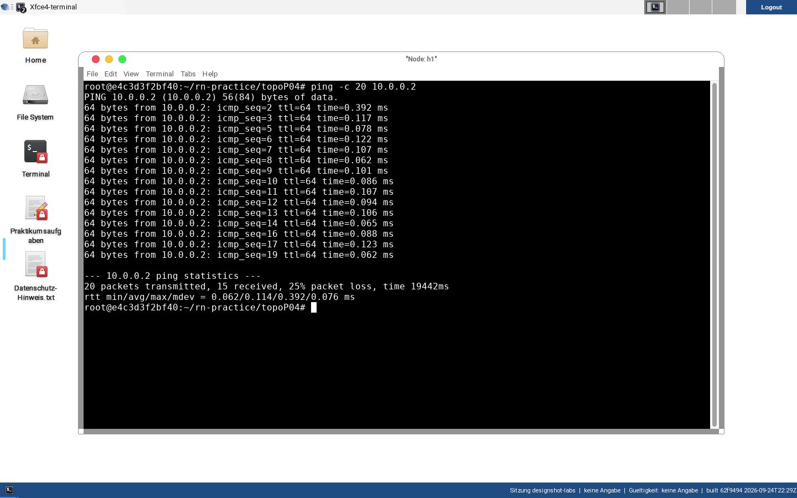
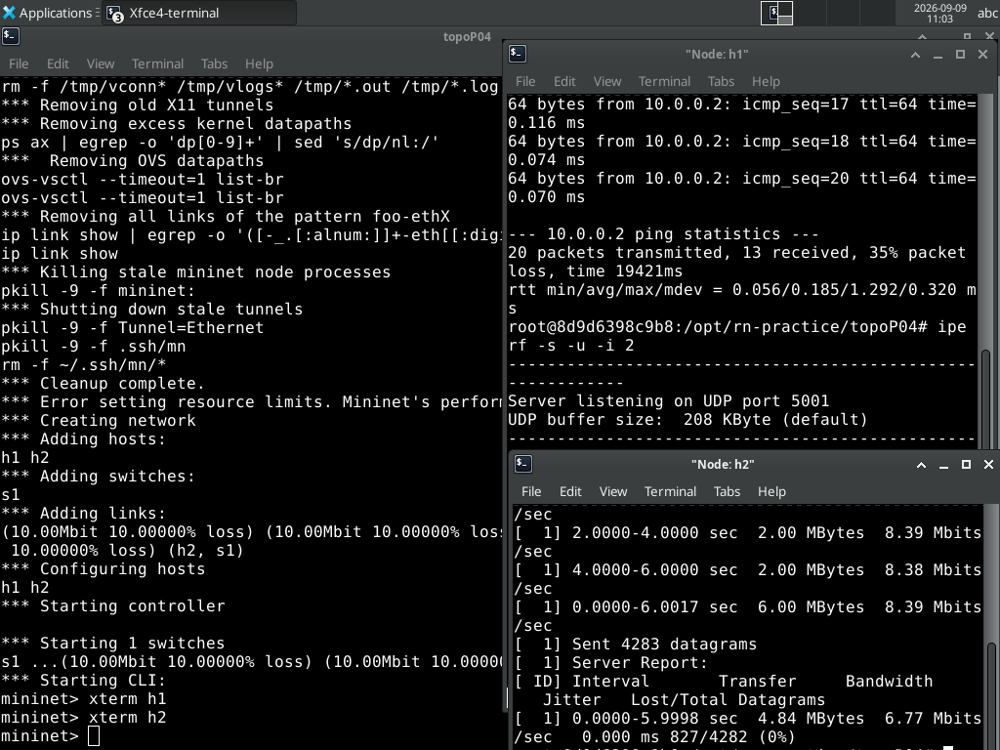

# 04 · TCP/UDP & Congestion Control

[:material-file-pdf-box: Als PDF herunterladen](../../pdf/04-tcp-udp-congestion.pdf){ .md-button }

## Lernziele

- Verstehen, wie sich eine Link-Fehlerrate (zufälliger Paketverlust) auf Ping,
  UDP und TCP unterschiedlich auswirkt.
- Den Zusammenhang zwischen MTU-Begrenzung, IP-Fragmentation und
  UDP-Paketverlust nachvollziehen können, einschließlich der Gründe, warum
  Netze IP-Fragmentation eher vermeiden.
- Durchsatz, Latenz und das Zusammenspiel von Pufferung und
  Verbindungskonkurrenz mit `iperf`/`iperf3` praktisch messen und die
  gemessenen Werte gegen vorher gebildete Erwartungswerte prüfen.
- Beobachten, wie eine TCP-Verbindung (roher `iperf`-Strom wie auch eine
  SSH-Sitzung) auf eine kurzzeitige Unterbrechung des Pfads reagiert – im
  Unterschied zu einer laufenden `ping`-Messung.
- Grundverständnis von TCP Congestion Control (Reno vs. Cubic) durch
  praktische `iperf3`-Messungen mit `-C reno`/`-C cubic` und Abgleich der
  verfügbaren Algorithmen über `sysctl` gewinnen.
- Eine eingestellte Netzeigenschaft (Bandbreite, Verzögerung) gegen den
  gemessenen Wert halten, die Abweichung in Prozent angeben und sie begründen
  können.

--8<-- "issue-feedback.md"

## Aufgaben

### Teil A — Fehlerrate, MTU und IP-Fragmentation

Diesen Teil kennt ihr in Grundzügen bereits aus [Lab 02, Teil 3](02-subnetting-arp.md#teil-3-vertiefung-optional-mtu-und-fragmentierung-topop04):
Dieselbe Topologie `topoP04` mit kleiner MTU und künstlichem Paketverlust.
Dort ging es um Fragmentierung bei `ping`; hier untersucht ihr zusätzlich,
wie sich Fehlerrate und Fragmentierung auf UDP und TCP unterschiedlich
auswirken.

Startet euer Setup durch Wechsel in das Aufgabenverzeichnis und Aufruf des
Start-Skripts:

```bash
cd ~/rn-practice/topoP04
./start-topoP04.sh
```

Die Topologie besteht aus zwei Hosts und einem Switch. Die Verbindung ist auf
eine Bandbreite von 10 Mbit/s, eine MTU von 536 Byte und eine Fehlerrate von
10 % begrenzt.

#### Herausforderung der Fehlerrate

Die Fehlerrate von 10 % auf der Verbindung führt zu zufälligen
Paketverlusten. Beobachtet dies mit einem fortlaufenden Ping zwischen den
Hosts:

```bash
h1$ ping -c 20 10.0.0.2
h1$ ping -c 20 -D 10.0.0.2
```

Einige der Ping-Anfragen bleiben ohne Antwort; das spiegelt die Fehlerrate
der Verbindung wider. `-D` stellt jeder Antwort einen Zeitstempel voran, so
erkennt ihr Lücken in der Folge leichter. Denselben Verlust muss TCP später
durch Retransmission ausgleichen.

**Aufgabe:** Versucht zu erklären, warum `ping` euch häufig eine
Verlustrate *über* 10 % meldet, obwohl der Link nominell nur 10 % Fehlerrate
hat. (Hinweis: Ein ICMP-Echo besteht aus zwei Richtungen — Request *und*
Reply müssen den fehlerbehafteten Link jeweils unabhängig überstehen.)


*Ping über die verlustbehaftete `topoP04`-Verbindung: Der Gesamtverlust liegt
je nach Lauf bei etwa einem Viertel bis einem Drittel, nahe am rechnerischen
Wert `1 - 0,9⁴ ≈ 34,4 %`. Jede der beiden Host-Switch-Verbindungen verwirft in
jeder Richtung 10 %; Request und Reply queren zusammen vier solche
Teilstrecken. Euer Wert weicht ab, weil Paketverlust zufällig ist.*

#### Fehlerrate bei UDP und TCP

Untersucht den Einfluss der Fehlerrate auf UDP und TCP. Wir senden auf
dem 10-MBit/s-Link:

Einmal für UDP:

```bash
h1$ iperf -i 10 -s -u
h2$ iperf -t 300 -i 10 -c 10.0.0.1 -u -b 20M
```


*`iperf`-UDP-Test über denselben Link, auf wenige Sekunden verkürzt: Der
Client sendet mit konstanter Rate nahe der Linkkapazität, der Server-Report
weist einen erheblichen Teil der Datagramme als verloren aus. UDP bemerkt den
Verlust nicht selbst und gleicht ihn nicht aus. Die Zahlen schwanken von Lauf
zu Lauf.*

Einmal für TCP:

```bash
h1$ iperf -i 10 -s
h2$ iperf -t 300 -i 10 -c 10.0.0.1
```

**Aufgabe:** Passen diese Messwerte zu euren Erwartungen? Erklärt die
Daten. Wie schätzt ihr eine Paketfehlerrate von 10 % auf dem Link bezüglich
der Performance von TCP im Vergleich zu UDP ein?

#### Zu große MTU bei UDP

Da die MTU auf 536 Byte begrenzt ist, werden Pakete, die größer als diese
Grenze sind, in IP-Fragmente aufgeteilt (oder verworfen, falls die
Fragmentierung nicht gelingt). Beobachtet dies, indem ihr größere
UDP-Nachrichten sendet. Im Verzeichnis `topoP04` liegen dafür zwei
vorbereitete Textdateien (632 und 1638 Byte).

Einmal mit dem kürzeren Text:

```bash
h1$ nc -lu 5000
h2$ nc -u 10.0.0.1 5000 < MehrAls500ByteText.txt
```

Einmal mit dem längeren Text (beendet den ersten `nc -lu` vorher mit
Strg+C, denn `nc` nimmt nach der ersten Nachricht nur noch Daten vom selben
Absender an):

```bash
h1$ nc -lu 5000
h2$ nc -u 10.0.0.1 5000 < MehrAls1500ByteText.txt
```

Beobachtet auf beiden Systemen bei beiden Nachrichten den Verkehr mit
Wireshark. IP-Fragmentation tritt bei UDP auf, sobald Pakete größer als die
MTU sind und in kleinere Teile aufgeteilt werden müssen. Kommt ein Fragment
nicht an, verwirft der Empfänger die ganze Nachricht.

**Hintergrund:** IP-Fragmentierung wird in modernen Netzwerken aus mehreren
Gründen oft vermieden oder deaktiviert:

- **Leistungsprobleme:** Fragmentierung und Reassemblierung erfordern
  zusätzliche Verarbeitung durch Router und Endgeräte und können die
  Netzwerkleistung beeinträchtigen.
- **Sicherheitsbedenken:** Fragmentierte Pakete können missbraucht werden, um
  Firewalls und Intrusion-Detection-Systeme zu umgehen oder zu überlasten.
- **Komplexität:** Die Handhabung fragmentierter Pakete erhöht die
  Komplexität von Netzwerkgeräten und -protokollen; Implementierungs- oder
  Konfigurationsfehler können zu verlorenen oder unvollständigen Paketen
  führen.
- **Unzuverlässigkeit:** Geht ein Fragment verloren, muss das gesamte
  ursprüngliche Paket erneut gesendet werden — selbst wenn andere Fragmente
  bereits erfolgreich übertragen wurden.
- **Path MTU Discovery:** Statt Fragmentierung zuzulassen, ermitteln viele
  Netzwerke heute per Path MTU Discovery die maximale Übertragungseinheit
  entlang des Pfades, sodass Endgeräte von vornherein passend große Pakete
  senden.
- **IPv6:** Bei IPv6 ist Fragmentierung durch Zwischenrouter nicht mehr
  erlaubt — Endgeräte sind selbst dafür verantwortlich, Pakete in
  akzeptabler Größe zu senden.
- **Quality of Service:** Fragmentierte Pakete können die QoS beeinträchtigen,
  da Reihenfolge und Vollständigkeit nicht garantiert sind.

Im Gegenzug müssen Endgeräte und Anwendungen Pakete innerhalb der Pfad-MTU
senden.

**Aufgabe:** Wiederholt das gesamte Experiment mit TCP:

```bash
h1$ nc -l 5000
h2$ nc -N 10.0.0.1 5000 < MehrAls1500ByteText.txt
```

Erklärt, warum dabei keine IP-Fragmente entstehen (Stichwort: MSS).

### Teil B — iperf/iperf3 in `topo02`: Durchsatz, Latenz, Fairness und Congestion Control

In diesem Teil messt ihr Durchsatz, Latenz und Fairness auf einer
verlustfreien Strecke mit mehreren Hosts und Routern: `topo02`, dieselbe
Vier-Host-Topologie wie in [Lab 05](05-arp-spoofing-dos.md).

```text
h0 (10.0.10.10) --+                        +-- h2 (10.0.20.10)
                  s1 -- r1 ==10 Mbit/s== r2 -- s2
h1 (10.0.10.11) --+                        +-- h3 (10.0.20.11)
```

Nur die Verbindung zwischen `r1` und `r2` ist auf 10 Mbit/s begrenzt. Startet
die Topologie mit:

```bash
cd ~/rn-practice/topo02
./start-topo02.sh
```

Beim Start öffnen sich Terminals für `r1`, `h0`, `h1`, `h2` und `h3`. Ein
weiteres Terminal für einen Knoten öffnet ihr mit `mininet> xterm h0`.

1. **Erwartungswert bilden, dann Durchsatz messen.** Die Verbindung erlaubt
    nominell 10 Mbit/s. Überschlagt vorab, wie viele Daten sich in 5 Minuten
    übertragen lassen sollten. Startet dann auf `h2` einen Iperf-TCP-Server
    und auf `h0` den zugehörigen Client:

    ```bash
    h2$ iperf -i 10 -s
    h0$ iperf -t 300 -i 10 -c 10.0.20.10
    ```

    Vergleicht das Messergebnis mit eurem Erwartungswert. Wiederholt die
    Messung mit einer auf 536 Byte reduzierten maximalen Segmentgröße:

    ```bash
    h0$ iperf -M 536 -l 1 -t 300 -i 10 -c 10.0.20.10
    ```

    Bildet vorher eine These, wie sich die kleinere Segmentgröße auf den
    Durchsatz auswirken sollte, und gleicht sie mit dem Ergebnis ab.

2. **Latenz und der Effekt einer konkurrierenden Übertragung.** Startet auf
    `h1` einen fortlaufenden `ping` zu `h3` (und optional umgekehrt):

    ```bash
    h1$ ping 10.0.20.11
    h3$ ping 10.0.10.11
    ```

    Beurteilt anhand der gemessenen Round-Trip-Time, ob eine Telefonkonferenz
    über diese Verbindung praktikabel wäre (Richtwert: unter 150–200 ms).
    Bildet dann eine Annahme, wie stark sich die Latenz verändert, wenn `h0`
    gleichzeitig einen `iperf`-Strom zu `h2` startet (Stichwort: Pufferung
    auf gemeinsam genutzten Verbindungen):

    ```bash
    h0$ iperf -t 300 -i 10 -c 10.0.20.10
    ```

    Prüft eure Annahme anhand der laufenden `ping`-Ausgabe auf `h1`/`h3`.

3. **TCP vs. UDP im direkten Vergleich.** Lasst die TCP-Server-Instanz auf
    `h2` weiterlaufen und startet zusätzlich auf `h3` einen UDP-Server:

    ```bash
    h3$ iperf -u -i 10 -s
    ```

    Sendet von `h0` UDP-Verkehr mit steigender Rate zu `h3`, während `h1`
    weiterhin `h3` anpingt, und beobachtet jeweils Durchsatz auf `h3` sowie
    Latenz auf `h1`:

    ```bash
    h0$ iperf -u -b 8.6M -t 300 -i 10 -c 10.0.20.11
    h0$ iperf -u -b 9.8M -t 300 -i 10 -c 10.0.20.11
    h0$ iperf -u -b 100M -t 300 -i 10 -c 10.0.20.11
    ```

    Bei `-b 100M` überschreitet ihr die nominelle Link-Kapazität von 10
    Mbit/s deutlich – beobachtet insbesondere die Client- und
    Server-Ausgabe von `iperf` (Sendevolumen vs. tatsächlich beim Empfänger
    angekommenes Volumen). Vereinzelte "Out of Order"-Pakete bei UDP sind
    dabei normal und kein Fehler.

4. **Pfadunterbrechung während einer laufenden TCP-Übertragung.** Startet
    erneut eine TCP-Messung `h0` → `h2` und beobachtet parallel `h1$ ping
    10.0.20.10`. Deaktiviert dann für 20–30 Sekunden das Interface
    `r1-eth0` des Routers `r1` (Richtung `s1`, also zu `h0` und `h1`) und
    aktiviert es danach wieder:

    ```bash
    r1$ ifconfig r1-eth0 down
    # 20-30 Sekunden warten, Client-/Server-/Ping-Ausgabe beobachten
    r1$ ifconfig r1-eth0 up
    ```

    Haltet fest, wie sich Iperf-Client (`h0`), Iperf-Server (`h2`) und der
    `ping` auf `h1` jeweils während der Unterbrechung und nach der
    Wiederherstellung verhalten.

5. **Dieselbe Unterbrechung mit einer Anwendung (SSH) statt einem rohen
    Iperf-Strom.** Startet auf `h2` den SSH-Server:

    ```bash
    h2$ /usr/sbin/sshd -D
    ```

    Ihr meldet euch als Nutzer `cads` an, dessen Passwort ihr nicht kennt.
    Erzeugt deshalb auf `h0` ein Schlüsselpaar und tragt den öffentlichen
    Teil als vertrauenswürdig ein (alle Knoten teilen sich dasselbe
    Dateisystem, `~/.ssh` gilt also auch auf `h2`):

    ```bash
    h0$ mkdir -p ~/.ssh && chmod 700 ~/.ssh
    h0$ ssh-keygen -t ed25519 -N "" -f ~/.ssh/rn-practice-key -q
    h0$ cat ~/.ssh/rn-practice-key.pub >> ~/.ssh/authorized_keys
    h0$ chmod 600 ~/.ssh/authorized_keys
    h0$ chown -R cads ~/.ssh
    ```

    Verbindet euch dann von `h0` aus (die Rückfrage zum Host-Schlüssel mit
    `yes` beantworten) und prüft, auf welchem Knoten ihr gelandet seid:

    ```bash
    h0$ ssh -i ~/.ssh/rn-practice-key cads@10.0.20.10
    $ /sbin/ifconfig   # Interface h2-eth0 sichtbar?
    ```

    Bildet eine Erwartung, wie sich die SSH-Sitzung bei derselben
    Pfadunterbrechung verhalten sollte, unterbrecht dann erneut `r1-eth0` wie
    in Schritt 4, gebt in der SSH-Sitzung erneut `/sbin/ifconfig` ein und
    stellt den Pfad danach wieder her. Beendet die Sitzung anschließend mit
    `exit`.

6. **Fairness zwischen zwei gleichzeitigen Verbindungen.** Startet
    Iperf-TCP-Server auf `h2` und `h3` (`&` damit ihr das Terminal
    weiterverwenden könnt):

    ```bash
    h2$ iperf -i 10 -s
    h3$ iperf -i 10 -s &
    ```

    Startet zunächst nur `h0` → `h2`, wartet bis sich der Durchsatz
    stabilisiert hat, und startet dann zusätzlich `h1` → `h3`:

    ```bash
    h0$ iperf -t 300 -i 10 -c 10.0.20.10
    h1$ iperf -t 300 -i 10 -c 10.0.20.11
    ```

    Wiederholt den Versuch mit einem TCP-Strom (`h0` → `h2`) neben einem
    *unlimitierten* UDP-Strom mit 100 Mbit/s (`h1` → `h3`, ohne dass dafür
    ein eigener UDP-Server läuft):

    ```bash
    h0$ iperf -t 300 -i 10 -c 10.0.20.10
    h1$ iperf -u -b 100M -t 300 -i 10 -c 10.0.20.11
    ```

    Vergleicht, wie fair sich TCP gegenüber einem konkurrierenden TCP-Strom
    verhält – und wie es sich gegenüber einem unkooperativen UDP-Strom
    verhält, der keine Rücksicht auf Überlast nimmt.

7. **Reno vs. Cubic mit iperf3.** Prüft zunächst, welche
    Congestion-Control-Algorithmen der Kernel anbietet:

    ```bash
    h0$ sysctl -A | grep tcp | grep congestion
    ```

    Startet auf `h2` und `h3` je einen Iperf3-Server und vergleicht zwei
    gleichzeitige Iperf3-Client-Verbindungen mit unterschiedlicher
    Congestion Control: einmal mit der System-Standardeinstellung (Cubic)
    von `h0` zu `h2`, einmal explizit mit Reno von `h1` zu `h3`:

    ```bash
    h2$ iperf3 -i 10 -s
    h3$ iperf3 -i 10 -s
    h0$ iperf3 -t 300 -i 10 -c 10.0.20.10
    h1$ iperf3 -C reno -t 300 -i 10 -c 10.0.20.11
    ```

    Beendet auf `h2` vorher den `iperf`-Server aus Schritt 6 mit Strg+C, damit
    das Terminal frei ist. Ein `iperf`-Server im Hintergrund stört nicht,
    `iperf3` nutzt einen anderen Port (5201 statt 5001).

    Beobachtet den Durchsatzverlauf über die gesamte Laufzeit. Führt danach
    zum Vergleich dieselbe Messung mit `-C cubic` statt `-C reno` durch.

**Aufgabe:** Fasst zusammen, wie TCP auf Konkurrenz durch einen weiteren
TCP-Strom reagiert (Fairness) und wie es sich gegenüber einem unlimitierten
UDP-Strom verhält, der selbst keine Überlastkontrolle betreibt – und welche
Konsequenz das für Anwendungen hat, die UDP direkt nutzen (z. B. eigene
Verlustbehandlung, Rate-Limiting auf Anwendungsebene).

!!! example "Vertiefung (optional): TCP-Retransmission-Timeout und Backoff selbst vermessen"
    Schritt 4 hat gezeigt, dass eine laufende TCP-Übertragung eine
    Pfadunterbrechung übersteht. Schaut euch mit einem Mitschnitt genauer
    an, *wie* TCP das tut: Startet auf `h0` `tcpdump -i h0-eth0 -w
    /tmp/rto.pcap`, dazu in einem zweiten Terminal auf `h0` eine
    TCP-Übertragung `h0` → `h2` wie in Schritt 1, und deaktiviert
    währenddessen erneut `r1-eth0` für etwa eine Minute. Öffnet den
    Mitschnitt anschließend in Wireshark und filtert auf
    `tcp.analysis.retransmission`. Vergleicht die Zeitabstände zwischen
    aufeinanderfolgenden Retransmissionen desselben Segments: Sie verdoppeln
    sich näherungsweise (exponentieller Backoff des
    Retransmission-Timeout).

### Teil C — Das TCP Congestion Window unter Paketverlust live beobachten (`topoP04`)

Teil A hat gezeigt, dass der verlustbehaftete Link aus `topoP04` (10 %
Fehlerrate, 10 Mbit/s, MTU 536 Byte) TCP zu Retransmissions zwingt. In
diesem Teil macht ihr sichtbar, *wie* TCP auf diesen Verlust reagiert:
Linux erlaubt euch, das aktuelle Congestion Window (`cwnd`) einer laufenden
Verbindung direkt beim Kernel zu erfragen.

Startet die Topologie, falls nicht mehr aktiv:

```bash
cd ~/rn-practice/topoP04
./start-topoP04.sh
```

Startet auf `h1` einen Iperf-Server und auf `h2` einen ausreichend langen
Client-Transfer:

```bash
h1$ iperf -s
h2$ iperf -t 20 -i 2 -c 10.0.0.1
```

Öffnet dafür parallel ein zweites Terminal auf `h2` und beobachtet, während
der Transfer läuft, wiederholt das Congestion Window der Verbindung:

```bash
h2$ watch -n 1 "ss -ti dst 10.0.0.1"
```

In der Ausgabe von `ss -ti` interessiert euch vor allem das Feld `cwnd:`
(Congestion Window in MSS-Einheiten) sowie – sofern angezeigt – `rto:`
(aktueller Retransmission-Timeout).

**Aufgabe:** Notiert den `cwnd`-Wert alle paar Sekunden mit, vom Start der
Übertragung bis zu ihrem Ende. Vergleicht den Verlauf mit den
Intervall-Durchsatzwerten, die `iperf` auf `h2` selbst ausgibt (die Spalte
`Bandwidth` je Zwei-Sekunden-Intervall). Erklärt den Zusammenhang: Was
passiert mit `cwnd`, sobald der erste Paketverlust auftritt, und warum
bricht der gemessene Durchsatz danach so stark ein?

!!! success "Was ihr seht"
    Nach den ersten Verlusten fällt `cwnd` auf 1–2 Segmente und bleibt für
    den Rest der Übertragung in diesem Bereich. `rto:` wächst dabei auf
    mehrere hundert bis einige tausend Millisekunden (`mss:484`, passend zur
    MTU 536). `iperf` meldet im ersten Intervall einige hundert Kbit/s,
    danach wenig bis gar nichts; mehrere Intervalle zeigen 0 Bit/s. TCP
    deutet den zufälligen Linkverlust als Überlast und hält sein
    Sendefenster klein, obwohl der Link nicht überlastet, sondern nur
    fehlerbehaftet ist.

**Vergleich:** Wiederholt die Messung auf einer Verbindung *ohne* die 10-%-
Fehlerrate – am einfachsten mit derselben `iperf`-Messung aus Teil B auf
`topo02` (Link ohne künstlichen Verlust). Vergleicht dort den `cwnd`-Verlauf
über die Zeit: Wächst das Fenster dort stetig, statt bei sehr kleinen
Werten hängen zu bleiben?

--8<-- "issue-feedback.md"

### Teil D — Störungen selbst erzeugen: Verzögerung, Verlust und Bandbreite mit `tc` (`topo02`)

In Teil A war die Fehlerrate vorgegeben, in Teil C habt ihr gesehen, wie TCP
darauf reagiert. In diesem Teil erzeugt ihr Störungen selbst. Wer eine
Störung erzeugen kann, kann eine gemessene Auffälligkeit auch einer Ursache
zuordnen.

`tc` (traffic control) ist das Werkzeug des Linux-Kernels für die Steuerung
des ausgehenden Verkehrs. Es hängt an eine Schnittstelle eine sogenannte
**qdisc** (queueing discipline), also eine Warteschlangenregel, die entscheidet,
wann und ob ein Paket losgeschickt wird. Die hier verwendete Regel heißt
`netem` (Netzwerk-Emulator). Mit ihr lassen sich Verzögerung, Paketverlust,
Umsortierung und eine künstliche Bandbreitengrenze nachbilden.

```bash
tc qdisc add dev <schnittstelle> root netem delay 100ms   # Verzögerung anlegen
tc qdisc show dev <schnittstelle>                         # anzeigen, was aktiv ist
tc qdisc del dev <schnittstelle> root                     # wieder entfernen
tc qdisc add netem help                                   # alle Optionen von netem
```

!!! warning "Nur in eurer eigenen Topologie, und hinterher aufräumen"
    `tc` verändert das Verhalten einer Schnittstelle sofort und dauerhaft, bis
    die Regel entfernt wird. Wendet es nur auf Schnittstellen innerhalb eurer
    Mininet-Topologie an (`h0-eth0` und so weiter), niemals auf `eth0` des
    Containers, sonst schneidet ihr euch von eurem eigenen Desktop ab. Entfernt jede Regel am Ende wieder mit
    `tc qdisc del dev <schnittstelle> root`.

Startet die Topologie aus Teil B:

```bash
cd ~/rn-practice/topo02
./start-topo02.sh
```

Stellt in den Terminals von `h0` und `h2` zuerst den ungestörten Zustand
fest, als Vergleichswert für alle späteren Messungen:

```bash
h0$ ping -c 10 10.0.20.10
```

**Aufgabe 1 — Verzögerung.** Legt auf `h0` eine Verzögerung von 100 ms an und
wiederholt den Ping:

```bash
h0$ tc qdisc add dev h0-eth0 root netem delay 100ms
h0$ ping -c 10 10.0.20.10
```

Notiert die Laufzeit vorher und nachher. **Warum steigt sie um etwa 100 ms und
nicht um 200, obwohl das Paket hin und zurück muss?** Begründet eure Antwort
damit, an welcher Stelle die Regel greift.

**Aufgabe 2 — Schwankung.** Ersetzt die feste Verzögerung durch eine
schwankende und beobachtet die Streuung:

```bash
h0$ tc qdisc change dev h0-eth0 root netem delay 100ms 40ms
h0$ ping -c 20 10.0.20.10
```

Vergleicht `mdev` in der Zusammenfassung von `ping` mit dem Wert aus Aufgabe 1.
Diese Schwankung heißt **Jitter** und ist der Grund, warum Sprach- und
Videoübertragung einen Puffer braucht — eine konstant hohe Laufzeit stört
weniger als eine unregelmäßige.

**Aufgabe 3 — Verlust, und was er mit TCP macht.** Entfernt die Verzögerung und
legt stattdessen 5 % Paketverlust an. Messt dann mit `iperf` wie in Teil B:

```bash
h0$ tc qdisc del dev h0-eth0 root
h0$ tc qdisc add dev h0-eth0 root netem loss 5%
h2$ iperf -s
h0$ iperf -c 10.0.20.10 -t 20
```

**Bildet vor der Messung eine Erwartung:** Um wie viel bricht der Durchsatz bei
5 % Verlust ein: um 5 %, um deutlich mehr oder kaum? Messt und vergleicht mit
Teil C. Erklärt, warum der Einbruch hier anders ausfällt als auf `topoP04`
(Hinweise: In welche Richtung wirkt der Verlust hier, in welche dort? Wie
groß ist die RTT?).

**Aufgabe 4 — Bandbreite.** Entfernt die Verlustregel und begrenzt stattdessen
die Rate:

```bash
h0$ tc qdisc del dev h0-eth0 root
h0$ tc qdisc add dev h0-eth0 root tbf rate 1mbit burst 32kbit latency 400ms
h0$ iperf -c 10.0.20.10 -t 10
```

Vergleicht den gemessenen Durchsatz mit den eingestellten 1 Mbit/s. **Warum
liegt der gemessene Wert darunter und nicht exakt darauf?** Denkt an das, was
außer den Nutzdaten noch über die Leitung geht.

Räumt zum Schluss auf und prüft, dass keine Regel mehr aktiv ist:

```bash
h0$ tc qdisc del dev h0-eth0 root
h0$ tc qdisc show dev h0-eth0
```

!!! info "Hintergrund: wofür netem gedacht ist"
    `netem` ist Teil des Linux-Kernels und dient dazu, Protokollimplementierungen
    unter Bedingungen zu testen, die im Labor sonst nicht vorkommen:
    Satellitenstrecken mit 600 ms Laufzeit, Mobilfunk mit schwankender Rate,
    Funkzellen mit Paketverlust. Eine Anwendung, die „manchmal hängt",
    verhält sich unter 200 ms Verzögerung anders als unter 2 % Verlust; wer
    beides selbst hergestellt hat, kann die Fälle am Symptom unterscheiden.

!!! question "Zum Weiterdenken: warum trifft Verlust TCP härter als UDP?"
    In Aufgabe 3 habt ihr TCP unter Verlust gemessen. Überlegt, wie dieselbe
    Messung mit `iperf -u` (UDP) ausgehen würde, und begründet es mit dem
    Unterschied zwischen einem Protokoll, das verlorene Pakete erneut sendet
    und sein Tempo drosselt, und einem, das beides nicht tut. Wer mag, misst
    es nach — die UDP-Variante steht in Teil A.

### Teil E — Soll gegen Ist: was die Emulation liefert (`topo02`)

In Teil D habt ihr eine Störung mit `tc` hergestellt. In diesem Teil geht es
um die Gegenrichtung: Ihr prüft eine Angabe nach. In `topo02` stehen eine
Bandbreite und eine Verzögerung im Topologie-Skript. Eine Zahl in einer
Konfigurationsdatei ist eine Absicht, keine Messung; „der Link hat 10 Mbit/s"
gilt erst, wenn jemand 10 Mbit/s gemessen hat.

#### Schritt 1 – Das Soll aus dem Skript lesen, nicht aus dem Blatt

Sucht die Stelle in `~/rn-practice/topo02/topo02.py`, an der die Verbindung
zwischen den beiden Routern angelegt wird:

```bash
$ grep -n "TCLink" ~/rn-practice/topo02/topo02.py
```

Nur eine Verbindung trägt eine Begrenzung: die zwischen `r1` und `r2`, mit
`bw=10` und `delay='0.1ms'`. Alle anderen Verbindungen der Topologie sind
unbegrenzt.

**Haltet fest, bevor ihr weiterliest:** Wenn nur *ein* Abschnitt des Weges
begrenzt ist, welcher Wert bestimmt dann den Durchsatz von `h0` nach `h2`?
Und was folgt daraus für die Frage, wo man in einem echten Netz messen muss,
um eine Zusicherung zu überprüfen?

Kontrolliert das Soll anschließend dort, wo es wirkt, im Kernel des Routers
(Terminal von `r1`):

```bash
cd ~/rn-practice/topo02
./start-topo02.sh
r1$ tc qdisc show dev r1-eth2
r1$ tc class show dev r1-eth2
```

Die `class`-Zeile nennt `rate 10Mbit ceil 10Mbit`, die `qdisc`-Zeile
`delay 100us`. Damit habt ihr das Soll am Gerät gelesen, wie es bei einer
echten Störungsmeldung als Erstes zu tun ist.

#### Schritt 2 – Drei Konfigurationen messen

Für jede der drei Konfigurationen messt ihr **zwei** Größen: die Laufzeit mit
`ping` und den Durchsatz mit `iperf3`. Startet im Terminal von `h2` den Server:

```bash
h2$ iperf3 -s
```

Das Messpaar, das ihr dreimal wiederholt:

```bash
h0$ ping -c 10 10.0.20.10
h0$ iperf3 -c 10.0.20.10 -t 8 -f m
```

**Konfiguration 1** ist die unveränderte Topologie – Soll 10 Mbit/s und
0,1 ms. Messt sie zuerst, sie ist euer Bezugspunkt.

**Konfiguration 2 und 3** legt ihr selbst an. Anders als in Teil D nutzt ihr
dabei eine einzige `netem`-Regel für beide Eigenschaften gleichzeitig:

```bash
h0$ tc qdisc add dev h0-eth0 root netem rate 2mbit delay 10ms
h0$ tc qdisc show dev h0-eth0
```

…messen, dann die Regel austauschen:

```bash
h0$ tc qdisc del dev h0-eth0 root
h0$ tc qdisc add dev h0-eth0 root netem rate 5mbit delay 50ms
```

!!! note "Warum die Regel auf `h0-eth0` gehört und nicht auf `r1-eth2`"
    `h0-eth0` trägt im Ausgangszustand `qdisc noqueue` – dort ist also nichts,
    was eure Regel verdrängen könnte. Auf `r1-eth2` sitzt dagegen bereits die
    `htb`-Regel, mit der Mininet die 10 Mbit/s durchsetzt. Ein
    `tc qdisc add … root` auf dieser Schnittstelle würde sie ersetzen und
    damit genau das Soll verändern, das ihr nachprüfen wollt.

Räumt am Ende auf, wie in Teil D gelernt:

```bash
h0$ tc qdisc del dev h0-eth0 root
h0$ tc qdisc show dev h0-eth0
```

#### Schritt 3 – Die Abweichung ausrechnen und begründen

Legt eure Messwerte in einer Tabelle ab und **rechnet die Abweichung in Prozent
selbst aus**, für jede Konfiguration:

```text
Abweichung in Prozent = (Ist - Soll) / Soll * 100
```

| Konfiguration | Soll Rate | Ist Rate | Abw. % | Soll RTT | Ist RTT | Abw. % |
|---|---|---|---|---|---|---|
| 1 – unverändert | 10 Mbit/s | ? | ? | ? | ? | ? |
| 2 – `rate 2mbit delay 10ms` | 2 Mbit/s | ? | ? | ? | ? | ? |
| 3 – `rate 5mbit delay 50ms` | 5 Mbit/s | ? | ? | ? | ? | ? |

Die Spalte „Soll RTT" ist bewusst leer: Ihr müsst sie selbst herleiten. Der
Hinweis steckt in Teil D, Aufgabe 1 – eine `netem`-Regel wirkt nur auf den
ausgehenden Verkehr **einer** Schnittstelle.

Sichert die fertige Tabelle als Datei (in einem normalen Terminal des
Desktops, nicht im Knoten-Terminal):

```bash
$ mkdir -p ~/rn-practice/snapshots
$ mousepad ~/rn-practice/snapshots/04-teile-sollist.txt &
```

**Fragen zur Abweichung:**

1. **Der Ist-Wert liegt immer unter dem Soll-Wert, nie darüber.** Begründet,
    warum das so sein *muss* und nicht Zufall ist. Denkt an alles, was außer
    euren Nutzdaten noch durch dieselbe Leitung passt: Ethernet-Rahmenkopf,
    IP-Kopf, TCP-Kopf, Bestätigungen in der Gegenrichtung.
2. **`iperf3` nennt zwei Zahlen: `sender` und `receiver`.** Sie sind nicht
    gleich. Welche der beiden beantwortet „wie viel kam an?", und was misst
    die andere?
3. **Die prozentuale Abweichung ist bei kleinen Raten größer als bei großen.**
    Prüft das an euren eigenen drei Zeilen und erklärt es: Der Aufwand je Paket
    ist konstant, die Nutzlast je Paket auch – was ändert sich also?

!!! success "Was ihr ungefähr seht"
    `receiver` liegt in allen drei Konfigurationen einige Prozent unter dem
    Soll (bei 10 Mbit/s etwa 9,5 Mbit/s), `sender` dagegen darüber (bei
    10 Mbit/s etwa 13 Mbit/s). Die `sender`-Zeile zeigt also einen Durchsatz
    über dem eingestellten Limit; das verrät, dass sie nicht misst, was
    angekommen ist. Nach dem Aufräumen zeigt `tc qdisc show dev h0-eth0`
    wieder `qdisc noqueue`.

!!! question "Zum Weiterdenken: was hätte euch eine Einzelmessung verschwiegen?"
    Ihr habt drei Konfigurationen gemessen, nicht eine. Überlegt, welche der
    drei Erkenntnisse oben ihr mit nur einer Messung **nicht** hättet gewinnen
    können. Das ist der Grund, warum in der Messtechnik eine Reihe gebildet
    wird und kein Einzelwert: Ein einzelner Wert lässt sich immer erklären,
    ein Verlauf nicht.

### Teil F — Round-Trip-Verlust je Sonde zählen mit `nping` (`topoP04`)

In Teil A habt ihr mit `ping` untersucht, warum die Verlustrate *über* den
nominellen 10 % liegt. In diesem Teil messt ihr das mit einem Werkzeug, das
jedes gesendete und jedes empfangene Paket einzeln ausgibt. So könnt ihr den
Verlust Sonde für Sonde nachzählen.

!!! info "Werkzeug: `nping` – was es misst, was nicht"
    `nping` (Teil der Nmap-Sammlung) ist ein Paketgenerator und -zähler. Anders
    als `ping` zeigt es je Sonde eine `SENT`- und, bei Antwort, eine
    `RCVD`-Zeile und rechnet am Ende `Raw packets sent / Rcvd / Lost` aus.
    **Was es misst:** wie viele der von euch erzeugten Pakete eine Antwort
    bekommen haben. **Was es nicht misst:** wo auf dem Pfad ein Paket verloren
    ging; ein fehlendes `RCVD` sagt nur „keine Antwort gesehen", nicht „auf dem
    Hinweg verloren". **Typische Fehldeutung:** die `Lost`-Zahl als reine
    Hinweg-Verlustrate zu lesen. Sie zählt den Round Trip: Eine Sonde gilt als
    verloren, wenn Anfrage oder Antwort unterwegs verschwunden ist.

**Ziel:** Den Round-Trip-Verlust einer verlustbehafteten Strecke sondengenau
messen und gegen den in Teil A hergeleiteten Erwartungswert `1 − 0,9⁴ ≈ 34 %`
halten.

**Vorbedingung:** `topoP04` läuft (`cd ~/rn-practice/topoP04 && ./start-topoP04.sh`).
`h1` hat `10.0.0.1`, `h2` hat `10.0.0.2`; beide Host-Switch-Verbindungen tragen
je 10 % Verlust, ein Round Trip quert also vier verlustbehaftete Teilstrecken.

**Schritte:**

```bash
h2$ nping --icmp -c 20 --delay 100ms 10.0.0.1
```

Lest die letzten drei Zeilen: `Raw packets sent`, `Rcvd`, `Lost (…%)`.
Wiederholt den Lauf zwei-, dreimal – die Prozentzahl schwankt, weil 20 Sonden
eine kleine Stichprobe sind.

**Erwartete Ausgabe:** Eine `Lost`-Zeile mit einem Wert in der Größenordnung
von 30–40 %, deutlich über den 10 % einer *einzelnen* Teilstrecke.

!!! quote "Hintergrund: hping und der Idle-Scan"
    `nping` ist die Nmap-eigene Antwort auf `hping`, das Salvatore Sanfilippo
    (*antirez*) schrieb, der später auch Redis entwickelte. Auf
    Bugtraq beschrieb er am 18. Dezember 1998 „mit hping" einen Portscan, „so
    scanned hosts can't see your real address"; Nmap setzt ihn heute als
    Idle-Scan (`-sI`) um.

    - Bugtraq, 18.12.1998: <https://seclists.org/bugtraq/1998/Dec/79>
    - Nmap-Buch, Idle Scan: <https://nmap.org/book/idlescan.html>

### Teil G — Das Sendefenster unter Verlust im Detail lesen: `ss -ti` (`topo02`)

Teil C hat `cwnd` auf der fest eingestellten 10-%-Strecke von `topoP04`
beobachtet. In diesem Teil erzeugt ihr den Verlust selbst mit `tc` (wie in
Teil D) auf dem verlustfreien `topo02`-Link. `ss -ti` nennt neben dem
Congestion Window auch die Zahl der Neuübertragungen (`retrans`), den
aktuellen Retransmission-Timeout (`rto`) und den verwendeten
Staukontroll-Algorithmus.

!!! info "Werkzeug: `ss -ti` – was es misst, was nicht"
    `ss` (aus `iproute2`) ist der Nachfolger von `netstat`. Mit `-t`
    (nur TCP) und `-i` (interne TCP-Informationen) zeigt es je Verbindung eine
    zweite Zeile mit Kernel-Zählern: `cwnd:` (Sendefenster in MSS-Einheiten),
    `retrans:X/Y` (aktuell laufende / insgesamt), `rto:` (Timeout in ms), `mss:`
    und den Namen des Algorithmus (`cubic`, `reno`, …). **Was es misst:** den
    Ist-Zustand einer Verbindung im Moment der Abfrage. **Was es nicht misst:**
    den Verlauf; `ss` ist eine Momentaufnahme, kein Mitschnitt. **Typische
    Fehldeutung:** ein niedriges `cwnd` als „langsame Leitung" zu lesen. Ein
    kleines Fenster ist bei Verlust die Folge von TCPs Reaktion, nicht die
    Ursache der Störung.

**Ziel:** Den Zusammenhang zwischen Paketverlust, Neuübertragungen und einem
kollabierenden Congestion Window an den Kennzahlen einer laufenden Verbindung
ablesen.

**Vorbedingung:** `topo02` läuft (`cd ~/rn-practice/topo02 && ./start-topo02.sh`).
`h0` (`10.0.10.10`) und `h2` (`10.0.20.10`) sind über den 10-Mbit/s-Link
zwischen `r1` und `r2` verbunden.

**Schritte:**

```bash
h0$ tc qdisc add dev h0-eth0 root netem loss 8%
h2$ iperf3 -s
h0$ iperf3 -c 10.0.20.10 -t 8 &          # Transfer im Hintergrund
h0$ ss -ti dst 10.0.20.10                # während der Transfer läuft, mehrfach
```

Lasst `ss -ti` während der acht Sekunden mehrmals laufen. Räumt am Ende auf:

```bash
h0$ tc qdisc del dev h0-eth0 root
```

**Erwartete Ausgabe:** `ss -ti` listet zwei Verbindungen zu Port 5201:
die Steuerverbindung von `iperf3` (kaum Daten, `cwnd:10`) und die
Messverbindung. Bei der Messverbindung steht in der zweiten Zeile ein sehr
kleines `cwnd:` (meist 1 bis 3) und eine mit jeder Abfrage steigende
Gesamtzahl hinter `retrans:`. Ohne Verlustregel wächst `cwnd` derselben
Verbindung auf mehrere hundert Segmente.

!!! quote "Hintergrund: der erste Congestion Collapse, 1986"
    Dass ein volles Netz langsamer wird, statt nur „voll" zu sein, zeigte sich
    im Oktober 1986: Damals brach der Durchsatz
    zwischen dem Lawrence Berkeley Laboratory und der UC Berkeley – 400 Yards
    und zwei IMP-Hops voneinander entfernt – von 32 kbit/s auf **40 bit/s** ein,
    also um den Faktor tausend. Van Jacobson und Michael J. Karels untersuchten
    das und stellten auf der SIGCOMM ’88 „Congestion Avoidance and Control" vor,
    mit *Slow Start* als einem von sieben neuen Algorithmen im 4BSD-TCP. Genau
    dieses Slow Start seht ihr oben zusammenbrechen und wieder anlaufen.

    - Jacobson, „Congestion Avoidance and Control", LBL: <https://ee.lbl.gov/papers/congavoid.pdf>
    - Nachdruck in ACM SIGCOMM CCR 1995: <http://ccr.sigcomm.org/archive/1995/jan95/ccr-9501-jacobson.pdf>

    Die formale Beschreibung von Slow Start und Congestion Avoidance steht
    in **RFC 5681, Abschnitt 3.1**; die Reaktion auf drei doppelte
    Bestätigungen (Fast Retransmit) in **Abschnitt 3.2**.

### Teil H — UDP vermessen: Jitter und Verlust mit `iperf3 -u` (`topo02`)

In Teil B habt ihr UDP mit `iperf` (Version 2) gemessen. `iperf3` gibt für
UDP zusätzlich zwei Größen aus, die für Echtzeitanwendungen (Sprache, Video,
Spiele) wichtiger sind als der reine Durchsatz: den **Jitter** (die Schwankung
der Paketabstände) und den **Anteil verlorener Datagramme**. In diesem Teil
lest ihr diese Zeile und begründet, warum es sie bei UDP gibt, während TCP sie
nicht braucht.

!!! info "Werkzeug: `iperf3 -u` – was es misst, was nicht"
    `iperf3 -u` sendet UDP-Datagramme mit einer vorgegebenen Rate (`-b`) und
    lässt den Empfänger zählen, wie viele ankamen, in welcher Reihenfolge und
    mit welcher Abstandsschwankung. **Was es misst:** Jitter und Datagramm-
    Verlust bei einer festen Senderate. **Was es nicht misst:** den „maximal
    möglichen" UDP-Durchsatz; bei UDP bestimmt ihr die Rate mit `-b`, das
    Protokoll drosselt nicht von selbst. **Typische Fehldeutung:** die
    `sender`-Zeile für das Ergebnis zu halten. Bei UDP zählt allein die
    `receiver`-Zeile, denn nur sie sagt, was tatsächlich ankam.

!!! warning "iperf3 gehört auf den verlustfreien Link, nicht auf `topoP04`"
    Ein `iperf3 -u` über den verlustbehafteten `topoP04`-Link (10 %, MTU 536)
    bricht dort immer wieder mit `iperf3: error - unable to read from stream
    socket: Resource temporarily unavailable` ab. Grund: `iperf3` hält neben
    dem Messstrom eine TCP-Steuerverbindung, und die übersteht 10 % Verlust
    schlecht. `iperf` (Version 2) hat diese getrennte Steuerverbindung nicht und
    läuft dort (siehe Teil A). Deshalb messt ihr `iperf3 -u` auf dem
    verlustfreien `topo02`-Link und erzeugt Verlust bei Bedarf gezielt mit `tc`.

**Ziel:** Die UDP-Zusammenfassung von `iperf3` (Jitter, Lost/Total) lesen und
den Unterschied zwischen `sender`- und `receiver`-Zeile begründen.

**Vorbedingung:** `topo02` läuft. `h0` → `h2` über den 10-Mbit/s-Link.

**Schritte:**

```bash
h2$ iperf3 -s
h0$ iperf3 -u -b 8M -t 5 -c 10.0.20.10
```

Wiederholt die Messung danach mit einer Rate über der Link-Kapazität und
vergleicht die `Lost/Total`-Spalte:

```bash
h0$ iperf3 -u -b 12M -t 10 -c 10.0.20.10
```

**Erwartete Ausgabe:** Zwei Zeilen (`sender`/`receiver`) mit `Jitter` in
Millisekunden und `Lost/Total Datagrams`. Bei `-b 8M` kein Verlust; den Jitter
zeigt nur die `receiver`-Zeile, beim `sender` steht `0.000 ms`. Bei `-b 12M`
geht ein Teil der Datagramme verloren (um 10 %), weil ihr mehr in die Leitung
drückt, als sie trägt. Bei sehr kurzer Laufzeit (`-t 5`) kann der Verlust noch
ausbleiben: Die Warteschlange vor dem 10-Mbit/s-Link fängt den Überschuss
zunächst auf.

!!! quote "Hintergrund: woher iperf kommt"
    `iperf` entstand am NLANR/DAST (ursprünglich von Mark Gates und Alex
    Warshavsky); `iperf3` ist eine vollständige Neuimplementierung von ESnet /
    Lawrence Berkeley National Laboratory, derselben Institution, aus der auch
    `tcpdump` und die Congestion-Avoidance-Arbeit von 1986 stammen. Beide
    Werkzeuge haben ähnliche Optionen, aber unterschiedliche Interna, etwa die
    getrennte Steuerverbindung von `iperf3`.

    - ESnet iperf3: <https://software.es.net/iperf/>
    - Debian-Manpage iperf (AUTHORS/NLANR): <https://manpages.debian.org/bookworm/iperf/iperf.1.en.html>

    Die drei UDP-Diensteigenschaften (keine Zustellgarantie, mögliche
    Umsortierung, aber Verwerfen beschädigter Datagramme) stehen in **RFC 768**
    (im Abschnitt *Introduction* bzw. *Fields*; RFC 768 hat keine nummerierten
    Abschnitte).

### Teil I — Bufferbloat: warum eine schnelle Leitung träge werden kann (`topo02`)

Bisher habt ihr Verlust und Verzögerung getrennt betrachtet. Dieser Teil
behandelt einen Effekt, der in Heimnetzen häufig auftritt: Eine Leitung, die
schnell genug ist, wird unter Last sekundenlang träge, nicht weil Pakete
verloren gehen, sondern weil sie in einer zu großen Warteschlange stehen. Der
Name dafür ist *Bufferbloat*.

**Ziel:** Zeigen, dass ein sättigender Durchsatzstrom die Round-Trip-Zeit einer
gleichzeitigen `ping`-Messung stark erhöht, obwohl kein Paket verloren
geht.

**Vorbedingung:** `topo02` läuft. Ihr braucht zwei Terminals auf `h0`.

**Schritte:**

```bash
h0$ tc qdisc add dev h0-eth0 root netem rate 2mbit limit 1000   # kleine Rate, große Queue
h0$ ping -c 3 10.0.20.10                                        # Leerlauf-RTT merken
h2$ iperf3 -s
h0$ iperf3 -c 10.0.20.10 -t 8 &                                 # Leitung sättigen
h0$ ping -c 5 10.0.20.10                                        # RTT unter Last
h0$ tc qdisc del dev h0-eth0 root                               # aufräumen
```

**Erwartete Ausgabe:** Die Leerlauf-RTT liegt unter einer Millisekunde; unter
Last steigt sie um Größenordnungen auf mehrere Sekunden, ohne dass ein
`ping`-Paket verloren geht. Die Pakete warten in der großen Queue.

!!! question "Zum Weiterdenken: warum eine kleinere Queue hier hilft"
    Ihr habt die Queue mit `limit 1000` absichtlich groß gemacht. Überlegt, was
    passiert, wenn ihr `limit 20` setzt: Die RTT unter Last sinkt, aber etwas
    anderes verschlechtert sich. Was? (Hinweis: Wohin gehen die Pakete, die
    nicht mehr in die Queue passen – und wie reagiert TCP aus Teil G darauf?)
    Diese Abwägung ist der Grund, warum Router statt einer einfachen großen
    FIFO-Queue Verfahren wie `fq_codel` verwenden.

### Teil J — Zwei Staukontroll-Algorithmen nebeneinander sichtbar machen (`topo02`)

Teil B, Schritt 7 hat Reno und Cubic am Durchsatz verglichen. In diesem Teil
macht ihr sichtbar, dass jede einzelne Verbindung ihren Algorithmus als
Eigenschaft trägt und dass `ss` ihn benennt.

**Ziel:** Belegen, dass `iperf3 -C reno` Reno benutzt, und den
Algorithmusnamen sowie die MSS in `ss -ti` ablesen.

**Vorbedingung:** `topo02` läuft. Prüft zuerst, welche Algorithmen der Kernel
anbietet:

```bash
h0$ sysctl -n net.ipv4.tcp_available_congestion_control
```

**Schritte:**

```bash
h2$ iperf3 -s
h0$ iperf3 -C reno -c 10.0.20.10 -t 6 &
h0$ ss -ti dst 10.0.20.10        # während der Transfer läuft
```

Wiederholt danach ohne `-C reno` (System-Standard Cubic) und vergleicht
die von `ss` genannte Algorithmus-Zeile.

**Erwartete Ausgabe:** `sysctl` liefert `reno cubic`. `ss -ti` zeigt zwei
Verbindungen: Die Messverbindung trägt in der zweiten Zeile `reno`, die
Steuerverbindung von `iperf3` daneben `cubic`, jeweils mit `mss:` und `cwnd:`.
Der Algorithmus ist also keine globale Einstellung, sondern eine Eigenschaft
je Verbindung.

!!! info "Hintergrund: AIMD, und warum Cubic der Standard wurde"
    Beide Algorithmen folgen dem Grundprinzip *Additive Increase, Multiplicative
    Decrease* (AIMD): das Fenster wächst langsam linear und wird bei einem
    Verlust drastisch (multiplikativ) verkleinert. Reno halbiert bei einem
    Verlust und wächst danach um rund ein Segment je Round Trip – auf Strecken
    mit hoher Bandbreite und hoher Latenz braucht es dadurch sehr lange, um
    das Fenster wieder zu füllen. Cubic (Linux-Standard) löst dieses Problem
    mit einer kubischen Wachstumskurve, die sich nach einem Verlust erst
    schnell, dann vorsichtig dem alten Wert nähert. AIMD wird im CNP3-Lehrbuch
    (Kapitel *Congestion control*) erklärt; die konkrete Reno-Regel („bei drei
    doppelten Bestätigungen halbieren") steht in **RFC 5681, Abschnitt 3.2**.

    Quelle des Konzepts: *Computer Networking: Principles, Protocols and
    Practice*, O. Bonaventure u. a., UCLouvain, Kapitel „Congestion control"
    (CC BY-SA 3.0), <https://beta.computer-networking.info/syllabus/default/protocols/congestion.html>.

--8<-- "issue-feedback.md"

## Potenzielle Herausforderungen

- Die in Teil A beobachtete Ping-Verlustrate liegt über der nominellen
  Link-Fehlerrate, weil Echo Request und Echo Reply den Verlust jeweils
  getrennt überstehen müssen (siehe Teil A).
- Schritt 6 in Teil B setzt voraus, dass die Iperf-Server aus Schritt 1 und 3
  noch laufen oder neu gestartet werden.
- **Teil E: `netem rate` braucht keinen zweiten Regelsatz.** Rate und
  Verzögerung passen in eine einzige `netem`-Regel
  (`netem rate 2mbit delay 10ms`); eine Hierarchie aus `tbf` und `netem` ist
  nicht nötig.
- **Teil E: die eigene Regel nie auf `r1-eth2`.** Dort sitzt die `htb`-Regel,
  mit der Mininet die 10 Mbit/s aus `topo02.py` durchsetzt. Ein
  `tc qdisc add … root` ersetzt sie und verändert damit den Messgegenstand.
- **Teil F: `nping`s `Lost`-Zahl ist Round-Trip-Verlust, kein Hinweg-Verlust.**
  Ein Round Trip in `topoP04` quert vier verlustbehaftete Teilstrecken; der
  Wert liegt deshalb deutlich über 10 %.
- **Teil H: `iperf3` auf `topoP04` ist unzuverlässig.** Die
  TCP-Steuerverbindung von `iperf3` scheitert dort immer wieder
  (`unable to read from stream socket`). Auf `topoP04` bleibt es bei `iperf`
  (Teil A); `iperf3 -u` gehört auf `topo02` (Teil H).
- **Teil G/J: `ss -ti` ist eine Momentaufnahme.** `cwnd`, `retrans` und der
  Algorithmusname gelten nur für den Augenblick der Abfrage; für einen Verlauf
  ruft ihr `ss` wiederholt auf (oder mit `watch`).
- **Teil I: `netem rate … limit …` nie auf `eth0` des Containers**, nur auf
  `h0-eth0` innerhalb der Topologie, wie in Teil D. Eine große Queue auf der
  falschen Schnittstelle macht euren Desktop sekundenlang unbedienbar.
- **`tshark` und `mtr` sind nicht installiert.** Für die Teile F bis J werden
  sie nicht gebraucht (`nping`, `ss`, `iperf3`, `tc` genügen).

## Quellen

- Olivier Bonaventure u. a.: *Computer Networking: Principles, Protocols and
  Practice*, UCLouvain (Université catholique de Louvain), Repository
  `cnp3/ebook`, Lizenz CC BY-SA 3.0. Von dort stammt die Idee zu Teil E, eine
  zugesicherte Netzeigenschaft gegen die Messung zu halten. Es wird kein Text
  und keine Datei aus diesem Werk übernommen.
