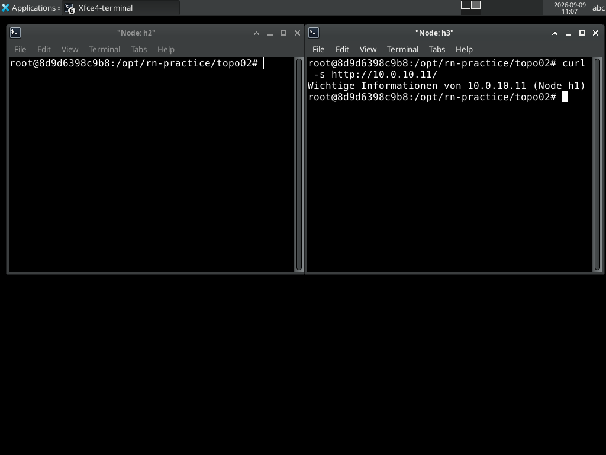
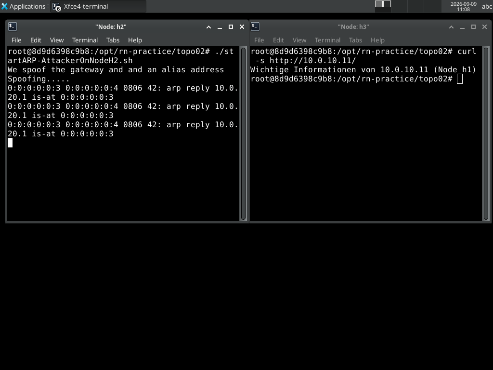

# 05 · ARP-Spoofing & Denial-of-Service

[:material-file-pdf-box: Als PDF herunterladen](../pdf/05-arp-spoofing-dos.pdf){ .md-button }

!!! warning "Sicherheits- und Ethikhinweis"
    Dieses Aufgabenblatt behandelt reale Angriffstechniken (ARP-Spoofing,
    SYN-Flood). Diese dürfen **ausschließlich** innerhalb der eigenen,
    isolierten Mininet-Netzwerk-Namespace-Umgebung Ihres Teilnehmer-Containers
    angewendet werden — **niemals** gegen das Host-Netzwerk, die
    HAW-Infrastruktur oder Dritte (siehe auch der Sicherheitshinweis auf der
    [Startseite](../index.md)). Bereits der Versuch gegen fremde Systeme ist
    strafbar und ein Verstoß gegen die Nutzungsbedingungen der Umgebung.

## Lernziele

- Den Mechanismus von ARP-Spoofing (gefälschte, unaufgeforderte ARP-Replies)
  und das daraus resultierende Man-in-the-Middle-Szenario verstehen.
- Nachvollziehen, wie ein MITM-Angreifer HTTP-Inhalte einer Verbindung
  unbemerkt austauschen kann (Content-Swap über einen gefälschten Webserver).
- SYN-Flood als Ressourcenerschöpfungsangriff auf den TCP-Drei-Wege-Handshake
  (halboffene Verbindungen) verstehen und mit `hping3` praktisch
  nachvollziehen.
- Grundlegende Gegenmaßnahmen benennen können (statische ARP-Einträge,
  Dynamic ARP Inspection, SYN-Cookies).

## Aufgaben

### Teil A — ARP-Spoofing als Aufwärmübung (Zwei-Netz-Routing-Topologie)

> Dieser Abschnitt stammt ursprünglich aus `Labor-03-Routing.tex`, Abschnitt
> "Man in the Middle", wurde aber inhaltlich hierher verschoben, da er
> fachlich zu den Angriffstechniken (Lab 05) gehört und nicht zum
> Routing-Thema von [Lab 03](03-routing-rip-bgp.md).

Nutzen Sie die aus Lab 03 bekannte Zwei-Netz-Topologie
(`10.0.0.0/24` mit h1/h2, `20.0.0.0/24` mit h3/h4, verbunden über einen
Router) mit funktionierenden Routen zwischen beiden Netzen.

**Aufgabe:** Führen Sie von h4 einen Ping auf h1 aus. Leiten Sie diesen
Request mittels ARP-Spoofing (`arpspoof`) auf h3 um, sodass h3 die Anfragen
abfängt. Überprüfen Sie Ihren Erfolg in Wireshark. Lassen Sie h3 den
abgefangenen Request — irreführenderweise — selbst mit einer Antwort
beantworten, sodass h4 einen scheinbar erfolgreichen Ping von h1 sieht,
obwohl h3 geantwortet hat.

!!! tip "Fortschritt festhalten (optional)"
    Diesen Teil geschafft? Optional fuer die Admin-Uebersicht vermerken
    (rein lokal, keine Netzwerkverbindung):

    ```bash
    ~/rn-practice/mark-done.sh 05 teila
    ```


### Teil B — ARP-Spoofing mit HTTP-Content-Swap (`topo02`)

*(Quelle: `mininet-labs/rn-practice/topo02/` (Code) sowie
`mininet-labs/intro/04-arp-and-more-tex.tex`, "Lab 4: Angriffsvektoren"
(Originaltext) — beide Quellen stimmen im Ablauf überein: `h1` als Server
via `startHTTPD.py`, `h3` als Opfer via `./user-firefox` gegen
`http://10.0.10.11`, `h2` als Angreifer, der zunächst per `traceroute
10.0.10.11` das Gateway `10.0.20.1` identifiziert, es sich per
IP-Alias aneignet und dann `startARP-AttackerOnNodeH2.sh` startet. Der
Originaltext wurde bei einer früheren Konsolidierung nicht erfolgreich aus
Google Drive kopiert; die lokal vendorierte `.tex`-Datei enthält weiterhin
nur einen TODO-Hinweis, der Originalinhalt wurde für dieses Aufgabenblatt
erneut geladen und bestätigt die zuvor allein aus dem Code rekonstruierten
Schritte unten vollständig.)*

`topo02` baut eine Topologie mit zwei Routern und mehreren Hosts auf
(`h0--s1--r1---r2----s2---h3`, mit weiteren Hosts an den Switches), in der
ein regulärer Webserver und ein Angreifer im selben Segment betrieben werden.

```bash
cd ~/rn-practice/topo02
./start-topo02.sh
```

1. **Legitimen Server starten:** Auf dem Server-Host den echten Webserver
   starten (liefert `index.html`, mit deaktiviertem Caching):

   ```bash
   $ python3 startHTTPD.py
   ```

2. **Normalzustand prüfen:** Vom Opfer-Host aus den Server per Browser/`curl`
   aufrufen und den unveränderten Inhalt (`index.html`) bestätigen.

   
   *Normalzustand vor dem Angriff: `h3` (Opfer) ruft den echten Webserver auf
   `h1` (`10.0.10.11`) auf und erhält den unveränderten Original-Inhalt.*

3. **Angriff starten:** Auf dem Angreifer-Host das Angriffsskript starten:

   ```bash
   $ ./startARP-AttackerOnNodeH2.sh
   ```

   
   *Live-Ausgabe von `arpspoof` auf dem Angreifer-Host `h2`: fortlaufend
   gefälschte, unaufgeforderte ARP-Replies, die dem Opfer `h3` vortäuschen,
   die Gateway-Adresse `10.0.20.1` gehöre zur MAC-Adresse `0:0:0:0:0:3` von
   `h2` statt zum echten Router `r2`.*

   Das Skript tut dabei drei Dinge:

   - Es legt einen IP-Alias auf der eigenen Schnittstelle an
     (`ifconfig h2-eth0:0 10.0.10.11 up`), um eine fremde Identität im
     Netzsegment vorzutäuschen.
   - Es startet im Hintergrund `startHTTPD-Attacker.py` — einen zweiten,
     bösartigen Webserver, der anstelle von `index.html` die Datei
     `attack.html` ausliefert (ebenfalls mit deaktiviertem Caching, damit
     der Content-Swap sofort sichtbar wird und nicht durch einen
     Browser-Cache verschleiert bleibt).
   - Es startet `arpspoof -i h2-eth0 -t 10.0.20.11 10.0.20.1` — vergiftet
     damit den ARP-Cache des Ziels `10.0.20.11` mit gefälschten Antworten,
     die die Gateway-Adresse `10.0.20.1` auf die MAC-Adresse des Angreifers
     umleiten (klassisches Gateway-Impersonation-MITM).

4. **Angriff verifizieren:** Opfer-Host den Server erneut aufrufen (ggf.
   vorher lokalen ARP-Cache mit `clear-cache.sh` leeren, siehe unten) und
   beobachten, dass nun `attack.html` statt `index.html` ausgeliefert wird —
   der sichtbare Beweis für den erfolgreichen Content-Swap. Bestätigen Sie in
   Wireshark, dass die ARP-Replies für die Gateway-Adresse von der
   MAC-Adresse des Angreifers stammen, nicht vom echten Gateway.

   
   *Erfolgreicher Content-Swap: Dieselbe Anfrage von `h3` an `10.0.10.11`
   liefert jetzt den Inhalt des Angreifer-Webservers auf `h2` statt der
   echten Antwort von `h1` (vgl. Screenshot oben vor dem Angriff) – die
   Zugriffslogs auf `h2` bestätigen, dass `10.0.20.11` (h3) tatsächlich beim
   Angreifer gelandet ist.*

5. **ARP-Cache zurücksetzen:** Für wiederholbare Demonstrationen den
   Neighbor-Cache aller Hosts leeren:

   ```bash
   $ ./clear-cache.sh   # entspricht: ip -s -s neigh flush all
   ```

6. **Angriff beenden:** Mit `Strg+C` auf dem Angreifer-Terminal — das Skript
   entfernt daraufhin den IP-Alias und beendet den gefälschten Webserver
   automatisch (siehe `trap`-Behandlung im Skript).

!!! tip "Fortschritt festhalten (optional)"
    Diesen Teil geschafft? Optional fuer die Admin-Uebersicht vermerken
    (rein lokal, keine Netzwerkverbindung):

    ```bash
    ~/rn-practice/mark-done.sh 05 teilb
    ```


### Teil C — SYN-Flood-DoS mit `hping3` (`topo02`, Originaltext)

*(Quelle: `mininet-labs/intro/04-arp-and-more-tex.tex`, "Lab 4:
Angriffsvektoren" — bei einer früheren Konsolidierung war der
Kopiervorgang dieser Datei aus Google Drive fehlgeschlagen; der vollständige
Originalinhalt wurde für dieses Aufgabenblatt erneut aus der Quelle geladen
und ersetzt die zuvor hier stehende, generische Neuentwicklung.)*

Nutzt weiterhin die aus Teil B laufende `topo02`-Topologie.

1. **Ziel-Server starten** (falls nicht mehr aktiv): auf `h1` den
   HTTP-Dienst, der bereits in Teil B verwendet wurde:

   ```bash
   h1$ python3 startHTTPD.py
   ```

2. **Normalverhalten prüfen:** Öffnet auf `h3` Firefox und ruft `http://10.0.10.11`
   auf, um den Dienst zu testen. Schließt Firefox danach wieder, damit sich
   der Effekt des Angriffs im nächsten Schritt klarer beobachten lässt.

3. **SYN-Flood starten:** Als Angreifer agiert `h0` gegen den HTTP-Server
   auf `h1` (`10.0.10.11`):

   ```bash
   h0$ hping3 -c 15000 -d 120 -S -w 64 -p 80 --flood --rand-source 10.0.10.11
   ```

   `-c 15000` sendet 15.000 Pakete à `-d 120` Byte, `-S` setzt das SYN-Flag
   mit TCP-Fenstergröße `-w 64`, `-p 80` richtet den Angriff auf den
   HTTP-Port, `--flood` sendet ohne Rücksicht auf Antworten so schnell wie
   möglich, und `--rand-source` täuscht wechselnde, gefälschte
   Absender-IPs vor – das verschleiert die echte Quelle und verhindert
   zugleich, dass die SYN-ACK-Antworten des Opfers den Angreifer erreichen.

4. **Wirkung beobachten:** Öffnet erneut Firefox auf `h3` und versucht,
   `http://10.0.10.11` erneut aufzurufen. Startet zusätzlich auf `h1` einen
   xterm mit Wireshark und beobachtet die Quelladressen der eingehenden
   SYN-Pakete – das ist IP-Spoofing sichtbar im Mitschnitt. Rechnet damit,
   dass Wireshark unter der Last des Angriffs nicht mehr flüssig läuft.

5. **Angriff beenden** (`Strg+C`) und die Erholung des Ziels bestätigen
   (`http://10.0.10.11` erneut in Firefox aufrufen).

**Aufgabe:** Erklärt, warum `--rand-source` den Angriff wirksamer macht als
ein SYN-Flood von einer einzelnen, festen Quell-IP, und welche Gegenmaßnahme
(SYN-Cookies) der Linux-Kernel dagegen anbietet.

!!! note "Alternative Beobachtung ohne Browser"
    Wer den Effekt lieber quantitativ statt über den Browser beobachten
    möchte, kann zusätzlich auf `h1` mit `ss -tan state syn-recv | wc -l`
    den Anstieg halboffener Verbindungen zählen und mit `curl`/`nc` prüfen,
    ob eine neue, legitime Verbindung noch rechtzeitig zustande kommt. Das
    steht so nicht im Original (das ausschließlich über Firefox verifiziert),
    ist aber eine naheliegende, faktisch korrekte Ergänzung mit denselben
    bereits vorinstallierten Werkzeugen.

!!! tip "Fortschritt festhalten (optional)"
    Diesen Teil geschafft? Optional fuer die Admin-Uebersicht vermerken
    (rein lokal, keine Netzwerkverbindung):

    ```bash
    ~/rn-practice/mark-done.sh 05 teilc
    ```

!!! example "Vertiefung (optional): Warum ihr das hier überhaupt dürft"
    ARP-Spoofing und SYN-Flood sind in diesem Aufgabenblatt keine
    Simulation, sondern laufen als echte Angriffe gegen echte Prozesse –
    das ist nur vertretbar, weil jede:r Teilnehmer:in eine eigene, komplett
    isolierte Mininet-Netzwerk-Namespace-Umgebung bekommt, statt sich einen
    gemeinsamen physischen Laborrechner mit anderen zu teilen. Nutzt das
    aus: Wiederholt Teil C, aber startet den SYN-Flood diesmal *ohne*
    `--rand-source` (also von einer festen Quell-IP) und beobachtet mit
    `ss -tan state syn-recv | wc -l` auf `h1`, wie sich die Zahl
    halboffener Verbindungen im Vergleich zum Angriff mit gefälschten
    Absendern entwickelt. Kombiniert anschließend Teil B und Teil C: Lasst
    den ARP-Spoofing-Angriff aus Teil B weiterlaufen, während ihr den
    SYN-Flood aus Teil C startet – bricht dadurch auch der (weiterhin
    funktionierende) Webserver auf `h1` unter der Last zusammen, oder
    bleibt nur die MITM-Umleitung bestehen? In einem gemeinsam genutzten
    Netz wäre schon der erste Versuch nicht erlaubt gewesen.


## Potenzielle Herausforderungen

- **`topo02` (ARP-Spoofing/`hping3`) ist seit 2026-09-09 unter dem
  granularen Capability-Set (`NET_ADMIN`+`NET_RAW`+`SYS_ADMIN`+
  `apparmor:unconfined`, siehe
  [ADR 0002](../adr/0002-capabilities-not-privileged.md)) real verifiziert.**
  `topo02.py` baute vorher wegen eines reinen Skript-Bugs (fehlender
  `controller=`-Parameter) gar nicht — nach dem Fix wurden `arpspoof -i
  h2-eth0 -t ...` und das IP-Aliasing per `ifconfig h2-eth0:0 ... up` real
  getestet: `arpspoof` sendet tatsächlich die gefälschten ARP-Replies
  (`arp reply 10.0.20.1 is-at <MAC von h2>` im Mitschnitt sichtbar), Rohsockets
  über `NET_RAW` funktionieren also wie unter `privileged: true`.
- In `topo02.py` fällt bei genauerem Lesen eine Ungereimtheit in der
  Interface-Benennung auf: mehrere `addLink()`-Aufrufe vergeben für `h1`
  literal den Namen `h0-eth0` statt `h1-eth0` (z. B.
  `addLink(h[1], s[1], intfName1='h0-eth0', ...)`). Dies wirkt wie ein
  Copy-Paste-Fehler im Originalskript und könnte je nach Mininet-Version zu
  Konfigurationsproblemen führen. Das Skript wurde für dieses Aufgabenblatt
  unverändert als Referenz übernommen (read-only vendorierte Kopie) — vor
  produktivem Rollout sollte dies vom Fachverantwortlichen geprüft werden.
- `--rand-source` bei `hping3` kann innerhalb der Mininet-Namespaces zu
  ungewöhnlichem ARP-/Routing-Verhalten führen, da die vorgetäuschten
  Quell-IPs im Testnetz nicht existieren. Im isolierten Mininet-Setup ist
  das unkritisch, verdeutlicht aber gleichzeitig, warum echte Netze
  IP-Spoofing üblicherweise per Ingress-Filterung (BCP 38) unterbinden.
- **Teil C nutzt jetzt den originalen Wortlaut** (`04-arp-and-more-tex.tex`,
  erneut aus Google Drive geladen) statt der zuvor hier stehenden,
  generischen Neuentwicklung — der `hping3`-Aufruf und die Verifikation über
  Firefox sind damit direkt aus der Quelle übernommen, nicht mehr erfunden.
  Die lokal vendorierte `.tex`-Datei selbst enthält weiterhin nur einen
  TODO-Hinweis (s. Quellen unten); ein Nachziehen dieser Korrektur dort wird
  empfohlen.

## Playwright-Screenshot-Referenz

In `tests/e2e/specs/screenshots.spec.ts` eignet sich ein
**Fenster-Screenshot** (`captureWindow`) für das geöffnete Wireshark-Fenster
mit den sichtbaren gefälschten ARP-Replies (Teil B) — hier ist der Kontext
mehrerer Pakete relevant. Für den Nachweis des Content-Swaps bzw. des
SYN-Flood-Effekts eignet sich dagegen ein **Zeilen-Screenshot**
(`captureLine`) besser: eine einzelne `arp -a`-Zeile mit der durch Spoofing
veränderten MAC-Adresse, oder (bei der optionalen quantitativen Beobachtung
in Teil C) eine `ss -tan`-Zeile im Zustand `SYN-RECV` während des
Flood-Tests.

## Quellen

- `mininet-labs/rn-practice/topo02/` (`topo02.py`, `start-topo02.sh`,
  `startARP-AttackerOnNodeH2.sh`, `startHTTPD.py`,
  `startHTTPD-Attacker.py`, `clear-cache.sh`) — Referenzimplementierung für
  Teil B, durch den Originaltext (s. u.) inhaltlich bestätigt.
- `mininet-labs/intro/04-arp-and-more-tex.tex` ("Lab 4: Angriffsvektoren")
  — Originaltext für Teil B (ARP-MitM) und Teil C (SYN-Flood). Die lokal
  vendorierte Kopie dieser Datei enthält weiterhin nur einen technischen
  TODO-Hinweis (fehlgeschlagener Google-Drive-Kopiervorgang in einer
  früheren Session); der oben verwendete Originalinhalt wurde für dieses
  Aufgabenblatt erneut aus Google Drive gelesen, aber nicht in die
  vendorierte `.tex`-Datei zurückgeschrieben (außerhalb des Geltungsbereichs
  dieser Konsolidierung) — ein Nachziehen wird empfohlen.
- `mininet-labs/vertiefung/Labor-03-Routing.tex`, Abschnitt "Man in the
  Middle" — Ursprung von Teil A, fachlich hierher verschoben.
- `docs/reference/umgebung.md` — Bestätigung, dass `hping3` im Image
  vorinstalliert ist.
