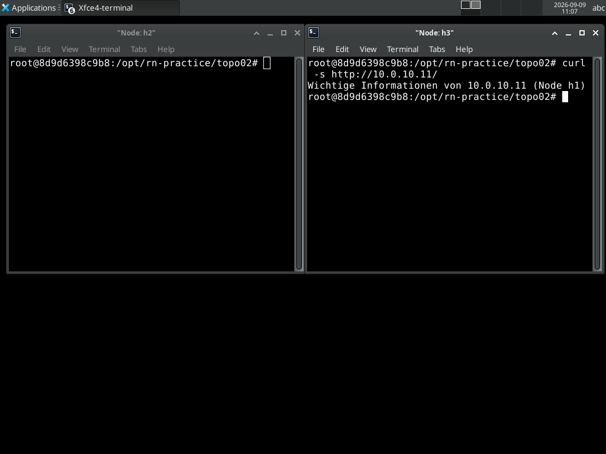
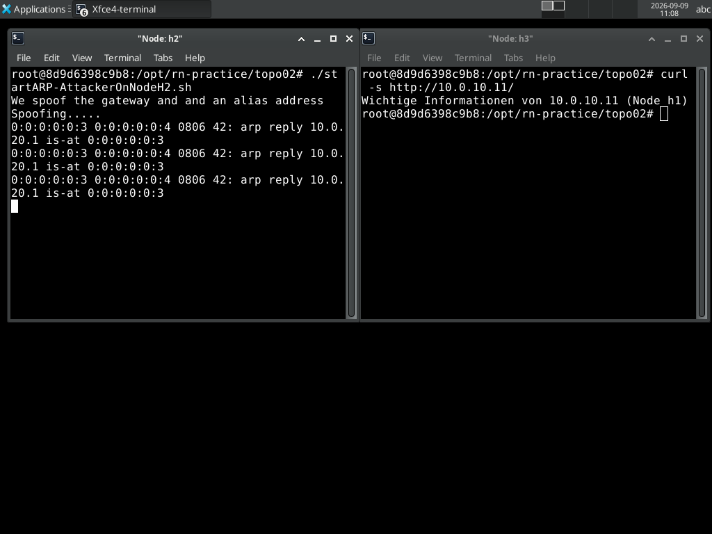

# 05 · ARP-Spoofing & Denial-of-Service

[:material-file-pdf-box: Als PDF herunterladen](../../pdf/05-arp-spoofing-dos.pdf){ .md-button }

!!! warning "Sicherheits- und Ethikhinweis"
    Dieses Aufgabenblatt behandelt reale Angriffstechniken (ARP-Spoofing,
    SYN-Flood). Diese dürfen **ausschließlich** innerhalb der eigenen,
    isolierten Mininet-Netzwerk-Namespace-Umgebung eures
    Teilnehmer-Containers angewendet werden — **niemals** gegen das
    Host-Netzwerk, die Infrastruktur des Betreibers oder Dritte (siehe auch
    der Sicherheitshinweis auf der [Startseite](../index.md)). Bereits der
    Versuch gegen fremde Systeme ist strafbar und ein Verstoß gegen die
    Nutzungsbedingungen der Umgebung.

## Lernziele

- Den Mechanismus von ARP-Spoofing (gefälschte, unaufgeforderte ARP-Replies)
  und das daraus resultierende Man-in-the-Middle-Szenario verstehen.
- Nachvollziehen, wie ein MITM-Angreifer HTTP-Inhalte einer Verbindung
  unbemerkt austauschen kann (Content-Swap über einen gefälschten Webserver).
- SYN-Flood als Ressourcenerschöpfungsangriff auf den TCP-Drei-Wege-Handshake
  (halboffene Verbindungen) verstehen und mit `hping3` praktisch
  nachvollziehen.
- Grundlegende Gegenmaßnahmen benennen können (statische ARP-Einträge,
  Dynamic ARP Inspection, SYN-Cookies).

--8<-- "issue-feedback.md"

## Aufgaben

### Teil A — ARP-Spoofing als Aufwärmübung (Zwei-Netz-Routing-Topologie)

Nutzt die aus [Lab 03](03-routing-rip-bgp.md) bekannte Zwei-Netz-Topologie
(`10.0.0.0/24` mit h1/h2, `20.0.0.0/24` mit h3/h4, verbunden über einen
Router) mit funktionierenden Routen zwischen beiden Netzen.

**Aufgabe:** Führt von h4 einen Ping auf h1 aus. Leitet diesen Request
mittels ARP-Spoofing (`arpspoof`) auf h3 um, sodass h3 die Anfragen abfängt.
Überprüft euren Erfolg in Wireshark. Lasst h3 den abgefangenen Request —
irreführenderweise — selbst mit einer Antwort beantworten, sodass h4 einen
scheinbar erfolgreichen Ping von h1 sieht, obwohl h3 geantwortet hat.

### Teil B — ARP-Spoofing mit HTTP-Content-Swap (`topo02`)

Teil A hat ARP-Spoofing an einem einzelnen umgeleiteten Ping gezeigt. Jetzt
wechselt ihr zur Topologie `topo02` und einer Angriffsvariante mit echtem
Schaden: Der Angreifer tauscht nicht nur ARP-Antworten, sondern liefert dem
Opfer über einen gefälschten Webserver manipulierte Inhalte aus.

`topo02` baut eine Topologie mit zwei Routern und mehreren Hosts auf
(`h0--s1--r1---r2----s2---h3`, mit weiteren Hosts an den Switches), in der
ein regulärer Webserver und ein Angreifer im selben Segment betrieben werden.

```bash
cd ~/rn-practice/topo02
./start-topo02.sh
```

1. **Legitimen Server prüfen:** Der echte Webserver (liefert `index.html`,
    mit deaktiviertem Caching) läuft bereits automatisch auf `h1`, sobald
    `./start-topo02.sh` durchgelaufen ist. Prüft das:

    ```bash
    h1$ pgrep -f startHTTPD.py
    ```

    Ein zusätzliches manuelles `python3 startHTTPD.py` scheitert mit
    `OSError: [Errno 98] Address already in use`, weil der Port bereits
    belegt ist — der Server läuft also schon.

2. **Normalzustand prüfen:** Vom Opfer-Host aus den Server per Browser/`curl`
    aufrufen und den unveränderten Inhalt (`index.html`) bestätigen.

    
    *Normalzustand vor dem Angriff: `h3` (Opfer) ruft den echten Webserver auf
    `h1` (`10.0.10.11`) auf und erhält den unveränderten Original-Inhalt.*

3. **Angriff starten:** Auf dem Angreifer-Host das Angriffsskript starten:

    ```bash
    $ ./startARP-AttackerOnNodeH2.sh
    ```

    
    *Live-Ausgabe von `arpspoof` auf dem Angreifer-Host `h2`: fortlaufend
    gefälschte, unaufgeforderte ARP-Replies, die dem Opfer `h3` vortäuschen,
    die Gateway-Adresse `10.0.20.1` gehöre zur MAC-Adresse `0:0:0:0:0:3` von
    `h2` statt zum echten Router `r2`.*

    Das Skript tut dabei drei Dinge:

    - Es legt einen IP-Alias auf der eigenen Schnittstelle an
      (`ifconfig h2-eth0:0 10.0.10.11 up`), um eine fremde Identität im
      Netzsegment vorzutäuschen.
    - Es startet im Hintergrund `startHTTPD-Attacker.py` — einen zweiten,
      bösartigen Webserver, der anstelle von `index.html` die Datei
      `attack.html` ausliefert (ebenfalls mit deaktiviertem Caching, damit
      der Content-Swap sofort sichtbar wird und nicht durch einen
      Browser-Cache verschleiert bleibt).
    - Es startet `arpspoof -i h2-eth0 -t 10.0.20.11 10.0.20.1` — vergiftet
      damit den ARP-Cache des Ziels `10.0.20.11` mit gefälschten Antworten,
      die die Gateway-Adresse `10.0.20.1` auf die MAC-Adresse des Angreifers
      umleiten (klassisches Gateway-Impersonation-MITM).

4. **Angriff verifizieren:** Opfer-Host den Server erneut aufrufen (ggf.
    vorher lokalen ARP-Cache mit `clear-cache.sh` leeren, siehe unten) und
    beobachten, dass nun `attack.html` statt `index.html` ausgeliefert wird —
    der sichtbare Beweis für den erfolgreichen Content-Swap. Bestätigt in
    Wireshark, dass die ARP-Replies für die Gateway-Adresse von der
    MAC-Adresse des Angreifers stammen, nicht vom echten Gateway.

    
    *Erfolgreicher Content-Swap: Dieselbe Anfrage von `h3` an `10.0.10.11`
    liefert jetzt den Inhalt des Angreifer-Webservers auf `h2` statt der
    echten Antwort von `h1` (vgl. Screenshot oben vor dem Angriff) – die
    Zugriffslogs auf `h2` bestätigen, dass `10.0.20.11` (h3) tatsächlich beim
    Angreifer gelandet ist.*

5. **ARP-Cache zurücksetzen:** Für wiederholbare Demonstrationen den
    Neighbor-Cache aller Hosts leeren:

    ```bash
    $ ./clear-cache.sh   # entspricht: ip -s -s neigh flush all
    ```

    !!! warning "Nach dem Leeren zuerst einen Aufruf, dann warten"
        Leert den Zwischenspeicher nicht unmittelbar vor der Probe.
        Linux legt auf eine unaufgeforderte ARP-Reply keinen neuen Eintrag
        an, es aktualisiert nur vorhandene. Direkt nach dem Leeren fragt
        euer Rechner das Gateway selbst per ARP - und der echte Router
        antwortet darauf. Ihr landet dann beim echten Server und haltet den
        Angriff faelschlich fuer gescheitert.

        Setzt deshalb erst einen Aufruf ab, wartet etwa zehn Sekunden und
        prueft mit `ip neigh show 10.0.20.1`, dass dort die MAC des
        Angreifers steht. Erst dann ist die Probe aussagekraeftig.

6. **Angriff beenden:** Mit `Strg+C` auf dem Angreifer-Terminal — das Skript
    entfernt daraufhin den IP-Alias und beendet den gefälschten Webserver
    automatisch (siehe `trap`-Behandlung im Skript).

!!! example "Vertiefung (optional): Ein fester ARP-Eintrag als Gegenmaßnahme"
    ARP glaubt jeder Antwort, auch einer unaufgeforderten – daher funktioniert
    der Angriff überhaupt. Tragt auf dem angegriffenen Rechner die *richtige*
    Zuordnung fest ein, bevor ihr den Angriff erneut startet:

    ```bash
    ip neigh replace <ziel-ip> lladdr <richtige-mac> dev <interface> nud permanent
    ```

    Startet das Angriffsskript danach noch einmal und schaut mit
    `ip neigh show`, ob sich der Eintrag noch umbiegen lässt.

    Überlegt anschließend, warum diese Abhilfe trotzdem kaum jemand einsetzt:
    Wie viele Einträge wären das in einem Netz mit 500 Rechnern, und was
    passiert, wenn ein Gerät planmäßig eine neue Netzwerkkarte bekommt?
    Eine Maßnahme, die technisch wirkt, aber im Betrieb nicht durchzuhalten
    ist, ist noch keine Lösung.

### Teil C — SYN-Flood-DoS mit `hping3` (`topo02`)

Teil A und B haben gezeigt, wie ein Angreifer im selben Segment den
Datenverkehr eines Opfers umleiten kann (ARP-Spoofing). Dieser Teil
wechselt die Angriffsart: Statt Verkehr umzuleiten, überflutet ihr einen
Server mit halboffenen Verbindungen, bis er keine neuen Clients mehr
annehmen kann (Denial-of-Service). Nutzt weiterhin die aus Teil B laufende
`topo02`-Topologie.

1. **Ziel-Server prüfen:** Der HTTP-Dienst aus Teil B läuft auf `h1`
    normalerweise noch (er startet automatisch mit der Topologie). Prüft das
    zuerst, statt ihn blind neu zu starten:

    ```bash
    h1$ pgrep -f startHTTPD.py || python3 startHTTPD.py
    ```

2. **Normalverhalten prüfen:** Öffnet auf `h3` Firefox und ruft `http://10.0.10.11`
    auf, um den Dienst zu testen. Schließt Firefox danach wieder, damit sich
    der Effekt des Angriffs im nächsten Schritt klarer beobachten lässt.

3. **SYN-Flood starten:** Als Angreifer agiert `h0` gegen den HTTP-Server
    auf `h1` (`10.0.10.11`):

    ```bash
    h0$ hping3 -c 15000 -d 120 -S -w 64 -p 80 --flood --rand-source 10.0.10.11
    ```

    `-c 15000` sendet 15.000 Pakete à `-d 120` Byte, `-S` setzt das SYN-Flag
    mit TCP-Fenstergröße `-w 64`, `-p 80` richtet den Angriff auf den
    HTTP-Port, `--flood` sendet ohne Rücksicht auf Antworten so schnell wie
    möglich, und `--rand-source` täuscht wechselnde, gefälschte
    Absender-IPs vor – das verschleiert die echte Quelle und verhindert
    zugleich, dass die SYN-ACK-Antworten des Opfers den Angreifer erreichen.

4. **Wirkung beobachten:** Öffnet erneut Firefox auf `h3` und versucht,
    `http://10.0.10.11` erneut aufzurufen. Startet zusätzlich auf `h1` einen
    xterm mit Wireshark und beobachtet die Quelladressen der eingehenden
    SYN-Pakete – das ist IP-Spoofing sichtbar im Mitschnitt. Rechnet damit,
    dass Wireshark unter der Last des Angriffs nicht mehr flüssig läuft.

5. **Angriff beenden** (`Strg+C`) und die Erholung des Ziels bestätigen
    (`http://10.0.10.11` erneut in Firefox aufrufen).

**Aufgabe:** Erklärt, warum `--rand-source` den Angriff wirksamer macht als
ein SYN-Flood von einer einzelnen, festen Quell-IP, und welche Gegenmaßnahme
(SYN-Cookies) der Linux-Kernel dagegen anbietet.

!!! note "Alternative Beobachtung ohne Browser"
    Wer den Effekt lieber quantitativ statt über den Browser beobachten
    möchte, kann zusätzlich auf `h1` mit `ss -tan state syn-recv | wc -l`
    den Anstieg halboffener Verbindungen zählen und mit `curl`/`nc` prüfen,
    ob eine neue, legitime Verbindung noch rechtzeitig zustande kommt —
    dieselbe Messung, die Teil E im Detail vertieft.

!!! example "Vertiefung (optional): Warum ihr das hier überhaupt dürft"
    ARP-Spoofing und SYN-Flood sind in diesem Aufgabenblatt keine
    Simulation, sondern laufen als echte Angriffe gegen echte Prozesse –
    das ist nur vertretbar, weil jede:r Teilnehmer:in eine eigene, komplett
    isolierte Mininet-Netzwerk-Namespace-Umgebung bekommt, statt sich einen
    gemeinsamen physischen Laborrechner mit anderen zu teilen. Nutzt das
    aus: Wiederholt Teil C, aber startet den SYN-Flood diesmal *ohne*
    `--rand-source` (also von einer festen Quell-IP) und beobachtet mit
    `ss -tan state syn-recv | wc -l` auf `h1`, wie sich die Zahl
    halboffener Verbindungen im Vergleich zum Angriff mit gefälschten
    Absendern entwickelt. Kombiniert anschließend Teil B und Teil C: Lasst
    den ARP-Spoofing-Angriff aus Teil B weiterlaufen, während ihr den
    SYN-Flood aus Teil C startet – bricht dadurch auch der (weiterhin
    funktionierende) Webserver auf `h1` unter der Last zusammen, oder
    bleibt nur die MITM-Umleitung bestehen? In einem gemeinsam genutzten
    Netz wäre schon der erste Versuch nicht erlaubt gewesen.

### Teil D — Selbst zum Verteidiger werden: ARP-Spoofing als Opfer erkennen (`topo02`)

In Teil B habt ihr den Angriff aus Sicht des Angreifers (`h2`) durchgeführt
und in Wireshark bestätigt. In diesem Teil dreht ihr die Perspektive um:
Ihr seid jetzt das Opfer (`h3`) und müsst den laufenden Angriff **selbst
erkennen**, ohne vorher zu wissen, dass er stattfindet – so, wie es eine
reale Administratorin an ihrem Rechner tun müsste, ohne Wireshark-Mitschnitt
des Angreifers zur Hand zu haben.

Startet `topo02` (falls nicht mehr aktiv) und sorgt zunächst dafür, dass
`h3` eine "saubere" Basis hat, mit der ihr später vergleichen könnt:

```bash
cd ~/rn-practice/topo02
./start-topo02.sh
```

1. **Baseline aufnehmen.** Erzeugt auf `h3` zunächst Verkehr zum Gateway,
    damit dessen Eintrag im Nachbarschafts-Cache steht, und notiert euch die
    dabei angezeigte MAC-Adresse:

    ```bash
    h3$ ping -c 2 10.0.20.1
    h3$ ip neigh show 10.0.20.1
    ```

2. **Angriff im Hintergrund starten**, ohne dass `h3` etwas davon "weiß"
    (in einer echten Übung: bittet eine Kommilitonin/einen Kommilitonen, den
    Angriff für euch zu starten, während ihr nur auf `h3` schaut):

    ```bash
    h2$ ./startARP-AttackerOnNodeH2.sh
    ```

3. **Selbst erkennen, ohne Wireshark.** Prüft auf `h3` erneut denselben
    Nachbarschafts-Eintrag:

    ```bash
    h3$ ping -c 1 10.0.20.1
    h3$ ip neigh show 10.0.20.1
    ```

    **Aufgabe:** Vergleicht die MAC-Adresse mit eurer Notiz aus Schritt 1.
    Eine sich ändernde MAC-Adresse für dieselbe Gateway-IP, ohne dass am
    Gateway selbst etwas getauscht wurde, ist ein starkes Indiz für
    ARP-Spoofing. Bestätigt euren Verdacht, indem ihr auf `h2` die eigene
    Interface-MAC abfragt und mit der "neuen" Gateway-MAC vergleicht:

    ```bash
    h2$ ip link show h2-eth0
    ```

    Stimmen beide MAC-Adressen überein, habt ihr den Angreifer eindeutig
    identifiziert – rein aus der Opfer-Perspektive, ohne den Angriffs-Traffic
    selbst mitgeschnitten zu haben.

!!! info "Was ihr seht"
    Vor dem Angriff zeigt `ip neigh show 10.0.20.1` auf `h3`
    `lladdr 00:00:00:00:00:06` (die echte MAC von `r2`), nach dem Start von
    `startARP-AttackerOnNodeH2.sh` dagegen `lladdr 00:00:00:00:00:03` – genau
    die MAC-Adresse, die `ip link show h2-eth0` auf `h2` als dessen eigene
    Interface-Adresse ausweist. Beim Ping auf `h3` kann während des Angriffs
    zusätzlich die Meldung
    `From 10.0.20.10: icmp_seq=1 Redirect Host(New nexthop: 10.0.20.1)`
    erscheinen – ein ICMP-Redirect, ausgelöst dadurch, dass der Angreifer
    (`10.0.20.10`) kurzzeitig als vermeintlicher Zwischen-Hop auftaucht. Auch
    das ist ein Warnsignal, es tritt aber nicht in jedem Timing-Fenster auf.

**Aufgabe:** Nennt zwei Gründe, warum diese Erkennungsmethode (manueller
Vergleich der Nachbarschafts-Tabelle) in einem echten, großen Firmennetz
mit hunderten Rechnern nicht praktikabel skaliert, und recherchiert
stichwortartig, wie automatisierte Gegenmaßnahmen wie **Dynamic ARP
Inspection** (auf verwalteten Switches) oder Tools wie **arpwatch** dasselbe
Prinzip (Änderung einer IP-zu-MAC-Zuordnung erkennen) automatisieren.

--8<-- "issue-feedback.md"

### Teil E — SYN-Flood quantitativ: den Schaden messen und SYN-Cookies wirken sehen (`topo02`)

Teil C hat den SYN-Flood *gestartet* und über den Browser beobachtet. Das ist
ein qualitativer Eindruck („die Seite lädt nicht mehr"). Jetzt messt ihr den
Angriff in Zahlen – wie viele halboffene Verbindungen er erzeugt und ob eine
legitime Verbindung noch durchkommt – und schaltet die eigentliche
Gegenmaßnahme des Linux-Kernels ein: **SYN-Cookies**.

!!! info "Werkzeug: `ss -tan state syn-recv` – was es zählt"
    Ein TCP-Server, der ein `SYN` empfängt, antwortet mit `SYN-ACK` und wartet
    auf das dritte Paket des Handshakes. Bis es kommt, steht die Verbindung
    **halboffen** im Zustand `SYN-RECV`. `ss -tan state syn-recv` listet genau
    diese. **Was es misst:** wie viele Handshakes gerade in der Schwebe hängen.
    **Typische Fehldeutung:** eine kleine Zahl für „harmlos" zu halten – die Zahl
    ist durch die **Backlog-Größe** des Servers gedeckelt, und genau dieser
    kleine Vorrat ist die knappe Ressource, die der Angriff erschöpft.

**Ziel:** Zeigen, dass ein SYN-Flood eine legitime Verbindung verhindert, und
dass SYN-Cookies sie zurückholen.

**Vorbedingung:** `topo02` läuft, der HTTP-Server auf `h1` (`10.0.10.11`) ist
gestartet (`python3 startHTTPD.py`). Angreifer ist `h0`, ein unbeteiligter
legitimer Client ist `h3`.

!!! warning "`sysctl -w` allein schlägt hier fehl"
    `/proc/sys` ist in diesem Container schreibgeschützt; ein direktes
    `sysctl -w net.ipv4.tcp_syncookies=0` bricht mit `sysctl: permission
    denied on key "net.ipv4.tcp_syncookies"` ab.
    Da `tcp_syncookies` eine Eigenschaft je Netzwerk-Namespace ist, genügt ein
    auf den eigenen Host beschränkter Umweg über eine neue Sicht auf
    `/proc/sys`:

    ```bash
    h1$ unshare -m sh -c 'mount -o remount,rw /proc/sys && sysctl -w net.ipv4.tcp_syncookies=0'
    ```

    Der Kernelwert bleibt danach für diesen Host gesetzt, auch wenn jeder
    weitere Befehl wieder in der ursprünglichen, weiterhin schreibgeschützten
    Sicht läuft — bestätigen lässt sich das mit einem anschließenden einfachen
    `sysctl net.ipv4.tcp_syncookies` (ohne `unshare`), das den neuen Wert zeigt.

**Schritte:**

```bash
# 1. Legitimer Zugriff im Normalzustand:
h3$ curl -s -o /dev/null -w '%{http_code}\n' http://10.0.10.11/
# 2. SYN-Cookies AUS, dann fluten und waehrenddessen messen:
h1$ unshare -m sh -c 'mount -o remount,rw /proc/sys && sysctl -w net.ipv4.tcp_syncookies=0'
h0$ hping3 -S -p 80 --flood --rand-source 10.0.10.11 &
h1$ ss -tan state syn-recv | grep -c :80      # halboffene Verbindungen
h3$ curl -s -o /dev/null -m 3 -w '%{http_code}\n' http://10.0.10.11/   # legitim?
# 3. SYN-Cookies AN, erneut fluten und legitim testen:
h1$ unshare -m sh -c 'mount -o remount,rw /proc/sys && sysctl -w net.ipv4.tcp_syncookies=1'
h3$ curl -s -o /dev/null -m 3 -w '%{http_code}\n' http://10.0.10.11/
```

Beendet den Flood mit ++ctrl+c++ auf `h0`.

**Erwartete Ausgabe:** Im Normalzustand `200`. Bei `syncookies=0` unter Flood:
eine `SYN-RECV`-Zahl in Höhe des Server-Backlogs und ein legitimer Abruf, der
mit `000` (keine Verbindung) scheitert. Bei `syncookies=1` unter demselben
Flood: wieder `200`.

!!! info "Was ihr seht"
    Der legitime `curl` von `h3` liefert vor dem Angriff `200`. Unter Flood mit
    `net.ipv4.tcp_syncookies=0` zählt `ss … syn-recv` nur wenige halboffene
    Verbindungen (so viele wie der kleine Listen-Backlog des Python-Servers),
    und der legitime `curl` liefert `000` – der Angriff greift. Mit
    `net.ipv4.tcp_syncookies=1` liefert derselbe `curl` bei weiterlaufendem
    Flood wieder `200`, obwohl `ss` dieselbe Zahl halboffener Verbindungen
    zeigt. Das ist der Kern: SYN-Cookies halten für die Flut keinen Zustand vor,
    sondern kodieren ihn in die Sequenznummer – der Backlog läuft gar nicht
    erst voll.

!!! info "Hintergrund: warum `--rand-source` den Angriff erst wirksam macht"
    `--rand-source` fälscht für jedes SYN eine andere Absender-IP. Dadurch (a)
    verschleiert es die Quelle und (b) sorgt dafür, dass die `SYN-ACK`-Antworten
    ins Leere gehen und der Handshake nie abgeschlossen wird – jede Verbindung
    bleibt halboffen. Ohne `--rand-source` käme entweder ein `RST` der echten
    Quelle zurück (der den Slot sofort freigäbe) oder die Quelle wäre trivial zu
    sperren. Deshalb ist die randomisierte Quelle kein Detail, sondern der Kern
    des Angriffs – und der Grund, warum eine Abwehr, die auf der Quell-IP
    aufsetzt, scheitert (siehe Teil F).

### Teil F — Eine naheliegende Gegenmaßnahme, die scheitert: die nft-Ratenbegrenzung (`topo02`)

Bevor man zur richtigen Lösung (SYN-Cookies, Teil E) greift, liegt eine andere
nahe: „Dann begrenze ich eben die SYN-Rate mit der Firewall." In diesem Teil
baut ihr genau das mit `nft` und **messt, dass es die legitime Verbindung nicht
rettet** – ein Lehrstück darüber, warum eine plausible Maßnahme trotzdem falsch
sein kann.

!!! info "Werkzeug: `nft` (nftables) – was die Regel tut"
    `nftables` ist der moderne Nachfolger von `iptables`. Eine Regel wie
    `tcp flags syn limit rate 20/second` lässt die ersten 20 SYN je Sekunde
    durch und verwirft (per zweiter Regel `drop`) den Rest. **Was sie tut:** die
    *Gesamtzahl* eingehender SYN begrenzen. **Was sie nicht kann:** zwischen dem
    SYN eines Angreifers und dem eines legitimen Clients unterscheiden – beide
    sind nur SYN-Pakete auf Port 80.

**Ziel:** Eine SYN-Ratenbegrenzung bauen, unter Flood messen und feststellen,
dass die legitime Verbindung weiterhin scheitert – und begründen, warum.

**Vorbedingung:** wie Teil E; `syncookies` zunächst wieder auf `0` setzen, damit
ihr die Wirkung der Firewall-Regel isoliert seht.

**Schritte:**

```bash
h1$ unshare -m sh -c 'mount -o remount,rw /proc/sys && sysctl -w net.ipv4.tcp_syncookies=0'
h1$ nft add table ip fw
h1$ nft add chain ip fw input '{ type filter hook input priority 0; }'
h1$ nft add rule ip fw input tcp dport 80 tcp flags syn limit rate 20/second burst 20 packets accept
h1$ nft add rule ip fw input tcp dport 80 tcp flags syn drop
h0$ hping3 -S -p 80 --flood --rand-source 10.0.10.11 &
h3$ curl -s -o /dev/null -m 3 -w '%{http_code}\n' http://10.0.10.11/
h1$ nft flush ruleset          # aufraeumen
```

**Erwartete Ausgabe:** Der legitime `curl` scheitert **weiterhin** (`000`),
obwohl die Firewall-Regel aktiv ist.

!!! info "Was ihr seht"
    Der legitime `curl` von `h3` bleibt unter Flood auch mit der
    `nft`-SYN-Ratenbegrenzung bei `000` – genau wie ohne Regel. Der Grund: Die
    Ratenbegrenzung verwirft SYN-Pakete ohne Ansehen der Quelle. Während der
    Flut ist das 20/s-Budget von den Angreifer-SYN aufgebraucht, bevor das eine
    legitime SYN von `h3` an die Reihe kommt – die Regel trifft Freund und Feind
    gleich. Erst SYN-Cookies (Teil E), die nichts verwerfen, sondern ohne
    Zustand auskommen, lösen das Problem.

!!! question "Zum Weiterdenken"
    Überlegt, unter welchen Umständen die Ratenbegrenzung *doch* helfen würde –
    und warum diese Umstände bei einem Flood mit `--rand-source` gerade nicht
    gegeben sind. (Hinweis: Was bräuchtet ihr, um Angreifer-SYN von legitimen
    zu *unterscheiden*, und warum nimmt euch `--rand-source` genau das?)

### Teil G — Der feste ARP-Eintrag als gemessene Gegenmaßnahme (`topo02`)

In Teil B/D habt ihr gesehen, dass ARP jeder Antwort glaubt – auch einer
unaufgeforderten. Die Vertiefungsbox zu Teil B hat einen festen ARP-Eintrag als
Gegenmaßnahme vorgeschlagen. Jetzt messt ihr, dass er wirklich hält: Mit einem
`permanent`-Eintrag prallt der Angriff aus Teil D ab.

**Ziel:** Zeigen, dass ein `nud permanent`-Nachbarschaftseintrag durch
`arpspoof` nicht mehr umgebogen werden kann – und dass genau derselbe Angriff
ohne ihn (Teil D) die MAC-Adresse tauscht.

**Vorbedingung:** `topo02` läuft. Opfer ist `h3` (`10.0.20.11`), Gateway `r2`
(`10.0.20.1`), Angreifer `h2` — dieselben drei Rollen wie in Teil B/D, denn
`startARP-AttackerOnNodeH2.sh` greift fest verdrahtet `10.0.20.11` über
`10.0.20.1` an (siehe Skriptinhalt in Teil B). `h1`/`r1` liegen auf der
anderen Seite der Topologie und werden von diesem Skript gar nicht erreicht.

**Schritte:**

```bash
# 1. echte Gateway-MAC lernen und FEST eintragen:
h3$ ip neigh flush all; ping -c1 10.0.20.1
h3$ ip neigh show 10.0.20.1                      # echte MAC merken
h3$ ip neigh replace 10.0.20.1 lladdr <echte-MAC> dev h3-eth0 nud permanent
# 2. Angriff starten und Eintrag erneut prüfen:
h2$ ./startARP-AttackerOnNodeH2.sh &
h3$ ip neigh show 10.0.20.1                      # unveraendert?
```

**Erwartete Ausgabe:** Nach dem `permanent`-Eintrag bleibt die MAC-Adresse für
`10.0.20.1` trotz laufendem `arpspoof` unverändert die **echte** MAC des
Gateways – anders als in Teil D, wo sie auf die MAC des Angreifers umsprang.

!!! info "Was ihr seht"
    Nach `ip neigh flush all` + `ping` lernt `h3` die echte Gateway-MAC von
    `r2` (`00:00:00:00:00:06`). Nach dem Setzen als `permanent` und dem Start
    von `arpspoof` auf `h2` bleibt `ip neigh show 10.0.20.1` unverändert bei
    `00:00:00:00:00:06` – der Angriff, der in Teil D die MAC tauscht, läuft ins
    Leere.

!!! warning "Kontrolliert, dass der Angriff wirklich euer Segment trifft"
    Ein unveränderter Eintrag beweist die Abwehr nur, wenn in diesem Moment
    tatsächlich ein Angriff auf **dieses** Segment läuft. Prüft das an `h2`s
    eigener Ausgabe (`arp reply 10.0.20.1 is-at ...`) und nicht nur am
    Ergebnis auf `h3` – ein Eintrag, der sich nicht ändert, weil der Angriff
    ein ganz anderes Segment trifft, sieht identisch aus wie ein Eintrag, der
    sich dank `nud permanent` nicht ändern *lässt*, belegt aber nichts.

!!! example "Vertiefung: warum das trotzdem selten eingesetzt wird"
    Ihr habt eine Maßnahme gefunden, die technisch **funktioniert**. Rechnet nun
    den Betriebsaufwand: In einem Netz mit 500 Rechnern und je einem
    Gateway-Eintrag – wie viele feste Zuordnungen sind das, und wer pflegt sie,
    wenn ein Gerät planmäßig eine neue Netzwerkkarte bekommt? Genau diese
    Skalierungsfrage ist der Grund, warum in echten Netzen stattdessen *Dynamic
    ARP Inspection* auf verwalteten Switches eingesetzt wird (siehe Teil D) –
    dieselbe Idee, aber zentral und automatisch statt von Hand auf jedem Host.

### Teil H — Den Angriff forensisch festhalten: gefälschte ARP-Replies mitschneiden und zählen (`topo02`)

Die bisherigen Teile haben den Angriff *live* beobachtet. Ein Mitschnitt ist
etwas anderes: ein **dauerhaftes Artefakt**, das man auch nach dem Angriff noch
auswerten, zählen und vorlegen kann – die Grundlage jeder Incident-Analyse. In
diesem Teil zeichnet ihr die gefälschten ARP-Replies auf und wertet sie ohne
`tshark` (das fehlt hier) allein mit `tcpdump` und den `pcap`-Werkzeugen aus.

!!! info "Werkzeug: `capinfos` und `editcap` – die pcap-Werkzeuge ohne tshark"
    Wireshark bringt eine ganze Kommandozeilen-Familie mit, die **auch ohne die
    grafische Oberfläche und ohne `tshark`** funktioniert: `capinfos` fasst eine
    Datei zusammen (Paketzahl, Dauer), `editcap` schneidet einen Bereich heraus,
    `mergecap` fügt Dateien zusammen. **Typische Fehldeutung:** anzunehmen, ohne
    `tshark` sei eine `pcap`-Datei auf der Kommandozeile nicht auswertbar. Für
    Zählen, Zuschneiden und Zusammenführen genügen diese Werkzeuge – und sie
    sind vorhanden, `tshark` nicht.

**Ziel:** Die gefälschten ARP-Replies eines laufenden Angriffs mitschneiden, ihre
Zahl bestimmen und einen Ausschnitt als Beweis-Artefakt sichern.

**Vorbedingung:** `topo02` läuft. Opfer `h3` (`10.0.20.11`), Angreifer `h2`.

**Schritte:**

```bash
h3$ mkdir -p ~/rn-practice/pcaps
h3$ tcpdump -i h3-eth0 -n arp -w ~/rn-practice/pcaps/05-teilh-arpspoof.pcap &
h2$ ./startARP-AttackerOnNodeH2.sh &
# einige Sekunden laufen lassen, dann auf h3:
h3$ pkill tcpdump
h3$ P=~/rn-practice/pcaps/05-teilh-arpspoof.pcap
h3$ capinfos -c "$P"                                  # wie viele Pakete?
h3$ tcpdump -r "$P" -n | grep -c is-at                # wie viele gefaelschte Replies?
h3$ tcpdump -r "$P" -n | grep is-at | head -1         # Beispiel: is-at <Angreifer-MAC>
h3$ editcap -r "$P" ~/rn-practice/pcaps/05-teilh-auszug.pcap 1-3   # Beweis-Ausschnitt
```

**Erwartete Ausgabe:** `capinfos` nennt die Gesamtzahl der ARP-Pakete;
`grep -c is-at` zählt die gefälschten Replies; die Beispielzeile zeigt eine
`is-at`-Zuordnung auf die MAC des Angreifers `h2`.

!!! info "Was ihr seht"
    `capinfos -c` meldet die Zahl der mitgeschnittenen ARP-Pakete, `grep -c
    is-at` zählt die gefälschten Replies der Form
    `ARP, Reply 10.0.20.1 is-at <MAC von h2>`, und `editcap -r … 1-3` schneidet
    daraus ein kleines Beweis-Artefakt heraus (per `capinfos` prüfbar). Eure
    Zahlen hängen davon ab, wie lange ihr aufzeichnet – die Zahl der gefälschten
    Replies wächst mit der Angriffsdauer.

!!! quote "Hintergrund: woher `tcpdump` und `pcap` stammen"
    `tcpdump` – und damit das `pcap`-Dateiformat, das alle diese Werkzeuge lesen
    – stammt von Van Jacobson, Craig Leres und Steven McCanne am Lawrence
    Berkeley Laboratory; eine Manpage ist auf Juni 1989 datiert, das erste
    öffentliche Release (2.0) auf Januar 1991. `libpcap` wurde später aus
    `tcpdump` herausgelöst und erschien erstmals im Juni 1994. Fast alle
    Netzwerk-Analysewerkzeuge – auch Wireshark – bauen bis heute auf diesem
    Format auf.

    - tcpdump-Manpage (AUTHORS): <https://www.tcpdump.org/manpages/tcpdump.1.html>
    - tcpdump CHANGES (v2.0, Jan 1991): <https://raw.githubusercontent.com/the-tcpdump-group/tcpdump/master/CHANGES>

--8<-- "issue-feedback.md"

## Potenzielle Herausforderungen

- In `topo02.py` fällt bei genauerem Lesen eine Ungereimtheit in der
  Interface-Benennung auf: mehrere `addLink()`-Aufrufe vergeben für `h1`
  literal den Namen `h0-eth0` statt `h1-eth0` (z. B.
  `addLink(h[1], s[1], intfName1='h0-eth0', ...)`). Das ist zwar
  ungewöhnlich benannt, aber harmlos: `h1`
  bekommt dadurch konsequent selbst eine Schnittstelle namens `h0-eth0`
  zugewiesen und alle nachfolgenden Befehle referenzieren denselben Namen,
  sodass kein tatsächlicher Namenskonflikt zwischen verschiedenen Nodes
  entsteht (Interface-Namen sind ohnehin pro Netzwerk-Namespace separat).
- `--rand-source` bei `hping3` kann innerhalb der Mininet-Namespaces zu
  ungewöhnlichem ARP-/Routing-Verhalten führen, da die vorgetäuschten
  Quell-IPs im Testnetz nicht existieren. Im isolierten Mininet-Setup ist
  das unkritisch, verdeutlicht aber gleichzeitig, warum echte Netze
  IP-Spoofing üblicherweise per Ingress-Filterung (BCP 38) unterbinden.
- **Teil E: die `SYN-RECV`-Zahl ist durch den Server-Backlog gedeckelt.** Der
  Python-HTTP-Server hat einen kleinen Listen-Backlog (nur wenige halboffene
  Verbindungen bei Flood). Wer eine große Zahl erwartet, misst den Backlog,
  nicht den Angriff – entscheidend ist nicht die Höhe der Zahl, sondern dass der
  legitime Abruf scheitert (`000`) und mit SYN-Cookies wieder gelingt (`200`).
- **Teil F: die nft-Ratenbegrenzung rettet die legitime Verbindung nicht**
  (`000` mit und ohne Regel). Das ist der Befund, kein Fehler – eine Regel, die
  SYN ohne Ansehen der Quelle verwirft, trifft Freund und Feind gleich. Wer hier
  „Firewall hilft" erwartet, übernimmt eine plausible, aber falsche Annahme
  (Begründung in Teil F).
- **Teil H: `tshark` fehlt in der Umgebung.** Für das Zählen und Zuschneiden
  der `pcap`-Datei genügen `capinfos`, `editcap` und `tcpdump -r` – alle
  vorhanden. Anleitungen mit `tshark -Y arp` laufen hier nicht.
- **`arpspoof` niemals auf `lo`** – dort stürzt es ab (kein ARP auf Loopback).
  In den Aufgaben läuft es korrekt auf den `veth`-Schnittstellen der Topologie
  (`h2-eth0`), wie in Teil B/D/H.

## Quellen

- `mininet-labs/rn-practice/topo02/` (`topo02.py`, `start-topo02.sh`,
  `startARP-AttackerOnNodeH2.sh`, `startHTTPD.py`,
  `startHTTPD-Attacker.py`, `clear-cache.sh`) — Referenzimplementierung für
  Teil B.
- `mininet-labs/intro/04-arp-and-more-tex.tex` ("Lab 4: Angriffsvektoren")
  — fachliche Basis für Teil B (ARP-MitM) und Teil C (SYN-Flood).
- `mininet-labs/vertiefung/Labor-03-Routing.tex`, Abschnitt "Man in the
  Middle" — fachliche Basis für Teil A.
- `docs/reference/umgebung.md` — Überblick über die verwendete Umgebung und
  die vorinstallierten Werkzeuge.
