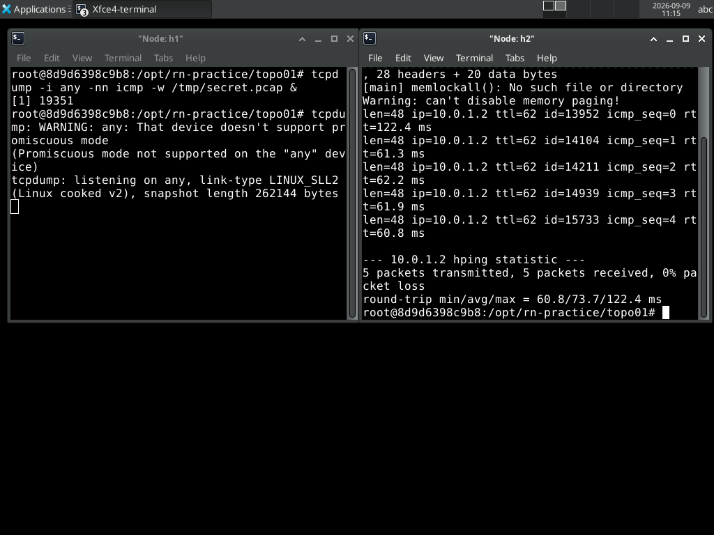
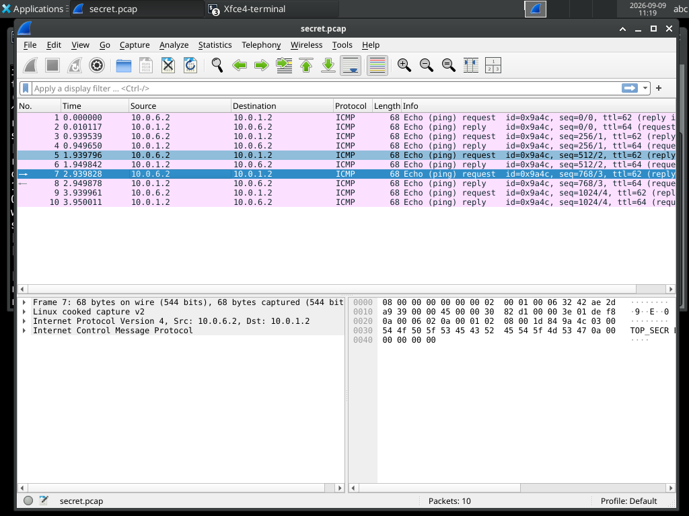

# 06 · Advanced: Covert Channels

[:material-file-pdf-box: Als PDF herunterladen](../pdf/06-advanced-covert-channels.pdf){ .md-button }

!!! success "Originalinhalt jetzt vollständig vorhanden"
    Eine frühere Fassung dieses Aufgabenblatts markierte es als "In
    Vorbereitung", weil beim Kopieren aus Google Drive nur Titel und vier
    Themenschlagworte übertragen wurden, nicht der eigentliche Text. Der
    vollständige Originaltext (`mininet-labs/intro/05-advanced.tex`, "Lab 5:
    Sicherheitsanalyse und verdeckte Kanäle in Netzwerken") wurde für diese
    Konsolidierung erneut aus Google Drive geladen und liegt jetzt vor. Die
    lokal vendorierte `.tex`-Datei selbst enthält weiterhin nur den
    TODO-Hinweis (s. [Quellen](#quellen)) — das Nachziehen dieser Korrektur
    dort wird empfohlen, liegt aber außerhalb des Geltungsbereichs dieser
    auf `docs/labs/`/`docs/reference/` beschränkten Konsolidierung.

!!! warning "Kein `topoXX`-Skript, einige Werkzeuge nicht vorinstalliert"
    Für dieses Aufgabenblatt existiert in `rn-practice` **kein** dediziertes
    Topologie-Skript — das Original nutzt schlicht `topo01`. Zwei der
    verwendeten Werkzeuge (`iodine` für DNS-Tunneling, `tshark` für
    JA3-Fingerprinting) sind **nicht** vorinstalliert (siehe
    [Desktop-/Mininet-Umgebung](../reference/umgebung.md)) — das Original
    sieht dafür aber bereits eine Laufzeit-Installation per `apt install`
    vor (s. u.), das ist also kein Original-Fehler. **Verifiziert
    (2026-09-09): der Container hat ausgehenden Internetzugriff**, `apt-get
    update` sowie `apt-get install -y tshark iodine` liefen im real getesteten
    Container fehlerfrei durch (siehe
    [Potenzielle Herausforderungen](#potenzielle-herausforderungen)).

## Lernziele

- Unverschlüsselten Netzwerkverkehr (DNS, ICMP, HTTP) mit Wireshark/`tcpdump`
  live und aus einem Mitschnitt heraus analysieren, und zwischen
  vertrauenswürdigem und einsehbarem Verkehr im selben lokalen Netz
  unterscheiden.
- Das Prinzip von DNS-Tunneling als verdeckten Datenkanal über
  DNS-Anfragen/-Antworten praktisch mit `iodine` nachvollziehen.
- Verdeckte Kanäle über ICMP-Payload und TTL-Manipulation selbst mit
  `hping3` erzeugen und im Mitschnitt wiedererkennen.
- Klassisches DNS mit DNS-over-HTTPS (DoH) vergleichen: Was bleibt im
  Klartext sichtbar, was nicht?
- Das Prinzip von JA3-Fingerprinting (Fingerabdruck eines TLS-Clients anhand
  charakteristischer Merkmale des `ClientHello`) einordnen können.
- Verstehen, welche Risiken eine Manipulation der Systemzeit für andere
  sicherheitsrelevante Mechanismen hat (insbesondere TLS-Zertifikatsprüfung).

## Aufgaben

### Teil 1 – Passive Traffic-Inspection mit Wireshark/`tcpdump`

Startet die euch bereits aus [Lab 01](01-netzwerkgrundlagen-tools.md)
bekannte Topologie `topo01`:

```bash
cd ~/rn-practice/topo01
./start-topo01.sh
```

1. Öffnet auf `h1` einen xterm und startet dort einen Mitschnitt auf allen
   Interfaces:

   ```bash
   h1$ sudo tcpdump -i any -w h1.pcap
   ```

2. Erzeugt auf `h1` in einem zweiten Terminal Verkehr:

   ```bash
   h1$ ping -c 4 10.0.1.2
   h1$ dig @10.0.1.2 becke.net
   h1$ dig +tcp @10.0.1.2 becke.net
   h1$ curl becke.net
   ```

   !!! note "Korrektur gegenüber dem Originaldokument"
       Das Original ruft `dig`/`curl` gegen die Adresse `10.0.1.2` auf, ohne
       diese im Kontext dieses Aufgabenblatts zu erklären. In `topo01`
       (siehe [Lab 01](01-netzwerkgrundlagen-tools.md)) ist `10.0.1.2`
       keine der beiden Host-Adressen (`h1`/`h2`), sondern liegt im Subnetz
       von `h1`. Verwendet stattdessen eine tatsächlich erreichbare
       Gegenstelle aus `topo01`, z. B. `10.0.6.2` (`h2`) oder eine externe
       Adresse/Domain über den NAT-Uplink, und passt die Befehle
       entsprechend an. Das Original-`ping` ohne `-c` läuft zudem endlos;
       nutzt `-c 4`, um die Aufzeichnung nicht unnötig zu verlängern.

3. Wiederholt dieselben Aufrufe auf `h2` und vergleicht den Unterschied im
   Mitschnitt.

4. Beendet den Mitschnitt auf `h1` (++ctrl+c++) und öffnet die Datei in
   Wireshark:

   ```bash
   h1$ wireshark h1.pcap
   ```

5. Beobachtet: Welche Protokolle sind sichtbar? Wo seht ihr Klartextdaten?
   Welche Daten kommen unverschlüsselt "durch"? Vertraut ihr dem lokalen
   Netz, wenn ihr das seht?

!!! tip "Fortschritt festhalten (optional)"
    Diesen Teil geschafft? Optional fuer die Admin-Uebersicht vermerken
    (rein lokal, keine Netzwerkverbindung):

    ```bash
    ~/rn-practice/mark-done.sh 06 teil1
    ```

!!! example "Vertiefung (optional): Ein eigenes Pcap-Archiv aufbauen"
    Da `~/rn-practice` persistent ist, müsst ihr eure Mitschnitte nicht nach
    jeder Sitzung verwerfen. Legt euch ein Verzeichnis
    `~/rn-practice/pcaps/` an und sichert dort `h1.pcap` aus Teil 1 sowie in
    den folgenden Teilen `/tmp/dnstunnel.pcap`, `/tmp/secret.pcap` und
    `/tmp/dns_plain.pcap` unter sprechenden Namen. Öffnet am Ende des
    gesamten Aufgabenblatts alle vier Mitschnitte gemeinsam in Wireshark und
    vergleicht, wie unterschiedlich "verdächtig" die jeweiligen verdeckten
    Kanäle im Vergleich zu normalem Verkehr aussehen – die DNS-Tunneling-
    Anfragen aus Teil 2 fallen durch ungewöhnliche Länge und Entropie der
    Subdomain auf, während die ICMP-Payload aus Teil 3 auf den ersten Blick
    wie normaler Ping-Verkehr wirkt und sich erst beim Blick in die
    Nutzdaten verrät. Ein guter Kandidat für einen Eintrag im Notizbuch aus
    [Aufgabenblatt 01](01-netzwerkgrundlagen-tools.md).


### Teil 2 – DNS-Tunneling mit `iodine`

**Ziel:** Ein Tunnel über DNS-Anfragen soll aufgebaut, genutzt und in
Wireshark sichtbar gemacht werden.

1. Installiert und startet `iodine` auf `h1` als Server:

   ```bash
   h1$ apt install iodine
   h1$ iodine -f -T null 10.99.0.1 tunnel.h1
   ```

2. Konfiguriert auf `h1` `dnsmasq` so, dass `h2` seine DNS-Anfragen über
   `h1` sendet (siehe `dnsmasq`-Konfiguration, die `topo01` bereits für die
   `dig`-Übung in Lab 01 verwendet).

3. Verbindet euch auf `h2` als Client:

   ```bash
   h2$ iodine tunnel.h2
   h2$ ping 10.99.0.1 -I dns0
   ```

4. Startet parallel auf `h1` einen gezielten Mitschnitt auf DNS-Verkehr:

   ```bash
   h1$ sudo tcpdump -i any port 53 -w /tmp/dnstunnel.pcap
   ```

5. Analysiert in Wireshark: Welche DNS-Resource-Record-Typen werden
   genutzt? Wie sehen die (ungewöhnlich langen bzw. zufällig wirkenden)
   Subdomains aus, über die die Tunneldaten kodiert werden?

!!! note "Original-Befehlszeile leicht widersprüchlich"
    Das Originaldokument zeigt für Schritt 3 `h1$ iodine tunnel.h2`, obwohl
    der Befehl laut Aufgabentext auf `h2` ausgeführt werden soll (der
    Server läuft auf `h1`, der Client verbindet sich als `h2`). Das ist mit
    hoher Wahrscheinlichkeit ein Tippfehler im Original (Verwechslung des
    Prompt-Präfixes) – oben korrigiert zu `h2$ iodine tunnel.h2`.

!!! tip "Fortschritt festhalten (optional)"
    Diesen Teil geschafft? Optional fuer die Admin-Uebersicht vermerken
    (rein lokal, keine Netzwerkverbindung):

    ```bash
    ~/rn-practice/mark-done.sh 06 teil2
    ```


### Teil 3 – Verdeckte Kanäle über ICMP-Payload und TTL (`hping3`)

**Ziel:** Implementiert einen einfachen Covert Channel mit ICMP-Payload
bzw. TTL-Manipulation.

1. Erzeugt auf `h2` eine "geheime" Nachricht und sendet sie per ICMP an
   `h1`:

   ```bash
   h2$ echo "TOP_SECRET" > /tmp/secret.txt
   h2$ hping3 -1 -E /tmp/secret.txt -c 5 <IP_h1>
   ```

   !!! warning "In dieser hping3-Version zusätzlich `-d <Größe>` nötig"
       Real gegen die Umgebung getestet: `hping3` verweigert `-E` ohne eine
       explizit angegebene Datengröße mit der Fehlermeldung
       `Option error: -E option useless without -d`. Ergänzt den Aufruf
       daher um `-d <Bytegröße-der-Datei>`, z. B. für eine 20 Byte lange
       Nachricht `hping3 -1 -d 20 -E /tmp/secret.txt -c 5 <IP_h1>`.

   
   *`hping3` verschickt fünf ICMP-Echo-Requests von `h2` an `h1`, deren
   Payload der Inhalt von `/tmp/secret.txt` ist – aus Sicht eines simplen
   Firewall-/IDS-Regelwerks sieht das wie gewöhnlicher Ping-Verkehr aus.*

2. Zeichnet parallel auf `h1` den ICMP-Verkehr auf:

   ```bash
   h1$ sudo tcpdump -i any -nn icmp -w /tmp/secret.pcap
   ```

3. Öffnet das Pcap in Wireshark und beobachtet den Payload in den
   ICMP-Echo-Requests – die "geheime" Nachricht steht im Klartext im
   Paket-Inhalt.

   
   *Der Mitschnitt auf `h1` bestätigt den verdeckten Kanal: Im
   Hex-/ASCII-Bereich des ICMP-Echo-Requests (Paket 7) ist der Anfang der
   "geheimen" Nachricht `TOP_SECR…` im Klartext lesbar – ICMP-Payload wird
   von den meisten einfachen Firewalls nicht inspiziert.*

4. **Erweiterung:** Kodiert einzelne Zeichen stattdessen über den
   TTL-Wert des IP-Headers statt über die Payload:

   ```bash
   h2$ hping3 -2 --ttl 65 -p 53 -c 1 <IP_h1>
   ```

   Ein Wert, der normalerweise nur zur Pfadverfolgung dient, lässt sich so
   zweckentfremden, um (langsam, aber unauffällig) Informationen zu
   übertragen.

!!! tip "Fortschritt festhalten (optional)"
    Diesen Teil geschafft? Optional fuer die Admin-Uebersicht vermerken
    (rein lokal, keine Netzwerkverbindung):

    ```bash
    ~/rn-practice/mark-done.sh 06 teil3
    ```


### Teil 4 – DNS over HTTPS im Vergleich zu klassischem DNS

**Ziel:** Führt DNS-Anfragen über HTTPS durch und analysiert, was im
Mitschnitt im Vergleich zu klassischem DNS noch sichtbar ist.

1. Klassisches DNS auf `h1`:

   ```bash
   h1$ dig @1.1.1.1 example.com
   ```

2. Startet einen gezielten Mitschnitt:

   ```bash
   h1$ sudo tcpdump -i any host 1.1.1.1 -w /tmp/dns_plain.pcap
   ```

3. Wiederholt dieselbe Abfrage über DNS-over-HTTPS:

   ```bash
   h1$ curl -H "accept: application/dns-json" \
       "https://1.1.1.1/dns-query?name=example.com&type=A"
   ```

4. Öffnet den Mitschnitt in Wireshark: Was ist bei der klassischen
   DNS-Anfrage im Klartext sichtbar (Anfragename, Antwort), was ist bei der
   DoH-Anfrage nur noch als TLS-Record erkennbar? Wie unterscheidet sich
   DoH dadurch von klassischem DNS aus Sicht eines mitlesenden Dritten im
   selben Netzsegment?

!!! tip "Fortschritt festhalten (optional)"
    Diesen Teil geschafft? Optional fuer die Admin-Uebersicht vermerken
    (rein lokal, keine Netzwerkverbindung):

    ```bash
    ~/rn-practice/mark-done.sh 06 teil4
    ```


### Teil 5 – TLS-Fingerprinting mit JA3

**Ziel:** Identifiziert Client-Software anhand ihres TLS-`ClientHello`
mittels JA3-Fingerprint.

1. Installiert die benötigten Werkzeuge auf `h1`:

   ```bash
   h1$ sudo apt install -y jq tshark
   ```

2. Wertet den TLS-Handshake aus einem vorhandenen Mitschnitt aus (z. B. dem
   `dns_plain.pcap`/DoH-Mitschnitt aus Teil 4, sofern er TLS-Verkehr
   enthält):

   ```bash
   h1$ tshark -r /tmp/dns_plain.pcap -Y "ssl.handshake.type == 1" \
       -T fields -e ip.src -e ssl.handshake.extensions_server_name \
       -e ssl.handshake.ciphersuite -e ssl.handshake.version
   ```

3. Notiert Unterschiede zwischen `curl`, `wget` und Firefox beim
   TLS-Handshake (Cipher-Suite-Liste, TLS-Erweiterungen, Reihenfolge) – das
   ist die Grundlage, auf der ein JA3-Fingerprint einen Client eindeutig
   erkennen kann, ganz ohne den Server-Namen (SNI) auszuwerten.

4. **Erweiterung:** Nutzt ein Python-Modul wie `pyja3`, um aus den obigen
   Feldern direkt den JA3-Hash zu berechnen.

!!! tip "Fortschritt festhalten (optional)"
    Diesen Teil geschafft? Optional fuer die Admin-Uebersicht vermerken
    (rein lokal, keine Netzwerkverbindung):

    ```bash
    ~/rn-practice/mark-done.sh 06 teil5
    ```


### Teil 6 – NTP-Manipulation und zeitabhängige Angriffe

**Ziel:** Verändert gezielt die Systemzeit und beobachtet die Auswirkungen
auf TLS-Verbindungen.

1. Deaktiviert die Zeitsynchronisation auf `h1` und setzt eine falsche
   Zeit:

   ```bash
   h1$ sudo timedatectl set-ntp false
   h1$ sudo date -s "next monday 10:00"
   ```

2. Versucht anschließend eine HTTPS-Verbindung:

   ```bash
   h1$ curl https://example.com
   ```

3. Beobachtet: Gibt es einen TLS-Fehler (Zertifikat nicht mehr gültig, weil
   das System jetzt "in der Zukunft" liegt)? Ordnet ein, warum eine
   korrekte Systemzeit eine stillschweigende Voraussetzung für
   funktionierende Zertifikatsprüfung ist.

4. **Erweiterung:** Betreibt einen lokalen NTP-Dienst mit absichtlich
   falscher Zeit (z. B. `ntpd` im Fake-Modus) und manipuliert damit gezielt
   die Zeit von `h2`.

!!! tip "Fortschritt festhalten (optional)"
    Diesen Teil geschafft? Optional fuer die Admin-Uebersicht vermerken
    (rein lokal, keine Netzwerkverbindung):

    ```bash
    ~/rn-practice/mark-done.sh 06 teil6
    ```


## Potenzielle Herausforderungen

!!! danger "Nur Teil 1/3/4/5 nicht real getestet – Teil 2 (Installation) und Teil 6 (Zeit) inzwischen verifiziert"
    Dieses Aufgabenblatt wurde im Rahmen dieser Konsolidierung zunächst
    ausschließlich textlich aus der Originalquelle rekonstruiert. Am
    2026-09-09 wurden zwei konkrete offene Fragen gegen einen echten
    Container real geprüft (s. u.); die eigentlichen Übungsschritte in Teil
    1, 3, 4 und 5 (Traffic-Inspection, ICMP/TTL-Covert-Channel, DoH,
    JA3-Fingerprinting) wurden **weiterhin nicht** Schritt für Schritt
    nachgestellt.

- **`iodine` und `tshark` sind nicht vorinstalliert** (siehe
  [Desktop-/Mininet-Umgebung](../reference/umgebung.md)) und müssen zur
  Laufzeit per `apt install` nachinstalliert werden, wie im Original
  vorgesehen. **Verifiziert (2026-09-09):** `apt-get update` und
  `apt-get install -y tshark iodine` liefen im real getesteten Container
  fehlerfrei durch – ausgehender Internetzugriff und die nötigen Rechte für
  `apt install` sind vorhanden.
- **`timedatectl`** setzt systemd als PID 1 voraus und schlägt daher
  **bestätigt** fehl (`System has not been booted with systemd as init
  system (PID 1). Can't operate.`). Die im Original als Ersatz erwogene
  Alternative funktioniert ebenfalls **nicht**: ein direktes `date -s "next
  monday 10:00"` scheitert im real getesteten Container mit `date: cannot
  set date: Operation not permitted` (der granularen Capability-Set fehlt
  `CAP_SYS_TIME`, siehe [ADR 0002](../adr/0002-capabilities-not-privileged.md)).
  Teil 6 dieses Aufgabenblatts ist damit auf dem aktuellen Image **nicht
  durchführbar**, weder über den Original- noch über den vorgeschlagenen
  Ersatzweg.
- **Kein dediziertes `topoXX`-Skript für dieses Lab** – alle Übungen laufen
  in der bereits bekannten `topo01`-Topologie; ein DNS-Tunnel-Server auf
  `h1` und ein funktionierender `dnsmasq`-Forward auf `h2` sind aus dem
  Originaltext nicht vollständig im Detail spezifiziert (Schritt 2 in
  Teil 2 bleibt bewusst vage, wie im Original).
- **`ping 10.0.1.2` in Teil 1** ist in `topo01` keine gültige Zieladresse
  für einen Host – oben bereits auf eine erreichbare Adresse korrigiert
  (s. Hinweis in Teil 1), sollte aber vor dem Rollout gegen die tatsächlich
  aktuelle `topo01`-Adressierung (siehe [Lab 01](01-netzwerkgrundlagen-tools.md))
  geprüft werden.
- **Fachliche Tiefe ungeprüft:** Diese Konsolidierung stellt den
  Originaltext akkurat dar, bewertet aber nicht, ob Umfang und
  Schwierigkeitsgrad (sechs sehr unterschiedliche Teilthemen in einem
  Aufgabenblatt) didaktisch sinnvoll für eine einzelne Praktikumssitzung
  sind – das sollte der Fachverantwortliche vor dem Rollout einordnen.

## Playwright-Screenshot-Referenz

Für `tests/e2e/specs/screenshots.spec.ts` bietet sich am ehesten ein
**Zeilen-Screenshot** (`captureLine`) an: eine einzelne, auffällig lange
DNS-Query-Zeile in `tcpdump`/`dig` (Teil 2, Indiz für Tunneling) oder eine
`tshark`-Ausgabezeile mit den JA3-relevanten Feldern (Teil 5). Für den
TLS-Zertifikatsfehler nach der NTP-Manipulation (Teil 6) eignet sich analog
zu [Lab 01](01-netzwerkgrundlagen-tools.md#potenzielle-herausforderungen)
eher ein **Fenster-Screenshot**, falls im Browser statt per `curl` getestet
wird.

## Quellen

- `mininet-labs/intro/05-advanced.tex` ("Lab 5: Sicherheitsanalyse und
  verdeckte Kanäle in Netzwerken") — vollständiger Originaltext, erneut aus
  Google Drive geladen. Die lokal vendorierte Kopie dieser Datei enthält
  weiterhin nur einen technischen TODO-Hinweis (fehlgeschlagener
  Google-Drive-Kopiervorgang in einer früheren Session); ein Nachziehen
  dieser Korrektur dort wird empfohlen, liegt aber außerhalb des
  Geltungsbereichs dieser auf `docs/labs/`/`docs/reference/` beschränkten
  Konsolidierung.
- `docs/reference/umgebung.md` — Abgleich der vorinstallierten Werkzeuge
  gegen die im Original genannten (Lücken: `iodine`, `tshark`, s. o.).
- `mininet-labs/rn-practice/topo01/` — Topologie, in der laut Original alle
  Teilaufgaben dieses Labs stattfinden.
