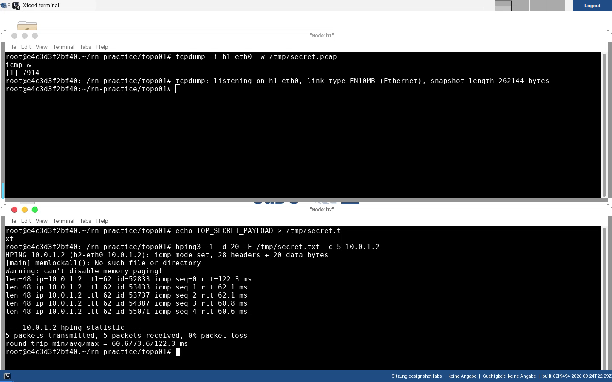
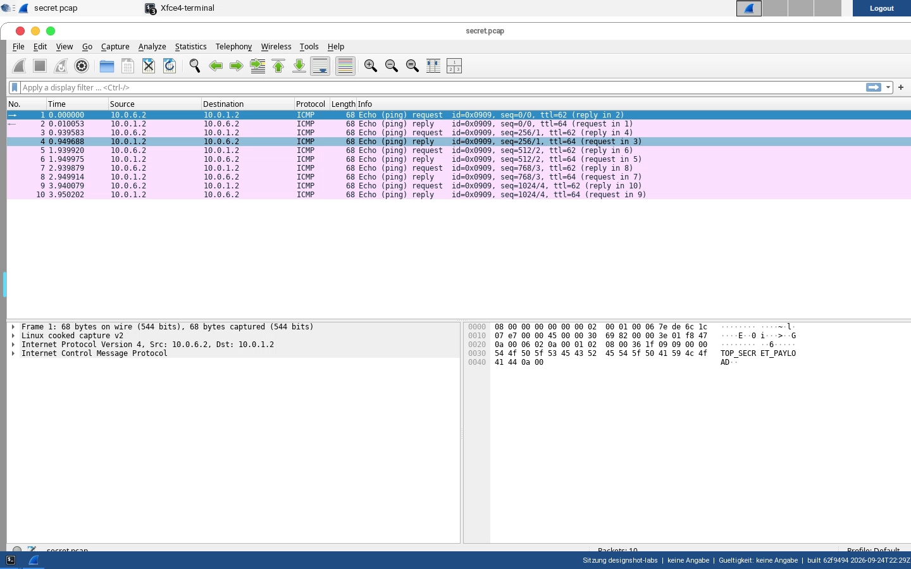

# 06 · Advanced: Covert Channels

[:material-file-pdf-box: Als PDF herunterladen](../../pdf/06-advanced-covert-channels.pdf){ .md-button }

!!! warning "Zusatzwerkzeuge vor dem Start von `topo01` im Desktop-Terminal installieren"
    Für dieses Aufgabenblatt gibt es kein eigenes Topologie-Skript – ihr
    arbeitet in der bekannten Topologie `topo01`. Drei Werkzeuge sind nicht
    vorinstalliert (siehe
    [Desktop-/Mininet-Umgebung](../reference/umgebung.md)): `iodine` für
    DNS-Tunneling (Teil 2) sowie `tshark` und `jq` für JA3-Fingerprinting
    (Teil 5).

    Installiert sie im Desktop-Terminal, bevor ihr `./start-topo01.sh`
    startet:

    ```bash
    sudo apt-get update
    sudo apt-get install -y iodine tshark jq
    ```

    `h1` und `h2` teilen sich das Dateisystem des Desktops (nur die
    Netzwerk-Namensräume unterscheiden sich), also stehen die Programme
    nach der Installation auch in den Knoten bereit. Von den Knoten selbst
    erreicht nur `h1` das Internet; auf `h2` schlägt ein `apt install`
    fehl, weil `h2` keine externen Ziele erreicht.

## Lernziele

- Unverschlüsselten Netzwerkverkehr (DNS, ICMP, HTTP) mit Wireshark/`tcpdump`
  live und aus einem Mitschnitt heraus analysieren, und zwischen
  vertrauenswürdigem und einsehbarem Verkehr im selben lokalen Netz
  unterscheiden.
- Das Prinzip von DNS-Tunneling als verdeckten Datenkanal über
  DNS-Anfragen/-Antworten praktisch mit `iodine` nachvollziehen.
- Verdeckte Kanäle über ICMP-Payload und TTL-Manipulation selbst mit
  `hping3` erzeugen und im Mitschnitt wiedererkennen.
- Klassisches DNS mit DNS-over-HTTPS (DoH) vergleichen: Was bleibt im
  Klartext sichtbar, was nicht?
- Das Prinzip von JA3-Fingerprinting (Fingerabdruck eines TLS-Clients anhand
  charakteristischer Merkmale des `ClientHello`) einordnen können.
- Verstehen, welche Risiken eine Manipulation der Systemzeit für andere
  sicherheitsrelevante Mechanismen hat (insbesondere TLS-Zertifikatsprüfung).
- Einen verdeckten Kanal über DNS auch **ohne** `iodine` bauen – mit einem
  lesbaren Python-DNS-Server, an dem sichtbar wird, dass die Daten in den
  Abfragenamen stecken.
- Verdeckte Kanäle in Protokoll-**Kopffeldern** erzeugen und wiedererkennen:
  TCP-Sequenznummer, ICMP-Timestamp, sowie Port-Knocking als Signalisierung.
- Erkennen, dass selbst bei TLS die Ziel-Domain (SNI) im Klartext übertragen
  wird – ohne `tshark`, nur mit `openssl` und `tcpdump`.
- Einen verdeckten Kanal nicht nur bauen, sondern ihn als Beobachter an
  Paketrate und -größe **erkennen**.

--8<-- "issue-feedback.md"

## Aufgaben

### Teil 1 – Passive Traffic-Inspection mit Wireshark/`tcpdump`

Startet die euch bereits aus [Lab 01](01-netzwerkgrundlagen-tools.md)
bekannte Topologie `topo01`:

```bash
cd ~/rn-practice/topo01
./start-topo01.sh
```

1. Öffnet auf `h1` einen xterm und startet dort einen Mitschnitt auf allen
    Interfaces:

    ```bash
    h1$ sudo tcpdump -i any -w h1.pcap
    ```

2. Erzeugt auf `h1` in einem zweiten Terminal Verkehr gegen `h2`
    (`10.0.6.2`, ueber `r1`/`r2` geroutet) und loest einen externen Namen
    ueber den von `topo01` eingetragenen Resolver auf (Weg nach draussen
    ueber den NAT-Uplink von `h1`):

    ```bash
    h1$ ping -c 4 10.0.6.2
    h1$ dig becke.net
    h1$ dig +tcp becke.net
    h1$ curl becke.net
    ```

3. Wiederholt dieselben Aufrufarten auf `h2` - hier ist `h1` (`10.0.1.2`) das
    erreichbare Ziel, `h2` hat keinen eigenen NAT-Uplink:

    ```bash
    h2$ ping -c 4 10.0.1.2
    ```

    und vergleicht den Unterschied im Mitschnitt.

4. Beendet den Mitschnitt auf `h1` (++ctrl+c++) und öffnet die Datei in
    Wireshark:

    ```bash
    h1$ wireshark h1.pcap
    ```

5. Beobachtet: Welche Protokolle sind sichtbar? Wo seht ihr Klartextdaten?
    Welche Daten kommen unverschlüsselt "durch"? Vertraut ihr dem lokalen
    Netz, wenn ihr das seht?

!!! question "Kurz nachgedacht"
    Mitlesen ist nur die halbe Miete. Was müsste ein Angreifer im selben
    Netzsegment zusätzlich können, um aus dem Klartext, den ihr gerade
    gesehen habt, einen echten Vorteil zu ziehen – reicht reines Beobachten
    schon aus, oder braucht es noch einen weiteren Schritt?

!!! example "Vertiefung (optional): Ein eigenes Pcap-Archiv aufbauen"
    Da `~/rn-practice` persistent ist, müsst ihr eure Mitschnitte nicht nach
    jeder Sitzung verwerfen. Legt euch ein Verzeichnis
    `~/rn-practice/pcaps/` an und sichert dort `h1.pcap` aus Teil 1 sowie in
    den folgenden Teilen `/tmp/dnstunnel.pcap`, `/tmp/secret.pcap` und
    `/tmp/dns_plain.pcap` unter sprechenden Namen. Öffnet am Ende des
    gesamten Aufgabenblatts alle vier Mitschnitte gemeinsam in Wireshark und
    vergleicht, wie unterschiedlich "verdächtig" die jeweiligen verdeckten
    Kanäle im Vergleich zu normalem Verkehr aussehen – die DNS-Tunneling-
    Anfragen aus Teil 2 fallen durch ungewöhnliche Länge und Entropie der
    Subdomain auf, während die ICMP-Payload aus Teil 3 auf den ersten Blick
    wie normaler Ping-Verkehr wirkt und sich erst beim Blick in die
    Nutzdaten verrät. Ein guter Kandidat für einen Eintrag im Notizbuch aus
    [Aufgabenblatt 01](01-netzwerkgrundlagen-tools.md).

### Teil 2 – DNS-Tunneling mit `iodine`

**Ziel:** Ein Tunnel über DNS-Anfragen soll aufgebaut, genutzt und in
Wireshark sichtbar gemacht werden.

1. `iodine` sollte bereits installiert sein (siehe Hinweis oben – vor dem
    Start von `topo01`, im Desktop-Terminal). Auf `h1` fehlt zusätzlich das
    Tunnel-Gerät `/dev/net/tun`, das im Container-Image standardmäßig nicht
    angelegt ist (ohne dieses Gerät brechen sowohl Server als auch Client
    sofort mit `open_tun: /dev/net/tun: No such file or directory` ab; das
    Gerät liegt im geteilten Dateisystem und muss daher nur einmal angelegt
    werden):

    ```bash
    h1$ sudo mkdir -p /dev/net && sudo mknod /dev/net/tun c 10 200 && sudo chmod 666 /dev/net/tun
    ```

    Startet danach den Server – das ist `iodined`, **nicht** `iodine` (das
    ist der Client für Schritt 3):

    ```bash
    h1$ sudo iodined -f -P geheim123 10.99.0.1 tunnel.h1
    ```

    Ohne `-P` fragt `iodined` interaktiv nach einem Passwort; Server und
    Client müssen dasselbe verwenden.

2. **Optional, für die transparente Variante:** In `topo01` läuft auf `h1`
    bereits ein `dnsmasq`, über den `h2` seine Namen auflöst. Für den Tunnel
    selbst reicht Schritt 3 unten, weil der Client dort `h1` direkt als
    Nameserver angegeben bekommt.

3. Verbindet euch auf `h2` als Client (mit demselben Passwort und demselben
    Topdomain wie oben) und gebt `h1` (`10.0.1.2`) explizit als Nameserver
    an:

    ```bash
    h2$ sudo iodine -P geheim123 10.0.1.2 tunnel.h1
    h2$ ping 10.99.0.1 -I dns0
    ```

4. Startet parallel auf `h1` einen gezielten Mitschnitt auf DNS-Verkehr:

    ```bash
    h1$ sudo tcpdump -i any port 53 -w /tmp/dnstunnel.pcap
    ```

5. Analysiert in Wireshark: Welche DNS-Resource-Record-Typen werden
    genutzt? Wie sehen die (ungewöhnlich langen bzw. zufällig wirkenden)
    Subdomains aus, über die die Tunneldaten kodiert werden?

!!! example "Vertiefung (optional): Was der Tunnel kostet"
    Ein verdeckter Kanal ist nie umsonst. Übertragt dieselbe kleine Datei
    einmal **durch** den Tunnel und einmal direkt über die normale Strecke,
    und messt beide Male die Dauer (`time …`).

    Lasst parallel `tcpdump` mitlaufen und vergleicht, wie viele Pakete und
    wie viele Bytes tatsächlich über die Leitung gingen – im Verhältnis zur
    Größe der Nutzdaten. Der Unterschied ist der Preis der Unauffälligkeit:
    jedes Byte Nutzlast muss in Namen verpackt werden, die wie DNS aussehen.

    Schätzt daraus ab, wie lange eine Datei von 10 MB bräuchte. Die Zahl
    erklärt besser als jeder Merksatz, wofür solche Kanäle in der Praxis
    benutzt werden – und wofür nicht.

### Teil 3 – Verdeckte Kanäle über ICMP-Payload und TTL (`hping3`)

**Ziel:** Implementiert einen einfachen Covert Channel mit ICMP-Payload
bzw. TTL-Manipulation.

1. Erzeugt auf `h2` eine "geheime" Nachricht und sendet sie per ICMP an
    `h1`:

    ```bash
    h2$ echo "TOP_SECRET" > /tmp/secret.txt
    h2$ hping3 -1 -E /tmp/secret.txt -c 5 <IP_h1>
    ```

    !!! warning "In dieser hping3-Version zusätzlich `-d <Größe>` nötig"
        `hping3` verweigert `-E` ohne eine explizit angegebene Datengröße mit
        der Fehlermeldung `Option error: -E option useless without -d`.
        Ergänzt den Aufruf daher um `-d <Bytegröße-der-Datei>`, z. B. für eine
        20 Byte lange Nachricht
        `hping3 -1 -d 20 -E /tmp/secret.txt -c 5 <IP_h1>`.

    
    *`hping3` verschickt fünf ICMP-Echo-Requests von `h2` an `h1`, deren
    Payload der Inhalt von `/tmp/secret.txt` ist – aus Sicht eines simplen
    Firewall-/IDS-Regelwerks sieht das wie gewöhnlicher Ping-Verkehr aus.*

2. Zeichnet parallel auf `h1` den ICMP-Verkehr auf:

    ```bash
    h1$ sudo tcpdump -i any -nn icmp -w /tmp/secret.pcap
    ```

3. Öffnet das Pcap in Wireshark und beobachtet den Payload in den
    ICMP-Echo-Requests – die "geheime" Nachricht steht im Klartext im
    Paket-Inhalt.

    
    *Der Mitschnitt auf `h1` bestätigt den verdeckten Kanal: Im
    Hex-/ASCII-Bereich des markierten ICMP-Echo-Requests ist der Anfang der
    "geheimen" Nachricht `TOP_SECR…` im Klartext lesbar – ICMP-Payload wird
    von den meisten einfachen Firewalls nicht inspiziert.*

4. **Erweiterung:** Kodiert einzelne Zeichen stattdessen über den
    TTL-Wert des IP-Headers statt über die Payload:

    ```bash
    h2$ hping3 -2 --ttl 65 -p 53 -c 1 <IP_h1>
    ```

    Ein Wert, der normalerweise nur zur Pfadverfolgung dient, lässt sich so
    zweckentfremden, um (langsam, aber unauffällig) Informationen zu
    übertragen.

!!! question "Kurz nachgedacht"
    Das TTL-Feld ist 8 Bit breit, trägt hier aber pro Paket nur ein
    einziges Zeichen. Was begrenzt die Kapazität dieses Kanals wirklich –
    die Größe des Felds, oder etwas anderes an der Art, wie ihr es benutzt?

!!! example "Vertiefung (optional): Dieselbe Nachricht, andere Kodierung"
    Verpackt **denselben** Text einmal als Rohtext und einmal
    base64-kodiert (`base64`) in die ICMP-Payload und vergleicht im
    Hex-Dump des Mitschnitts, wie sich das Bild der Nutzdaten ändert.

    Überlegt dann für den TTL-Kanal aus Schritt 4: Pro Paket trägt das
    TTL-Feld nur ein einziges Zeichen. Rechnet aus, wie viele Pakete euer
    Text damit braucht – und warum eine kompaktere Kodierung den Kanal
    zwar kürzer, aber nicht unauffälliger macht.

### Teil 4 – DNS over HTTPS im Vergleich zu klassischem DNS

**Ziel:** Führt DNS-Anfragen über HTTPS durch und analysiert, was im
Mitschnitt im Vergleich zu klassischem DNS noch sichtbar ist.

1. Startet auf `h1` einen Mitschnitt, der klassisches DNS (Port 53) und den
    DoH-Verkehr (TCP/443 zu `1.1.1.1`) zugleich erfasst:

    ```bash
    h1$ sudo tcpdump -i any -w /tmp/dns_plain.pcap "port 53 or host 1.1.1.1"
    ```

2. Löst `example.com` klassisch über den eingetragenen Resolver auf:

    ```bash
    h1$ dig example.com
    ```

3. Wiederholt dieselbe Abfrage über DNS-over-HTTPS:

    ```bash
    h1$ curl -H "accept: application/dns-json" \
        "https://1.1.1.1/dns-query?name=example.com&type=A"
    ```

4. Öffnet den Mitschnitt in Wireshark: Was ist bei der klassischen
    DNS-Anfrage im Klartext sichtbar (Anfragename, Antwort), was ist bei der
    DoH-Anfrage nur noch als TLS-Record erkennbar? Wie unterscheidet sich
    DoH dadurch von klassischem DNS aus Sicht eines mitlesenden Dritten im
    selben Netzsegment?

### Teil 5 – TLS-Fingerprinting mit JA3

**Ziel:** Identifiziert Client-Software anhand ihres TLS-`ClientHello`
mittels JA3-Fingerprint.

1. `jq` und `tshark` sollten bereits installiert sein (siehe Hinweis oben –
    vor dem Start von `topo01`, im Desktop-Terminal; ein `apt install`
    direkt in `h1`/`h2` scheitert an deren fehlendem Standard-DNS-Resolver).

2. Wertet den TLS-Handshake aus einem vorhandenen Mitschnitt aus (z. B. dem
    `dns_plain.pcap`/DoH-Mitschnitt aus Teil 4, sofern er TLS-Verkehr
    enthält):

    ```bash
    h1$ tshark -r /tmp/dns_plain.pcap -Y "ssl.handshake.type == 1" \
        -T fields -e ip.src -e ssl.handshake.extensions_server_name \
        -e ssl.handshake.ciphersuite -e ssl.handshake.version
    ```

3. Notiert Unterschiede zwischen `curl`, `wget` und Firefox beim
    TLS-Handshake (Cipher-Suite-Liste, TLS-Erweiterungen, Reihenfolge) – das
    ist die Grundlage, auf der ein JA3-Fingerprint einen Client eindeutig
    erkennen kann, ganz ohne den Server-Namen (SNI) auszuwerten.

4. **Erweiterung:** Nutzt ein Python-Modul wie `pyja3`, um aus den obigen
    Feldern direkt den JA3-Hash zu berechnen.

!!! example "Vertiefung (optional): Zwei Programme, zwei Fingerabdrücke"
    Nehmt dasselbe Ziel noch einmal auf, aber mit einem **anderen** Programm –
    z. B. einmal mit `curl` und einmal mit `openssl s_client` oder `wget`.
    Vergleicht die ClientHello-Felder beider Mitschnitte nebeneinander.

    Zwei Beobachtungen lohnen die Mühe: Erstens unterscheiden sich die
    Fingerabdrücke deutlich, obwohl beide Programme *dasselbe* tun. Zweitens
    bleibt der Fingerabdruck eines Programms gleich, egal welche Seite ihr
    ansteuert.

    Überlegt, was daraus folgt: Der Fingerabdruck verrät nichts über den
    **Inhalt** der Verbindung – aber sehr wohl, **womit** sie aufgebaut
    wurde. Was bedeutet das für jemanden, der verschlüsselten Verkehr
    beobachtet, ihn aber nicht entschlüsseln kann?

### Teil 6 – NTP-Manipulation und zeitabhängige Angriffe

**Ziel:** Verändert gezielt die Systemzeit und beobachtet die Auswirkungen
auf TLS-Verbindungen.

!!! note "Auf dem aktuellen Image nicht durchführbar"
    Das Setzen der Systemzeit schlägt im Container fehl: `timedatectl`
    setzt `systemd` als PID 1 voraus, `date -s` die Berechtigung
    `CAP_SYS_TIME` – beides ist nicht gegeben (siehe
    [Potenzielle Herausforderungen](#potenzielle-herausforderungen)).
    Arbeitet die Schritte als Gedankenexperiment durch und meldet euch bei
    der Kursleitung, wenn ihr an diese Grenze stoßt.

1. Deaktiviert die Zeitsynchronisation auf `h1` und setzt eine falsche
    Zeit:

    ```bash
    h1$ sudo timedatectl set-ntp false
    h1$ sudo date -s "next monday 10:00"
    ```

2. Versucht anschließend eine HTTPS-Verbindung:

    ```bash
    h1$ curl https://example.com
    ```

3. Beobachtet: Gibt es einen TLS-Fehler (Zertifikat nicht mehr gültig, weil
    das System jetzt "in der Zukunft" liegt)? Ordnet ein, warum eine
    korrekte Systemzeit eine stillschweigende Voraussetzung für
    funktionierende Zertifikatsprüfung ist.

4. **Erweiterung:** Betreibt einen lokalen NTP-Dienst mit absichtlich
    falscher Zeit (z. B. `ntpd` im Fake-Modus) und manipuliert damit gezielt
    die Zeit von `h2`.

!!! question "Kurz nachgedacht"
    Ihr habt die Systemzeit nach vorne verschoben. Zertifikate prüfen ein
    Gültigkeitsfenster mit zwei Grenzen (nicht davor, nicht danach). Was
    würde eine Zeit deutlich in der **Vergangenheit** statt in der Zukunft
    für dieselbe Prüfung bedeuten?

--8<-- "issue-feedback.md"
### Teil 7 — Den TTL-Kanal aus Teil 3 wirklich decodieren (`topo01`)

Teil 3 hat gezeigt, dass sich ein einzelnes Zeichen über den TTL-Wert eines
IP-Pakets kodieren lässt. In diesem Teil baut ihr das zu einem echten,
mehrzeichigen verdeckten Kanal aus: Ein kurzes Wort wird Zeichen für Zeichen
verschickt (ein `hping3`-Paket pro Zeichen, TTL = ASCII-Code des Zeichens),
und ihr **decodiert es aus einem Mitschnitt zurück** – ohne vorher zu
wissen, was verschickt wurde.

Startet `topo01`, falls nicht mehr aktiv:

```bash
cd ~/rn-practice/topo01
./start-topo01.sh
```

1. **Empfänger vorbereiten.** Startet auf `h1` einen Mitschnitt, der nur
    ICMP-Verkehr aufzeichnet:

    ```bash
    h1$ sudo tcpdump -i any icmp -n -w /tmp/ttlmsg.pcap
    ```

2. **Sender:** Wechselt zu `h2` und schickt (ohne `h1` vorher zu verraten,
    was ihr sendet) ein kurzes Wort Zeichen für Zeichen, mit einem
    ASCII-kodierten TTL-Wert pro Zeichen:

    ```bash
    h2$ for c in H I ; do
          ttl=$(printf '%d' "'$c")
          hping3 -1 --ttl "$ttl" -c 1 10.0.1.2
          sleep 1
        done
    ```

    (Ersetzt die Zeichenliste `H I` durch ein eigenes, für euch unbekanntes
    Wort – lasst es euch am besten von jemand anderem vorgeben, damit die
    Decodierung im nächsten Schritt nicht durch Vorwissen verfälscht wird.)

3. **Decodieren.** Beendet den Mitschnitt auf `h1` (++ctrl+c++) und lest die
    *empfangene* TTL jedes eingehenden Pakets aus:

    ```bash
    h1$ tcpdump -r /tmp/ttlmsg.pcap -n -v
    ```

    Achtet nur auf die Zeilen mit `ICMP echo request` (Absender `h2`, in
    `topo01` die Adresse `10.0.6.2`) – die dazugehörigen `echo reply`-Zeilen
    (Absender `h1`) tragen `h1`s eigenen, unveränderten Standard-TTL-Wert und
    sind für die Decodierung ohne Bedeutung. Die relevanten Zeilen zeigen
    euch je einen Wert wie `ttl 70`. Das ist
    **nicht** der von `h2` gesendete Wert, sondern der bereits um die Anzahl
    der durchlaufenen Router verminderte Wert – bestimmt diese Hop-Zahl
    selbst mit `traceroute` (oder `tracepath`) von `h2` zu `h1`, bevor ihr
    zurückrechnet.

4. **Rückrechnen.** Addiert die ermittelte Hop-Zahl auf jeden beobachteten
    TTL-Wert und wandelt das Ergebnis mit der ASCII-Tabelle (oder
    `printf "\x$(printf %x <Zahl>)"`) zurück in ein Zeichen. Reiht die
    Zeichen in der Reihenfolge auf, in der die Pakete eingetroffen sind.

**Aufgabe:** Erklärt, warum ihr die Hop-Zahl vorher separat ermitteln
müsst, statt sie zu raten – und warum ein verdecktes TTL-Signal über einen
Pfad mit *wechselnder* Hop-Zahl (z. B. bei dynamischem Routing wie in
[Aufgabenblatt 03](03-routing-rip-bgp.md)) unzuverlässig würde, selbst wenn
Sender und Empfänger sich vorher auf ein Encoding geeinigt haben.

### Teil 8 – DNS-Kanal ohne `iodine`: der lesbare DNS-Server als Endpunkt (`topo01`)

Teil 2 verlangte `iodine`, das erst per `apt install` aus dem Netz
nachgeladen werden muss. Diesen verdeckten DNS-Kanal baut ihr hier mit einem
Werkzeug, das im Image bereits liegt und dessen Innenleben ihr lesen könnt:
dem Python-DNS-Server `dns-server.py` aus dem Topologie-Verzeichnis (siehe
[Aufgabenblatt 01, Teil 3](01-netzwerkgrundlagen-tools.md)).

Die Idee eines DNS-Tunnels ist: Nutzdaten werden **in den abgefragten Namen**
kodiert. Der Server muss die Namen gar nicht kennen – schon die *Anfrage*
trägt die Daten über die Leitung.

Startet den Server auf `h1` auf Port 5353 (Port 53 belegt dort bereits
`dnsmasq`) und einen DNS-Mitschnitt auf der Schnittstelle zu `h2`:

```bash
h1$ cd ~/rn-practice/topo01
h1$ python3 dns-server.py 5353 &
h1$ sudo tcpdump -i h1-eth1 -w /tmp/dnschan.pcap udp port 5353 &
```

Kodiert auf `h2` eine kurze Nachricht als Hex und verpackt sie als Subdomain
in eine DNS-Abfrage an den Server:

```bash
h2$ msg=$(printf 'Hallo' | od -An -tx1 | tr -d ' ')   # -> 48616c6c6f
h2$ dig @10.0.1.2 -p 5353 "$msg.exfil.h1"
```

Beendet den Mitschnitt (`sudo pkill tcpdump`) und lest die Abfragenamen aus:

```bash
h1$ tcpdump -r /tmp/dnschan.pcap -n | grep exfil
```

**Aufgabe:** Der Hex-String steht im Klartext im Abfragenamen. Ein einzelnes
DNS-Label darf höchstens 63 Zeichen lang sein, ein ganzer Name höchstens 255
(RFC 1035, Abschnitt 2.3.4 / 3.1). Rechnet aus, wie viele Nutzbytes euch pro
Abfrage bleiben, wenn ihr hex-kodiert (zwei Zeichen je Byte). Woran erkennt
ein Beobachter im Mitschnitt, dass hier kein normales DNS läuft?

!!! quote "Hintergrund: warum ein DNS-Label bei 63 Zeichen endet"
    Ein DNS-Label endet nach höchstens **63** Oktetten, weil die zwei
    höchstwertigen Bits jedes Längen-Oktetts null sein müssen und nur sechs
    Bits für die Länge bleiben – 2⁶−1 = 63 (RFC 1035, Abschnitt 3.1). Der ganze
    Name ist auf 255 Oktette begrenzt (Abschnitt 2.3.4 / 3.1). Als lesbarer
    Text sind nur 253 Zeichen möglich, weil das Längenbyte des ersten Labels
    und das Null-Byte der Root zwei Oktette mehr belegen, als die Punkte
    kosten. Diese knappen Grenzen zwingen einen DNS-Tunnel zu vielen kurzen
    Anfragen – und machen ihn dadurch auffällig.

    - RFC 1035, Abschnitt 2.3.4/3.1 (rfc-editor): <https://www.rfc-editor.org/rfc/rfc1035.html>
    - R. Chen, „What is the real maximum length of a DNS name?": <https://devblogs.microsoft.com/oldnewthing/20120412-00/?p=7873>

### Teil 9 – Ein Kanal in der TCP-Sequenznummer (`topo01`)

Teil 3 hat Daten in der ICMP-Payload und im TTL versteckt. Ein noch
unauffälligeres Versteck ist die **Initial-Sequenznummer** eines
TCP-SYN-Pakets: ein 32-Bit-Feld, das normalerweise zufällig gewählt wird –
also fällt ein hineingeschriebener Wert kaum auf.

Zeichnet auf `h1` TCP auf und schickt von `h2` ein einzelnes SYN mit einer
selbst gewählten Sequenznummer (`hping3 -M`):

```bash
h1$ sudo tcpdump -i h1-eth1 -w /tmp/seqchan.pcap tcp -c 2 &
h2$ sudo hping3 -c 1 -S -M 305419896 -p 80 10.0.1.2
```

Lest die empfangene Sequenznummer aus dem Mitschnitt zurück:

```bash
h1$ tcpdump -r /tmp/seqchan.pcap -n -v | grep -o 'seq 305419896'
```

**Aufgabe:** `305419896` ist dezimal für `0x12345678`. Erklärt, warum die
Sequenznummer ein besonders schwer zu entdeckendes Versteck ist (Stichwort:
ein *zufälliger* Wert ist normal, ein *strukturierter* fällt nur bei genauem
Hinsehen auf). Welche Datenmenge passt pro Paket hinein?

!!! quote "Hintergrund: Craig Rowland versteckte Daten schon 1997 in der Sequenznummer"
    Die Idee, Nutzdaten in Kopffeldern zu verstecken, die eigentlich anderen
    Zwecken dienen, ist alt: Craig H. Rowland beschrieb 1997 in „Covert
    channels in the TCP/IP protocol suite" das Werkzeug `covert_tcp`, das Daten
    byteweise in der **IP-Identification** und in der **TCP-Sequenznummer**
    versteckt. Das 16-Bit-Feld IP-Identification (RFC 791, Abschnitt 3.1) dient
    eigentlich nur dem Zusammensetzen von Fragmenten – RFC 6864, Abschnitt 7,
    stellt ausdrücklich fest, es „can more easily be used as a covert channel".

    - RFC 6864, Abschnitt 7, und RFC 791, Abschnitt 3.1 (rfc-editor): <https://www.rfc-editor.org/rfc/rfc6864.html>
    - C. H. Rowland, „Covert channels in the TCP/IP protocol suite", First Monday 2(5), 1997: <https://firstmonday.org/ojs/index.php/fm/article/view/528>

!!! question "Kurz nachgedacht"
    Ein Beobachter, der nur diesen einen Mitschnitt sieht, ohne von einem
    Kanal zu wissen: Woran müsste er zweifeln, um `seq 305419896` als
    verdächtig einzustufen? Reicht ein einzelner "auffälliger" Wert, oder
    braucht es ein Muster über mehrere Pakete hinweg?

--8<-- "issue-feedback.md"

### Teil 10 – Port-Knocking: Signalisieren, ohne einen Port offen zu haben (`topo01`)

Bisher lag die versteckte Information *in* den Paketen. Beim **Port-Knocking**
steckt die Botschaft in der **Reihenfolge**, in der scheinbar sinnlose
Verbindungsversuche auf geschlossene Ports treffen. Ein Beobachter, der nur
auf offene Dienste achtet, sieht nichts Auffälliges.

Zeichnet auf `h1` alle SYN-Pakete auf und „klopft" von `h2` eine feste
Sequenz auf drei geschlossene Ports:

```bash
h1$ sudo tcpdump -i h1-eth1 -w /tmp/knock.pcap tcp -c 6 &
h2$ for p in 7000 8000 9000; do sudo hping3 -c 1 -S -p $p 10.0.1.2; sleep 1; done
```

Lest die Klopf-Sequenz aus dem Mitschnitt zurück:

```bash
h1$ tcpdump -r /tmp/knock.pcap -n | grep -oE '\.(7000|8000|9000):'
```

**Aufgabe:** Die drei Zielports erscheinen in genau der gesendeten
Reihenfolge. Erklärt, warum ein Port-Knock-Daemon (der auf diese Sequenz
hin z. B. eine Firewall-Regel öffnet) für einen einfachen Portscan
unsichtbar bleibt – und was den Kanal trotzdem verrät, wenn jemand den
Gesamtverkehr aufzeichnet.

!!! quote "Hintergrund: Port-Knocking – Authentifizierung über geschlossene Ports"
    Martin Krzywinski prägte den Begriff 2003: „port knocking provides an
    authentication system that works across closed ports". Der Clou: Hinter der
    Firewall lauscht gar kein Port, die Information reist allein in der
    *Reihenfolge* der Verbindungsversuche, die die Firewall ohnehin
    mitprotokolliert. Weil kein Port offen ist, lässt sich mit einem Portscan
    nicht einmal feststellen, dass das Verfahren überhaupt aktiv ist. (Ein RFC
    existiert dafür nicht.)

    - Linux Journal, M. Krzywinski, „Port Knocking" (16.06.2003): <https://www.linuxjournal.com/article/6811>
    - Autorenseite M. Krzywinski, portknocking: <https://mk.bcgsc.ca/portknocking/view/about/summary/>

### Teil 11 – Ein ungewöhnlicher Träger: die ICMP-Timestamp-Nachricht (`topo01`)

Teil 3 nutzte die Nutzlast von ICMP-**Echo** (Typ 8) – der klassische,
dokumentierte ICMP-Kanal (siehe Hintergrund unten). ICMP kennt aber weitere
Typen, die kaum je auftauchen und einem einfachen Regelwerk deshalb selten
auffallen – etwa die **Timestamp**-Nachricht (Typ 13/14, RFC 792, Abschnitt
„Timestamp or Timestamp Reply Message"). Hier beobachtet ihr zunächst nur,
dass sich ein solcher Typ überhaupt erzeugen und im Mitschnitt wiedererkennen
lässt.

Zeichnet ICMP auf `h1` auf und schickt von `h2` eine Timestamp-Anfrage:

```bash
h1$ sudo tcpdump -i h1-eth1 -v -w /tmp/icmpts.pcap icmp -c 2 &
h2$ sudo hping3 --icmp-ts -c 1 10.0.1.2
```

Schaut euch die Nachrichtentypen im Mitschnitt an:

```bash
h1$ tcpdump -r /tmp/icmpts.pcap -v -n | grep -i 'time stamp'
```

**Aufgabe:** Ihr solltet `time stamp request` und `time stamp reply` sehen –
nicht das gewohnte `echo request`. Die Timestamp-Nachricht trägt drei
sender­bestimmte 32-Bit-Zeitfelder (RFC 792). Überlegt (als Denkaufgabe, nicht
als belegte Praxis): warum wären diese drei Felder *strukturell* geeignet, um
Daten zu transportieren, und warum ist ein selten genutzter, aber völlig
legitimer ICMP-Typ schwerer zu bemerken als offensichtlicher Sonderverkehr?

!!! quote "Hintergrund: der dokumentierte ICMP-Kanal ist die Echo-Nutzlast (Project Loki, 1996)"
    Der klassische, tatsächlich dokumentierte verdeckte ICMP-Kanal steckt nicht
    in der Timestamp-, sondern in der **Echo**-Nachricht: „Project Loki"
    (Phrack 49, 1996) zeigte, dass „arbitrary information can be tunneled in
    the data portion of ICMP_ECHO and ICMP_ECHOREPLY packets". Die
    Timestamp-Nachricht aus diesem Teil hat mit ihren drei senderbestimmten
    32-Bit-Feldern (RFC 792) dieselbe strukturelle Eignung – das bleibt aber
    eine Folgerung, kein dokumentierter Angriff.

    - „Project Loki", Phrack 49, File 06 (1996): <https://phrack.org/issues/49/project-loki-icmp-tunneling.html>
    - RFC 792, Abschnitt „Timestamp or Timestamp Reply Message" (rfc-editor): <https://www.rfc-editor.org/rfc/rfc792.html>

### Teil 12 – Klartext trotz TLS: die Ziel-Domain (SNI) mitlesen (`topo01`)

Teil 5 wollte für JA3-Fingerprinting `tshark` nachinstallieren. Ein Kernpunkt
lässt sich aber schon **ohne** `tshark` zeigen, nur mit `openssl` und
`tcpdump`: Der Name des Servers, zu dem sich ein Client verbindet, wird als
*Server Name Indication* (SNI) im TLS-`ClientHello` übertragen (definiert in
RFC 6066, Abschnitt 3) – und zwar **im Klartext**, noch bevor irgendetwas
verschlüsselt wird (RFC 8744, Abschnitt 2: „The SNI extension is carried in
cleartext in the TLS 'ClientHello' message.").

Startet auf `h1` einen TLS-fähigen Server (der HTTP/3-Server aus
[Aufgabenblatt 07](07-http-rest-quic.md) bringt auch TLS über TCP mit) und
einen Mitschnitt:

```bash
h1$ cd ~/rn-practice/topo01
h1$ ./startHTTP3Server.sh &
h1$ sudo tcpdump -i h1-eth1 -A -w /tmp/sni.pcap tcp port 443 &
```

Baut von `h2` eine TLS-Verbindung mit einem frei gewählten Servernamen auf:

```bash
h2$ echo | openssl s_client -connect 10.0.1.2:443 -servername geheim.example.org
```

Sucht den Servernamen im Mitschnitt:

```bash
h1$ tcpdump -r /tmp/sni.pcap -A | grep -a geheim.example.org
```

**Aufgabe:** Der Name `geheim.example.org` steht im Klartext im Mitschnitt,
obwohl die Verbindung TLS-verschlüsselt ist. Erklärt, warum die SNI
notwendigerweise unverschlüsselt gesendet wird (der Server muss vor dem
Handshake wissen, für welchen Namen er ein Zertifikat vorlegen soll) – und
was das für einen Beobachter bedeutet, der den Inhalt zwar nicht entschlüsseln
kann, aber sehr wohl sieht, **welche** Seiten ihr ansteuert. (Genau das ist
die Motivation hinter *Encrypted ClientHello*, ECH.)

!!! quote "Hintergrund: die SNI im Klartext – und ihr RFC-Gegenspieler"
    Die Ziel-Domain reist unverschlüsselt, weil der Server erst *aus* der SNI
    erfährt, welches Zertifikat er überhaupt vorlegen soll (RFC 6066, Abschnitt
    3, definiert die Erweiterung; RFC 8744, Abschnitt 2, hält die
    Klartext-Eigenschaft fest). RFC 6066, Abschnitt 11.1, bewertete
    `server_name` noch als „no significant security issues". Dieses Leck
    adressiert *Encrypted ClientHello* (RFC 9849), das die Klartext-SNI
    „perhaps the most sensitive information left unencrypted in TLS 1.3"
    nennt.

    - RFC 6066, Abschnitt 3, und RFC 9849, Abschnitt 1 (rfc-editor): <https://www.rfc-editor.org/rfc/rfc9849.html>
    - Cloudflare Blog, „Encrypted Client Hello" (29.09.2023): <https://blog.cloudflare.com/announcing-encrypted-client-hello/>

!!! question "Kurz nachgedacht"
    ECH verschlüsselt die SNI selbst. Was bleibt für einen Beobachter auf dem
    Übertragungsweg trotzdem sichtbar (Stichwort: Ziel-IP-Adresse,
    Paketgrößen, Zeitpunkt der Verbindung) – und warum ist "die Domain ist
    jetzt verschlüsselt" allein noch keine vollständige Anonymität?

--8<-- "issue-feedback.md"

### Teil 13 – Nutzdaten ganz ohne Kopffeld: UDP mit `socat` – und warum das auffällt (`topo01`)

Die bisherigen Kanäle versteckten Daten in Feldern, die andere Zwecke haben.
Der ehrlichste – und zugleich am leichtesten erkennbare – „Kanal" ist einfach
eine UDP-Nutzlast. Das baut ihr mit `socat` (im Image vorhanden) und stellt es
den raffinierteren Verstecken gegenüber.

Startet auf `h1` einen UDP-Empfänger und einen Mitschnitt, sendet von `h2`:

```bash
h1$ sudo tcpdump -i h1-eth1 -A -w /tmp/udpchan.pcap udp port 9999 &
h1$ socat -u UDP-RECV:9999 -
h2$ echo 'EXFIL_UDP' | socat - UDP-SENDTO:10.0.1.2:9999
```

Prüft, dass die Nutzlast im Mitschnitt steht:

```bash
h1$ tcpdump -r /tmp/udpchan.pcap -A | grep -a EXFIL_UDP
```

**Aufgabe:** `EXFIL_UDP` steht sofort im Klartext im Paket. Vergleicht diesen
Kanal mit dem DNS-Kanal aus Teil 8 und dem Sequenznummer-Kanal aus Teil 9:
Welcher überträgt am meisten pro Paket? Welcher fällt einem Beobachter am
schnellsten auf? Was ist der Zielkonflikt jedes verdeckten Kanals
(Bandbreite gegen Unauffälligkeit)?

### Teil 14 – Die andere Seite: einen verdeckten Kanal erkennen (`topo01`)

Alle bisherigen Teile haben Kanäle **gebaut**. Zum Abschluss nehmt ihr die
Rolle des Verteidigers ein: Ein verdeckter Kanal verrät sich fast immer durch
sein *statistisches* Verhalten, auch wenn kein einzelnes Paket verdächtig
aussieht.

Nehmt einen der Mitschnitte aus den Teilen 8, 11 oder 13 und einen Mitschnitt
von normalem Verkehr (z. B. ein `curl` gegen den lokalen Server) und
vergleicht Paketzahl und -größe:

```bash
h1$ capinfos /tmp/dnschan.pcap
h1$ capinfos /tmp/udpchan.pcap
```

`capinfos` (im Image vorhanden) fasst pro Mitschnitt Paketzahl, Dauer,
durchschnittliche Paketgröße und Datenrate zusammen. Zählt ergänzend, wie
viele Pakete auf einen bestimmten Kanal entfallen:

```bash
h1$ tcpdump -r /tmp/dnschan.pcap -n | wc -l
```

**Aufgabe:** DNS-Tunneling erzeugt auffällig **viele** DNS-Anfragen mit
auffällig **langen** Namen; ein normaler Client fragt selten und kurz. Nennt
zwei messbare Merkmale (z. B. Anfragerate, mittlere Namenslänge, Verhältnis
von Anfragen ohne Antwort), an denen ein Verteidiger einen der vorherigen
Kanäle erkennen könnte – **ohne** eine einzige Nutzlast zu entschlüsseln.

--8<-- "issue-feedback.md"
## Potenzielle Herausforderungen

- **`iodine`, `tshark` und `jq` sind nicht vorinstalliert** (siehe
  [Desktop-/Mininet-Umgebung](../reference/umgebung.md)) und müssen vor dem
  Start von `topo01` im Desktop-Terminal installiert werden (siehe Hinweis
  am Blattanfang). Von den Knoten erreicht nur `h1` das Internet; auf `h2`
  schlägt ein `apt install` fehl.
- **`timedatectl`** setzt systemd als PID 1 voraus und schlägt daher fehl
  (`System has not been booted with systemd as init system (PID 1). Can't
  operate.`). Auch `date -s "next monday 10:00"` scheitert, mit
  `date: cannot set date: Operation not permitted` (dem Capability-Set des
  Containers fehlt `CAP_SYS_TIME`). Teil 6 ist auf dem aktuellen Image daher
  **nicht durchführbar**; meldet euch bei der Kursleitung, wenn ihr an diese
  Grenze stoßt.
- **Kein dediziertes `topoXX`-Skript für dieses Lab** – alle Übungen laufen
  in der bekannten `topo01`-Topologie. Dort löst `dnsmasq` auf `h1` die
  Namen für `h1` und `h2` auf.

## Quellen

- `mininet-labs/intro/05-advanced.tex` ("Lab 5: Sicherheitsanalyse und
  verdeckte Kanäle in Netzwerken")
- `docs/reference/umgebung.md` — Abgleich der vorinstallierten Werkzeuge
  (Lücken: `iodine`, `tshark`, s. o.)
- `mininet-labs/rn-practice/topo01/` — Topologie, in der alle Teilaufgaben
  dieses Labs stattfinden, inklusive `dns-server.py` (Teil 8)
